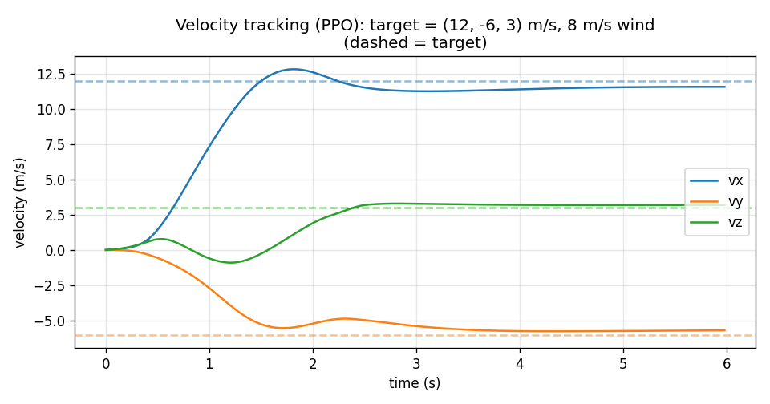
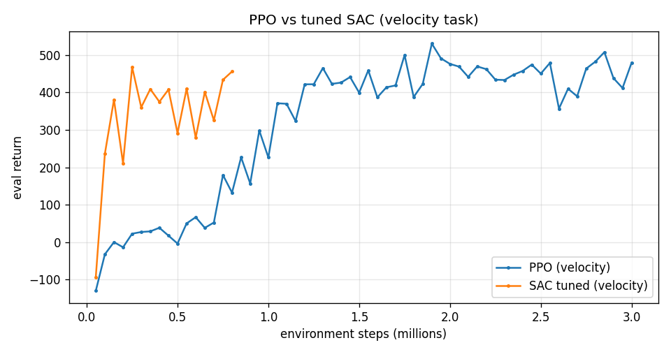
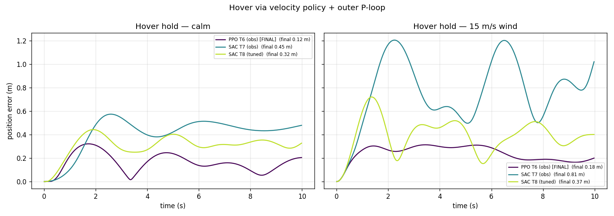
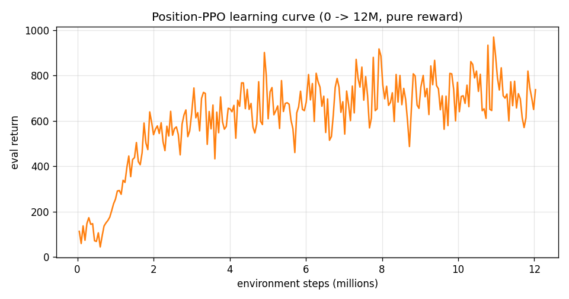
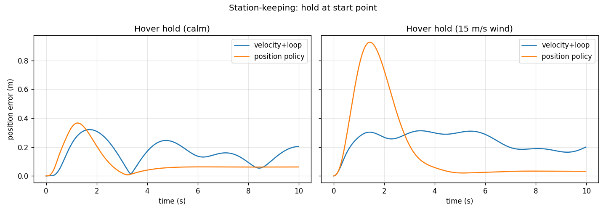
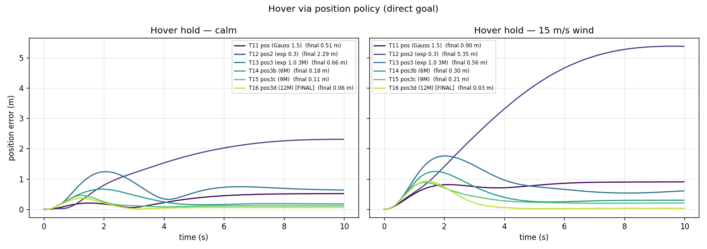
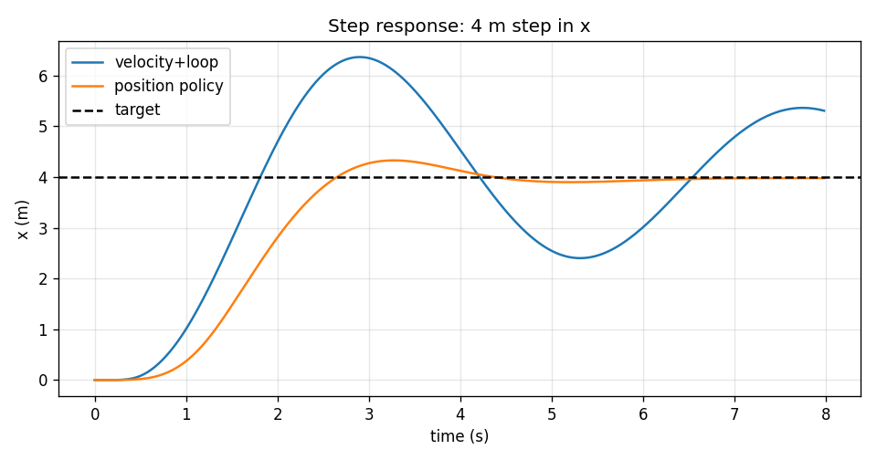
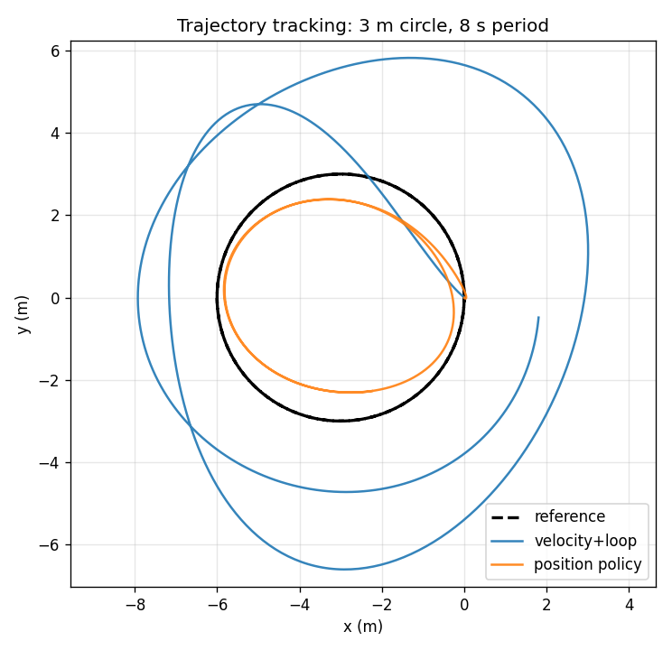
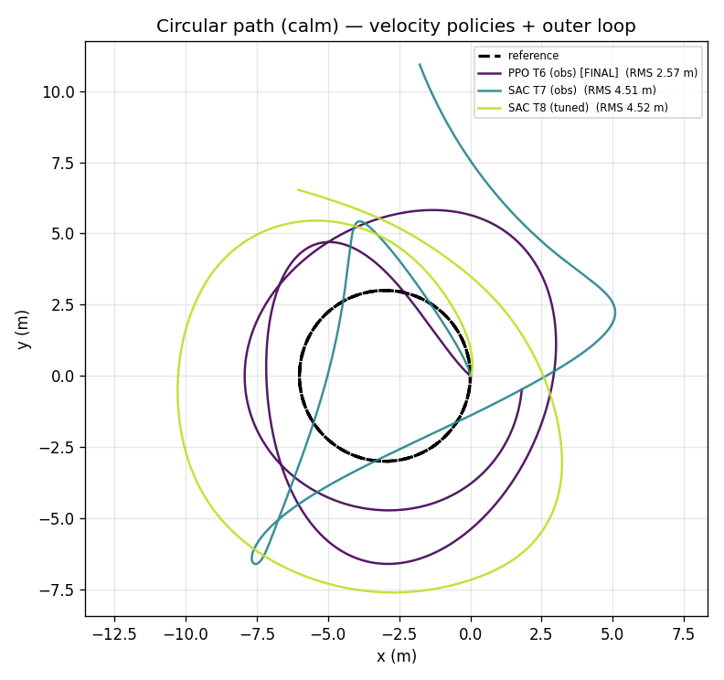
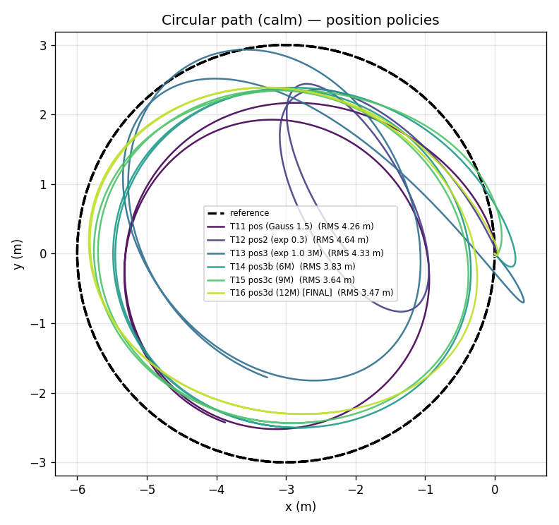

# RL Quadrotor Control — Training Summary

End-to-end reinforcement-learning control of a **heavy quadrotor** (≈10 kg) in
[gym-pybullet-drones](https://github.com/utiasDSL/gym-pybullet-drones), with a **PID
attitude-rate inner loop**, under **domain randomization** (mass, wind, motor lag).
Two control tasks were trained and compared: **3-D velocity tracking** and **3-D
position (go-to / hover)**. Algorithms: **PPO** and **SAC** (Stable-Baselines3).

> 📜 **This document describes the final state.** See also:
> - **[TRAINING_HISTORY.md](TRAINING_HISTORY.md)** — full chronological log of all ~16 runs
>   (exact observation, reward, config, result, and *why* we changed each step).
> - **[LESSONS.md](LESSONS.md)** — deep, generalizable takeaways (PPO vs SAC, reward-design
>   traps, sense-vs-infer observations, training dynamics, physical vs learnable limits).

---

## 1. Problem & airframe

| Property | Value |
|---|---|
| Airframe | heavy quad (not the CF2X Crazyflie) |
| Mass | **randomized 9–11 kg per episode** |
| Motors | **4 × 0–40 N** (160 N max total thrust) |
| Thrust-to-weight | ≈1.63 at 10 kg → max horizontal accel ≈ 12.6 m/s² |
| Arm length | 0.35 m (X config); yaw torque ratio KM/KF = 0.02 |
| Inertia | diag(0.20, 0.20, 0.35) kg·m² at 10 kg (scales with mass) |
| **Motor lag** | first-order, **τ randomized 0.10–0.25 s per episode** |
| **Wind** | constant per episode, **random direction, 0–20 m/s**, quadratic drag |
| Control rates | policy **50 Hz**, PID inner loop **500 Hz** (10 substeps/step) |
| Episode | 8 s (400 policy steps); crash if roll or pitch > 85° |

**Feasibility note:** at 10 kg, holding 20 m/s into a 20 m/s wind (≈40 m/s relative
airspeed → ~128 N drag + 98 N weight ≈ 160 N) sits right at the thrust envelope — a
*physical* limit no controller can beat.

---

## 2. Control architecture

```
 target ─► [ RL policy (PPO/SAC) ] ─► CTBR: [thrust, roll_rate, pitch_rate, yaw_rate]   @ 50 Hz
                                            │
                                            ▼
                              [ PID rate inner loop ]   ω_body = Rᵀ·ω_world     @ 500 Hz
                                            │            τ = J·(Kp·e + Ki·∫e)
                                            ▼
                          [ per-motor forces, clipped 0–40 N ]  (motor saturation)
                                            │
                                            ▼
                          [ first-order motor lag ]  →  achieved wrench (T, τ)
                                            │
                                            ▼
                     [ analytic wrench + wind + gravity → PyBullet ]
```

**Why an analytic wrench (not per-motor RPM into the URDF)?** The airframe is a custom
0.35 m / 10 kg quad, so its geometry doesn't match the CF2X URDF. Instead of relying on
URDF motor-link positions, the controller computes total thrust + body torques, clips
per-motor forces to [0, 40] N (so thrust and torque correctly compete for the motor
budget), and applies the *achieved* wrench directly. Mass/inertia are set per episode
via `changeDynamics`; PyBullet's default damping is zeroed so **wind is the only aero
force**. The mixer sign convention matches `BaseAviary._dynamics()` CF2X and was verified
empirically (see `test_env.py`).

**PID inner-loop gains** were lowered (`kp_rate` 12→6, `ki` 0.5) once the motor lag was
added — a 0.1–0.25 s actuator in the loop cuts phase margin, so the original high gains
oscillated. Rate tracking was re-verified stable at worst-case τ=0.25 s.

---

## 3. Observation (29-dim, memoryless MLP — no recurrence)

| Block | dims | note |
|---|---|---|
| velocity error **or** relative position (task-dependent, clamped/normalized) | 3 | |
| target velocity **or** current velocity | 3 | |
| rotation matrix R | 9 | attitude, gimbal-free |
| body angular velocity ω_body | 3 | world→body via Rᵀ |
| last action | 4 | |
| **motor RPM** (from ESC telemetry; `√(force/max)`) | 4 | **solves motor lag** |
| **wind-force estimate** (disturbance observer) | 3 | **solves steady wind** |

**Motor RPM** directly exposes the hidden actuator state, so the memoryless policy
doesn't have to infer motor spin-up from history (better than frame-stacking; verified).

**Disturbance observer** recovers the external (wind) force from Newton's law using
*nominal* mass + achieved thrust — exactly what an onboard estimator has:
`F_wind ≈ m·a − R·[0,0,T] + [0,0,mg]` (EMA-filtered). It's **target-independent**, so it
transfers to real-time changing targets, unlike a velocity-error integral. Verified to
recover the true wind force to ~0 N.

---

## 4. Algorithms & hyperparameters

### PPO (main workhorse)
`n_steps=2048`, `batch_size=4096`, `n_epochs=10`, `gamma=0.99`, `gae_lambda=0.95`,
`clip_range=0.2`, `ent_coef=0.0`, `lr=3e-4`, `net_arch=[128,128]`, 6 parallel envs.
Velocity task: **3M steps** (~32 min). Position task: **12M steps** (continued in 3M
chunks). VecNormalize (obs+reward). `n_stack=1` (RPM+observer are fed directly).

### SAC (compared, tuned)
Untuned SAC (defaults) was unstable. Tuned config that worked:
`lr=1e-4`, `batch_size=512`, `net_arch=[256,256]`, `tau=0.005`, `gradient_steps=2`
(update ratio ½), `buffer_size=600k`, `learning_starts=15k`, `gSDE on`, `ent_coef=auto`,
4 envs, **800k steps** (~72 min). VecNormalize obs only (reward norm off — off-policy).

---

## 5. Rewards (and *why* — this is where most of the work went)

### Velocity task
```
d = ‖v − v_target‖
r = exp(−½(d/2)²) + 0.5·exp(−½(d/8)²) − 0.02·d − 5e-4(‖ω‖² + ‖Δa‖²);   crash: −10
```
Two Gaussians (sharp peak + broad basin) give dense reward near the target; the linear
`−0.02·d` keeps a gradient far away so it isn't flat when the error is large.

### Position task (final, after several iterations)
```
dp = ‖p − p_target‖,  speed = ‖v‖
r = clip(1 − dp/R, 0, 1)            # positive baseline: guidance + SURVIVAL
  + 2·exp(−½·dp/1.0)                # exponential (cusp at 0): pulls to target, reachable
  + 0.5·exp(−½(dp/0.25)²)           # tiny pin-point bonus
  − 0.01·max(0, speed−18)²          # soft speed cap (safety)
  + smooth;   crash: −10
```

**Reward lessons learned (the hard way):**

1. **Negative living reward + terminal crash → suicide.** An early position reward went
   negative far from the target; because a crash *ends* the episode, the policy learned to
   crash immediately (episodes were 25/400 steps) to stop accruing negative reward. **Fix:
   a non-negative baseline** (`clip(1−dp/R)`) so staying alive always beats the −10 crash.
2. **A Gaussian is flat at its peak.** With `exp(−½(dp/1.5)²)`, being 0.5 m off cost only
   3.8% of the reward → the policy parked at a rock-steady **0.5 m deadband**.
3. **Too-sharp reward is unreachable → ignored.** Shrinking to σ=0.3 made the bonus
   narrower than the achievable precision, so the policy almost never collected it and fell
   back to the weak baseline → hover got **worse (2.3 m)**. Sweet spot: an *exponential*
   (non-flat peak) at a *reachable* width (σ≈1.0).
4. **Reward sharpness must match achievable precision** — too flat leaves a deadband, too
   sharp is unlearnable.
5. **Shaping wasn't needed for overshoot.** A stopping-distance speed penalty was tried and
   *didn't help*. The pure position reward, trained long enough (12M), removed overshoot on
   its own (overshoot is inherently reward-suboptimal). **More training + a clean reward
   beat reward-shaping tricks.**

---

## 6. Results

### 6.1 Velocity tracking (PPO)

PPO tracks a random 3-D velocity (0–20 m/s, any direction) under mass/wind/motor-lag
randomization. Aggregate over 100 random scenarios:

| slice | mean steady err | crash rate |
|---|---|---|
| overall | 1.28 m/s | 4% |
| **strong wind (>14 m/s)** | **1.48 m/s** | **4%** |
| target speed ≤ 15 m/s | **0.61 m/s** | **0%** |
| target speed > 15 m/s | 3.39 m/s | 17% |

**Wind is essentially solved** (strong wind tracks as well as calm), thanks to the
disturbance observer. The residual failures are the **high-speed (>15 m/s) thrust-envelope
corner** — a physical limit, not a sensing one.



### 6.2 PPO vs SAC (velocity task)

| Metric | PPO | Tuned SAC |
|---|---|---|
| mean steady err | **0.82 m/s** | 1.48 m/s |
| crash rate | **0%** | 2% |
| crash rate (>15 m/s) | 0% | 0% |
| env steps | 3M | 0.8M (~4× fewer) |
| **wall-clock (CPU)** | **~32 min** | ~72 min (~2× slower) |
| throughput | ~1590 steps/s | ~135 steps/s |

**PPO wins on accuracy, stability, *and* wall-clock.** SAC uses ~4× fewer *environment
steps* (it's more sample-efficient), **but that did not make it faster** — it was ~2× slower
in wall-clock because it's **gradient-bound** (a gradient update per transition, on CPU),
whereas PPO is **simulation-bound** and parallelizes 6 env workers. SAC's sample efficiency
only pays off when *environment interaction* is the expensive resource (real hardware / very
slow sim) or with a GPU to cheapen gradients. It also **destabilizes** under heavy domain
randomization (return peaks early then drifts down); tuning (lower LR, gSDE, smaller update
ratio, bigger net) recovered it from broken (4.09 m/s, 18% crash) to a close second
(1.48 m/s, 2% crash) but did not overtake PPO. For this task, PPO is strictly better.



**Hover inference — all three runnable velocity policies** (driven as position controllers
through the outer P-loop). The PPO policy holds tightest and flattest (0.12 m calm, 0.18 m in
15 m/s wind); both SAC policies vibrate through the loop, and the untuned SAC policy diverges
under wind — the structural instability that tuning narrowed but never removed.



> The three earliest velocity models (`results_sac`, `results_fs`, `results_sac_fs`)
> predate the 29-dim RPM+wind observation (their obs is 22-dim / 88-dim frame-stacked), so
> they cannot be inferenced against the current env — they are documented by their historical
> velocity-error numbers in `TRAINING_HISTORY.md` only.

### 6.3 Position control (PPO) — training progression

The position policy needed **more training than expected**. Hover error and step overshoot
were flat from 3M→9M, then improved sharply by 12M (late-stage refinement):

| checkpoint | hover calm | hover 15 m/s wind | step overshoot |
|---|---|---|---|
| 3M | 0.61 m | 0.66 m | 2.6 m |
| 6M | 0.19 m | 0.30 m | 2.6 m |
| 9M | 0.12 m | 0.21 m | 2.6 m |
| **12M** | **0.06 m** | **0.03 m** | **0.33 m** |



### 6.4 Hover / station-keeping

The 12M position policy holds position to **0.03–0.06 m**, *beating* the velocity-policy +
hand-tuned outer P-loop (~0.2 m) — because the learned policy uses the disturbance observer
directly, with no proportional-controller steady-state error. Note the position policy has
a larger initial transient (it was trained on static targets and starts cold), but a much
tighter steady state.



**Hover inference — all six position policies.** This single plot is the whole
position story: the too-sharp reward (`exp σ=0.3`) makes the target *unreachable* and the
policy drifts away (2.3 m calm, 5.4 m in wind); the reachable-width reward (`σ=1.0`)
recovers to 0.66 m; and **pure additional training** with an unchanged reward tightens it
monotonically 0.66 → 0.18 → 0.11 → **0.06 m** (calm) across the four training-length runs,
and to **0.03 m** in 15 m/s wind. No reward trick did this — steps did.



### 6.5 Step response (4 m)

The 12M position policy reaches the target with only **0.33 m overshoot** and settles to
**0.02 m**. The velocity+loop overshoots more here because its outer-loop gain is untuned.



### 6.6 Trajectory tracking (3 m circle, 8 s)

Both approaches have room to improve on *dynamic* paths:
- **velocity+loop** (blue) spirals out — the outer-loop gain `Kp=1.5` is too aggressive
  (untuned) and unstable for path following.
- **position policy** (orange) traces a clean circle but **undersized and phase-lagged** —
  it was trained on *static* targets, so it chases and lags a moving one.

Fixing this is known work: tune the outer loop, and/or train the position policy on
**moving** targets.



**Circle inference — every runnable model.** Confirms the weakness is *general*, not specific
to one checkpoint. All six position policies phase-lag the moving reference (RMS 3.5–4.6 m) —
they trace a roughly circular arc but at the wrong point at the wrong time, because every one
was trained on *static* goals. The velocity policies + outer loop overshoot the circle on
entry then spiral in (the PPO policy best at 2.57 m RMS); the aggressive `Kp=1.5` is the culprit.
More training tightens *hover* but not *path tracking* — that needs training on moving targets.





---

## 7. Key takeaways

1. **Sensing beats inferring.** Feeding motor RPM (ESC) + a disturbance-observer wind
   estimate directly made the memoryless policy robust to motor lag and 20 m/s wind, and
   beat frame-stacking (which infers those from history): 0.82 vs 1.74 m/s error.
2. **The disturbance observer is target-independent** → transfers to real-time changing
   targets, unlike a velocity-error integral (which conflates wind with setpoint changes).
3. **Reward design is where the bugs live**: non-negative baselines prevent suicide;
   reward *sharpness must match achievable precision*; and **more training + a clean reward
   beat shaping tricks** (overshoot vanished without any penalty by 12M).
4. **PPO > SAC here** for accuracy/stability under heavy DR; SAC wins sample-efficiency but
   destabilizes.
5. **Some limits are physical, not learnable** — 20 m/s into 20 m/s wind is at the thrust
   envelope; no reward or algorithm fixes that (only more thrust).

---

## 8. Reproduce

```bash
# sanity checks (inner loop, observer, saturation, mass DR)
python test_env.py

# velocity task
python train.py --timesteps 3000000 --n-envs 6                     # PPO
python train_sac.py --timesteps 800000 --n-envs 4                  # SAC (tuned defaults)
python compare.py --ppo-dir results_obs --sac-dir results_sac_tuned

# position task (12M via continuation)
python train.py --task position --pos-range 30 --speed-cap 18 --timesteps 3000000 --out-dir results_pos3
python continue_train.py --src results_pos3  --out results_pos3b --extra 3000000
python continue_train.py --src results_pos3b --out results_pos3c --extra 3000000
python continue_train.py --src results_pos3c --out results_pos3d --extra 3000000

# task comparison (hover / step / path) + figures
python compare_tasks.py --vel-dir results_obs --pos-dir results_pos3d
python gen_summary_figs.py

# hover + circle inference for EVERY runnable model (the fig_all_*.png figures)
python gen_all_inference_figs.py

# watch a policy fly
python eval.py --out-dir results_obs --gui --episodes 3
```

## 9. Files
| File | Purpose |
|---|---|
| `rate_vel_aviary.py` | Environment: CTBR action, PID rate inner loop, mixer, motor lag, wind, observer, both tasks |
| `train.py` / `train_sac.py` | PPO / SAC training (VecNormalize, callbacks) |
| `continue_train.py` | Resume training (more steps / swapped reward) |
| `compare.py` / `compare_tasks.py` | PPO-vs-SAC / velocity-vs-position evaluation |
| `progress_callback.py` | Shared eval callback (curves + tracking snapshots) |
| `test_env.py` | Env sanity checks |
| `gen_summary_figs.py` | Figures for this document |
| `gen_all_inference_figs.py` | Hover + circle inference across all 9 runnable models (`fig_all_*.png`) |
| `eval_ts.py` | Tailsitter velocity-tracking eval (band + direction breakdown, tracking figure) |

---

## 10. Tailsitter VTOL extension (velocity tracking)

The env was later converted from the heavy quad to a **quadrotor tailsitter VTOL** (2–5 kg,
4×40 N, **2 fixed wings** with a flat-plate lift/drag model, no control surfaces — it must pitch
~90° to fly forward on the wings). Task: track a random 3-D target velocity, **0–80 m/s
omnidirectional**. Full detail — every run, reward, ablation — is in [`TAILSITTER.md`](TAILSITTER.md).

**Arc:** aggregate steady-state speed error **~9.6 → 4.6 m/s**, **0% crashes**, full envelope. Two
classical-control-informed levers did the work: a **leaky velocity-error integrator in the
observation** (the breakthrough, 8.1 → 4.8, which also acted as a "stuck-below-target" detector)
and a **sharp `1−tanh(d/2)` reward peak** (the polish, 4.8 → 4.63, vs a Gaussian's flat-top
deadband). Everything else — more training, DR removal, hard-corner oversampling, a dive
curriculum, longer episodes, a deeper 256×256×256 net — **failed**, and past saturation extra
steps **regressed** (4.63 → 5.35). Final **champion** policy (`results_tsIt`, 16 M): **calm hover 0.31 m/s,
everyday tracking 2.3 m/s, up/level high-speed 95–99% reach, wing-borne cruise to 80 m/s, learned
dives**; residual concentrated in the extreme **dive-into-wind** corner (a crosswind-sensing +
near-limit issue).

**Memory study (MLP vs frame-stacking vs LSTM).** On the tailsitter task we also compared the
memoryless MLP against a 4-frame frame-stack and an LSTM policy. Result: **LSTM > MLP >
frame-stacking** — the LSTM (full 8 s episode horizon) tracked best per environment step but ran
~3× slower in wall-clock; frame-stacking (~80 ms window of near-duplicate frames) was *worst*; and
even the LSTM did better *with* the wind-estimator + integrator features than without — memory
complements, but does not replace, good hand-designed observations. Full detail in
[`TAILSITTER.md`](TAILSITTER.md) and [`LESSONS.md`](LESSONS.md).

```bash
# tailsitter velocity task (baseline -> +bigger net & random-init -> +integrator -> +tanh reward)
python train.py --timesteps 8000000 --n-envs 6 --use-integral --out-dir results_tsI
python continue_train.py --src results_tsI  --out results_tsI2 --extra 4000000     # -> 12M
# (then the tanh precision peak reward-v3 in _computeReward)
python continue_train.py --src results_tsI2 --out results_tsIt --extra 4000000     # -> 16M champion
python eval_ts.py                                                                  # band + figure
```
