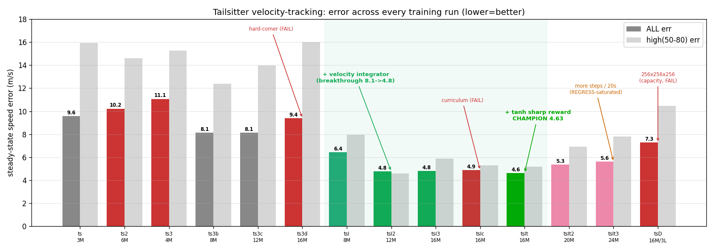
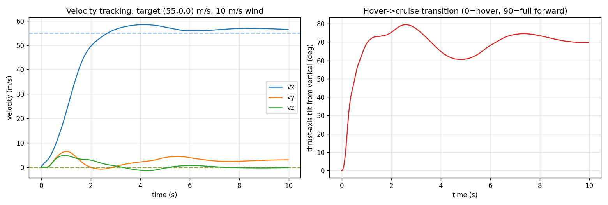

# Tailsitter VTOL — Full Investigation Log

Detailed record of converting the heavy-quad env to a **quadrotor tailsitter VTOL** and the
entire training investigation that followed: every env change, every reward function, every
training run (config + what changed + result), every diagnostic/ablation, and what worked vs
failed. Task throughout: **track a random 3-D target velocity** (direction uniform on the
sphere, speed `Uniform(0, MAX_SPEED)`; 0 = hover).

The quad project (velocity + position tasks, runs T1–T16) is in [`TRAINING_HISTORY.md`](TRAINING_HISTORY.md);
this file is the tailsitter phase only.

**Headline:** the aggregate steady-state speed error went **~9.6 → 4.6 m/s**. Two levers did the
work, both classical-control-informed: a **leaky velocity-error integrator in the observation**
(the breakthrough, 8.1 → 4.8) and a **sharp tanh precision peak in the reward** (the polish,
4.8 → 4.63). Everything else — more training, domain-randomization removal, hard-corner
oversampling, a dive curriculum, and longer episodes — **failed** to move the plateau, and past
saturation extra steps actively **regressed**. The winning run — referred to throughout as the
**champion** — is the 16 M-step policy with the integrator + tanh reward.



*Green = integrator runs (the breakthrough); bright green = **champion** (+ sharp tanh reward). Red =
failed levers: **longer-episodes** (confounded), **bigger-net-4M** (hover collapse from undertraining),
**hard-corner**, **dive-curriculum**, **deeper-net** (256×256×256). Pink = post-saturation regressions
(**champion-more-steps**, **champion-longer-eps**). Bars: aggregate error (dark), high-speed band (light).*

---

## 1. Airframe conversion (quad → tailsitter)

A tailsitter hovers on its tail (props up) and **pitches ~90° to fly forward on its wings**.
Same 4-motor CTBR control + PID rate inner loop as the quad; the physics differences:

| Parameter | Heavy quad | **Tailsitter** |
|---|---|---|
| Mass (per-episode DR) | 9–11 kg | **2–5 kg** (nominal 3.5) |
| Inertia (at nominal mass) | (0.20, 0.20, 0.35) @10 kg | **(0.06, 0.03, 0.06) @3.5 kg**, scaled ×(M/3.5) |
| Motors | 4 × 40 N (160 N) | 4 × 40 N (160 N) — unchanged; TWR now ~3–8× |
| `NOMINAL_HOVER` (a_T=0 thrust) | 10·9.8 | **3.5·9.8** |
| Aerodynamics | isotropic quadratic drag | **flat-plate wings (lift + drag)** |
| Attitude crash | roll/pitch > 85° → terminate | **removed** (tailsitter must pitch ~90°) |
| Observation | 29-dim | **30-dim** (+ pitot airspeed) |

### Wing aerodynamics (flat-plate model)
Chosen because a tailsitter sweeps the **full 0–90° angle-of-attack** range where thin-airfoil
theory breaks; the flat plate is valid across it. Applied as a **pure force at the COM (no aero
moment)** — consistent with how thrust is already applied; the airframe is aerodynamically
neutral and controlled purely by differential thrust.

Body frame: **normal `n̂ = body-x`, span `ŝ = body-y`, chord = body-z (= thrust/prop axis,
up in hover → forward in cruise)**.
```
v_rel = vel − wind ;  V = |v_rel| ;  v̂ = v_rel/V ;  q·S = ½·ρ·V²·S
sin α = n̂ · v̂            (angle of attack)
C_L   = 2·sin α·cos α      C_D = CD0 + 2·sin²α
F_drag = −C_D·qS·v̂
F_lift =  C_L·qS·(v̂ × ŝ)/|v̂ × ŝ|      (⊥ wind and span; sign follows α)
```
Defaults: `S = 0.40 m²` (randomized ±20%/episode), `ρ = 1.225`, `CD0 = 0.05`.

**Lift sign was verified numerically** before any training (fixed attitudes): cruise +AoA → lift
up (+13.8 N), −AoA → flips down, 45° → max lift (79 N) + heavy drag, hover/zero-airflow → 0,
pure-spanwise flow → drag only. No sign flip needed.

The learned hover→cruise transition (12M integrator checkpoint, target 55 m/s forward): thrust axis
tilts from 0° (hover, props up) toward ~86° (near-horizontal, wing-borne cruise) while velocity
tracks cleanly to target.



### Disturbance observer (now total external force)
Unchanged formula, but its meaning broadened: `F_ext = m_nom·a − F_thrust + m_nom·g` now lumps
**wind + wing aero** into one estimate. Still built only from measured acceleration + achieved
thrust (never from ground-truth wind) → honest and target-independent. Note the mass bias it
carries: `wind_est = F_aero + (3.5 − M)·(a + g)` — mass error appears as a vertical force offset.

### Sensing: single pitot (1 scalar)
`pitot = R[:,2] · (vel − wind)` — the **axial** airspeed along the thrust/prop axis, i.e. exactly
what one forward-facing pitot tube reads. Chosen (over a 3-axis probe) for realism after a
discussion of what's physically measurable: a pitot gives a magnitude along its axis, **not** the
wind vector. The sim uses true wind only to emulate the sensor reading (legitimate); cross-wind /
sideslip are **not** directly sensed (this becomes the one real observability gap — see §6).

---

## 2. MAX_SPEED derivation (physics, not arbitrary)

Requested max target speed was derived from a steady level-cruise force balance rather than
picked. Solving `qS·CL + T·cosφ = W` (vertical) and `T·sinφ = qS·CD` (horizontal):

| Thrust model | Max sustainable level speed |
|---|---|
| **Constant 160 N** (what the sim actually does) | ~104–126 m/s (φ→90°, thrust ≈ parasitic drag) |
| **Power-limited prop** (momentum theory, prop r≈0.18 m, from 40 N static) | **~50 m/s** |

The ~110 m/s figure is "hollow" — a real prop can't hold 160 N at 110 m/s. The realistic ceiling
is ~50 m/s. **User set `MAX_SPEED = 80`** — above the realistic prop limit but reachable in the
constant-thrust sim (so 50–80 m/s targets train against optimistic thrust; noted, not fixed).

**Reward-width consequence:** the velocity-reward Gaussians are absolute and do **not** auto-scale
with `MAX_SPEED`. Widening the envelope 20 → 80 left them tuned for 20 m/s (flat beyond ~16 m/s of
error). This drove the first reward redesign (§3).

---

## 3. Reward functions (every version, exact)

`d = |vel − target_vel|`. `smooth = −5e-4·|ω_body|² − 5e-4·|Δaction|²`. Crash penalty −10 (rarely
triggers now that the tilt-crash is gone).

**R0 — inherited quad reward (20 m/s world):**
```
r = exp(−½(d/2)²) + 0.5·exp(−½(d/8)²) − 0.02·d + smooth
```

**reward-v1 — scale-invariant single peak (first tailsitter reward, MAX_SPEED=80, s = MAX_SPEED/20 = 4):**
```
r = exp(−½(d/(2s))²) + 0.5·exp(−½(d/(8s))²) − (0.02/s)·d + smooth      # widths σ=8, 32
```
Rationale: keep the shape self-similar as the envelope grew. **Flaw found empirically:** the peak
got so wide that a 4 m/s error scored 1.38 vs 1.49 at perfect — **almost no low-speed gradient**,
so the policy never tightened up (run `baseline`).

**reward-v2 — multi-scale (final; used from `longer-episodes` onward):**
```
r = exp(−½(d/2)²)  +  exp(−½(d/(10s))²)  − (0.02/s)·d + smooth          # narrow σ=2  +  wide σ=40
```
A **narrow 2 m/s precision peak** (sharp gradient near the target, restores low-speed precision)
**plus** a wide coverage peak that scales with the envelope (keeps a gradient far from target for
high-speed acceleration). Verified gradient: 2.00 @ d=0 → 1.88 @1 → 1.60 @2 → 1.11 @4 → 0.36 @20.

**reward-v3 — sharp tanh precision peak (final; `champion` onward):**
```
r = (1 − tanh(d/2))  +  exp(−½(d/(10s))²)  − (0.02/s)·d + smooth      # SHARP peak + wide coverage
```
The narrow Gaussian in reward-v2 has a **flat top** — its slope at `d=0` is ≈ 0 (a deadband), so near the
target the policy gets almost no gradient and settles *near*, not *on*, the target (the same bug
that pinned the quad hover at 0.5 m, `TRAINING_HISTORY.md` T11). `1 − tanh(d/2)` is **steepest
exactly at `d=0`** (slope ≈ −0.5 vs the Gaussian's −0.005 — ~100× stronger gradient at the
target). The historical risk of "too sharp" (a narrow unreachable peak, T12) does **not** apply
here because the **wide coverage term guides the policy into the sharp region** — the wide term is
the safety net. Result: calm hover **0.49 → 0.31 m/s**, aggregate **4.81 → 4.63**. (Reward tweaks
were otherwise deliberately avoided; reward-v1→reward-v2→reward-v3 were the only reward changes, each with a measured
reason.)

---

## 4. Observation (evolution)

- **30-dim (base tailsitter):** `[vel_err(3), target_vel(3), R(9), ω_body(3), last_action(4),
  motor_rpm(4), ext_force_est(3), pitot(1)]`.
- **33-dim (`integrator-8M*`, +integrator):** append **`vel_err_integral(3)`** — a **leaky, clamped**
  integral of velocity error: `dI/dt = err − I/τ`, `τ = 3 s`, clamped to ±`MAX_SPEED`, reset each
  episode, normalized by `MAX_SPEED`. The leak+clamp are the anti-windup that makes it robust to
  changing setpoints (and `target_vel` is in the obs, so the policy can learn its own
  feedforward). This is the standard outer-loop-PID trick — and it was the breakthrough (§5).

Initial-state randomization (`randomize_init`, training only): 50% level / 50% uniform-SO(3)
attitude (incl. inverted), 50% zero / 50% random velocity up to `MAX_SPEED`, ±2 rad/s body rates.
Eval always uses a standard level-hover start so the metric stays comparable.

---

## 5. Chronological training runs

All velocity task, PPO (`n_steps=2048, batch=4096, 10 epochs, γ=0.99, λ=0.95, clip=0.2, lr=3e-4`),
6 envs. Metric = mean steady-state speed error (m/s) over the final 3 s, 240 random targets/winds/
masses, identical seeds across runs; eval on the **uniform** distribution and standard hover start.
Crash rate was **0%** for every run.

### Master table (aggregate + per-band, m/s)

| Run | Steps | Net | Reward | rand-init | Episode | Extra | hover | low | mid | high | **ALL** |
|---|---|---|---|---|---|---|---|---|---|---|---|
| **baseline**  | 3 M  | 128 | reward-v1 | no  | 8 s  | first tailsitter | 2.60 | 4.80 | 6.32 | 15.93 | **9.57** |
| **longer-episodes** | 6 M  | 128 | reward-v2 | no  | 15 s | +longer eps +reward-v2 (confounded) | 2.47 | 5.76 | 8.63 | 14.59 | **10.22** |
| **bigger-net-4M** | 4 M  | 256 | reward-v2 | yes | 8 s  | +256 net +random-init | 7.38 | 7.83 | 8.94 | 15.25 | **11.07** |
| **bigger-net-8M**| 8 M  | 256 | reward-v2 | yes | 8 s  | continue bigger-net-4M | 1.43 | 3.96 | 6.47 | 12.39 | **8.12** |
| **bigger-net-12M**| 12 M | 256 | reward-v2 | yes | 8 s  | continue bigger-net-8M | 1.03 | 3.20 | 5.47 | 13.96 | **8.14** |
| **hard-corner**| 16 M | 256 | reward-v2 | yes | 8 s  | +hard-corner 0.4 | 1.24 | 3.68 | 6.38 | 16.00 | **9.39** |
| **integrator-8M** | 8 M  | 256 | reward-v2 | yes | 8 s  | **+velocity integrator** | 1.09 | 3.00 | 6.83 | 7.97 | **6.43** |
| **integrator-12M**| 12 M | 256 | reward-v2 | yes | 8 s  | continue integrator-8M | 0.82 | 2.51 | 6.12 | 4.58 | **4.76** |
| **integrator-16M**| 16 M | 256 | reward-v2 | yes | 8 s  | continue integrator-12M | 0.69 | 2.44 | 5.09 | 5.90 | **4.81** |
| **dive-curriculum**| 16 M | 256 | reward-v2 | yes | 8 s  | integrator-12M + dive curriculum | 0.76 | 2.47 | 5.76 | 5.31 | **4.88** |
| **champion** ⭐| 16 M | 256 | **reward-v3** | yes | 8 s | integrator-12M + **tanh reward** | **0.59** | 2.31 | 5.35 | 5.20 | **4.63** |
| **champion-more-steps**| 20 M | 256 | reward-v3 | yes | 8 s  | continue champion (regressed) | 1.15 | 2.50 | 5.41 | 6.92 | **5.35** |
| **champion-longer-eps**| 24 M | 256 | reward-v3 | yes | **20 s** | continue champion-more-steps (regressed) | 0.66 | 2.38 | 5.38 | 7.79 | **5.63** |
| **deeper-net**  | 16 M (fresh) | **256×256×256** | reward-v3 | yes | 8 s | capacity test (fresh, not staged) | 1.08 | 3.26 | 6.50 | 10.45 | **7.27** |
| **deeper-net-more-steps** | 24 M | **256×256×256** | reward-v3 | yes | 8 s | continue deeper-net (+8 M — regressed) | 1.08 | 3.74 | 7.02 | 12.76 | **8.45** |

### Per-run detail

**`baseline` (3 M, 128-net, reward-v1) — first tailsitter policy.**
Change: converted env + reward-v1 reward + MAX_SPEED 80. Result: the **transition physics works** —
clean hover→cruise pitch-over, tracks 55 fwd tightly. But **low-speed precision poor (~4 m/s)**
because reward-v1's peak was too wide, and high-speed band 15.9 (partly measurement horizon, partly hard
directions). Why next: fix low-speed gradient + give high targets time to settle.

**`longer-episodes` (6 M, 128-net, reward-v2, 15 s eps).**
Changed **three things at once** (reward-v2 reward, 8→15 s episodes, 3→6 M) — a methodology mistake.
Result: no better (ALL 10.22). Diagnosis later showed 15 s episodes shifted the training
distribution toward high-speed, costing low-speed precision. **Lesson: change one variable at a
time** — this comparison was uninterpretable.

**`bigger-net-4M` (4 M, 256-net, +random-init).**
Changed net 128→256 and added initial-state randomization (to teach dive/inverted/high-speed).
Result: **learned the hard regimes** — inverts to dive, flies wing-borne — but **hover wrecked
(7.38)** and worst ALL (11.07). Cause: aggressive random-init meant only ~25% of episodes were
calm-hover-like, so the policy became a twitchy recoverer. Looked like a precision↔coverage
tension. Why next: user — "train it more and more."

**`bigger-net-8M` (8 M) / `bigger-net-12M` (12 M) — continue `bigger-net-4M`.**
Result: precision **recovered and kept improving** (hover 7.38 → 1.43 → 1.03; low 7.83 → 3.96 →
3.20; mid → 5.47), **all bands improving together** → capacity was **not** the binding constraint;
`bigger-net-4M` was simply **undertrained** on the harder distribution. But the **aggregate plateaued at
~8.1** (8.12 → 8.14). High-speed stuck ~13–14.

**`hard-corner` (16 M) — hard-corner oversampling (FAILED).**
Change: 40% of training targets forced to weak corners (high-speed + downward-biased). Result:
**worse across the board** (ALL 9.39); the down-reach it targeted actually *dropped* (73→69%).
Oversampling perturbed the converged policy off its `bigger-net-12M` optimum without teaching the corners.

**`integrator-8M` (8 M) — velocity-error integrator in the obs (BREAKTHROUGH).**
Change: only the leaky/clamped `vel_err_integral(3)` added (else = `bigger-net-4M` lineage), fresh 8 M.
Result: **ALL 8.1 → 6.43** — the biggest single improvement, at 8 M vs the plateaued 12 M. High
band **collapsed 13.96 → 7.97**; into-wind cell level/wind **78%@19 → 96%@4.7**; and — contrary
to prediction — the dive improved too (down/calm 69 → 87%). Mechanism: a *persistent* error winds
the integral into a growing "**I'm stuck below target**" signal the policy learns to act on — so
it's both steady-state nulling **and** a stuck-detector.

**`integrator-12M` (12 M) / `integrator-16M` (16 M) — continue `integrator-8M`.**
Result: `integrator-12M` **ALL 4.76** (best) — hover 0.52 calm, up/level near-perfect (95–99% reach). `integrator-16M`
(16 M) **flat at 4.81** (precision inched down, high bounced up) → **saturated again** at the new,
much lower plateau. Same pattern: structural change resets the plateau, then training saturates.

**`dive-curriculum` (16 M) — `integrator-12M` + dive curriculum (FAILED to move the corner).**
Change: 30% of targets drawn from a dive curriculum whose angle (10°→90° below horizontal) and
speed (40→80) ramp with a `dive_level` knob (0→1 over the first 3 M steps, callback-driven).
Result: **no change** (ALL 4.88; down/calm 90→90%, down/wind 83→82%). Bulk preserved (curriculum
didn't hurt), but the dive corner was unmoved — ruling out "wrong optimization path."

**`champion` (16 M) — `integrator-12M` + sharp tanh reward reward-v3 (⭐ CHAMPION).**
Change: only the narrow reward peak, Gaussian → `1 − tanh(d/2)` (else = `integrator-12M`, continued +4 M).
Result: **near-target precision tightened** exactly as the gradient predicted — calm hover
**0.49 → 0.31**, low 2.44 → 2.31 — and aggregate **4.81 → 4.63** (new best). As predicted, a
*polish* not a corner fix: the 5–6 m/s high/mid residual sits outside the 2 m/s peak, so the
aggregate moved only ~4%.

**`champion-more-steps` (20 M) — continue `champion` (REGRESSED).**
More of the same 8 s training past saturation: ALL **4.63 → 5.35** (hover 0.59 → 1.15, high
5.20 → 6.92). Past convergence, with `ent_coef = 0`, the policy over-sharpens / drifts and
on-policy forgetting degrades under-visited regimes (hover). More steps ≠ better once saturated.

**`champion-longer-eps` (24 M) — `champion-more-steps` + 20 s episodes (REGRESSED).**
Hypothesis: 8 s episodes end before the τ=3 s integral fully settles (~9 s), so longer episodes
should let the policy exploit the settled integral. Hover *did* recover (1.15 → 0.66), but
**high-speed got worse** (6.92 → 7.79) and ALL rose to **5.63**. Same mechanism as `longer-episodes`'s 15 s: a
longer episode shifts experience toward the settled phase and *away* from high-speed reaching, so
that skill decays. The settling benefit didn't outweigh the distribution-shift cost. **Episode
length is not a free lever.**

**`deeper-net` (16 M, fresh) — 256×256×256 network capacity test (WORSE).**
Change: same best config (integrator + reward-v3 tanh + random-init + 8 s) but a **deeper 3-layer
256×256×256** net, trained **fresh** to 16 M. Result: **ALL 7.27** — worse than the 256×256
champion on every band (hover 1.08, high 10.45 vs the champion's 0.59 / 5.20). Two reads, both
pointing away from capacity as the lever:
(1) it matches the prior that **capacity was never the bottleneck** — the residual is
sensing/corner-limited, not "not enough network" (the DR ablation and the all-bands-improve-
together pattern already said so); an extra layer unlocked nothing.
(2) **partial confound:** `deeper-net` is a single fresh 16 M shot, whereas the champion was built by
**staged continuation** (`integrator-8M` → `integrator-12M` → `champion`), which warms up the integrator behavior
before refining; deeper nets are also harder to optimize and typically need more steps. So some
of the gap is fresh-vs-staged, not purely "3 layers is bad." But even against the **fresh** 8 M
256×256 run (`integrator-8M`, 6.43), fresh 16 M 256×256×256 is worse (7.27) → the extra capacity bought
nothing and, if anything, slowed learning. **Verdict: no reason to go deeper.**

**`deeper-net-more-steps` (24 M) — `deeper-net` + 8 M more (tested "is it just undertrained?" — NO).**
The natural objection: a bigger net should be *at least as good*, so maybe `deeper-net` was just
undertrained and slow to converge — train it more. Tested it: +8 M made it **worse**, 7.27 →
**8.45** (high 10.45 → 12.76), nowhere near the champion's 4.63. So the deeper net was **not**
merely undertrained — under on-policy PPO with `ent_coef=0`, the extra capacity **overfits the
self-generated data and drifts** (same post-saturation regression as `champion-more-steps`/`champion-longer-eps`, but from a
worse start and with more room to overfit). The "bigger net ≥ smaller net" guarantee holds for
supervised learning (fixed data, optimization toward a global optimum); on-policy RL has neither,
so more capacity converged to a *worse* practical solution and more training amplified the drift.
**Bigger is genuinely worse here, and training more does not rescue it.**

---

## 6. Diagnostics & ablations

**Domain-randomization ablation (on `bigger-net-12M`) — is the observation the bottleneck?**
Eval with each hidden parameter toggled:

| config | ALL err | high err |
|---|---|---|
| full DR | 9.07 | 16.75 |
| **no DR (ideal)** | **9.29** | 10.29 |
| mass only | 7.91 | 6.34 |
| wind only | 11.47 | 15.99 |
| wing only | 9.21 | 10.47 |

**Removing all DR did not reduce the aggregate (9.29 ≈ 9.07)** → the residual is **not**
hidden-parameter inference; the observation is adequate for **mass/wing/lag** (mass-only is the
*lowest* — light drones are more agile). **Wind is the one exception** (wind-only worst; wind
inflates high-speed 10→16), split into (a) a real thrust-margin limit at extreme airspeed and
(b) a genuine **crosswind observability gap** (the axial-only pitot can't sense lateral airflow).

**High-speed reach decomposition (`bigger-net-12M`)** — plateau vs oscillation (reach % = achieved speed
along target ÷ target):

| cell | reach % | cross-err | total err |
|---|---|---|---|
| level/calm | 93% | 3.7 | 7.5 |
| up/calm | 89% | 5.3 | 11.3 |
| level/wind | 80% | 5.9 | 18.1 |
| **down/calm** | **73%** | 5.5 | 21.0 |
| down/wind | 79% | 7.7 | 17.3 |

The drone **plateaus below** downward/into-wind targets (not oscillating) → capability gap.

**Physical feasibility (analytic):** powered-dive terminal speed = **126 m/s** (so an 80 m/s dive
is trivially feasible); 80 m/s ground into a 20 m/s headwind (100 m/s airspeed) needs **~122 / 160
N** (feasible, tight). ⇒ the dive/into-wind plateaus are **learnable/sensing limits, not physics**.

**20 s-horizon test (`bigger-net-12M`)** — was the "plateau" just too-short an episode? Velocity vs time:
55-down was still climbing at 15 s and reaches 96% by 20 s (**moderate dives just needed time**),
but **70-straight-down truly plateaus at ~50 m/s** even at 20 s. Aggregate at 20 s ≈ 15 s (8.35 vs
8.14) — the extra time helps individual moderate targets but not the aggregate.

---

## 7. What worked vs what failed

| Lever | Effect | Verdict |
|---|---|---|
| Flat-plate wings + remove tilt-crash | transition/dive/cruise all emerge | ✅ core enabler |
| Multi-scale reward (reward-v2) | restored low-speed precision vs reward-v1 | ✅ |
| 256-net + random-init | taught dive & wing-borne cruise | ✅ (but needs enough steps) |
| **More training (while underfit)** | recovers precision; **all bands improve together** | ✅ until it saturates |
| **Velocity-error integrator** | **8.1 → 4.8**; nulls steady-state + escapes dive plateau | ✅✅ the breakthrough |
| **Sharp tanh reward peak (reward-v3)** | calm hover 0.49 → 0.31; **4.81 → 4.63** | ✅ precision polish |
| More training *past saturation* (`champion-more-steps`) | **4.63 → 5.35** (drift/forgetting) | ❌ regresses |
| Longer (20 s) episodes (`champion-longer-eps`) | hover ↑ but high-speed ↓; **→ 5.63** | ❌ distribution shift |
| Hard-corner oversampling (`hard-corner`) | worse everywhere | ❌ |
| Dive curriculum (`dive-curriculum`) | dive corner unmoved | ❌ (wrong lever — it's sensing, not path) |
| Deeper net 256×256×256 (`deeper-net`) | 7.27 (worse) | ❌ capacity not the bottleneck |
| Removing DR | no aggregate change | ➖ (proves obs adequate except crosswind) |

---

## 8. Final result (`champion`, 16 M, integrator + tanh reward)

- **Aggregate 4.63 m/s** (from ~9.6), **0% crashes**, full 0–80 m/s omnidirectional envelope.
- **calm hover 0.31 m/s**, everyday tracking **2.3 m/s**, up/level high-speed **95–99% reach**.
- Learned: hover→cruise transition, climb, **wing-borne cruise to 80 m/s**, and dives.
- Residual concentrated in one corner: the **extreme dive, especially into wind** (down/wind
  ~13–14 m/s, ~82% reach) — robust to more-training, DR-removal, hard-corner, curriculum, and
  longer episodes.

**Saturation is confirmed:** from `champion` (16 M) every training-side / capacity lever — more 8 s
steps (`champion-more-steps`), 20 s episodes (`champion-longer-eps`), curriculum (`dive-curriculum`), and a deeper 256×256×256 net
(`deeper-net`, 7.27) — **regressed or failed**. Further gains need a *structural* change that adds new
signal (e.g. richer sensing), not more steps / capacity / shaping. The remaining evidence-backed lever (untried) is
a **3-axis airspeed sensor** for the crosswind gap; the pure straight-down dive-commitment appears
near a genuine floor for this reward/policy. `ent_coef = 0` was inherited and *helped* precision
(let policy std shrink → tight hover) but contributes to the late-training drift — a small
`ent_coef` is a candidate probe for stable continued training.

---

## 9. Lessons (tailsitter-specific; see [`LESSONS.md`](LESSONS.md) for the general set)

1. **A single hand-designed memory feature (the integrator) beat every distribution/curriculum
   trick.** When residual error is steady-state disturbance rejection under partial observability,
   the classical control tool (integral action) can outperform pure RL levers — and here it also
   doubled as a "stuck-below-target" detector that escaped a maneuver plateau.
2. **"Precision vs coverage" was undertraining, not a real trade-off.** With enough steps the
   256-net improved *all* bands together; the apparent tension at 4 M vanished by 8–12 M.
3. **Diagnose the residual before choosing a lever.** The DR ablation + reach decomposition showed
   the obs was adequate (except crosswind) and the plateau was capability, not physics — which
   correctly predicted that hard-corner and curriculum would fail on the corner and that a
   sensing/steady-state lever (integrator, 3-axis airspeed) was the right target.
4. **Change one variable at a time.** `longer-episodes` (3 simultaneous changes) and `hard-corner`/`dive-curriculum` (multi-lever
   continuations) produced unattributable or misleading deltas; the clean single-variable `integrator-8M`
   run is what proved the integrator.
5. **Ground the spec in physics.** Deriving MAX_SPEED from the force balance revealed the 50–80 m/s
   band is optimistic-thrust-only, and that the dive/into-wind residuals are learnable (feasible),
   not physical walls — so effort went to the right place.
6. **A curriculum only helps if the problem is a wrong optimization *path*.** The dive corner was
   robust to curriculum because its residual is sensing (crosswind) + near-limit control, not a
   reachable-but-unexplored optimum.
7. **A sharp (non-squared) reward peak beats a Gaussian for terminal precision.** `exp(−½(d/2)²)`
   has ~zero slope at the target (flat-top deadband → settles *near*, not *on*). `1 − tanh(d/2)`
   is steepest *at* the target (~100× the gradient at d=0) and tightened calm hover 0.49 → 0.31.
   Safe here because the wide coverage term guides the policy into the sharp region (the T12
   "too-sharp unreachable island" failure needs *no* such guide).
8. **More training past saturation doesn't plateau — it can *regress*.** `champion`→`champion-more-steps` went
   4.63 → 5.35. Once there's no signal left, on-policy updates are noise: with `ent_coef = 0` the
   policy over-sharpens and *forgets* under-visited regimes (hover degraded first). Keep
   checkpoints and pick the one that **evals best**, not the latest. ("Best" saved by a 10-episode
   *reward* eval is itself noisy and not the same as the error metric — another reason to re-eval.)
9. **Episode length is not a free lever.** 20 s episodes (to let the τ=3 s integral settle)
   recovered hover but *hurt* high-speed — a longer episode shifts experience toward the settled
   phase and away from the reaching/transition phase, decaying that skill (same as `longer-episodes`'s 15 s).
   Changing horizon changes the *training distribution*, not just "more time."
10. **`ent_coef = 0` is a precision/stability trade-off, not a free default.** It let the Gaussian
    policy's std shrink → tight deterministic tracking (good for hover precision), and exploration
    came from DR + random-init rather than action entropy. But it also removes the floor that
    would keep late training stable, contributing to the `champion-more-steps` drift. A small `ent_coef` trades
    peak precision for stability/exploration — worth it only if pushing past a clean saturation.
11. **More capacity ≠ better when capacity isn't the bottleneck — and "just train it more"
    doesn't save it.** A deeper 256×256×256 net (`deeper-net`, 7.27) lost to the 256×256 champion (4.63);
    training it 8 M *more* made it **worse still** (`deeper-net-more-steps`, 8.45), not closer. The "bigger net ≥
    smaller net" intuition is a *supervised-learning* guarantee (fixed data, optimization toward a
    global optimum). On-policy RL has neither: with self-generated data + a bootstrapped critic +
    `ent_coef=0`, extra capacity **overfits and drifts**, converging to a *worse* practical
    solution that more steps only degrade. The residual here was sensing/corner-limited, not
    representational, so the extra parameters were pure liability. Diagnose the bottleneck before
    scaling the model. Corollary: **fresh single-shot training underperformed a staged
    continuation** (warm up a behavior, then refine) — compare same-schedule before blaming a net.

---

## 10. Memory ablation — MLP vs frame-stack vs LSTM, and do the hand-designed features (wind_est + integrator) survive memory?

**The question.** The champion is a *memoryless* MLP that relies on two hand-designed
features to cope with hidden state: the **disturbance-observer wind estimate** (`wind_est`) and
the **leaky velocity-error integrator**. Two natural challenges:
1. Would a policy with **temporal memory** — a **frame-stack** (windowed history) or an **LSTM**
   (learned recurrent memory) — do better than the memoryless MLP?
2. If it has memory, can it **re-derive** the wind estimate and the integral from raw history,
   making those hand-designed features **redundant**? (I.e., do we still need them?)

**Design — a clean 6-cell matrix.** Everything identical except the observation; the reward
(reward-v3), task (0–80 m/s omnidirectional), tough random-init, and full DR are the same in all cells,
all **fresh at 4 M steps**. The only two axes:
- memory: **MLP** (none) / **frame-stack ×4** (`VecFrameStack`, VecNormalize *outside*) / **LSTM**
  (`sb3_contrib.RecurrentPPO`, `MlpLstmPolicy`).
- features: **+feat** = `wind_est`(3) **and** integrator(3) in the obs / **raw** = **neither**
  (a `use_wind_est=False` env flag was added to drop the observer; obs = 27 raw / 30 / 33).

Net was **`[256,256]`** for all (LSTM adds `lstm_hidden_size=256`). Evaluated with `eval_mem.py`
through the real vec-env stack (byte-identical wrapper order), constant target per episode, and —
for the LSTM — `state` + `episode_start` threaded through `predict` (validated: it reproduces
`eval_ts` on `champion` to 4.48 vs 4.63). Tooling: `train_lstm.py`, `train.py --n-stack`/`--no-wind-est`,
`eval_mem.py`.

### Results — aggregate velocity error (m/s), 4 M each

| memory | **+feat** (wind_est + integrator) | **raw** (neither) |
|---|---|---|
| **MLP** (memoryless) | 9.95 | 8.56 |
| **frame-stack ×4** | 16.36 | 14.41 |
| **LSTM** | **7.49** ⭐ | 9.05 |

Per-band for the `+feat` cells (the high band is where memory should matter most):

| band | MLP+feat | FS+feat | **LSTM+feat** |
|---|---|---|---|
| hover(0–1) | 3.67 | 3.82 | 3.90 |
| low(1–20) | 4.81 | 5.39 | 5.31 |
| mid(20–50) | 7.82 | 11.75 | **7.34** |
| high(50–80) | 16.02 | 29.38 | **9.20** |

### Training cost (same 4 M steps, 6 envs)

| policy | throughput | wall-clock (4 M) |
|---|---|---|
| frame-stack | ~2140 fps | ~31 min |
| MLP | ~1013 fps | ~66 min |
| **LSTM** | ~347 fps | **~192 min (3.2 h)** |

**LSTM is ~2.9× slower than MLP** per step — the `RecurrentPPO` cost of sequential BPTT over the
episode-length sequences (can't parallelize across time like a feed-forward minibatch). Frame-stack
is *fastest* (trivial forward pass) but *worst*.

### The decisive factor: memory HORIZON, not just "memory yes/no"
- **LSTM** carries its hidden state **from episode start to reset → the full ~400-step / 8 s
  episode**. BPTT during training runs over episode-length sequences (no short truncation window).
- **frame-stack `n_stack=4`** is a **fixed 4-frame = 80 ms** window of raw history.

That is a **~100× difference in memory horizon** (8 s vs 80 ms). The dynamics this task needs to
infer (wind response, converging to a velocity, motor-lag spin-up) evolve over *seconds*, so 80 ms
captures almost none of it while the LSTM sees the whole trajectory — the main reason LSTM crushed
frame-stack (high-speed 9.2 vs 29.4).

### Findings (answers to the two questions)
1. **LSTM > MLP > frame-stack.** LSTM+feat (7.49) beat the memoryless MLP (9.95) and **nearly
   halved** the frame-stack error (16.36), with the largest gap at high speed. **Frame-stacking
   actively *hurt*** (worse than plain MLP) — the 4 consecutive frames are near-duplicates (state
   barely changes in 20 ms) that dilute the signal rather than add usable history. This reproduces
   the earlier quad-project finding that frame-stacking underperformed direct sensing.
2. **The hand-designed features are NOT replaced by memory.** LSTM **+feat (7.49) < raw (9.05)** —
   even with full-episode recurrent memory, adding `wind_est` + the integrator still helped
   (gap at mid/high speed). The reason: **`wind_est` is an *instantaneous physics computation*** —
   `m·a − F_thrust + m·g` — not a temporal *pattern* the LSTM can cheaply reconstruct from history;
   handing it the answer beats making it re-derive it. So **keep the observer + integrator even
   with a recurrent policy.**
3. **Best per-sample = LSTM+feat; best practical = MLP+feat.** LSTM wins at equal *steps*, but at
   ~3× the wall-clock; in the same wall-clock the MLP runs ~3× more steps, so the memoryless MLP +
   features (the `champion` recipe) remains the pragmatic default. Frame-stacking is not recommended.

### Was frame-stack just undertrained? — continued both to 12 M (3× the steps)

The obvious objection to "frame-stack is worst" is that a frame-stack has more input dims and might
simply need **more steps** to converge. To test it directly, both `+feat` policies were continued
from 4 M to **12 M steps** (identical everything else) and re-evaluated:

| policy | 4 M (ALL) | **12 M (ALL)** | 4 M high(50–80) | **12 M high(50–80)** |
|---|---|---|---|---|
| **MLP + feat** | 9.95 | **6.60** | 16.02 | **8.90** |
| **frame-stack + feat** | 16.36 | **13.29** | 29.38 | **24.62** |

**Verdict: not an undertraining artifact.** More steps helped *both* (MLP 9.95→6.60, FS 16.36→13.29),
but the frame-stack **stayed ~2× worse at every step count** and remained catastrophic in the
high-speed band (24.62 vs 8.90). Tripling the budget did **not** let frame-stack close the gap — the
deficit is **structural** (the 80 ms window can't span the seconds-long dynamics; the 4 near-duplicate
frames dilute rather than inform), not a matter of training time. This confirms frame-stacking is the
wrong memory mechanism for this task, independent of budget.

### Confounds / caveats (honest)
- **Absolute numbers are high** vs the 16 M staged champion (4.63): the matrix cells are single-seed
  and use a flat (non-staged) training recipe, so read the **relative** ranking, not the absolute
  error. Only the **large** gaps are trustworthy (LSTM-best, FS-worst, features-help-LSTM); the
  **MLP feat-vs-raw** cell (9.95 vs 8.56) is within single-seed noise — do not over-read it. (The
  "undertrained?" worry specifically was closed by the 4 M→12 M test above.)
- **Frame-stack was under-resourced on two axes** — both the **window** (`n_stack=4` = 80 ms, far
  short of the seconds the task needs) *and* the **net width** (132-dim input into the same
  `[256,256]`). A fair frame-stack would need a much larger `n_stack` (e.g. 16–32) *and* a wider
  net — but that still can't reach the LSTM's 8 s horizon, and the redundant-frames problem remains.
- An earlier *8 M* attempt (with-integrator only) gave MLP 11.68 / FS 14.29 but was interrupted and
  is superseded by this clean equal-budget 4 M matrix.
