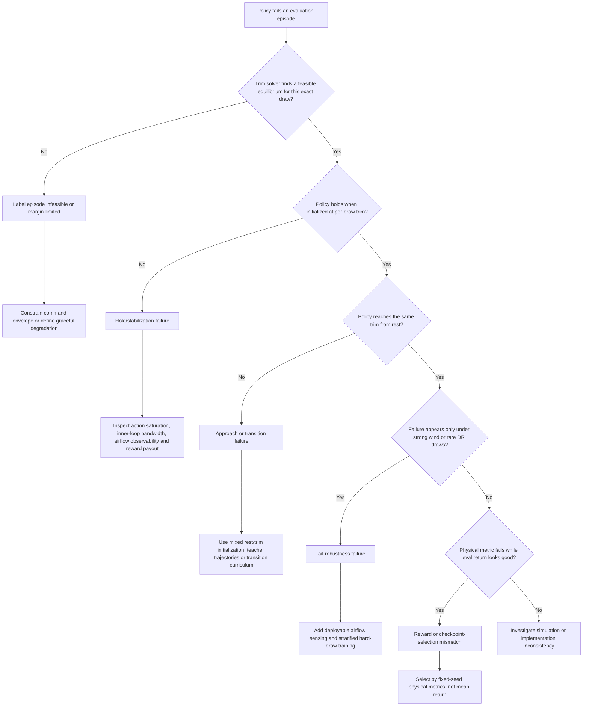

# Deep Research Audit and Recovery Plan for the Quadrotor Tailsitter RL Repository

## Executive summary

The repository documents a serious and unusually extensive reinforcement-learning campaign, but it does **not yet demonstrate completion of the stated 0–45 m/s tailsitter velocity-and-heading task**. The strongest demonstrated result is a mid-speed specialist covering 10–18 m/s with an attitude-command action interface: approximately **0.99 m/s median error on one 100-episode evaluation**, or a more conservative **1.09 m/s robust median with a 95% confidence interval of 0.99–1.20 m/s**, and 45–51% of episodes below 1 m/s. High-speed 18–25 m/s performance remains about **5.88 m/s median**, and the repository provides no validated 25–35 or 35–45 m/s result. The current headline therefore combines results from separate specialist lineages rather than proving one finished, unified 0–45 m/s policy. citeturn23view4turn27view1turn6view0

The experiment history strongly supports three conclusions:

1. **The original dominant failure was reward exploitation.** An independently commanded yaw objective paid substantial reward while the aircraft was diving or loitering far from the velocity target. Velocity-gating the yaw reward reduced error from 41.3 to 9.2 m/s, by far the largest improvement in the campaign. Attitude-gating was then needed because an arbitrary body-heading command is not physically compatible with wing-borne flight in which the aircraft nose and velocity vector are strongly coupled. citeturn27view2turn24view4turn24view5

2. **The second dominant failure was an action-interface stabilization problem.** From trim, the direct body-rate policy rapidly commanded saturated rates and left the unstable wing-borne equilibrium. Supplying an attitude-setpoint interface, tracked by an inner attitude loop, reduced the mid-band median from 3.44 to 2.35 m/s at 12 million steps and then to about 1.09 m/s at 28 million steps. This is more convincing than the unsuccessful larger-network, LSTM, privileged-critic, reward-sharpening, and no-domain-randomization experiments because it changes the actual closed-loop stabilization structure. citeturn27view1turn6view0

3. **The present residual is predominantly the strong-wind tail, not the calm-air median.** At the 28-million-step attitude-command checkpoint, mid-band medians were approximately 0.67 m/s for 0–5 m/s wind, 0.99 m/s for 5–10 m/s wind, and 2.17 m/s for 10–15 m/s wind. The next work should therefore target deployable airflow observability, stratified hard-wind training, and robust evaluation—not another indiscriminate increase in network size or reward complexity. citeturn27view1

There are also significant reproducibility limitations. The repository deliberately ignores `results_*`, TensorBoard logs, model archives, normalization files, NumPy artifacts, and shell scripts. Consequently, the committed material contains markdown summaries and selected figures but **not the checkpoints or raw logs needed to independently reproduce the reported curves or reevaluate historical models**. citeturn20view8turn23view4

A literal `git clone` could not be completed in the execution container because DNS resolution for GitHub was unavailable. The audit therefore used the live repository’s GitHub file tree, raw source files, commit pages, and markdown histories. I could inspect the code and documented artifacts, but I could not load the omitted model archives or rerun training.

The recommended path is not “train the current command longer.” It is:

**freeze and reproduce the 28M attitude-command result → repair artifact/checkpoint handling → formally redefine heading across hover and wing-borne regimes → add per-draw feasibility and hold-versus-approach diagnostics → attack the 10–15 m/s wind tail with airflow observability and stratified sampling → transfer the proven architecture to 18–25 m/s → expand to 25–45 m/s using band-balanced training and teacher-assisted initialization → distill or blend specialists into a single deployable policy.**

A realistic estimate is approximately **three to six weeks of focused work on one workstation**, excluding hardware flight testing. A single lucky run could finish sooner, but the evidence does not support treating this as a one-command continuation.

## Repository and evidence audit

### Repository structure and commit history

The repository currently contains 13 commits. Development began on July 20, 2026, with subsequent commits for wind estimation, position control, tailsitter conversion, deeper-network trials, and memory comparisons. The August 1, 2026 public-release commit reorganized prior work into `docs/` and `legacy/`, rewrote the README, added dependency declarations, and committed the current trim-initialization, attitude-command, privileged-critic, and distribution-aware evaluation features. That release commit changed 53 files with 1,967 additions and 192 deletions. citeturn23view2turn23view3

This history is useful but too coarse to serve as a fully reproducible experiment ledger. Many trial notes and current campaign features were consolidated in the final public-release commit rather than committed immediately after each experiment. The markdown history is therefore the main provenance record, while Git history mostly identifies broad project phases. citeturn23view3

The present root contains the environment, aerodynamic model, PPO and recurrent PPO trainers, continuation script, trim-table builder, classical baseline, in-flight and rest-start evaluation scripts, privileged critic, logging callback, and the `docs`, `legacy`, and `training_history` directories. citeturn23view4

### What the markdown files actually describe

The markdown material belongs to three different generations and should not be treated as one homogeneous specification.

| Markdown group | Actual scope | Current relevance |
|---|---|---|
| `README.md` | Current XWing velocity-and-heading campaign: approximately 14 kg, four 110 N motors, elevons, 0–45 m/s goal | Primary current overview |
| `training_history/00...33` | One file per current `velyaw` trial, including command, configuration, metrics, traces, and verdict | Primary experiment record |
| `training_history/INDEX.md` | Normalized chronological table of trials | Best compact history |
| `training_history/JOURNEY.md` | Early 81.7→5.26 m/s narrative and recurring reward-failure diagnosis | Valid historically but predates the latest trim/attitude-command results |
| `training_history/ULTIMATE_PLAN.md` | July 31 diagnosis and staged plan | Partially superseded by trials 27–33 |
| `docs/VELYAW_DESIGN.md` | Original design proposal saying that no training had yet occurred | Obsolete as a status document; still useful for design intent |
| `docs/TAILSITTER.md` | Earlier 2–5 kg, flat-plate/no-elevon tailsitter campaign | Legacy evidence, not the current XWing task |
| `docs/TRAINING_HISTORY.md`, `SUMMARY.md`, `LESSONS.md` | Earlier heavy-quad and position-control campaigns, plus the first tailsitter extension | Useful general lessons, but many numeric results are not current XWing results |

The current README defines the task as tracking a random three-dimensional target velocity and commanded heading under 0–15 m/s wind and roughly ±20% randomization of aerodynamics and actuator properties. The current trainer uses an MLP PPO policy, a 50 Hz policy loop, and a 500 Hz inner control loop. citeturn23view4turn24view6turn25view0

By contrast, `docs/LESSONS.md` begins with a roughly 10 kg conventional quadrotor, 40 N motors, 0–20 m/s wind, and an attitude-crash termination. `docs/TAILSITTER.md` then describes a lighter 2–5 kg tailsitter with a simpler aerodynamic model and no current XWing elevon configuration. Those files contain valuable observations about reward design, sensing, motor lag, and PPO versus SAC, but their airframe specifications and reported “champion” policies must not be mixed with the current 14 kg XWing campaign. citeturn19view0turn22view4turn22view5

`docs/VELYAW_DESIGN.md` is especially easy to misread because it says “Design only—no training yet,” recommends the initial reward, and presents the original 0–25 m/s formulation. The current campaign has already tested and revised those decisions extensively. citeturn20view6turn22view7

### Code and artifact inventory

The current environment implements:

- PyBullet physics at 500 Hz and policy control at 50 Hz.
- A custom XWing aerodynamic model with elevon force and moment effects.
- Per-episode randomized aerodynamic coefficients, center of gravity, mass, motor lag, servo gain and offset, and wind.
- Motor force state, fin state, a disturbance-force estimate, scalar pitot airspeed, leaky velocity and yaw integrals, and wrap-safe yaw error in the observation.
- Either direct rate commands or an attitude-command interface.
- PPO with `n_steps=2048`, batch size 4096, ten epochs, GAE λ=0.95, clipping 0.2, base learning rate `3e-4`, and a 256×256 MLP by default. citeturn24view0turn24view1turn24view3turn24view4turn25view0

There are stale comments in the source. For example, the top-level environment documentation describes a four-dimensional CTBR action, while current XWing operation can use six actions—two elevons, thrust, and either body-rate or attitude/yaw commands. This does not necessarily change runtime behavior, but it increases the chance of evaluation or deployment code using the wrong interface assumption. citeturn24view0turn27view1

The repository’s most consequential artifact issue is explicit in `.gitignore`: result directories, logs, shell scripts, `.npz`, model `.zip`, normalization `.pkl`, PyTorch files, TensorBoard directories, and generated training curves are excluded by default. The committed trial figures were evidently force-added, but raw checkpoints and event files are absent. citeturn20view8

Therefore:

| Requested artifact | Present in public repository? | Audit consequence |
|---|---:|---|
| Trial markdown summaries | Yes | Training chronology can be reconstructed |
| Selected training-curve PNGs | Yes | Qualitative curve inspection is possible |
| `config.json` from each run | Embedded in many markdown files | Hyperparameters can often be recovered |
| TensorBoard event files | No | Cannot independently recompute learning curves |
| PPO checkpoints | No | Cannot reevaluate historical policies |
| Matching `VecNormalize` snapshots | No | Cannot safely load historical checkpoints |
| Replay buffers | No | Not relevant to PPO, but legacy SAC buffers are absent |
| Exact Python lock file | No | Dependency-level reproduction is not guaranteed |
| OS, CPU, RAM, compiler information | Unspecified | Wall-clock estimates are uncertain |
| Random seeds for every training lineage | Partially specified | Multi-seed statistical reproduction is unavailable |

## Training history reconstruction

### Early reward and actuation phase

The normalized `INDEX.md` and the individual trial files describe the following sequence. Metrics are not perfectly homogeneous: early entries usually report mean velocity error across the full evaluation distribution, whereas later specialist trials emphasize median, percent below 1 m/s, and wind bins. They should be read as a decision history, not as one perfectly controlled benchmark. citeturn23view1turn6view0

| Trial | Main intervention | Documented outcome | Decision |
|---:|---|---|---|
| 00 | Flat-plate `velyaw` baseline | Trained but not physically evaluated | Superseded by XWing physics |
| 01 | XWing aerodynamics and motors only | 81.7 m/s; yaw good while aircraft dives | Severe reward-exploiting local optimum |
| 02 | Added elevons and 110 N motors | 41.3 m/s | Correct actuation helps but does not remove local optimum |
| 03 | Tough initialization and wind curriculum | 39.7 m/s; 0% recovery | Exposure cannot overcome bad incentives |
| 04 | Velocity-gated yaw reward; entropy 0.003 | 9.2 m/s | Largest breakthrough |
| 05 | Continuation to approximately 14M | 7.36 m/s | Useful continuation, then plateau |
| 06 | Gate-only ablation | 7.89 m/s | Confirms yaw gate—not curriculum—is the active mechanism |
| 07 | Narrow velocity-precision term | 7.53 m/s; low band improved, high band did not | Local precision lever only |
| 08 | Attitude-gated yaw reward | 6.82 m/s; high band improved | Removes incompatible yaw demand in wing-borne flight |
| 09 | Fresh full-stack run | 6.70 m/s; yaw about 4.1° | Lineage contamination ruled out |

The campaign’s recurring reward failure is clearly documented: a failure behavior repeatedly earned reward close to successful behavior, first through yaw while diving, later through yaw at an intermediate tilt, and then through a wide velocity-coverage term while loitering. Direct per-step reward accounting was the correct diagnostic. citeturn27view2

### Capacity, horizon, specialization, and classical feasibility phase

| Trial | Main intervention | Documented outcome | Decision |
|---:|---|---|---|
| 10 | Larger network | Interrupted around 2.5M | Inconclusive |
| 11 | 512×512 network; real 0–15 m/s wind | 5.55 m/s | Capacity not the main limit |
| 12 | Coverage width reduced to 5 m/s | 5.44 m/s | Small gain; reward shaping nearly exhausted |
| 13 | γ=0.997 and 14 s episodes | 5.26 m/s; high 8.58; recovery 57%; yaw degraded badly | Longer value horizon helps transition but harms objective balance |
| 14 | Further continuation | Regressed to 6.24 m/s | Last checkpoint is not necessarily best |
| 15 | Low-band specialist | 2.31 m/s mean | Specialization alone insufficient |
| 16 | Converged low specialist | Hover 0.78; low median 0.82; 59% below 1 | First genuinely sub-1 median |
| 17 | High-band specialist | Approximately 10.09 m/s | High band still structurally difficult |
| 18 | Recurrent PPO/LSTM | 17.2 m/s; yaw about 82° | Recurrence does not fix the primary mechanism |
| 19 | Stiffer inner rate loop | High approximately 8.94 m/s | Rate ripple not dominant |
| 20 | Removed aerodynamic domain randomization | High approximately 11.40 m/s | Domain randomization was regularizing, not simply obstructing |
| 21 | Classical trim/cascade baseline | Low mean 0.64; mid median about 0.20; high median about 3.90; nominal trims found | Physics is feasible at least for nominal and many evaluated conditions |

The classical baseline is a pivotal control experiment. It shows that the mid-band problem is not fundamentally caused by absent actuator authority or impossible nominal trim. It also supplies a teacher and a structural clue: the classical cascade stabilizes attitude before asking the outer controller to optimize velocity. citeturn6view0turn27view1

### Isolation, trim initialization, and action-interface phase

| Trial | Main intervention | Documented outcome | Decision |
|---:|---|---|---|
| 22 | True integrator, longer episode, high γ, stiff gains bundled together | Low median 2.08; yaw about 53° | Confounded failure |
| 23 | Corrected mid-band γ | Mid about 10.51; yaw about 77° | High γ not a clean solution |
| 24 | Corrected high-band run | Aborted | No conclusion |
| 25 | Low-band isolation with normal γ and gains | Median about 0.93; yaw poor | Velocity mechanism exonerated from bundled trial |
| 26 | Mid-band “proven recipe” | Mean 6.33; median 4.44; yaw approximately 52° | Mid still fails from rest |
| 27 | Added 20% trim initialization | Mean 4.09; median 3.44; yaw approximately 14.5° | Largest mid-band data-distribution gain |
| 28 | Increased trim initialization to 40% | Essentially flat | Exposure alone reaches a ceiling |
| 29 | High-band with 20% trim initialization | Mean 7.38; median 5.88 | Best documented high result, still far from target |
| 30 | Privileged critic | Median about 5.13 | Critic information does not fix actor stabilization |
| 31 | Precision reward reshape | Median about 3.67 | Incentive refinement again largely flat |
| 32 | Attitude-command interface plus trim initialization | 12M: 2.35; 20M: 1.52; 28M: robust 1.09 | Best mid lineage; structural stabilization confirmed |
| 33 | Rate-interface budget ladder | 20M: 2.61; 28M: 1.72; 36M: 1.29; 44M: 1.37 | More training helps after trim-init, but rate interface saturates around 1.3–1.4 |

The latest trial-32 trace analysis states that the rate policy departs from exact trim within roughly a second, often commanding saturated rates and falling into a half-tilt, low-thrust attractor. The attitude-command variant instead asks the policy for a desired thrust direction and lets an inner attitude loop convert that direction into body-rate commands at the physics rate. citeturn27view1

The reconstructed budget ladders make the interaction between data distribution, action structure, and training budget visible:


The rate interface continued improving after trim initialization but flattened near 1.3–1.4 m/s. The attitude-command interface reached approximately 1.09 m/s by 28M steps using fewer cumulative steps for the same performance. The latest trial file also reports a declining training-return trend near the 28M endpoint, reinforcing the need to select by physical metrics rather than continuing blindly. citeturn22view1turn22view2turn27view1

### What is and is not solved

| Regime | Best documented status | Interpretation |
|---|---|---|
| Hover 0–1 m/s | Median about 0.61; 86% below 1 | Mostly solved |
| Low 1–10 m/s | Median about 0.82–0.88; 57–59% below 1 | Median solved; robust tail not solved |
| Mid 10–18 m/s | Robust median about 1.09; 45% below 1 | Near median target; reliability not solved |
| High 18–25 m/s | Median about 5.88 | Not solved |
| Very high 25–35 m/s | No validated result | Not demonstrated |
| Top 35–45 m/s | No validated result | Not demonstrated |
| Dive/botched-transition recovery | Approximately 12% in latest attitude-command evaluation | Not solved |
| Strong-wind 10–15 m/s tail | Mid median about 2.17 m/s | Principal current residual |
| Single unified 0–45 policy | No documented checkpoint | Not demonstrated |

The README’s 0–45 m/s wording is a goal envelope and evaluation-band structure, not evidence that the entire envelope has been trained successfully. citeturn23view4turn25view2turn27view1

## Failure modes and confirming diagnostics

### Failure-mode decision flow

The appropriate next intervention depends on whether an episode is infeasible, cannot hold trim, cannot approach trim, or is being mis-scored. The repository already contains the beginning of this distinction through `eval_inflight.py`, which solves a trim for the actual episode draw and compares in-flight hold behavior with rest-start behavior. citeturn24view9



### Ranked failure hypotheses

| Priority | Failure mode and evidence | Likely cause | Diagnostic that confirms or rejects it |
|---:|---|---|---|
| Critical | Arbitrary yaw command conflicts with wing-borne flight | Heading target is sampled independently of velocity, although fixed-wing heading, course and sideslip are coupled | Plot yaw objective, gate value, sideslip, velocity direction and body axes versus airspeed; test equivalent course-aware objective |
| Critical | Strong-wind tail remains poor while calm median is below 1 | Scalar pitot plus force-disturbance estimate may not uniquely expose three-axis airflow and sideslip under nonlinear aerodynamics | Repeat fixed scenarios with privileged true body-frame air velocity added only for diagnosis; a large gain confirms an observability gap |
| Critical | Historical checkpoint selection is unreliable | “Best” is chosen from mean reward over only ten randomized episodes; physical success is median/%<1/p90 on a larger fixed set | Reevaluate every available checkpoint on one fixed, stratified 300–1000-scenario bank |
| Critical | Old checkpoints lack matching normalization statistics | Checkpoint callback saves models, while the custom callback overwrites one `vecnormalize.pkl` path | Save one normalization snapshot per checkpoint and verify identical observations after reload |
| High | Policy reaches target but cannot remain at trim | Inner attitude gain, rate-loop bandwidth, actuator lag or airflow state is insufficient | In-flight trim test; attitude/thrust/elevon step responses; requested-versus-achieved wrench and saturation occupancy |
| High | Policy holds trim but cannot transition from rest | Training distribution underrepresents successful approach trajectories | Compare rest, nominal-trim, per-draw-trim and teacher-trajectory initializations using identical draws |
| High | Dive recovery remains approximately 12% | The successful mid policy was optimized mainly for ordinary rest starts and holding, not large upset recovery | Evaluate a fixed upset library; inspect whether recovery actions improve velocity reward monotonically |
| High | High and very-high commands may include infeasible draws | Relative airspeed can approach target speed plus 15 m/s wind; random aerodynamic draws may remove trim or leave negligible control margin | Run per-draw trim solver and calculate thrust/elevon margin before scoring the policy |
| Medium | Continuation results are not fully reproducible | `continue_train.py` does not record LR overrides, selected source model, or all runtime overrides in output configuration | Add immutable run manifest and compare reconstructed command with actual runtime state |
| Medium | More steps can regress | PPO continues updating after physical quality saturates; entropy and return metric may not align with tail performance | Checkpoint-by-checkpoint physical curve with multiple seeds and an early-stopping rule |
| Medium | Domain randomization evaluation is statistically noisy | Ten-episode callback evaluations can change substantially with random draw composition | Fixed scenario bank, bootstrap confidence intervals, repeated seeds, and stratification by wind/DR |
| Medium | Documentation can lead to wrong experiments | Legacy heavy-quad, simple-tailsitter and current XWing results coexist | Add document status banners and a machine-readable experiment registry |

The checkpoint concern is not merely theoretical. Stable-Baselines3’s official callback documentation notes that model checkpoints and normalization state must be saved together, and that save frequency must account for the number of vectorized environments. The current code already scales model frequency by environment count, but its separate normalization callback continually overwrites a single file rather than preserving the version paired with each historical model. citeturn21search30turn25view0

### Required diagnostic telemetry

Every evaluation row should include, at minimum:

| Category | Fields |
|---|---|
| Task | target velocity, target speed band, desired heading/course, gate value |
| Environment | wind vector, mass, motor lag, center of gravity, all aerodynamic multipliers, servo gain/offset |
| Feasibility | trim residual, required thrust, required elevon, thrust margin, elevon margin |
| Tracking | final-window velocity error, yaw/course error, sideslip, angle of attack, settling time, integral absolute error |
| Control | commanded and achieved thrust/moment, fin saturation fraction, motor saturation fraction, rate-command saturation, attitude error |
| Robustness | crash/divergence, recovery outcome, maximum altitude loss, maximum speed overshoot |
| Reward audit | each reward component separately, not only total reward |
| Provenance | git SHA, dependency lock hash, policy checkpoint SHA-256, normalization SHA-256, seed and scenario ID |

At present, `_computeInfo()` exposes target, desired yaw, position, velocity, mass, wind, motor lag, wind estimate, velocity error and yaw error, but omits most actuator saturation, aerodynamic-draw, reward-component and feasibility fields. citeturn24view5

## Recovery and completion plan

### Completion specification

Before further training, the task should be made physically precise. The current phrase “velocity plus commanded heading” becomes ambiguous in cruise. The repository itself recognizes that a random desired yaw can be structurally unsatisfiable when the nose is constrained by wing-borne velocity, and therefore attenuates yaw reward as the aircraft tilts. citeturn24view5turn20view6

The recommended objective is:

| Flight regime | Commanded directional objective |
|---|---|
| Hover and low airspeed | Body compass heading |
| Transition | Smooth blend of body heading and velocity-course direction |
| Wing-borne cruise | Ground course or air-relative course, low sideslip, and appropriate bank—not arbitrary independent body yaw |
| Vertical climb/dive | Heading around the usable horizontal projection, with the objective attenuated when geometrically ill-conditioned |

Use a smooth blend based on calibrated airspeed and/or tilt rather than a hard mode switch. This preserves one policy while removing an impossible objective. If arbitrary body yaw at 30–45 m/s is truly required, the airframe must be shown to have enough sideslip and control authority to achieve it; otherwise the specification, not the policy, is wrong.

Recommended simulation completion criteria are:

| Metric | Acceptance threshold |
|---|---:|
| Divergence/crash rate | 0% on at least 1,000 stratified simulation episodes |
| Per-band median velocity error | ≤1.0 m/s |
| Per-band success rate | ≥80% below 1 m/s initially; ≥90% for final robust release |
| Per-band p90 velocity error | ≤2.5 m/s |
| Strong-wind 10–15 m/s median | ≤1.5 m/s interim, ≤1.0 m/s final |
| Heading error where heading is active | Median ≤10°, p90 ≤20° |
| Cruise sideslip | Defined airframe limit, preferably derived from aerodynamic validation |
| Dive/upset recovery | ≥80% with bounded altitude loss |
| Feasible-draw hold test | ≥95% below 1 m/s |
| Rest-start versus trim-start gap | ≤0.5 m/s median |
| Seed robustness | Threshold passed by at least four of five training seeds |

### Prioritized experiment sequence

| Priority | Experiment | Exact decision rule | Estimated effort |
|---:|---|---|---:|
| P0 | Repair manifests and checkpoint/normalization pairing | Do not start long runs until every checkpoint reloads identically | 0.5–1 day |
| P0 | Build fixed scenario banks and feasibility labels | Repeated evaluations must be bitwise or statistically consistent | 1 day |
| P0 | Reproduce trial-32 architecture with three to five seeds | Median and confidence interval should overlap documented 28M result | 2–5 compute days |
| P1 | Course-aware heading objective A/B test | Keep only if velocity improves without unacceptable hover heading loss | 2–3 days |
| P1 | Privileged three-axis airspeed diagnostic | A substantial hard-wind improvement confirms observability limitation | 1–2 days |
| P1 | Deployable airflow observer/sensor A/B | Must recover most of privileged diagnostic gain | 3–7 days |
| P1 | Hard-wind stratified sampling | Keep only if 10–15 m/s bin improves without calm-bin regression | 2–4 days |
| P2 | Transfer attitude-command recipe to 18–25 m/s | Require clear improvement over 5.88 median before expanding | 3–7 days |
| P2 | Rest/trim/teacher mixed initialization | Use hold-versus-approach result to set mixture | 2–5 days |
| P2 | Recovery curriculum after reward audit | Require ≥50%, then ≥80% upset recovery without nominal regression | 2–5 days |
| P3 | Extend to 25–35 and 35–45 m/s | Only feasible draws count toward controller quality; infeasible commands trigger degradation | 1–2 weeks |
| P3 | Distill specialists into one policy | Unified student must remain within 10% of every specialist metric | 3–7 days |
| P4 | ArduPilot/PX4-style SITL and hardware safety validation | No hardware free-flight until SITL and tether tests pass | 1–3 weeks |

### Baseline freeze and reproducibility repair

The first deliverable should be a frozen `xw32` reproduction branch, not another reward experiment.

The branch should:

1. Pin a repository commit and all dependencies.
2. Save the complete command and environment in `manifest.json`.
3. Save `model_<steps>.zip` and `vecnormalize_<steps>.pkl` atomically.
4. Save optimizer state, source-checkpoint hash, and effective learning rate.
5. Use a fixed scenario bank for checkpoint selection.
6. Preserve the last checkpoint but designate a release model using physical metrics.
7. Run at least three seeds before accepting an intervention.

The callback should rank models lexicographically:

1. zero divergence;
2. highest percent below 1 m/s;
3. lowest median;
4. lowest p90;
5. lowest yaw/course error;
6. lowest actuator saturation.

Mean reward should remain a training diagnostic, not the release criterion. The current callback plots mean return and lets the standard evaluation callback save the best mean-return model from ten deterministic episodes, which is poorly aligned with the repository’s later distribution-aware physical metrics. citeturn27view0turn25view2

### Strong-wind residual campaign

The latest mid policy is already near target in low and moderate wind. The hard-wind campaign should therefore be a small controlled matrix, not a broad hyperparameter search.

| Arm | Observation/training change | Purpose |
|---|---|---|
| Control | Current `xw32` configuration | Reproduction baseline |
| Diagnostic truth | Add true body-frame air-relative velocity to actor observation | Determine maximum gain available from airflow observability |
| Deployable observer | Estimate body-frame airflow from IMU, GPS, pitot, motor thrust and aerodynamic residual | Realistic replacement for privileged truth |
| Sensor model | Simulate multi-hole pitot or pitot plus sideslip measurements | Test whether modest hardware sensing closes the tail |
| Distribution | 50% ordinary wind, 50% wind sampled from 8–15 m/s | Increase hard-tail gradient |
| Robust combination | Best deployable observation plus hard-wind mixture | Confirm compound gain |

Only one observation change should be introduced per first-stage arm. Three seeds and 8M-step screening runs are sufficient to reject weak ideas; promising arms can continue in 4–8M increments.

The earlier tailsitter investigation independently identified three-axis airspeed as the principal untried structural sensor for crosswind residuals. RotorPy’s inclusion of aerodynamic wrenches, actuator dynamics, wind models, and realistic sensors also makes it a useful second simulator for checking whether a proposed airflow observer is exploiting a PyBullet-specific artifact. citeturn22view5turn21search3turn21search23

### High-speed transfer

For 18–25 m/s, start from the proven architecture—not from the old high specialist:

```bash
python train.py \
  --xwing-aero \
  --yaw-bias 0.3 \
  --max-speed 25 \
  --speed-min 18 \
  --wind-max 15 \
  --yaw-gate \
  --yaw-att-gate \
  --vel-precision 0.7 \
  --cov-width 5 \
  --ent-coef 0.003 \
  --trim-init 0.2 \
  --att-cmd \
  --katt 1.5 \
  --gamma 0.99 \
  --episode-len 8 \
  --timesteps 8000000 \
  --seed 0 \
  --out-dir results_high_attcmd_s0
```

Repeat for seeds 1 and 2. Continue only the best two physically evaluated seeds:

```bash
python continue_train.py \
  --src results_high_attcmd_s0 \
  --out results_high_attcmd_s0_16m \
  --extra 8000000 \
  --lr 1e-4 \
  --model-file results_high_attcmd_s0/best_physical/best_model.zip
```

Before training, ensure that the trim table covers the **relative-air-speed envelope**, not only target ground speed. For a 25 m/s target and 15 m/s opposing wind, at least 40 m/s relative-air-speed coverage is required. For the eventual 45 m/s target, the table and aerodynamic model need at least 60 m/s coverage.

Run both evaluations after every stage:

```bash
python analyze_velyaw.py \
  --dir results_high_attcmd_s0_16m \
  --episodes 300 \
  --ep-len 8

python eval_inflight.py \
  --dir results_high_attcmd_s0_16m \
  --episodes 150 \
  --ep-len 8
```

Interpretation:

- **Good in-flight hold, poor rest start:** add transition demonstrations, rest/trim mixtures, or a trajectory curriculum.
- **Poor in-flight hold:** do not increase transition exposure; fix stabilization, airflow observability, or physical margin.
- **Only high-wind failures:** proceed with the strong-wind tail campaign.
- **Large trim residual or actuator margin near zero:** label the draw infeasible and redesign the command envelope.

### Expansion to 45 m/s

A uniform target-speed distribution across 0–45 m/s will not adequately train each operational regime. Hover occupies only 1/45 of the scalar speed range, while the aircraft dynamics change sharply between hover, transition and cruise. Use a band-balanced sampler:

| Band | Initial sampling probability |
|---|---:|
| Hover 0–1 | 15% |
| Low 1–10 | 20% |
| Mid 10–18 | 20% |
| High 18–25 | 20% |
| Very high 25–35 | 15% |
| Top 35–45 | 10% |

Within each band, sample direction, wind, and aerodynamic parameters independently, but monitor feasibility. Increase top-band exposure only after the policy meets the previous band’s gate.

The most reliable completion architecture is likely:

1. Train robust band specialists with a shared observation and action definition.
2. Train a shared actor with either band-specific critics or a task embedding.
3. Use the specialists and classical trim controller as teachers.
4. Distill into one deployable actor.
5. Fine-tune the student with PPO under full randomization.

Recent multi-task quadrotor research reports successful knowledge sharing through shared task encoders and multiple critics across stabilization, velocity tracking and racing. It is not a drop-in tailsitter solution, but it supports the shared-actor/multi-critic direction for combining distinct flight regimes. citeturn21search1turn21search5

## Algorithms, rewards, simulators, and external baselines

### Candidate algorithm comparison

| Candidate | Advantages for this task | Main risks | Recommendation |
|---|---|---|---|
| PPO with MLP and attitude-command interface | Already best in repository; stable with parallel CPU simulation; compatible with domain randomization | Sample hungry; can drift after saturation | **Primary algorithm** |
| PPO plus multi-critic/task encoding | Can share actor behavior while giving each speed regime an appropriate value function | More implementation complexity; needs careful batching | Strong candidate for unified 0–45 policy |
| PPO teacher–student initialization | Uses classical trim and specialist policies to solve sparse transition discovery | Teacher bias; distribution mismatch | High priority for 25–45 extension |
| Recurrent PPO | Can represent latent dynamics and temporal filters | Repository LSTM result failed badly; slower and harder to debug | Revisit only after observation and objective fixes |
| SAC | More sample-efficient in some continuous tasks | Earlier repository work found unstable CPU training under heavy randomization; replay mixes heterogeneous dynamics | Secondary comparison, not recovery default |
| Residual RL over classical controller | Strong safety and stability; smaller learned correction problem | Not fully end-to-end; residual authority must be constrained | Excellent hardware-readiness baseline |
| Model-predictive control plus learned model/residual | Explicit constraints and feasibility handling | Greater engineering effort and online computation | Essential reference baseline |
| RAPTOR-style foundation policy transfer | Strong reusable quadrotor-control architecture and deployable implementation | Dynamics and action conventions differ greatly from a tailsitter | Architectural reference, not direct initialization |

Stable-Baselines3 describes PPO as an on-policy clipped method intended to prevent overly large policy updates, and its official guidance recommends normalized observations, separate evaluation environments, multiple runs, and tuned hyperparameters for custom continuous-control problems. citeturn21search6turn21search26turn21search34

The repository’s LSTM failure does not prove that recurrence is never useful. A tailsitter controller from Zhou and colleagues uses an RNN to approximate an expensive nonlinear desired-attitude/thrust solver inside a cascaded controller, enabling a unified hover-transition-cruise implementation at real-time rates. That result suggests a better role for recurrence here: **imitating a nonlinear teacher or airflow estimator**, not replacing a mis-specified objective or unstable action interface. citeturn26search4

RAPTOR provides a recent reusable foundation policy for quadrotor control with a documented observation/action interface and 10 ms simulation step. Its direct transfer to the XWing tailsitter would be unsafe because of airframe and axis differences, but its training infrastructure, compact deployment interface, and task-conditioning approach are useful references. citeturn21search29turn26search3

### Reward-design comparison

| Reward design | Expected behavior | Risk | Decision |
|---|---|---|---|
| Current additive velocity and gated-yaw reward | Dense learning signal and demonstrated progress | Gate can hide an ill-defined heading specification; wide terms can support loitering | Retain velocity component; revise directional objective |
| Independent velocity and arbitrary yaw | Simple formulation | Physically incompatible in wing-borne flight | Reject |
| Velocity plus regime-blended heading/course/sideslip | Consistent with hover and fixed-wing physics | Requires calibrated blending and sideslip model | **Recommended** |
| Pure narrow precision reward | Strong local pull | Little gradient before policy enters precision region | Reject as sole reward |
| Wide coverage plus narrow precision | Coarse approach plus terminal precision | Coverage payout must be audited in failure states | Retain with measured component accounting |
| Lexicographic or constrained objective | Prevents yaw from being optimized at unacceptable velocity error | More custom training/evaluation machinery | Good if gating remains exploitable |
| Tail-weighted or CVaR-style optimization | Directly targets rare strong-wind failures | Can sacrifice ordinary-case performance and increase variance | Apply only after observability test |
| Teacher action or trajectory auxiliary loss | Accelerates transitions and high-speed trim discovery | Teacher may prevent better RL behavior | Use as temporary auxiliary objective |

The existing reward includes a sharp velocity peak, a wide Gaussian coverage term, a narrow optional precision term, a similarly multi-scale yaw term, a joint bonus, a linear velocity pull, and smoothness penalties. Velocity coverage gates yaw, while an attitude factor further attenuates yaw in wing-borne flight. citeturn24view4turn24view5

The critical redesign is semantic rather than numerical: do not spend another week tuning `yaw_weight` or `yaw_width` until “heading” has a physically valid meaning across hover, transition and cruise.

### Simulation and validation environment comparison

| Environment | Strengths | Limitations for this project | Best use |
|---|---|---|---|
| Current custom PyBullet environment | Existing XWing model, training history, fast parallel PPO workflow | Custom dynamics are weakly validated; checkpoint artifacts absent | Main development environment |
| `gym-pybullet-drones` | Gymnasium/SB3 integration and vectorized drone examples | Stock models are multirotors, not this tailsitter | Infrastructure and API base |
| RotorPy | Transparent 6-DoF multirotor dynamics, aerodynamic wrenches, actuator dynamics, wind, sensors, batched simulation | Requires custom tailsitter aerodynamic model and elevons | Independent dynamics and observer validation |
| ArduPilot SITL | Mature tailsitter modes, transition logic, tuning guidance, realistic autopilot interfaces | Slower and not designed as a high-throughput RL trainer | Deployment integration and safety verification |
| Custom JAX/C++ simulator | Potentially very high throughput and exact batching | Large porting and validation burden | Later optimization only |
| Hardware-in-the-loop | Captures actuator, estimator, latency and aerodynamic discrepancies | Safety, cost and reset burden | Final staged validation |

ArduPilot explicitly treats tailsitters differently from conventional lift-plus-cruise or tilt-rotor QuadPlanes and maintains separate tailsitter setup and tuning guidance. It should be used as an operational reference even if the final controller remains RL-based. citeturn26search2turn26search21

### High-value external resources

| Resource | Relevant lesson for this repository |
|---|---|
| RL adaptive landing for a quadrotor biplane tailsitter | Uses RL for outer-loop planning/control while retaining an attitude inner loop, closely matching the repository’s successful move toward structured stabilization |
| Unified RNN tailsitter controller | Learns/approximates a nonlinear desired-attitude and thrust solver rather than learning raw unstable rates |
| Full-attitude tailsitter control with flexible modes | Emphasizes frequency-response identification, notch filtering and robust inner-loop tuning |
| Aerodynamic feedforward-feedback tailsitter architecture | Supports explicit aerodynamic feedforward plus feedback across hybrid regimes |
| Hybrid aerodynamic-model MPC | Provides a constrained, model-based benchmark for nonlinear tailsitter aerodynamics |
| Universal optimal tailsitter control, 2026 | Uses direct-collocation trajectories with actuator and angle-of-attack constraints; useful teacher-trajectory source |
| Autonomous high-speed tailsitter flight | Demonstrates that high-speed tailsitter autonomy benefits from explicit model-based trajectory generation and control |
| Multi-task RL for quadrotors | Supports shared actor and regime/task-specific critic architecture |
| RAPTOR foundation policy | Reference for compact, reusable learned flight-control policies |
| RotorPy sim-to-real work | Reference for fast training, aerodynamic validation, and real-flight transfer |

The Vertical Flight Society tailsitter RL work retains an inner attitude controller while replacing trajectory planning and outer position control with RL, which is much closer to the successful trial-32 architecture than a raw motor- or rate-level end-to-end policy. citeturn21search28

Classical tailsitter literature also repeatedly uses hierarchical structures. Full-attitude work identifies and filters flexible modes, while recent hybrid aerodynamic MPC and aerodynamic feedforward-feedback approaches explicitly model rapidly changing aerodynamic forces across hover, transition and cruise. These should be treated as baselines and teacher generators, not as competitors to be ignored because the final outer controller is RL. citeturn26search0turn26search19turn26search28

A 2026 optimal-control study formulates tailsitter transition with direct collocation, actuator limits and angle-of-attack constraints. Such optimized trajectories are particularly valuable for initializing the 25–45 m/s transition regime, where random exploration is least efficient and least safe. citeturn26search12

## Reproducibility, commands, and delivery timeline

### Environment status

The repository specifies only lower bounds:

```text
stable-baselines3>=2.3
sb3-contrib>=2.3
torch>=2.2
gymnasium>=0.29
pybullet>=3.2
numpy>=1.26
scipy>=1.11
matplotlib>=3.8
tqdm
rich
```

`gym-pybullet-drones` is installed separately and is not pinned in `requirements.txt`. The operating system, Python version, CPU, RAM, compiler, PyBullet build, and exact package versions are unspecified. citeturn24view8turn23view4

Python 3.11 on Ubuntu 22.04 or 24.04 is a reasonable proposed baseline, but this is a recommendation rather than a repository-declared environment.

### Repository-faithful setup

```bash
git clone https://github.com/babeingineer/quadrotor-rl-analysis.git
cd quadrotor-rl-analysis

# Pin the audited public-release state.
git checkout 8eb4a131e74e44c6eeaa46056235bdea81464ad6

python3.11 -m venv .venv
source .venv/bin/activate

python -m pip install --upgrade pip setuptools wheel
python -m pip install -r requirements.txt
python -m pip install gym-pybullet-drones

python -m pip check
python -m pip freeze | sort > requirements.lock.txt

python - <<'PY'
import json
import platform
import sys
import numpy
import scipy
import torch
import gymnasium
import pybullet
import stable_baselines3
import sb3_contrib

info = {
    "platform": platform.platform(),
    "python": sys.version,
    "numpy": numpy.__version__,
    "scipy": scipy.__version__,
    "torch": torch.__version__,
    "gymnasium": gymnasium.__version__,
    "stable_baselines3": stable_baselines3.__version__,
    "sb3_contrib": sb3_contrib.__version__,
}
print(json.dumps(info, indent=2))
PY
```

After a successful smoke test, commit `requirements.lock.txt` or produce a lock using `uv`, `pip-tools`, Poetry, or Conda. Do not begin a multi-day run with only lower-bounded dependencies.

### Static and environment diagnostics

Create `diagnostics/check_env.py`:

```python
from stable_baselines3.common.env_checker import check_env

from rate_vel_aviary import RateVelAviary


def main() -> None:
    env = RateVelAviary(
        use_xwing_aero=True,
        randomize_init=True,
        wind_max=15.0,
        max_speed=18.0,
        speed_min=10.0,
        yaw_gate=True,
        yaw_att_gate=True,
        trim_init_frac=0.2,
        att_cmd=True,
    )
    try:
        check_env(env, warn=True, skip_render_check=True)
        obs, info = env.reset(seed=123)
        assert obs.shape == env.observation_space.shape
        assert env.observation_space.contains(obs)

        for _ in range(500):
            action = env.action_space.sample()
            obs, reward, terminated, truncated, info = env.step(action)
            assert env.observation_space.contains(obs)
            assert isinstance(float(reward), float)
            if terminated or truncated:
                obs, info = env.reset()
    finally:
        env.close()


if __name__ == "__main__":
    main()
```

Run:

```bash
mkdir -p diagnostics

python -m compileall -q .
python diagnostics/check_env.py

python build_trim_table.py
sha256sum trim_table.npz

python classical_baseline.py \
  --episodes 300 \
  --kp 1.2 \
  --ki 0.4 \
  --katt 4.0 \
  --wind-max 15

python train.py \
  --smoke \
  --xwing-aero \
  --max-speed 18 \
  --speed-min 10 \
  --wind-max 15 \
  --yaw-bias 0.3 \
  --yaw-gate \
  --yaw-att-gate \
  --vel-precision 0.7 \
  --cov-width 5 \
  --ent-coef 0.003 \
  --trim-init 0.2 \
  --att-cmd \
  --out-dir results_smoke_attcmd
```

The smoke test verifies wiring only; it is not evidence of learning.

### Baseline retraining commands

Run at least three seeds:

```bash
for SEED in 0 1 2; do
  python train.py \
    --xwing-aero \
    --yaw-bias 0.3 \
    --max-speed 18 \
    --speed-min 10 \
    --wind-max 15 \
    --yaw-gate \
    --yaw-att-gate \
    --vel-precision 0.7 \
    --cov-width 5 \
    --ent-coef 0.003 \
    --trim-init 0.2 \
    --att-cmd \
    --katt 1.5 \
    --gamma 0.99 \
    --episode-len 8 \
    --timesteps 12000000 \
    --n-envs 6 \
    --seed "${SEED}" \
    --out-dir "results_mid_attcmd_s${SEED}_12m"
done
```

Continue each promising seed in separate immutable directories:

```bash
for SEED in 0 1 2; do
  python continue_train.py \
    --src "results_mid_attcmd_s${SEED}_12m" \
    --out "results_mid_attcmd_s${SEED}_20m" \
    --extra 8000000 \
    --lr 1e-4
done
```

Then:

```bash
for SEED in 0 1 2; do
  python continue_train.py \
    --src "results_mid_attcmd_s${SEED}_20m" \
    --out "results_mid_attcmd_s${SEED}_28m" \
    --extra 8000000 \
    --lr 1e-4
done
```

Evaluate with a larger fixed sample:

```bash
for DIR in results_mid_attcmd_s*_28m; do
  python eval_velyaw.py --dir "${DIR}" --episodes 500 \
    | tee "${DIR}/physical_eval_500.txt"

  python analyze_velyaw.py --dir "${DIR}" --episodes 300 --ep-len 8 \
    | tee "${DIR}/analysis_300.txt"

  python eval_inflight.py --dir "${DIR}" --episodes 150 --ep-len 8 \
    | tee "${DIR}/inflight_eval_150.txt"
done
```

### Required continuation-script fixes

Before relying on these runs, modify `continue_train.py` so the output manifest records:

```json
{
  "source_directory": "...",
  "source_model_file": "...",
  "source_model_sha256": "...",
  "source_vecnormalize_sha256": "...",
  "extra_timesteps": 8000000,
  "effective_learning_rate": 0.0001,
  "effective_episode_length": 8.0,
  "effective_yaw_bias": 0.3,
  "git_sha": "...",
  "command_line": "...",
  "dependency_lock_sha256": "...",
  "hostname": "...",
  "seed": 0
}
```

At present, continuation can override learning rate, episode length and yaw bias, but not all of those effective values are persisted in the copied `config.json`. It also resumes the final model by default rather than the physically best checkpoint unless `--model-file` is supplied. citeturn25view1

### Hyperparameter sweep

Do not launch a large combinatorial sweep. Use sequential, evidence-gated experiments:

| Parameter | Screening values | Reason |
|---|---|---|
| `katt` | 1.0, 1.5, 2.0, 3.0 | Directly controls attitude stabilization bandwidth |
| Trim-init fraction | 0.1, 0.2, 0.4 | Retest only with attitude-command interface; old 0.4 result used rate interface |
| Entropy coefficient | 0.001, 0.003, 0.005 | Balance late precision and policy collapse/drift |
| Learning-rate continuation | `1e-4`, `3e-5` | Determine whether late physical quality can improve without policy drift |
| Hard-wind mixture | 0%, 25%, 50% episodes from 8–15 m/s | Target observed residual |
| Observation | current, true 3-axis airflow diagnostic, deployable airflow estimate | Isolate observability |
| Heading formulation | current gate, course-aware blend | Fix task semantics |
| Tough-init fraction | 0%, 5%, 10% | Recovery only after nominal task is stable |

Run 2–4M-step screeners only for variables that affect immediate stabilization, such as `katt`. Observation or objective changes require fresh runs and should receive 8M-step screens because the campaign shows that early plateaus can be misleading.

### Delivery timeline

| Work package | Elapsed effort | Deliverable |
|---|---:|---|
| Reproducibility repair | 0.5–1 day | Locked environment, run manifest, paired checkpoints |
| Fixed evaluation and feasibility bank | 1–2 days | Stratified scenarios and deterministic reports |
| Multi-seed trial-32 reproduction | 2–5 days | Verified baseline with confidence intervals |
| Heading/course redesign | 2–4 days | Physically consistent task and A/B result |
| Airflow-observability campaign | 4–8 days | Strong-wind diagnosis and deployable sensor/observer |
| High-band transfer | 4–10 days | 18–25 m/s specialist approaching ≤1 m/s median |
| Recovery training | 2–5 days | ≥80% upset recovery target |
| 25–45 m/s specialists | 1–2 weeks | Validated very-high/top-band policies |
| Distillation into unified policy | 3–7 days | Single 0–45 actor |
| SITL and hardware-readiness validation | 1–3 weeks | Safety envelope and staged flight-test plan |

The shortest credible path to a **simulation-only banded solution** is approximately two to four weeks. A statistically defensible unified 0–45 m/s policy with strong-wind robustness and recovery is more realistically a **three-to-six-week effort**, with additional time for SITL and hardware validation. The highest-probability path is to preserve the current PPO and attitude-command foundation, repair the experimental infrastructure, and attack the remaining problem in the order indicated by the evidence: **task semantics, airflow observability, hard-wind robustness, high-speed transfer, recovery, then unification**.