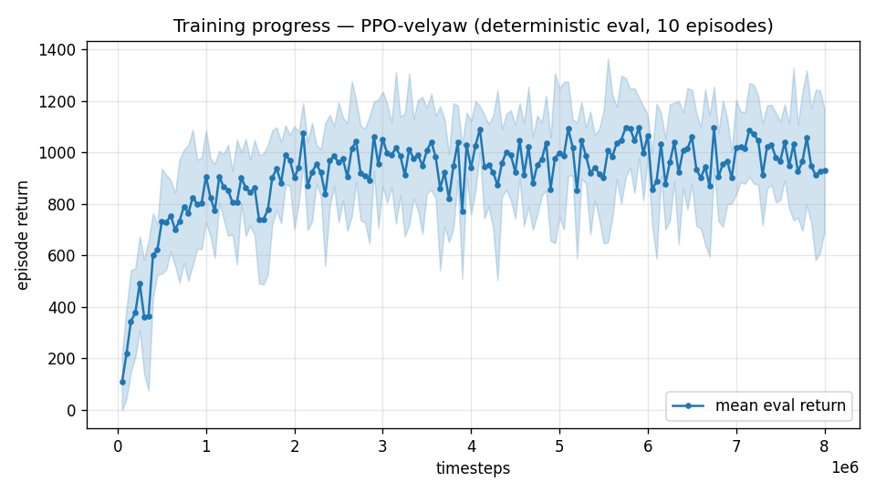

# Trial 00 — velyaw baseline (light tailsitter, flat-plate aero)

| | |
|---|---|
| run dir | `results_velyaw` |
| date | 2026-07-28 (~12:00) |
| steps | 8,011,776 (completed) |
| env | RateVelAviary, **flat-plate force-only aero** (no aerodynamic moment) |
| airframe | light tailsitter: 2–5 kg, 4×40 N motors, arm 0.30 m |
| action | 4-dim CTBR `[thrust, p, q, r]` |
| obs | 36-dim |
| algo | PPO MlpPolicy [256,256], batch 4096, n_steps 2048, lr 3e-4, ent 0, 6 SubprocVecEnv, CPU |
| status | trained to completion; **never physically evaluated** (superseded same day by the XWing-physics series) |

## What this run was
The **first run of the new velyaw task** — the two-objective extension of the tailsitter
velocity task: track a random 3-D target velocity (0–25 m/s) **and** hold a commanded heading
(`desired_yaw`, ±180°). Designed in [`../VELYAW_DESIGN.md`](../VELYAW_DESIGN.md).

## What was built for it (from scratch — no "previous trial" to diff against)

### 1. Heading definition (the tailsitter subtlety) — exact code
```python
    def _current_yaw(self, R):
        """Heading = azimuth of body-x (nose) in the world horizontal plane. Well-conditioned
        except near body-x vertical (extreme tilt), which the <=25 m/s envelope never forces."""
        nose = R[:, 0]
        return float(np.arctan2(nose[1], nose[0]))

    def _yaw_error(self, R):
        """Signed, wrap-safe heading error dpsi = wrap(psi - desired_yaw) in [-pi, pi]."""
        dpsi = self._current_yaw(R) - self.desired_yaw
        return float(np.arctan2(np.sin(dpsi), np.cos(dpsi)))
```

### 2. Gentle init (replaced the old 50%-inverted SO(3) init) — exact code
```python
        if self.RANDOMIZE_INIT:
            did = int(self.DRONE_IDS[0])
            rr = self.np_random.uniform(np.radians(-40.0), np.radians(40.0))
            pp = self.np_random.uniform(np.radians(-40.0), np.radians(40.0))
            yy = self.np_random.uniform(-np.pi, np.pi)
            quat = np.array(p.getQuaternionFromEuler([rr, pp, yy]))
            dv = self.np_random.normal(size=3); dv /= (np.linalg.norm(dv) + 1e-9)
            v = dv * self.np_random.uniform(0.0, self.MAX_SPEED)
            w = self.np_random.uniform(-1.0, 1.0, size=3)
            p.resetBasePositionAndOrientation(did, self.pos[0].tolist(), quat.tolist(), ...)
            p.resetBaseVelocity(did, v.tolist(), w.tolist(), ...)
```
Per-episode targets + heading disturbance (in `_housekeeping`):
```python
        self.desired_yaw = float(self.np_random.uniform(-np.pi, np.pi))
        self.yaw_bias = float(self.np_random.uniform(-self.YAW_BIAS_MAX, self.YAW_BIAS_MAX))
# applied about body-z every substep in _apply_wrench_and_wind:
        if self.yaw_bias != 0.0:
            tau_world = tau_world + R[:, 2] * self.yaw_bias
```

### 3. Yaw integral + yaw observation — exact code
```python
# in step(), after the velocity integral:
        if self.USE_YAW_INTEGRAL:
            R = np.array(p.getMatrixFromQuaternion(self.quat[0])).reshape(3, 3)
            dpsi = self._yaw_error(R)
            self.yaw_integral += (dpsi - self.yaw_integral / self.INTEGRAL_TAU) * self.CTRL_TIMESTEP
            self.yaw_integral = float(np.clip(self.yaw_integral, -np.pi, np.pi))

# in _computeObs() (appended after the velocity-integral block):
        dpsi = self._yaw_error(R)
        parts.append([np.sin(dpsi), np.cos(dpsi)])             # 2  <- heading error (wrap-safe)
        if self.USE_YAW_INTEGRAL:
            parts.append([self.yaw_integral / np.pi])          # 1  <- steady heading-offset nulling
```
Observation (36) = vel err(3), target(3), R(9), ω_body(3), last action(4), motor RPM(4),
wind-observer estimate(3), pitot(1), leaky velocity-error integral(3), [sin Δψ, cos Δψ](2),
leaky yaw-error integral(1).

### 4. Reward — exact code (this is the pre-gate version, trials 00–03)
```python
        s = self.MAX_SPEED / 20.0
        d = np.linalg.norm(self.vel[0] - self.target_vel)
        a = abs(self._yaw_error(R))
        w = self.YAW_REWARD_WIDTH                              # 0.35 rad (~20 deg)
        r_vel = (1.0 - np.tanh(d / 2.0)) + np.exp(-0.5 * (d / (10.0 * s)) ** 2)
        r_yaw = (1.0 - np.tanh(a / w)) + np.exp(-0.5 * (a / 1.0) ** 2)
        joint = (1.0 - np.tanh(d / 2.0)) * (1.0 - np.tanh(a / w))
        reward = r_vel + self.YAW_WEIGHT * r_yaw + 0.5 * joint - (0.02 / s) * d + smooth
        if self._crashed():
            reward -= 10.0
```

### 5. Housekeeping change
The env file was also **stripped to velyaw-only** at the user's request (position task,
standalone velocity task, dive-curriculum and hard-corner machinery all removed; ~519 → ~330
lines), and `train.py`/`continue_train.py` were rewritten to match.

## Command
```bash
python train.py --max-speed 25 --yaw-bias 0.3 --n-envs 6 --timesteps 8000000 \
                --device cpu --out-dir results_velyaw
```
(`--device cpu` was added this day after benchmarking: CPU is 3.7× faster end-to-end than the
RTX 4070 for this small MLP + CPU sim — see `bench_device.py`.)

## Result
- Training was healthy throughout: ep_rew_mean climbed −14 → +185 by 200k steps and kept
  rising; **eval reward first 108 → best 1096 (@ ~7.7M) → last 931**; full-length episodes,
  ~2100–3300 fps.
- 
- **No physical (m/s / deg) evaluation was ever run** — before the eval tooling was written,
  the project pivoted: inner-loop PID comparisons against the XWingNav_BetaQuad Simulink DLL
  revealed that this env's aerodynamics were missing the moment entirely (see analysis below),
  making the results physically optimistic. All later trials use the XWing physics.

## Analysis / why it was superseded
Comparing this env's inner loop against the XWing Betaflight DLL exposed two things:
1. **Sensor realism** (minor): this env has a noise-free gyro; the loop holds 0 deg/s exactly,
   which no real vehicle does. (XWing DLL: ±1 deg/s regulation ripple — and notably its ripple
   is dominated by dynamics, not sensor noise.)
2. **Missing aerodynamic moment** (major): flat-plate lift/drag was applied as a **pure force
   at the COM** — zero moment. A 10 s pitch-rate hold showed this env holds any rate forever
   (std 0.03 deg/s) while the XWing's achievable rate collapses from ~20 to ~7 deg/s as
   airspeed builds — a **V²-growing weathervane moment vs constant motor torque** authority
   limit that this env simply did not model. For a *winged* vehicle this is the dominant
   high-speed effect.

**Verdict**: successful as a task-design shakedown (task, obs, reward, and tooling all work);
physically obsolete. Every subsequent trial keeps the task/obs/reward structure but replaces
the physics with the full ported XWing aero model.
