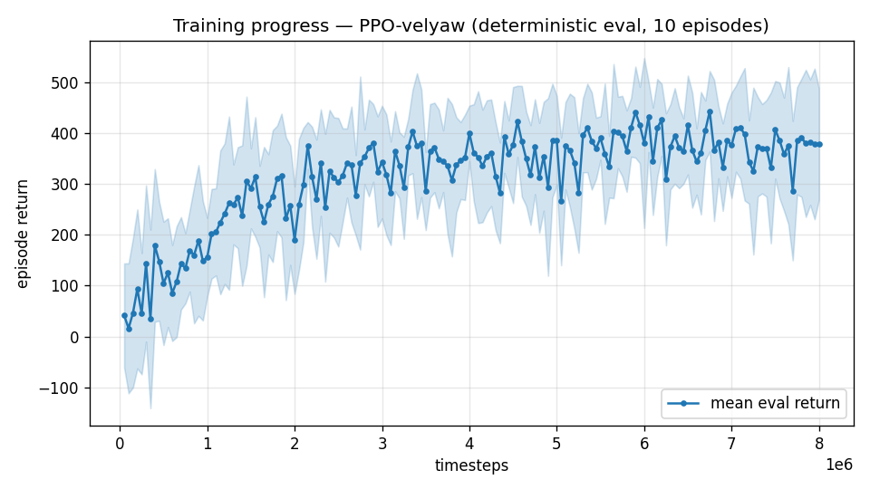

# Trial 01 — XWing aero + XWing airframe, motors only

| | |
|---|---|
| run dir | `results_velyaw_xwaero` |
| date | 2026-07-28 (afternoon; 3 launches — see "Launch history") |
| steps | 8,011,776 (completed, 3rd launch) |
| env | RateVelAviary + **full ported XWing aerodynamic model** (`aero_xwing.py`), S=C=b=1 |
| airframe | **XWing**: mass 13.6–14.1 kg, J=[1.47, 0.46, 1.39] kg·m², **75 N/motor** (T/W≈2.2), motor lag 0.025–0.16 s (from DLL), rate-PID stiffened to kp=(25,25,15), ki=(6,6,3) |
| action | 4-dim CTBR (no elevons — `Fin1=Fin2=0`) |
| obs | 36-dim |
| algo | PPO [256,256], batch 4096, ent 0, 6 envs, CPU |
| status | completed + physically evaluated — **FAILED (yaw-only dive local optimum)** |

## Problem to solve
Trial 00's physics had no aerodynamic moment. The user supplied the **real XWing MATLAB
aero model** (`funcAeroModel`) and asked to use it, with XWing mass and motor power, and
S=C=b=1 reference dims.

## Exact changes vs trial 00

### 1. `aero_xwing.py` (NEW) — faithful port of the MATLAB `funcAeroModel`
Full file is in the repo; the core moment build-up (verbatim coefficients):
```python
def func_aero_model(alpha, beta, Va, Wb, rho, S, C, b, CoM, Fin1, Fin2, rand_mat):
    Wx, Wy, Wz = Wb
    Xg, Yg = CoM[0], CoM[1]
    de = (Fin1 + Fin2) / 2.0            # elevator (symmetric elevon)
    da = (Fin2 - Fin1) / 2.0            # aileron  (differential elevon)
    ...
    MYB = (0.330009974 * Xg - 0.141106402) * rand_mat[6]          # directional stability
    MZA = ((1 + np.sign(alpha)) / 2 * (0.884270845 * Xg - 0.396678696) * rand_mat[10]
           + (1 - np.sign(alpha)) / 2 * (1.186820596 * Xg - 0.543687141) * rand_mat[11])
    ...
    alpha_cx = _fold(alpha)             # MATLAB 90-deg triangle folding
    beta_cx = _fold(beta)
    cx = _cx_non_linear(alpha_cx, beta_cx) * rand_mat[14] + CXIDD*(de + KSI*alpha_cx)*de/2
    cy = _cy_non_linear(np.degrees(alpha)) * rand_mat[15] + CYDE * de
    cz = _cz_non_linear(np.degrees(beta)) * rand_mat[16] + CZDA * da
    Q = 0.5 * rho * max(Va,1e-6)**2;  QS = Q * S
    fd, fl, fs = -QS*cx, QS*cy, QS*cz
    T1 = rotz(alpha); T2 = roty(beta)                 # wind -> body (y-up convention)
    F = (T1 @ T2) @ np.array([fd, fl, fs])
    mx = MXB*beta_cx + MXDA*da + MXWX*Wx*C/(2*Va)     # NOTE: even in beta (kept faithful)
    my = MYB*np.sign(beta)*beta_cx + MYDA*da + MYWY*Wy*b/Va
    mz = MZ0 + MZA*np.sign(alpha)*alpha_cx + MZDE*de + MZWZ*Wz*b/Va
    M = QS * C * np.array([mx, my, mz])
    return F, M
```

### 2. `rate_vel_aviary.py` — `_xwing_aero`: launch A (WRONG) → fixed (launch B/C)
```python
# LAUNCH A (WRONG — textbook z-down convention, alpha/beta effectively swapped):
    _P_XW = np.array([[0.0, 0.0, 1.0], [0.0, 1.0, 0.0], [-1.0, 0.0, 0.0]])
    ...
        u, vv, w = v_xw
        alpha = float(np.arctan2(w, u))
        beta = float(np.arcsin(np.clip(vv / Va, -1.0, 1.0)))

# FIXED (the model is Y-UP: alpha about z, beta about y; verified from its own
#        Twb = rotz(alpha)*roty(beta): u=Va ca cb, v=-Va sa cb, w=Va sb):
    # model_x(fwd)=my_z, model_y(lift)=my_x, model_z(side)=my_y — cyclic, det=+1
    _P_XW = np.array([[0.0, 0.0, 1.0], [1.0, 0.0, 0.0], [0.0, 1.0, 0.0]])
    ...
        u, vv, w = v_xw
        alpha = float(np.arctan2(-vv, u))                 # AoA about model-z (y-up convention)
        beta = float(np.arcsin(np.clip(w / Va, -1.0, 1.0)))   # sideslip about model-y
```
Full method (final form of this trial):
```python
    def _xwing_aero(self, R):
        v_rel = self.vel[0] - self.wind
        v_xw = self._P_XW @ (R.T @ v_rel)                 # air-relative vel, XWing model frame
        Va = float(np.linalg.norm(v_xw))
        if Va < 1e-4:
            return np.zeros(3), np.zeros(3)
        u, vv, w = v_xw
        alpha = float(np.arctan2(-vv, u))
        beta = float(np.arcsin(np.clip(w / Va, -1.0, 1.0)))
        Wb = self._P_XW @ (R.T @ self.ang_v[0])           # body rates in XWing model frame
        F_xw, M_xw = func_aero_model(alpha, beta, Va, Wb, self.RHO,
                                     self.AERO_S, self.AERO_C, self.AERO_B,
                                     (self.XG, self.YG, self.ZG), 0.0, 0.0, self.aero_rand)
        return R @ (self._P_XW.T @ F_xw), R @ (self._P_XW.T @ M_xw)
```
Applied in `_apply_wrench_and_wind`:
```python
        f_aero, m_aero = self._xwing_aero(R) if self.USE_XWING_AERO else self._wing_aero(R)
        ...
        tau_world = tau_world + m_aero                    # aerodynamic moment
```

### 3. Airframe overrides in `__init__` (ADDED; this trial's values)
```python
        if self.USE_XWING_AERO:
            self.MASS_RANGE = (13.6, 14.1)                 # heavy XWing airframe
            self.NOMINAL_MASS = 13.85
            self.J_NOMINAL = np.array([1.47, 0.46, 1.39])  # XWing nominal inertia
            self.MOTOR_MAX = 75.0                          # ~T/W 2.2 (inferred from DLL climb)
            self.MAX_TOTAL_THRUST = 4.0 * self.MOTOR_MAX
            self.NOMINAL_HOVER = self.NOMINAL_MASS * 9.8
            self.MOTOR_TAU_RANGE = (0.025, 0.16)           # real XWing motor lag (from DLL)
            self.KP_RATE = np.array([25.0, 25.0, 15.0])    # stiffer rate loop for strong aero
            self.KI_RATE = np.array([6.0, 6.0, 3.0])
            self.INT_LIMIT = 15.0
```

### 4. Xg fix between launch B → C (`_housekeeping`)
```python
# LAUNCH B (WRONG): self.XG fixed at 0.42 (edge of DLL range, ~3x weaker directional stability)
# LAUNCH C:
        if self.USE_XWING_AERO:
            self.aero_rand = 1.0 + self.np_random.uniform(-0.20, 0.20, size=17)
            self.XG = 0.4045 + self.np_random.uniform(-0.02, 0.02)   # DLL's CoM_Aero + dXg
        else:
            self.aero_rand = np.ones(17)
```

### 5. `train.py` — `--xwing-aero` flag; saved to config; passed as `use_xwing_aero` env kwarg.

## Launch history (3 launches under this dir name)
1. **Launch A (aborted ~50k)**: first integration used the **textbook z-down α/β convention —
   wrong for this model**. ep_rew_mean stuck at −430.
2. **Aero audit** (user asked "is the model correct?"): proved the MATLAB model is a
   self-consistent **y-up** frame (α about z from `atan2(−v,u)`, β about y from `asin(w/Va)`;
   verified via the model's own `Twb = Rz(α)·Ry(β)`). My port had α/β effectively swapped and
   the force/moment axes crossed. **Fixed**; verified: exact α/β round-trip, static stability
   slope negative everywhere (trim α≈−7°), all rate dampings negative, in-env moments match
   hand-computed values (−3.07 vs −3.05 N·m trim). Also found and flagged (not changed):
   the model's roll-due-to-sideslip `mx = MXB·|β_folded|` is **even in β** (no `sign(β)`) —
   physically anomalous, kept byte-faithful to the user's MATLAB.
3. **Launch B (aborted ~135k)**: correct axes, but a second audit found my `Xg` was hardcoded
   0.42 while the DLL uses **0.4045 ± 0.02 randomized** — and the stability coefficients are
   near their Xg zero-crossings (MYB: −0.0025 @0.42 vs −0.0076 @0.4045 → 3× weaker directional
   stability). Fixed + randomized per episode.
4. **Launch C (completed)**: the run documented here.

## Command
```bash
python train.py --xwing-aero --yaw-bias 0.3 --max-speed 25 --n-envs 6 \
                --timesteps 8000000 --device cpu --out-dir results_velyaw_xwaero
```

## Results
- Training reward: −70 → ~324; eval reward first 41 → best 444 (@6.7M) → last 379.
- 
- **Physical eval (120 eps, level start, full wind):**

| band | vel err (m/s) | yaw err (deg) |
|---|---|---|
| hover(0–1) | 82.5 | 0.8 |
| low(1–10) | 79.9 | 6.4 |
| mid(10–18) | 83.2 | 5.2 |
| high(18–25) | 82.6 | 6.3 |
| **ALL** | **81.7** | **5.9** (crash 0%) |

- **Behavior trace** (typical): cuts thrust to −1, tips over within 1 s, free-falls to
  ~90 m/s terminal velocity **while tracking yaw to ~5° the whole way down**. The eval reward
  (~380) was almost entirely the yaw stream — the reward number hid the failure.

## Analysis
**The policy rationally solved the wrong problem.** Root cause chain (verified by
measurement, not conjecture):
1. With S=C=b=1 the weathervane pitch moment at hover attitude is 16/25/36 N·m at 20/25/30 m/s
   relative airspeed vs **~32 N·m max motor torque** (arm 0.212 m × thrust budget) — above
   ~28 m/s the nose is aerodynamically pinned to the airflow.
2. Chasing a 20+ m/s target ⇒ accelerate ⇒ pinned ⇒ dive ⇒ faster ⇒ more pinned:
   unrecoverable with motors only. Even hover targets fail — 20 m/s wind alone eats most of
   the authority budget.
3. Key engineering insight: **motor differential torque is constant with airspeed; the aero
   moment grows with V². Only control surfaces (whose authority also grows with V²) keep
   pace** — this is *why* the real XWing has elevons. We had pinned them at zero.

**Verdict**: physics well-posed only below ~28 m/s relative airspeed; the task demands more.
→ Trial 02: un-pin the elevons (the model already contains their terms) and raise motor
thrust to the real 11 kgf class.
