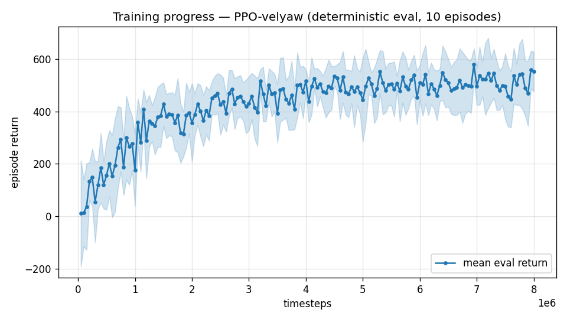

# Trial 02 — elevons added (6-actuator layout) + 110 N motors

| | |
|---|---|
| run dir | `results_velyaw_xw6` |
| date | 2026-07-28 (evening; 2 launches — see below) |
| steps | 8,011,776 (completed, 2nd launch) |
| env | XWing aero (S=C=b=1), **elevons live** |
| airframe | XWing mass/inertia; **110 N/motor** (T/W 3.23, peak differential torque ≈46 N·m); elevon limit **±20°** (real spec), servo = 30 ms first-order lag, gain ±10% + offset DR |
| action | **6-dim**: `[fin_L, fin_R, thrust, p, q, r]` (matches the original XWing actuator layout) |
| obs | **40-dim** (last_action 4→6, + 2 actual fin deflections) |
| algo | PPO [256,256], batch 4096, ent 0, 6 envs, CPU |
| status | completed + evaluated — improved 2× but **dive attractor persists** |

## Problem to solve
Trial 01 proved the vehicle is underactuated at speed with motors only: aero moment ∝ V²,
motor torque constant. Fix it the way the real aircraft does — control surfaces.

## Why this should work (pre-run analysis)
- Elevator (`MZDE ≈ 0.041/rad`) vs stability slope (`MZA ≈ −0.039/rad`): surfaces can command
  ≈1 rad of trim-α per rad of deflection → at 50 m/s a ±20° elevator ⇒ ≈±20° of α ⇒ ~2.8 g
  pull-out. **Dives become physically recoverable.**
- Motors own low speed (elevons dead at QS≈0, T/W 3.2, ~46 N·m); elevons own high speed
  (V² scaling). Natural crossover ≈30–45 m/s — exactly how a hybrid VTOL is really flown.
- 110 N/motor (11 kgf class, user's spec — replacing my inferred 75 N): raises the torque
  *ceiling* 32→46 N·m. Note the tent curve: max torque = arm·T below T=2Fmax, = arm·(4Fmax−T)
  above; **peak at half max total thrust; zero at both throttle extremes** — at hover thrust
  the authority is unchanged (~29 N·m), so the policy must throttle *up* to fight hard.

## Exact changes

### 1. `rate_vel_aviary.py` — motor upgrade (CHANGED)
```python
# BEFORE: self.MOTOR_MAX = 75.0    # ~T/W 2.2 (inferred)
# AFTER:
            self.MOTOR_MAX = 110.0                         # N per motor (11 kgf class) -> T/W ~3.2
```

### 2. Elevon config block (ADDED in `__init__`)
```python
        # --- elevons (XWing only): action[0:2] = left/right fin, aero via de/da terms.
        # Motor torque is ~constant with airspeed but the weathervane moment grows with V^2;
        # elevon authority also grows with V^2 — the only actuator that keeps pace at speed.
        self.USE_ELEVONS = self.USE_XWING_AERO
        self.ACT_DIM = 6 if self.USE_ELEVONS else 4
        self.FIN_MAX = np.radians(20.0)                     # rad; real elevon limit -20..+20 deg
        self.FIN_TAU = 0.03                                 # s, servo first-order lag
        self.fin_angles = np.zeros(2)                       # actual (lagged) deflections (rad)
        self.fin_gain = np.ones(2)                          # per-episode servo gain DR (DLL: 1 +/- 0.1)
        self.fin_offset = np.zeros(2)                       # per-episode mounting offset (rad)
```
(Launch A had `self.FIN_MAX = 0.5` — ±28.6°, an assumption; corrected to the real ±20° spec
for launch B.)

### 3. Action dimensionality (CHANGED, all hardcoded 4s → ACT_DIM)
```python
    def _actionSpace(self):
        return spaces.Box(low=-1.0, high=1.0, shape=(self.ACT_DIM,), dtype=np.float32)

    def _decode_action(self, action):
        a = np.clip(np.asarray(action, dtype=float).reshape(-1)[-4:], -1.0, 1.0)  # CTBR = LAST 4
        ...
# plus: current_action/prev_action = np.zeros(self.ACT_DIM) (init + _housekeeping),
#       step() clip .reshape(self.ACT_DIM)
```

### 4. Fin servo in the 500 Hz substep loop (ADDED in `step`)
```python
        fin_alpha = 1.0 - np.exp(-self.PYB_TIMESTEP / self.FIN_TAU)   # servo first-order lag
        for _ in range(self.PYB_STEPS_PER_CTRL):
            if self.USE_ELEVONS:
                fin_cmd = (self.FIN_MAX * self.current_action[:2]) * self.fin_gain + self.fin_offset
                self.fin_angles += (fin_cmd - self.fin_angles) * fin_alpha
                self.fin_angles = np.clip(self.fin_angles, -self.FIN_MAX, self.FIN_MAX)
            R, thrust, tau_body = self._control_wrench(thrust_des, omega_des)
            ...
```

### 5. Servo DR per episode (ADDED in `_housekeeping`)
```python
        # elevon servo DR (DLL: Fin gain 1 +/- 0.1, small mounting offset) + reset servo state
        self.fin_angles = np.zeros(2)
        self.fin_gain = 1.0 + self.np_random.uniform(-0.10, 0.10, size=2)
        self.fin_offset = self.np_random.uniform(-0.02, 0.02, size=2)   # rad (~1 deg)
```

### 6. Fins into the aero model (CHANGED in `_xwing_aero`)
```python
# BEFORE:  ..., (self.XG, self.YG, self.ZG), 0.0, 0.0, self.aero_rand)
# AFTER:
        F_xw, M_xw = func_aero_model(alpha, beta, Va, Wb, self.RHO,
                                     self.AERO_S, self.AERO_C, self.AERO_B,
                                     (self.XG, self.YG, self.ZG),
                                     float(self.fin_angles[0]), float(self.fin_angles[1]),
                                     self.aero_rand)
```

### 7. Observation +4 (36 → 40)
```python
    def _observationSpace(self):
        # elevons add: last_action grows 4->6 (+2) and actual fin deflections (+2)
        dim = 27 + (3 if self.USE_WIND_EST else 0) + (3 if self.USE_VEL_INTEGRAL else 0) \
              + 2 + (1 if self.USE_YAW_INTEGRAL else 0) + (4 if self.USE_ELEVONS else 0)
```
```python
# in _computeObs (ADDED):
        if self.USE_ELEVONS:
            parts.append(self.fin_angles / self.FIN_MAX)       # 2  <- actual servo deflections
```

### 8. Pre-launch verification (measured)
- ±20° elevator at 30 m/s: pitch moment swings **−11.6 … +4.2 N·m** (±7.9 symmetric about the
  −3.7 trim), lift modulation ~95 N; grows with V².
- aileron ±0.5 rad: ±8.8 N·m roll + small MYDA yaw coupling.

## Launch history
1. **Launch A (aborted ~100k)**: `FIN_MAX = 0.5 rad (±28.6°)` — an assumption.
   User: real elevon limit is **±20°**. Fixed (`FIN_MAX = radians(20)`; authority re-verified:
   ±7.9 N·m elevator swing at 30 m/s, ~2.8 g pull-out at 50 m/s — conclusion unchanged).
2. **Launch B (completed)**: the run documented here.

## Command
```bash
python train.py --xwing-aero --yaw-bias 0.3 --max-speed 25 --n-envs 6 \
                --timesteps 8000000 --device cpu --out-dir results_velyaw_xw6
```

## Results
- Training reward −41 → ~472; eval first 12 → best 580 (@6.9M) → last 552.
- 
- **Physical eval:**

| band | vel err (m/s) | yaw err (deg) |
|---|---|---|
| hover(0–1) | 48.6 | 1.1 |
| low(1–10) | 38.3 | 1.9 |
| mid(10–18) | 43.1 | 2.5 |
| high(18–25) | 42.8 | 1.9 |
| **ALL** | **41.3** | **2.1** (crash 0%) |

- **Traces**: genuinely *tries* now — full throttle at t=0, pitches toward the target — but
  fumbles the transition, tips past 90°, and settles into a 40–55 m/s dive with **elevons
  pegged at the −20° stop** (not flying, just saturated) and thrust at minimum. Yaw tracked
  beautifully throughout, again.

## Analysis
Halved the velocity error (82→41) — the elevons and thrust clearly help the *attempt* — but
the end state is the same local optimum: "give up velocity, harvest yaw reward."
Two observations that set up the next trials:
1. The policy **never experiences a successful dive recovery**, so recovery is never
   reinforced: from gentle starts, PPO's Gaussian exploration cannot stumble into a
   coordinated 1–2 s pull-out sequence. → exposure fix: **tough inits** (trial 03).
2. Cutting thrust in the dive also self-strips motor torque (tent curve: torque ∝ T at the
   bottom end) — the learned behavior is doubly self-defeating.

**Verdict**: actuation fixed, learning problem remains. → Trial 03 attacks exposure
(tough-init + wind curriculum).
