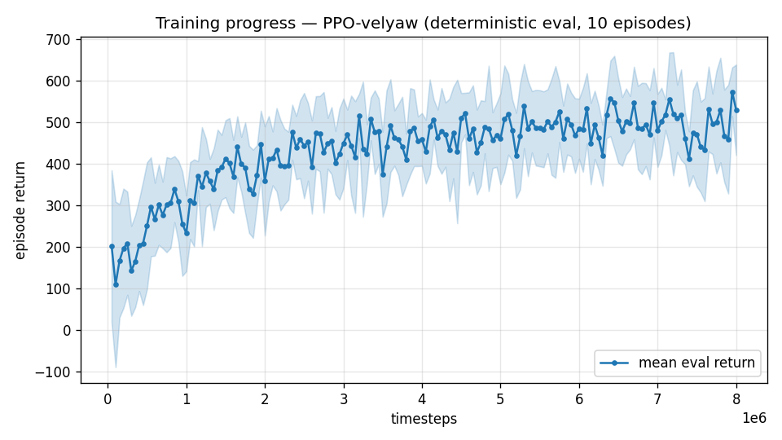

# Trial 03 — tough-init mix (30%) + wind curriculum

| | |
|---|---|
| run dir | `results_velyaw_xw7` |
| date | 2026-07-28 (night) |
| steps | 8,011,776 (completed) |
| env | identical physics to trial 02 (XWing aero, elevons ±20°, 110 N motors) |
| training changes | **30% failure-state episode starts** + **wind curriculum 8→20 m/s** |
| algo | PPO [256,256], ent 0, 6 envs, CPU |
| status | completed + auto-analyzed — **NEGATIVE RESULT: 0/60 dive recoveries.** Exposure alone does not fix it; the reward was identified (with numbers) as the true trap |

## Problem to solve
Trial 02's policy never learned dive recovery because it never *sampled* a successful one:
from gentle starts, the coordinated pull-out maneuver is unreachable by Gaussian exploration
noise, so every experienced dive ends badly → critic marks dives hopeless → policy gives up.
Classic exploration bottleneck.

## The idea (reset-state distribution shaping)
1. **Tough-init mix**: start ~30% of training episodes **in the failure states themselves** —
   - 50%: developed dive — 30–50 m/s, 40–90° below horizon, nose weathervaned into the flow
     (the exact trapped state), random roll about the flight path, ±25° scatter;
   - 50%: botched transition — 60–120° tilt, 15–30 m/s horizontal-ish, tumbling ±2 rad/s.
   The other 70% keep the gentle ±40° init. Eval keeps the level start (metric unchanged).
2. **Wind curriculum**: train `wind_max = 8` until 3M steps, linear ramp to 20 by 6M, then
   full. Rationale: with ≤8 m/s wind the whole envelope is comfortably inside the control
   authority, so velocity tracking gets *learned* before the hard corners appear
   (the reduce-then-ramp DR staging that worked in the tailsitter project).

## Exact changes

### 1. `rate_vel_aviary.py` — tough-init machinery (ADDED)

New constructor param (stored as `self.TOUGH_INIT_FRAC`):
```python
                 randomize_init: bool = False,     # gentle +-40 deg tilt + random vel/heading start
                 tough_init_frac: float = 0.0,     # fraction of episodes started in FAILURE states
                 #                                   (developed dive / botched transition) so the
                 #                                   policy gets direct gradient on recovery
```

New curriculum hook + attitude helper + failure-state sampler:
```python
    # -------------------------------------------------- curriculum / tough init
    def set_wind_max(self, w):
        """Curriculum knob (called via env_method): per-episode wind is U(0, WIND_MAX)."""
        self.WIND_MAX = float(w)

    def _quat_z_along(self, d, roll=0.0, scatter_deg=0.0):
        """Quaternion whose body-z (prop/cruise axis) points along unit vector d, with a given
        roll about that axis and optional random angular scatter."""
        z = np.array([0.0, 0.0, 1.0])
        axis = np.cross(z, d)
        n = np.linalg.norm(axis)
        if n < 1e-8:
            q = [0.0, 0.0, 0.0, 1.0] if d[2] > 0 else [1.0, 0.0, 0.0, 0.0]
        else:
            q = p.getQuaternionFromAxisAngle((axis / n).tolist(),
                                             float(np.arccos(np.clip(z @ d, -1.0, 1.0))))
        q_roll = p.getQuaternionFromAxisAngle(d.tolist(), float(roll))
        _, q = p.multiplyTransforms([0, 0, 0], q_roll, [0, 0, 0], q)
        if scatter_deg > 0.0:
            ax = self.np_random.normal(size=3); ax /= (np.linalg.norm(ax) + 1e-9)
            qs = p.getQuaternionFromAxisAngle(ax.tolist(), float(np.radians(scatter_deg)))
            _, q = p.multiplyTransforms([0, 0, 0], qs, [0, 0, 0], list(q))
        return np.array(q)

    def _sample_tough_init(self):
        """FAILURE-state starts, so recovery gets direct on-policy gradient:
        50% developed dive (30-50 m/s steeply down, nose near-aligned with the flow = the
        weathervaned state the policy actually gets trapped in), 50% botched transition
        (60-120 deg tilt at 15-30 m/s, tumbling)."""
        if self.np_random.uniform() < 0.5:
            az = self.np_random.uniform(-np.pi, np.pi)
            elev = np.radians(self.np_random.uniform(40.0, 90.0))
            d = np.array([np.cos(elev) * np.cos(az), np.cos(elev) * np.sin(az), -np.sin(elev)])
            v = d * self.np_random.uniform(30.0, 50.0)
            quat = self._quat_z_along(d, roll=self.np_random.uniform(-np.pi, np.pi),
                                      scatter_deg=self.np_random.uniform(0.0, 25.0))
            w = self.np_random.uniform(-1.0, 1.0, size=3)
        else:
            a0 = self.np_random.uniform(-np.pi, np.pi)
            tilt = np.radians(self.np_random.uniform(60.0, 120.0))
            q1 = p.getQuaternionFromAxisAngle([np.cos(a0), np.sin(a0), 0.0], float(tilt))
            qy = p.getQuaternionFromAxisAngle([0.0, 0.0, 1.0],
                                              float(self.np_random.uniform(-np.pi, np.pi)))
            _, quat = p.multiplyTransforms([0, 0, 0], qy, [0, 0, 0], q1)
            quat = np.array(quat)
            dv = self.np_random.normal(size=3)
            dv[2] = -abs(dv[2]) * 0.5                       # horizontal-ish, slightly sinking
            dv /= (np.linalg.norm(dv) + 1e-9)
            v = dv * self.np_random.uniform(15.0, 30.0)
            w = self.np_random.uniform(-2.0, 2.0, size=3)
        return quat, v, w
```

Wired into `_housekeeping` (BEFORE → AFTER):
```python
# BEFORE (trial 02):
        if self.RANDOMIZE_INIT:
            did = int(self.DRONE_IDS[0])
            rr = self.np_random.uniform(np.radians(-40.0), np.radians(40.0))
            pp = self.np_random.uniform(np.radians(-40.0), np.radians(40.0))
            yy = self.np_random.uniform(-np.pi, np.pi)
            quat = np.array(p.getQuaternionFromEuler([rr, pp, yy]))
            dv = self.np_random.normal(size=3); dv /= (np.linalg.norm(dv) + 1e-9)
            v = dv * self.np_random.uniform(0.0, self.MAX_SPEED)
            w = self.np_random.uniform(-1.0, 1.0, size=3)

# AFTER (this trial):
        if self.RANDOMIZE_INIT:
            did = int(self.DRONE_IDS[0])
            if self.np_random.uniform() < self.TOUGH_INIT_FRAC:
                quat, v, w = self._sample_tough_init()      # dive / botched-transition start
            else:
                rr = self.np_random.uniform(np.radians(-40.0), np.radians(40.0))
                pp = self.np_random.uniform(np.radians(-40.0), np.radians(40.0))
                yy = self.np_random.uniform(-np.pi, np.pi)
                quat = np.array(p.getQuaternionFromEuler([rr, pp, yy]))
                dv = self.np_random.normal(size=3); dv /= (np.linalg.norm(dv) + 1e-9)
                v = dv * self.np_random.uniform(0.0, self.MAX_SPEED)
                w = self.np_random.uniform(-1.0, 1.0, size=3)
```

### 2. `train.py` — flags + wind-curriculum callback (ADDED)
```python
class WindCurriculumCallback(BaseCallback):
    """Ramp per-episode wind: WIND_MAX = w0 until `start` steps, linear to w1 by `end`.
    The eval env stays at full wind so the metric tracks the real task throughout."""
    def __init__(self, w0, w1, start, end, verbose=0):
        super().__init__(verbose)
        self.w0, self.w1, self.start, self.end = w0, w1, start, end
        self._last = None

    def _on_rollout_start(self):
        t = self.model.num_timesteps
        frac = min(max((t - self.start) / max(self.end - self.start, 1), 0.0), 1.0)
        w = self.w0 + frac * (self.w1 - self.w0)
        if self._last is None or abs(w - self._last) > 0.05:
            self.training_env.env_method("set_wind_max", w)
            self._last = w
            if self.verbose:
                print(f"[wind curriculum] step {t:,}: wind_max = {w:.1f} m/s")

    def _on_step(self):
        return True
```
```python
    ap.add_argument("--tough-init", type=float, default=0.0,
                    help="fraction of TRAINING episodes started in failure states (dive/botched "
                         "transition) so recovery gets direct gradient")
    ap.add_argument("--wind-curriculum", action="store_true",
                    help="train wind_max: 8 m/s until 3M steps, linear ramp to 20 by 6M")
```
```python
    # tough init only shapes TRAINING; eval keeps the level start -> comparable metric
    train_kwargs = dict(base_kwargs, randomize_init=True, tough_init_frac=args.tough_init)
    eval_kwargs = dict(base_kwargs, randomize_init=False)
```
```python
    cbs = [ckpt, evalcb]
    if args.wind_curriculum:
        cbs.append(WindCurriculumCallback(w0=8.0, w1=20.0,
                                          start=int(0.375 * args.timesteps),
                                          end=int(0.75 * args.timesteps), verbose=1))
    model.learn(total_timesteps=args.timesteps, callback=cbs, progress_bar=True)
```

### 3. `analyze_velyaw.py` (NEW this trial) — the dive-recovery test core
```python
def dive_recovery_test(D, n=60, ep_len=10.0):
    """All episodes start mid-dive / mid-botched-transition (tough_init_frac=1)."""
    model, venv, base = load(D, ep_len=ep_len, randomize_init=True, tough_init_frac=1.0)
    dt = base.CTRL_TIMESTEP; N = int(ep_len / dt)
    recovered = partial = 0; final_errs = []
    for i in range(n):
        venv.seed(3000 + i)
        obs = venv.reset()
        errs = []
        for k in range(N):
            a, _ = model.predict(obs, deterministic=True)
            obs, _, done, infos = venv.step(a)
            if k >= N - int(2.0 / dt):
                errs.append(infos[0]["vel_error"])
            if done[0]:
                break
        fe = float(np.mean(errs)) if errs else np.nan
        final_errs.append(fe)
        if fe < 8.0:   recovered += 1
        elif fe < 15.0: partial += 1
```
(also required `eval_velyaw.load(D, ep_len, **overrides)` to accept env overrides —
`kw.update(overrides)` added.)

Training chained as `train && analyze_velyaw.py`, plus a watcher process that reports
when the analysis lands.

## Command
```bash
python train.py --xwing-aero --yaw-bias 0.3 --max-speed 25 --tough-init 0.3 \
                --wind-curriculum --n-envs 6 --timesteps 8000000 --device cpu \
                --out-dir results_velyaw_xw7
# auto: python analyze_velyaw.py --dir results_velyaw_xw7
```

## Results
- Training reward −123 → ~(lower than trial 02 early — expected: 30% of episodes now start in
  low-reward dive states); eval first 200 → best 573 → last 529.
- 
- **Physical eval:** ALL **39.7 m/s** / **1.7°** (hover 47.0 / low 37.1 / mid 42.0 / high 40.1)
  — statistically unchanged from trial 02.
- **Dive-recovery test: 0/60 recovered, 0/60 partial. Median final error 39.3 m/s.**
  Despite ~2.4M steps of experience *starting inside dives*, the policy still rides every
  dive down, elevons parked, yaw locked.

## The decisive post-mortem (two experiments)
1. **Physics probe — recovery is EASY.** A hand-scripted *constant* action
   (full −elevator, −pitch-rate command, reduced throttle) arrests the canonical 40 m/s dive
   to **14–18 m/s within 8 s**. (18 strategy combos tested; two arrest, several slow it.)
   So the actuators are sufficient and the maneuver isn't even complex. Physics exonerated.
2. **Reward accounting — the trap, quantified.** Per-step value of a stable dive with yaw
   locked: `r ≈ 0.01 (vel) + 2.0 (yaw, pays in full) − 0.64 (linear) ≈ +1.4/step` — the dive
   is a *comfortable* place. A *partial* recovery attempt disturbs yaw immediately (−2/step)
   while velocity reward stays ≈0 until the dive is mostly arrested ⇒ **every step toward
   recovery scores worse than staying put**. The gradient actively defends the local optimum;
   exposure cannot beat a reward barrier.

**Verdict**: tough-init is necessary but not sufficient. The yaw reward stream must stop
paying during velocity failure. → Trial 04: gate the yaw reward by velocity success.
