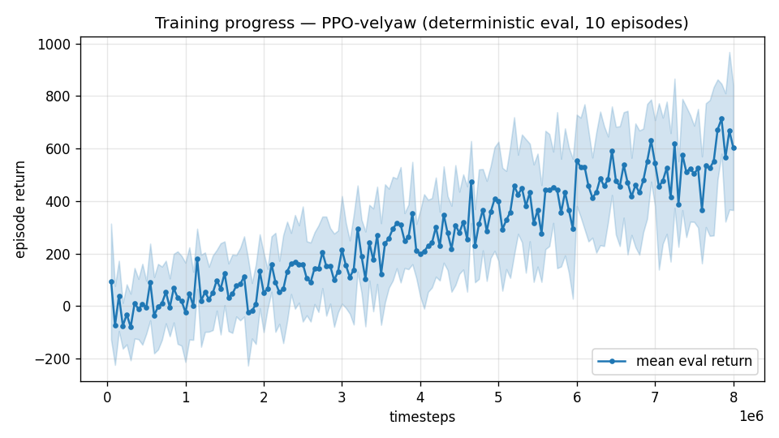

# Trial 04 — yaw-gated reward (+ ent_coef 0.003) — BREAKTHROUGH

| | |
|---|---|
| run dir | `results_velyaw_xw8` |
| date | 2026-07-28 → 07-29 |
| steps | 8,011,776 (completed) |
| env | identical physics to trials 02/03 (XWing aero, elevons ±20°, 110 N motors) |
| changes | **yaw reward gated by velocity success**; `ent_coef 0 → 0.003`; tough-init 30% and wind curriculum retained |
| status | completed + auto-analyzed — **velocity error 41.3 → 9.2 m/s, dive recovery 0% → 43% full + 25% partial**; cost: yaw 1.7° → 20.8° |

## Problem to solve
Trial 03 proved (with per-step numbers) that the reward *itself* defends the dive local
optimum: yaw pays ~2/step even while plummeting, and partial recovery attempts score worse
than staying in the dive. Fix the incentive, keep everything else.

## The change — one line of reward structure
```python
cov  = exp(−½ (d / 12.5)²)          # existing wide velocity-coverage term
gate = 0.2 + 0.8·cov                 # NEW  (yaw_gate=True)
reward = r_vel + w_y·gate·r_yaw + 0.5·joint − (0.02/s)·d + smooth
```
Design properties:
- **Dive stops paying**: at d≈40 m/s, cov≈0 → yaw pays 0.2×2 = 0.4 → dive total ≈ **−0.76/step**
  (measured in-env before launch; was +1.4). Recovered-and-tracking ≈ +2.9/step: a 3.6-unit gap.
- **Gradient along the recovery path, not just at the endpoint**: every m/s of dive-arrest
  raises `cov`, hence the yaw multiplier, hence reward — partial recovery is now *immediately*
  profitable, which is exactly what PPO's advantage estimates need.
- **0.2 floor** keeps some yaw gradient even at high velocity error (heading isn't abandoned
  entirely during early learning).
- Plus `ent_coef = 0.003` (was 0) for a little extra action-noise persistence on the maneuver.

## Exact code changes

### 1. `rate_vel_aviary.py` — new param + gated reward

Constructor (ADDED):
```python
                 yaw_bias_max: float = 0.0,        # N*m; per-episode constant yaw-torque disturbance
                 yaw_gate: bool = False,           # gate the yaw reward by velocity success, so
                 #                                   "track yaw while diving" stops being a local optimum
```
```python
        self.YAW_BIAS_MAX = float(yaw_bias_max)
        self.YAW_GATE = bool(yaw_gate)
```

`_computeReward` (BEFORE → AFTER):
```python
# BEFORE (trials 00-03):
        s = self.MAX_SPEED / 20.0
        d = np.linalg.norm(self.vel[0] - self.target_vel)
        a = abs(self._yaw_error(R))
        w = self.YAW_REWARD_WIDTH
        r_vel = (1.0 - np.tanh(d / 2.0)) + np.exp(-0.5 * (d / (10.0 * s)) ** 2)
        r_yaw = (1.0 - np.tanh(a / w)) + np.exp(-0.5 * (a / 1.0) ** 2)
        joint = (1.0 - np.tanh(d / 2.0)) * (1.0 - np.tanh(a / w))
        reward = r_vel + self.YAW_WEIGHT * r_yaw + 0.5 * joint - (0.02 / s) * d + smooth

# AFTER (this trial):
        s = self.MAX_SPEED / 20.0
        d = np.linalg.norm(self.vel[0] - self.target_vel)
        a = abs(self._yaw_error(R))
        w = self.YAW_REWARD_WIDTH
        cov = np.exp(-0.5 * (d / (10.0 * s)) ** 2)             # wide velocity coverage
        r_vel = (1.0 - np.tanh(d / 2.0)) + cov
        r_yaw = (1.0 - np.tanh(a / w)) + np.exp(-0.5 * (a / 1.0) ** 2)
        joint = (1.0 - np.tanh(d / 2.0)) * (1.0 - np.tanh(a / w))
        # yaw GATE: without it, "hold yaw while diving" earns ~1.4/step and every partial
        # recovery attempt scores worse (yaw disturbed before velocity improves) -> stable
        # local optimum. Gating yaw by velocity coverage removes the payout in a dive AND
        # gives a smooth gradient along the recovery path (every m/s arrested raises the gate).
        gate = (0.2 + 0.8 * cov) if self.YAW_GATE else 1.0
        reward = r_vel + self.YAW_WEIGHT * gate * r_yaw + 0.5 * joint - (0.02 / s) * d + smooth
```

### 2. `train.py` — flags + PPO entropy (ADDED / CHANGED)
```python
    ap.add_argument("--yaw-gate", action="store_true",
                    help="gate the yaw reward by velocity success (kills the yaw-only dive optimum)")
    ap.add_argument("--ent-coef", type=float, default=0.0)
```
```python
    base_kwargs = dict(..., use_xwing_aero=args.xwing_aero,
                       yaw_gate=args.yaw_gate)            # <- ADDED
```
```python
# PPO kwargs:  ent_coef=0.0  ->  ent_coef=args.ent_coef
        ent_coef=args.ent_coef, learning_rate=3e-4, max_grad_norm=0.5,
```
Both keys saved to `config.json` (`"yaw_gate": args.yaw_gate, "ent_coef": args.ent_coef`).

### 3. `eval_velyaw.py` — config passthrough (ADDED)
```python
              use_xwing_aero=cfg.get("xwing_aero", False),
              yaw_gate=cfg.get("yaw_gate", False),        # <- ADDED
              randomize_init=False)
```

### Pre-launch verification (in-env measurement)
```python
e = RateVelAviary(use_xwing_aero=True, yaw_gate=True, randomize_init=True, tough_init_frac=1.0)
e.reset(seed=0); o, r, *_ = e.step(np.zeros(6))
# -> dive-state reward = -0.76/step  (was ~+1.4 ungated)
```

## Command
```bash
python train.py --xwing-aero --yaw-bias 0.3 --max-speed 25 --tough-init 0.3 \
                --wind-curriculum --yaw-gate --ent-coef 0.003 --n-envs 6 \
                --timesteps 8000000 --device cpu --out-dir results_velyaw_xw8
# auto: analyze_velyaw.py --dir results_velyaw_xw8
```
**Note**: the gate changes the reward scale — curves are NOT comparable to trials ≤03.

## Results
- Training reward −305 → +142 (@4.2M) → ~350 (@8M); eval first 93 → dip to 33 (~1.2M — the
  gate killing the old yaw-only strategy, forcing a relearn) → best 713 (@7.85M) → last 603.
  **Both curves still rising at 8M** (motivates trial 05 continuation).
- 
- **Physical eval:**

| band | vel err (m/s) | yaw err (deg) |
|---|---|---|
| hover(0–1) | 5.6 | 14.7 |
| low(1–10) | 5.3 | 13.0 |
| mid(10–18) | 9.6 | 20.0 |
| high(18–25) | 14.4 | 33.4 |
| **ALL** | **9.2** | **20.8** (crash 0%) |

- **Dive-recovery test: 26/60 recovered (43%) + 15/60 partial (25%); median final err 9.7 m/s.**
- **Traces**: no dives anywhere. Tilt stays 16–75°, vz ≈ 0, converges toward the target and
  holds (best trace touches 3.7 m/s error). Curiosity: the policy holds the *right* fin near
  −20° as a standing trim while flying with the left — likely countering the constant
  yaw-torque bias and/or the model's even-in-β roll anomaly.

## Analysis
The reward accounting from trial 03 predicted exactly this outcome, and the intervention that
followed from it worked on the first try:
- **4.5× better velocity tracking** (41.3 → 9.2 m/s); errors now scale with speed band, which
  matches the control-authority physics (high band is genuinely harder at S=C=b=1).
- **Recovery went from non-existent to majority-successful** — the tough-init exposure
  (trial 03's change) finally became learnable once the gradient stopped opposing it.
  *Lesson: exposure and incentive must point the same way; either alone fails.*
- **The predictable cost**: yaw regressed to 20.8° (33° in the high band) — during hard
  velocity fights the gate makes heading temporarily cheap to sacrifice.
- Undertrained at 8M (curves rising) → trial 05 continues to 14M; if yaw stays weak,
  raise the gate floor 0.2 → 0.4 (keeps the dive at ≈−0.3/step, restores most yaw pressure).

---

## AUTO-CAPTURED RESULTS (2026-07-28 23:01)

**config**: `{"max_speed": 25.0, "use_integral": true, "use_yaw_integral": true, "use_wind_est": true, "yaw_width": 0.35, "yaw_weight": 1.0, "yaw_bias": 0.3, "heading_frame": false, "xwing_aero": true, "tough_init": 0.3, "wind_curriculum": true, "yaw_gate": true, "ent_coef": 0.003}`

**eval curve**: n=160, first 93, best 713 @ 7,849,686, last 603 (final steps 7,999,680)

**late trend**: still rising (last-10% mean 553 vs prior-10% 495)


### Physical eval
```
=== PHYSICAL EVAL (level start, full wind) ===

band           n  vel err (m/s)  yaw err (deg)
----------------------------------------------
hover(0-1)     1           5.57           14.7
low(1-10)     45           5.29           13.0
mid(10-18)    43           9.60           20.0
high(18-25)   31          14.43           33.4
----------------------------------------------
ALL          120           9.20           20.8   crash 0.0%
```


### Dive-recovery test
```
=== DIVE-RECOVERY TEST (60 episodes, all starting in failure states) ===
  recovered (final-2s vel err < 8 m/s):  26/60 = 43%
  partial   (8-15 m/s):                  15/60 = 25%
  median final err: 9.7 m/s   mean: 13.1 m/s
```


### Behavior traces
```
--- trace seed 1005: target [11.9  5.2  0.3] (|v|=13.0), wind [ -4.8 -15.4  -4.2] ---
  t= 0.0 |v|=  0.2 vz=   0.0 tilt=   0 verr= 13.1 yawerr=+103.5 fins=( -8.8,-10.5) thr=+0.52
  t= 2.0 |v|= 22.0 vz=  -9.9 tilt=  75 verr= 29.8 yawerr=-117.9 fins=(-18.0,-20.0) thr=-0.18
  t= 4.0 |v|= 19.4 vz= -11.0 tilt=  16 verr= 26.5 yawerr=  -1.2 fins=( +3.1,-20.0) thr=+1.00
  t= 6.0 |v|=  6.0 vz=  -1.0 tilt=  28 verr= 16.8 yawerr= -88.7 fins=( -4.3,-20.0) thr=+0.60
  t= 8.0 |v|=  8.2 vz=   4.0 tilt=  21 verr= 16.2 yawerr= -46.4 fins=(+11.5,-19.3) thr=-0.09
--- trace seed 1012: target [  6.3 -16.6   1.4] (|v|=17.8), wind [-0.4  5.5 -8.2] ---
  t= 0.0 |v|=  0.0 vz=   0.0 tilt=   0 verr= 17.8 yawerr= +46.7 fins=( +1.0, -8.9) thr=+1.00
  t= 2.0 |v|=  7.3 vz=   1.2 tilt=  50 verr= 13.8 yawerr= -21.0 fins=(-11.4,-18.2) thr=-0.51
  t= 4.0 |v|=  7.2 vz=   2.0 tilt=  65 verr= 14.5 yawerr= -14.0 fins=( +4.4,-18.2) thr=-0.29
  t= 6.0 |v|=  3.3 vz=   0.9 tilt=  31 verr= 15.4 yawerr=  -9.6 fins=(-12.2,-18.2) thr=-0.25
  t= 8.0 |v|=  7.9 vz=   0.7 tilt=  30 verr= 15.3 yawerr=  -6.1 fins=( -4.2,-18.2) thr=-1.00
--- trace seed 1020: target [-9.8 11.   0.9] (|v|=14.8), wind [-0.4 -1.5 -0.8] ---
  t= 0.0 |v|=  0.0 vz=   0.0 tilt=   0 verr= 14.8 yawerr= -65.7 fins=( -7.9,-10.3) thr=+1.00
  t= 2.0 |v|=  7.8 vz=  -3.1 tilt=  18 verr= 10.9 yawerr= -18.5 fins=( -8.9,-20.0) thr=-0.49
  t= 4.0 |v|= 13.4 vz=  -0.7 tilt=  43 verr=  3.7 yawerr=  -4.5 fins=( -2.2,-20.0) thr=-0.47
  t= 6.0 |v|=  8.2 vz=   0.9 tilt=  48 verr=  7.5 yawerr= -13.8 fins=( -3.2,-20.0) thr=-0.43
  t= 8.0 |v|=  9.5 vz=  -0.3 tilt=  72 verr=  5.6 yawerr= +19.2 fins=( -5.9,-20.0) thr=-1.00
```
