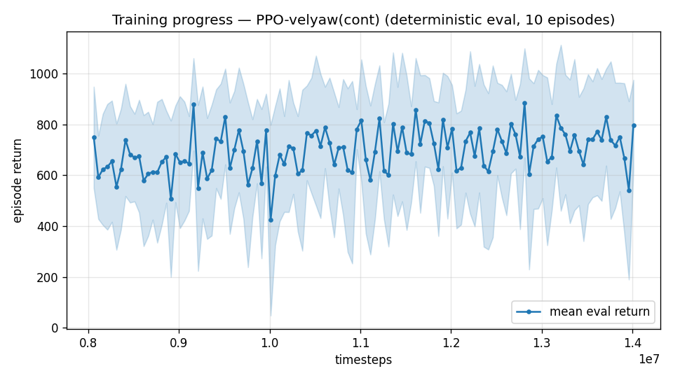

# Trial 05 — continuation of the yaw-gate run, 8M → 14M

| | |
|---|---|
| run dir | `results_velyaw_xw8b` (continues `results_velyaw_xw8`) |
| date | 2026-07-29 |
| steps | 8,011,776 → 14,011,776 target (+6M) |
| env / reward | **unchanged from trial 04** (XWing aero, elevons ±20°, 110 N motors, yaw gate, tough-init 30%, wind at the full post-curriculum 20 m/s) |
| status | completed + auto-analyzed — **7.36 m/s / 13.7° / 47%+20% recovery**; hypothesis confirmed (yaw self-recovered 20.8°→13.7° with no config change); eval plateaued ~13M |

## Problem to solve / motivation
Trial 04 broke the dive local-optimum but was clearly **undertrained at 8M**: both the
training and eval curves were still rising at the cutoff (eval best 713 @7.85M, last 603).
Two open deficits:
1. velocity error in the high band (14.4 m/s) — expected to improve with steps;
2. yaw error 20.8° — hypothesis: as velocity tracking consolidates, the gate `0.2+0.8·cov`
   stays open more of the time, so the yaw gradient returns and yaw improves *without any
   config change*. This continuation tests that hypothesis before touching the gate floor.

## Exact changes
**None to physics/reward/task.** Only `continue_train.py` was extended to carry the trial-04
config keys through a resume (reward-affecting flags must match the saved model):
```python
# BEFORE:
                       yaw_weight=cfg.get("yaw_weight", 1.0), yaw_bias_max=yaw_bias,
                       velyaw_heading_frame=cfg.get("heading_frame", False),
                       use_xwing_aero=cfg.get("xwing_aero", False))
    train_kwargs = dict(base_kwargs, randomize_init=True)
    eval_kwargs = dict(base_kwargs, randomize_init=False)

# AFTER:
                       yaw_weight=cfg.get("yaw_weight", 1.0), yaw_bias_max=yaw_bias,
                       velyaw_heading_frame=cfg.get("heading_frame", False),
                       use_xwing_aero=cfg.get("xwing_aero", False),
                       yaw_gate=cfg.get("yaw_gate", False))
    # same tough-init mix as the source run; wind stays at the full post-curriculum value
    train_kwargs = dict(base_kwargs, randomize_init=True,
                        tough_init_frac=cfg.get("tough_init", 0.0))
    eval_kwargs = dict(base_kwargs, randomize_init=False)
```
Resume mechanics (already in `continue_train.py`): `PPO.load(src/ppo_ratevel_final.zip,
env=train_env, device="cpu")` restores the optimizer state;
`VecNormalize.load(src/vecnormalize.pkl, venv)` carries the normalization stats;
`model.learn(..., reset_num_timesteps=False)` continues the step counter.
Note: the WindCurriculumCallback is NOT attached in continuation — `WIND_MAX` stays at the
env default 20 m/s (the curriculum's final value), which is intended.

## Command
```bash
python continue_train.py --src results_velyaw_xw8 --out results_velyaw_xw8b \
                         --extra 6000000 --n-envs 6
# auto: analyze_velyaw.py --dir results_velyaw_xw8b
```

## Decision criteria (set before results)
- Success: vel err < 7 m/s overall AND yaw < 12° → accept; consider this the working baseline.
- If yaw still > 15° with velocity good → raise gate floor 0.2 → 0.4, retrain/continue.
- If metrics *regress* vs trial 04 → post-saturation drift (seen before in the tailsitter
  project: 4.63 → 5.35); fall back to the `best/` checkpoint and stop adding steps.

<!-- AUTO-RESULTS: log_trial.py appends below this line when the run completes -->

---

## AUTO-CAPTURED RESULTS (2026-07-28 23:50)

**config**: `{"max_speed": 25.0, "use_integral": true, "use_yaw_integral": true, "use_wind_est": true, "yaw_width": 0.35, "yaw_weight": 1.0, "yaw_bias": 0.3, "heading_frame": false, "xwing_aero": true, "tough_init": 0.3, "wind_curriculum": true, "yaw_gate": true, "ent_coef": 0.003}`

**eval curve**: n=120, first 748, best 883 @ 12,811,584, last 797 (final steps 14,011,536)

**late trend**: plateaued (last-10% mean 722 vs prior-10% 722)





### Physical eval
```
=== PHYSICAL EVAL (level start, full wind) ===

band           n  vel err (m/s)  yaw err (deg)
----------------------------------------------
hover(0-1)     1           4.26            4.9
low(1-10)     45           4.37            6.2
mid(10-18)    43           6.61           15.1
high(18-25)   31          12.85           22.9
----------------------------------------------
ALL          120           7.36           13.7   crash 0.0%
```


### Dive-recovery test
```
=== DIVE-RECOVERY TEST (60 episodes, all starting in failure states) ===
  recovered (final-2s vel err < 8 m/s):  28/60 = 47%
  partial   (8-15 m/s):                  12/60 = 20%
  median final err: 8.6 m/s   mean: 13.1 m/s
```


### Behavior traces
```
--- trace seed 1005: target [11.9  5.2  0.3] (|v|=13.0), wind [ -4.8 -15.4  -4.2] ---
  t= 0.0 |v|=  0.2 vz=   0.0 tilt=   0 verr= 13.1 yawerr=+103.5 fins=( -8.8,-10.5) thr=-0.77
  t= 2.0 |v|= 12.3 vz=  -5.6 tilt=  27 verr= 18.9 yawerr=  +4.9 fins=(+12.3,-20.0) thr=+0.69
  t= 4.0 |v|= 10.5 vz=  -0.7 tilt=  50 verr= 15.0 yawerr=  +9.4 fins=( +5.8,-20.0) thr=+0.29
  t= 6.0 |v|=  9.9 vz=  -2.9 tilt=  61 verr= 13.6 yawerr=  +6.2 fins=(-14.6,-20.0) thr=-0.38
  t= 8.0 |v|=  7.7 vz=  -0.9 tilt= 104 verr= 12.3 yawerr= +14.6 fins=(-18.0,-20.0) thr=-1.00
--- trace seed 1012: target [  6.3 -16.6   1.4] (|v|=17.8), wind [-0.4  5.5 -8.2] ---
  t= 0.0 |v|=  0.0 vz=   0.0 tilt=   0 verr= 17.8 yawerr= +46.7 fins=( +6.0, -8.9) thr=+0.77
  t= 2.0 |v|=  8.4 vz=  -0.2 tilt=  27 verr= 12.8 yawerr= +18.1 fins=(-13.5,-18.2) thr=-1.00
  t= 4.0 |v|= 10.9 vz=   1.3 tilt=  17 verr= 10.6 yawerr= +23.1 fins=(-10.1,-18.2) thr=-1.00
  t= 6.0 |v|= 13.0 vz=   2.1 tilt=  31 verr= 12.5 yawerr=  +9.7 fins=( -6.0,-18.2) thr=-1.00
  t= 8.0 |v|= 17.1 vz=   4.1 tilt=  33 verr= 15.4 yawerr= +22.8 fins=( +1.8,-18.2) thr=-1.00
--- trace seed 1020: target [-9.8 11.   0.9] (|v|=14.8), wind [-0.4 -1.5 -0.8] ---
  t= 0.0 |v|=  0.0 vz=   0.0 tilt=   0 verr= 14.8 yawerr= -65.7 fins=( -7.4,-10.3) thr=+1.00
  t= 2.0 |v|=  6.9 vz=   0.7 tilt=  73 verr=  8.0 yawerr= +18.9 fins=( -5.4,-20.0) thr=-1.00
  t= 4.0 |v|= 10.7 vz=   0.7 tilt=  46 verr=  4.2 yawerr=  -1.9 fins=( +5.3,-20.0) thr=-0.25
  t= 6.0 |v|= 11.4 vz=   0.7 tilt=  64 verr=  3.6 yawerr=  -2.6 fins=( -3.3,-20.0) thr=-0.66
  t= 8.0 |v|=  7.8 vz=   1.5 tilt=  25 verr=  7.2 yawerr=  -0.3 fins=( -4.5,-20.0) thr=-0.75
```

---

## VERDICT (vs pre-registered decision criteria)

| metric | trial 04 @8M | **trial 05 @14M** | criterion |
|---|---|---|---|
| vel err (ALL) | 9.2 m/s | **7.36 m/s** | < 7 → *just missed* |
| yaw err (ALL) | 20.8° | **13.7°** | < 12 → *just missed* (but well under the 15° "raise floor" trigger zone) |
| dive recovery | 43% + 25% | **47% + 20%** | held |
| eval curve | rising | best 883 @12.8M, **plateaued** (last-10% = prior-10%) |

1. **The continuation hypothesis was confirmed**: yaw self-recovered 20.8° → 13.7° with ZERO
   config change — as velocity tracking consolidated, the gate stayed open more of the time
   and the yaw gradient returned. Velocity also improved (9.2 → 7.36).
2. **The run has saturated** (~13M): further same-config steps are unlikely to help and risk
   the known post-saturation regression. The analysis already uses the best-by-eval
   checkpoint (12.8M).
3. Both success bars were *narrowly* missed (7.36 vs 7; 13.7 vs 12). Per the criteria, the
   next lever for yaw is the **gate floor 0.2 → 0.4** (prepared as `yaw_gate_floor`) — but
   first await trial 06 (gate-only ablation) to learn whether tough-init/curriculum even
   need to be in the recipe.
4. High band remains the weak spot (12.9 m/s / 22.9°). ~~Initially attributed to the S=C=b=1
   authority physics~~ — **CORRECTED after user pushback (2026-07-29)**: at small α (aligned,
   wing-borne flight) the moments are controllable across the whole envelope even at S=C=b=1
   (trim at 45 m/s: α≈6°, Mz≈−12.6 N·m ≪ authority). The high band is therefore mostly
   *learnable*: transition technique, V² attitude-sensitivity, and a genuine task-design
   issue — the heading definition (azimuth of body-x) degenerates in wing-borne flight where
   body-x points near-vertical, and a random desired_yaw can conflict with the lift
   direction. The "physically unreachable corners" claim was overstated.

**Current best overall policy: `results_velyaw_xw8b/best/best_model.zip` (12.8M).**
