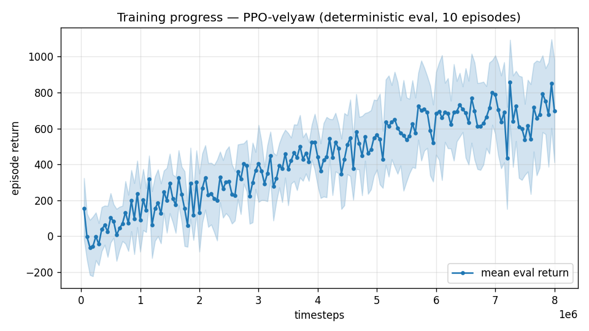

# Trial 06 — ABLATION: yaw gate only (xw7's tough-init + wind curriculum removed)

| | |
|---|---|
| run dir | `results_velyaw_xw10` |
| date | 2026-07-29 |
| steps | 8M (fresh run) |
| env / reward | physics identical to trials 02–05 (XWing aero, elevons ±20°, 110 N motors); reward = **yaw gate, floor 0.2** (identical to trial 04); ent_coef 0.003 |
| removed vs trial 04 | **tough-init mix (0.3 → 0.0)** and **wind curriculum (off → constant 20 m/s from step 0)** — i.e., trial 03's two changes |
| runs in parallel with | trial 05 (`results_velyaw_xw8b` continuation) |
| status | **IN PROGRESS** — results auto-appended on completion |

## Problem to solve / question
Trial 04 (= gate + ent + tough-init + wind curriculum) jumped from 41.3 → 9.2 m/s velocity
error and 0% → 43% dive recovery. But it stacked THREE ingredients (gate, tough-init,
curriculum), and trial 03 already showed tough-init+curriculum do nothing *by themselves*
(0/60 recovery). Open question — user's phrasing: "remove xw7 change and only keep xw8
change, so that I want to check what really helps."

**This run isolates the yaw gate**: if it matches trial 04, the gate alone is sufficient and
the exposure machinery is dead weight. If it lands between trials 02 and 04, the ingredients
are synergistic (gate makes recovery *worth learning*, tough-init makes it *cheap to find*).

## The 2×2 picture this completes (all at 8M, same physics)

| | no gate | gate (floor 0.2) |
|---|---|---|
| **no tough-init / no curriculum** | trial 02: 41.3 m/s, 2.1°, dives | **THIS RUN** |
| **tough-init 30% + wind curriculum** | trial 03: 39.7 m/s, 1.7°, 0% recovery | trial 04: 9.2 m/s, 20.8°, 43%+25% |

## Exact changes
**No code changes.** Command-line diff vs trial 04 only:
```bash
# trial 04 (xw8):
python train.py --xwing-aero --yaw-bias 0.3 --max-speed 25 --tough-init 0.3 \
                --wind-curriculum --yaw-gate --ent-coef 0.003 --n-envs 6 \
                --timesteps 8000000 --device cpu --out-dir results_velyaw_xw8

# THIS RUN (xw10): --tough-init and --wind-curriculum REMOVED
python train.py --xwing-aero --yaw-bias 0.3 --max-speed 25 \
                --yaw-gate --ent-coef 0.003 --n-envs 6 \
                --timesteps 8000000 --device cpu --out-dir results_velyaw_xw10
# auto: analyze_velyaw.py --dir results_velyaw_xw10 && log_trial.py
```
Effective differences in the env:
- `tough_init_frac = 0.0` → all training episodes start from the gentle ±40° init;
- no `WindCurriculumCallback` → `WIND_MAX = 20 m/s` from step 0 (constant, like trials 00–02);
- reward identical to trial 04 (`yaw_gate=True`, floor 0.2 via the new `yaw_gate_floor`
  parameter's default — byte-identical gate math).

Note: the dive-recovery test in the analysis still works — it *evaluates* with
`tough_init_frac=1.0` regardless of how the policy was trained.

## Decision criteria (set before results)
Compare to trial 04 (9.2 m/s / 20.8° / 43% full + 25% partial) at 8M:
- **xw10 ≈ trial 04** (vel err within ~2 m/s, recovery within ~10 pts) → the gate alone is
  the active ingredient; drop tough-init/curriculum from future runs (simpler training).
- **xw10 clearly worse on recovery** (< ~25% full) but velocity decent → synergy confirmed:
  gate sets the incentive, tough-init supplies the experience; keep both.
- **xw10 back to dive-collapse** (vel err > 25 m/s) → gate is necessary but not sufficient;
  exposure is load-bearing.

<!-- AUTO-RESULTS: log_trial.py appends below this line when the run completes -->

---

## AUTO-CAPTURED RESULTS (2026-07-29 00:54)

**config**: `{"max_speed": 25.0, "use_integral": true, "use_yaw_integral": true, "use_wind_est": true, "yaw_width": 0.35, "yaw_weight": 1.0, "yaw_bias": 0.3, "heading_frame": false, "xwing_aero": true, "tough_init": 0.0, "wind_curriculum": false, "yaw_gate": true, "yaw_gate_floor": 0.2, "ent_coef": 0.003}`

**eval curve**: n=160, first 153, best 857 @ 7,249,710, last 696 (final steps 7,999,680)

**late trend**: still rising (last-10% mean 684 vs prior-10% 673)





### Physical eval
```
=== PHYSICAL EVAL (level start, full wind) ===

band           n  vel err (m/s)  yaw err (deg)
----------------------------------------------
hover(0-1)     1           2.65            7.7
low(1-10)     45           4.30            8.3
mid(10-18)    43           8.04           20.7
high(18-25)   31          13.06           42.5
----------------------------------------------
ALL          120           7.89           21.6   crash 0.0%
```


### Dive-recovery test
```
=== DIVE-RECOVERY TEST (60 episodes, all starting in failure states) ===
  recovered (final-2s vel err < 8 m/s):  26/60 = 43%
  partial   (8-15 m/s):                  9/60 = 15%
  median final err: 10.2 m/s   mean: 19.8 m/s
```


### Behavior traces
```
--- trace seed 1005: target [11.9  5.2  0.3] (|v|=13.0), wind [ -4.8 -15.4  -4.2] ---
  t= 0.0 |v|=  0.2 vz=   0.0 tilt=   0 verr= 13.1 yawerr=+103.5 fins=( +3.5,-10.5) thr=-1.00
  t= 2.0 |v|=  7.4 vz=  -4.2 tilt=  72 verr= 14.9 yawerr= -25.2 fins=(+18.5, +8.6) thr=-0.75
  t= 4.0 |v|= 13.6 vz=  -6.1 tilt=  17 verr= 14.3 yawerr=  +9.8 fins=(+18.4, +9.8) thr=-0.78
  t= 6.0 |v|= 16.6 vz=  -7.5 tilt=  45 verr= 19.5 yawerr=  +9.1 fins=(+17.0,-12.2) thr=+1.00
  t= 8.0 |v|= 20.9 vz=  -5.8 tilt=  30 verr= 23.4 yawerr=+115.8 fins=(-18.0,-17.2) thr=+0.21
--- trace seed 1012: target [  6.3 -16.6   1.4] (|v|=17.8), wind [-0.4  5.5 -8.2] ---
  t= 0.0 |v|=  0.0 vz=   0.0 tilt=   0 verr= 17.8 yawerr= +46.7 fins=( -5.1, -8.9) thr=+0.11
  t= 2.0 |v|=  8.3 vz=   4.9 tilt=  41 verr= 12.8 yawerr= -35.4 fins=(-19.0,-18.2) thr=-0.53
  t= 4.0 |v|= 10.7 vz=   4.2 tilt=  60 verr=  8.5 yawerr=  -9.9 fins=(-20.0,-18.2) thr=-0.14
  t= 6.0 |v|= 11.8 vz=   2.9 tilt=  50 verr=  7.6 yawerr=  -7.0 fins=(-13.1,-18.2) thr=-1.00
  t= 8.0 |v|= 11.7 vz=   4.3 tilt=  46 verr=  7.5 yawerr= -15.7 fins=(-13.4,-18.2) thr=-0.49
--- trace seed 1020: target [-9.8 11.   0.9] (|v|=14.8), wind [-0.4 -1.5 -0.8] ---
  t= 0.0 |v|=  0.0 vz=   0.0 tilt=   0 verr= 14.8 yawerr= -65.7 fins=(+10.6,-10.3) thr=-1.00
  t= 2.0 |v|=  6.9 vz=   0.4 tilt=  64 verr=  9.1 yawerr= -24.3 fins=( +2.8,-10.0) thr=-1.00
  t= 4.0 |v|= 14.9 vz=   0.4 tilt=   6 verr=  3.0 yawerr=  +7.8 fins=(+20.0,-15.7) thr=+0.02
  t= 6.0 |v|= 16.1 vz=  -2.1 tilt=  13 verr=  4.2 yawerr=+147.1 fins=(-17.9,-20.0) thr=-0.31
  t= 8.0 |v|= 11.1 vz=  -2.2 tilt=  91 verr=  7.1 yawerr=  -7.7 fins=( +9.4,-20.0) thr=-0.94
```

---

## VERDICT: the yaw gate alone is the active ingredient

The completed 2×2 (all 8M steps, same physics):

| | no gate | gate (floor 0.2) |
|---|---|---|
| **no exposure** | xw6: 41.3 m/s / 2.1° / dives | **xw10: 7.89 m/s / 21.6° / 43%+15%** |
| **tough-init + wind curriculum** | xw7: 39.7 m/s / 1.7° / 0% | xw8: 9.2 m/s / 20.8° / 43%+25% |

1. **Gate-only ≥ gate+exposure at equal steps**: xw10's velocity error (7.89) is *better*
   than xw8's (9.2), with the **same 43% full dive-recovery** — despite never seeing a single
   tough-init episode in training. The recovery skill emerged from normal-flight learning
   once the incentive pointed the right way.
2. **Tough-init + wind curriculum contributed ≈ nothing** (0% recovery without the gate in
   xw7; no velocity benefit with it in xw8 — if anything the 30% dive-start episodes taxed
   the budget). Their only visible trace: a few more *partial* recoveries (25% vs 15%).
3. Refined lesson (supersedes trial 04's "exposure + incentive must both point the same
   way"): **when the reward provides a smooth gradient along the escape path, PPO finds the
   escape from ordinary experience — exposure shaping is unnecessary here.** Exposure without
   incentive (xw7) is worthless; incentive without exposure (xw10) is sufficient.
4. Secondary observations: xw10 yaw (21.6°, high band 42.5°) slightly worse than xw8 —
   within run-to-run noise or a mild exposure benefit; eval curve still rising at 8M
   (best 857 @7.25M), so a continuation would likely improve it further, as it did xw8→xw8b.

**Recipe going forward**: `--yaw-gate --ent-coef 0.003` only; drop `--tough-init` and
`--wind-curriculum` (simpler training, one fewer moving part, equal or better results).
