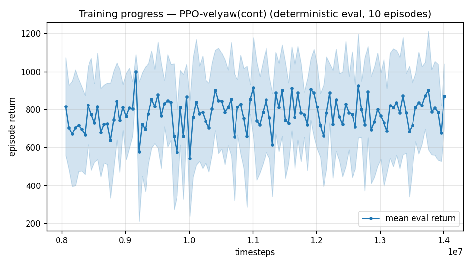

# Trial 07 — AUTONOMOUS LOOP iter 1: precision peak + fine-tune continuation

| | |
|---|---|
| run dir | `results_velyaw_xw11` (continues `results_velyaw_xw10`, 8M → 14M) |
| date | 2026-07-29 |
| goal (user) | **velocity error < 1 m/s** (ALL bands, level start, full 20 m/s wind) — loop iterates automatically until reached or blocked |
| baseline | xw10: 7.89 m/s / 21.6° (still rising at 8M); xw8b: 7.36 / 13.7 (plateaued) |
| changes | **+ narrow velocity precision peak** `0.7·(1−tanh(d/0.5))`; **LR 3e-4 → 1e-4** (fine-tune); n_envs 6 → 10 |
| status | **IN PROGRESS** — auto-analyzed + auto-logged on completion |

## Hypothesis (iteration 1)
The error floor is ~4.3 m/s even at low speed. The sharp reward term `1−tanh(d/2)` is nearly
flat below ~2 m/s (at d=1 m/s, 92% of it is already collected) — **sub-1 m/s tracking earns
almost no extra reward**, so the policy has no incentive to tighten. This is the exact
"sharpness must match achievable precision" lesson from the tailsitter project (its hover
went 0.5 m → 0.06 m when the peak width matched the target precision).

Base = xw10 (not xw8b): simplest recipe (gate-only — the trial-06 ablation verdict), best
velocity at 8M, eval curve still rising (best 857 @7.25M).

## Measured gradient profile (why width 0.5)
```
   d      old sharp (1-tanh(d/2))   new peak 0.7*(1-tanh(d/0.5))
 0.25          0.876                        0.377
 0.50          0.755                        0.167
 1.00          0.538                        0.025
 2.00          0.238                        0.000
```
The added term concentrates its entire 0.7 range inside d < 1.5 m/s — steepest exactly in
the <1 m/s regime the task targets; zero interference above 2 m/s.

## Exact code changes

### 1. `rate_vel_aviary.py` — new reward term (ADDED)
Constructor:
```python
                 vel_precision: float = 0.0,       # weight of an extra NARROW velocity peak
                 #                                   (1 - tanh(d/0.5)): gradient below ~1 m/s, where
                 #                                   the d/2 peak is already ~flat
```
```python
        self.VEL_PRECISION = float(vel_precision)
```
`_computeReward` (ADDED after `r_vel`):
```python
        cov = np.exp(-0.5 * (d / (10.0 * s)) ** 2)             # wide velocity coverage
        r_vel = (1.0 - np.tanh(d / 2.0)) + cov
        if self.VEL_PRECISION > 0.0:
            # narrow precision peak: the d/2 term is ~flat below 2 m/s (92% collected at d=1),
            # so sub-1 m/s tracking gets almost no gradient without this. Width 0.5 m/s puts
            # the steepest gradient exactly in the <1 m/s regime the task targets.
            r_vel += self.VEL_PRECISION * (1.0 - np.tanh(d / 0.5))
```

### 2. `continue_train.py` — LR override + reward-key injection (ADDED)
```python
    ap.add_argument("--lr", type=float, default=None,
                    help="override learning rate for the continuation (fine-tune)")
    ap.add_argument("--vel-precision", type=float, default=None,
                    help="set/override the narrow velocity precision peak weight")
```
```python
    cfg = json.load(open(os.path.join(args.src, "config.json")))
    if args.vel_precision is not None:
        cfg["vel_precision"] = args.vel_precision      # reward-only change: safe on continuation
```
```python
    co = {"learning_rate": args.lr} if args.lr is not None else {}
    model = PPO.load(os.path.join(args.src, "ppo_ratevel_final.zip"), env=train_env,
                     device=args.device, custom_objects=co)
```
(env kwargs gain `vel_precision=cfg.get("vel_precision", 0.0)`; `train.py` gains
`--vel-precision` for fresh runs; `eval_velyaw.py` passes it through from config.)

## Command
```bash
python continue_train.py --src results_velyaw_xw10 --out results_velyaw_xw11 \
                         --extra 6000000 --n-envs 10 --lr 1e-4 --vel-precision 0.7
# auto: analyze_velyaw.py --dir results_velyaw_xw11 && log_trial.py
```
Reward scale changes again (adds up to +0.7/step) — compare physical metrics only.

## Decision ladder (pre-registered; the loop applies the next rung automatically)
- vel err < 1.0 → **SUCCESS, stop.**
- big improvement (< ~4) → iterate: continue further / sharpen more (width 0.3) / LR decay.
- moderate (~5–7) → run α-vs-error diagnostic; if high band dominates, add high-speed target
  oversampling; if floor is uniform, investigate wind-buffet sensitivity (S=C=b=1 forces) and
  consider heading-frame obs (fresh run).
- no change / regression → revert to plain 3e-4 continuation of xw10 (isolate whether the
  precision term or the LR hurt), and reassess whether <1 m/s is reachable under S=C=b=1
  physics + 20 m/s wind (report evidence to user if blocked).

---

## AUTO-CAPTURED RESULTS (2026-07-29 02:00)

**config**: `{"max_speed": 25.0, "use_integral": true, "use_yaw_integral": true, "use_wind_est": true, "yaw_width": 0.35, "yaw_weight": 1.0, "yaw_bias": 0.3, "heading_frame": false, "xwing_aero": true, "tough_init": 0.0, "wind_curriculum": false, "yaw_gate": true, "yaw_gate_floor": 0.2, "ent_coef": 0.003, "vel_precision": 0.7}`

**eval curve**: n=120, first 815, best 999 @ 9,161,776, last 871 (final steps 14,011,776)

**late trend**: still rising (last-10% mean 797 vs prior-10% 776)





### Physical eval
```
=== PHYSICAL EVAL (level start, full wind) ===

band           n  vel err (m/s)  yaw err (deg)
----------------------------------------------
hover(0-1)     1           2.83            4.2
low(1-10)     45           3.79            7.0
mid(10-18)    43           7.37           19.8
high(18-25)   31          13.33           49.1
----------------------------------------------
ALL          120           7.53           22.5   crash 0.0%
```


### Dive-recovery test
```
=== DIVE-RECOVERY TEST (60 episodes, all starting in failure states) ===
  recovered (final-2s vel err < 8 m/s):  18/60 = 30%
  partial   (8-15 m/s):                  12/60 = 20%
  median final err: 15.3 m/s   mean: 28.1 m/s
```


### Behavior traces
```
--- trace seed 1005: target [11.9  5.2  0.3] (|v|=13.0), wind [ -4.8 -15.4  -4.2] ---
  t= 0.0 |v|=  0.2 vz=   0.0 tilt=   0 verr= 13.1 yawerr=+103.5 fins=( +2.6,-10.5) thr=-1.00
  t= 2.0 |v|=  6.3 vz=  -4.7 tilt=  90 verr= 10.6 yawerr= +67.4 fins=( -0.3, +7.3) thr=-0.83
  t= 4.0 |v|=  8.0 vz=  -5.5 tilt=  25 verr= 13.6 yawerr= -47.8 fins=(+18.5, +6.2) thr=-0.19
  t= 6.0 |v|=  7.8 vz=   1.5 tilt=  14 verr= 12.1 yawerr= +34.7 fins=( +8.6, +0.1) thr=+0.12
  t= 8.0 |v|=  5.8 vz=   0.8 tilt=  19 verr= 12.6 yawerr= -27.3 fins=( -8.8,-20.0) thr=-0.58
--- trace seed 1012: target [  6.3 -16.6   1.4] (|v|=17.8), wind [-0.4  5.5 -8.2] ---
  t= 0.0 |v|=  0.0 vz=   0.0 tilt=   0 verr= 17.8 yawerr= +46.7 fins=( -5.6, -8.9) thr=+0.15
  t= 2.0 |v|=  8.1 vz=   6.5 tilt=  31 verr= 13.9 yawerr= -23.8 fins=( -7.3,-18.2) thr=-0.58
  t= 4.0 |v|= 10.1 vz=   4.5 tilt=  31 verr=  9.3 yawerr=  -9.5 fins=(-20.0,-18.2) thr=-0.55
  t= 6.0 |v|=  7.8 vz=   2.9 tilt=  27 verr= 10.8 yawerr= -19.7 fins=( -7.8,-18.2) thr=-0.71
  t= 8.0 |v|= 10.6 vz=   4.2 tilt=  32 verr=  8.5 yawerr=  -6.1 fins=(-18.2,-18.2) thr=-0.19
--- trace seed 1020: target [-9.8 11.   0.9] (|v|=14.8), wind [-0.4 -1.5 -0.8] ---
  t= 0.0 |v|=  0.0 vz=   0.0 tilt=   0 verr= 14.8 yawerr= -65.7 fins=(+10.6,-10.3) thr=-1.00
  t= 2.0 |v|=  7.5 vz=   3.4 tilt=  68 verr= 10.5 yawerr=  +8.0 fins=( +5.5, -3.6) thr=-1.00
  t= 4.0 |v|= 15.0 vz=   1.5 tilt=  25 verr=  5.4 yawerr=  +9.4 fins=(+17.8,-20.0) thr=+0.17
  t= 6.0 |v|= 13.2 vz=   0.8 tilt= 105 verr=  4.3 yawerr= +55.3 fins=( -0.9,-20.0) thr=-1.00
  t= 8.0 |v|=  7.3 vz=   1.9 tilt=  60 verr=  8.7 yawerr= -71.2 fins=( +3.3,-17.3) thr=-0.40
```

---

## VERDICT (loop ladder: "moderate" rung)
| band | xw10 base | xw11 | read |
|---|---|---|---|
| low | 4.30 | **3.79** | precision peak worked where it aimed |
| mid | 8.04 | 7.37 | slight gain |
| high | 13.06 | 13.33 | unchanged — not a precision problem |
| ALL | 7.89 | **7.53** | modest |
| yaw | 21.6° | 22.5° (49° high) | worse at speed |
| recovery | 43%+15% | 30%+20% | dropped (watch) |

Eval peaked at 9.16M (999) then drifted — fine-tune value extracted early. Combined with the
high-band diagnostic (mean |α| = 53–82° at 20–45 m/s: the policy never flies aligned), the
high band is a STRATEGY problem the precision reward cannot touch. DOF analysis: in wing-borne
flight the nose must follow the velocity vector (free rotation = roll about flight path), so a
random desired_yaw is structurally unsatisfiable at speed — and the yaw reward, fully open
exactly when velocity is tracked, actively punishes the aligned attitude.

**→ Iteration 2 (trial 08): attitude-gate the yaw reward** (enforced in hover where yaw is
controllable, released in cruise where it is dictated by the flight path).
