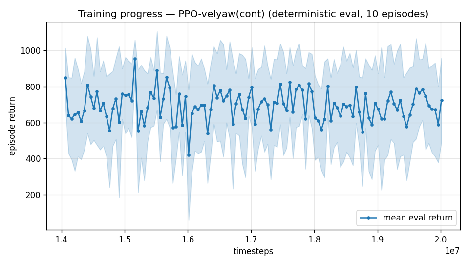

# Trial 08 — LOOP iter 2: attitude-gated yaw reward (unlock airplane-mode flight)

| | |
|---|---|
| run dir | `results_velyaw_xw12` (continues `results_velyaw_xw11`, 14M → 20M) |
| date | 2026-07-29 |
| loop goal | velocity error **< 1 m/s** |
| baseline | xw11: 7.53 m/s ALL (low 3.79 / mid 7.37 / high 13.33), yaw 22.5° |
| changes | **+ attitude gate on the yaw reward** `gate *= clip(R22, 0, 1)`; LR back to 3e-4 (structural change needs plasticity); keeps precision peak 0.7 |
| status | **IN PROGRESS** — auto-analyzed + auto-logged on completion |

## Hypothesis (iteration 2) — from the high-band diagnostic
Measured on the best policy (150 eps): mean |α| flown is **53–82° at 20–45 m/s demanded
relative airspeed** — the policy never enters aligned (small-α, airplane-like) flight, which
is where high-speed tracking is cheap (trim at 45 m/s: α≈6°, Mz≈−12.6 N·m ≪ authority).

Why it avoids alignment — a degrees-of-freedom argument: in wing-borne flight the nose is
slaved to the velocity vector; the only free rotation is **roll about the flight path**. A
random `desired_yaw` is therefore structurally unsatisfiable at speed. Our yaw reward is
velocity-gated — it pays **in full exactly when velocity is tracked** — so cruising aligned
(velocity good, yaw "wrong") gets punished ~2/step, while half-transitioned draggy flight
(some yaw payout, mediocre velocity) survives. The reward forbids the correct regime — the
same trap class as the dive optimum (trial 03/04), one level subtler.

## The change
Enforce yaw only where it is physically a free variable:
```
gate_total = [gf + (1−gf)·cov]  ×  clip(R22, 0, 1)
              velocity gate          attitude gate (NEW)
```
`R22` = vertical component of body-z = 1 in hover (yaw fully enforced, definition
well-conditioned) → 0 at 90° tilt (yaw released; the flight path dictates the nose).
Task semantics change, documented: **desired_yaw is a hover/low-speed objective** — which is
the only physically coherent reading for a tailsitter.

## Exact code changes

### `rate_vel_aviary.py` (ADDED)
Constructor:
```python
                 yaw_att_gate: bool = False,       # scale yaw reward by clip(R22,0,1): yaw enforced in
                 #                                   hover (controllable) and released in wing-borne
                 #                                   cruise, where the nose must follow the velocity
                 #                                   vector and a random desired_yaw is unsatisfiable
```
```python
        self.YAW_ATT_GATE = bool(yaw_att_gate)
```
`_computeReward` (ADDED between the velocity gate and the reward sum):
```python
        gf = self.YAW_GATE_FLOOR
        gate = (gf + (1.0 - gf) * cov) if self.YAW_GATE else 1.0
        if self.YAW_ATT_GATE:
            # attitude gate: in wing-borne flight the nose must follow the velocity vector (the
            # only free rotation is roll about the flight path), so a random desired_yaw is
            # structurally unsatisfiable at speed — and an always-on yaw reward punishes the
            # ALIGNED (small-alpha) attitude the vehicle needs there, locking it into draggy
            # half-transitioned flight (measured: mean |alpha| 53-82 deg at 20-45 m/s).
            # R[2,2] = 1 in hover (yaw fully enforced) -> 0 at 90-deg tilt (yaw released).
            gate = gate * float(np.clip(R[2, 2], 0.0, 1.0))
        reward = r_vel + self.YAW_WEIGHT * gate * r_yaw + 0.5 * joint - (0.02 / s) * d + smooth
```

### `train.py` / `continue_train.py` / `eval_velyaw.py` (ADDED — flag + config passthrough)
```python
    ap.add_argument("--yaw-att-gate", action="store_true", ...)
# continue_train: if args.yaw_att_gate: cfg["yaw_att_gate"] = True   (reward-only: safe on resume)
# all three: yaw_att_gate=cfg.get("yaw_att_gate", False) into env kwargs
```

## Command
```bash
python continue_train.py --src results_velyaw_xw11 --out results_velyaw_xw12 \
                         --extra 6000000 --n-envs 10 --lr 3e-4 --yaw-att-gate
# auto: analyze_velyaw.py --dir results_velyaw_xw12 && log_trial.py
```

## Expected signature of success / decision ladder
- Success signature: high-band mean |α| drops toward < 20°, high-band vel err from 13.3
  toward ≤ 6; ALL below ~5. Yaw error will *report* worse in the high band by construction
  (it is no longer optimized there) — judge yaw on the hover/low bands only.
- vel err < 1.0 → SUCCESS, stop.
- Big improvement but > 1.0 → continue: more steps + possibly sharpen precision (width 0.3),
  then LR decay.
- α still huge at speed → the conflict wasn't binding; next suspects: transition skill
  (curriculum on target speed), obs (heading-frame), physics realism (real S/C/b — ask user).
- Regression in hover/low yaw beyond ~10° → attitude-gate exponent too aggressive; try
  clip(R22,0,1)**0.5.

---

## AUTO-CAPTURED RESULTS (2026-07-29 02:51)

**config**: `{"max_speed": 25.0, "use_integral": true, "use_yaw_integral": true, "use_wind_est": true, "yaw_width": 0.35, "yaw_weight": 1.0, "yaw_bias": 0.3, "heading_frame": false, "xwing_aero": true, "tough_init": 0.0, "wind_curriculum": false, "yaw_gate": true, "yaw_gate_floor": 0.2, "ent_coef": 0.003, "vel_precision": 0.7, "yaw_att_gate": true}`

**eval curve**: n=120, first 850, best 956 @ 15,162,416, last 724 (final steps 20,012,416)

**late trend**: still rising (last-10% mean 696 vs prior-10% 672)





### Physical eval
```
=== PHYSICAL EVAL (level start, full wind) ===

band           n  vel err (m/s)  yaw err (deg)
----------------------------------------------
hover(0-1)     1           3.70            7.1
low(1-10)     45           3.96            7.6
mid(10-18)    43           6.99           17.3
high(18-25)   31          10.85           27.7
----------------------------------------------
ALL          120           6.82           16.2   crash 0.0%
```


### Dive-recovery test
```
=== DIVE-RECOVERY TEST (60 episodes, all starting in failure states) ===
  recovered (final-2s vel err < 8 m/s):  26/60 = 43%
  partial   (8-15 m/s):                  8/60 = 13%
  median final err: 13.0 m/s   mean: 21.7 m/s
```


### Behavior traces
```
--- trace seed 1005: target [11.9  5.2  0.3] (|v|=13.0), wind [ -4.8 -15.4  -4.2] ---
  t= 0.0 |v|=  0.2 vz=   0.0 tilt=   0 verr= 13.1 yawerr=+103.5 fins=( +6.1,-10.5) thr=-1.00
  t= 2.0 |v|=  2.7 vz=  -0.4 tilt=  24 verr= 11.7 yawerr= +97.4 fins=(+11.8,-10.6) thr=-0.42
  t= 4.0 |v|= 12.0 vz=  -6.0 tilt=  55 verr= 13.2 yawerr=-101.3 fins=(+15.4,+18.5) thr=-0.46
  t= 6.0 |v|= 17.9 vz=  -4.8 tilt=  56 verr= 24.3 yawerr= -19.3 fins=( -2.7,-20.0) thr=+0.99
  t= 8.0 |v|= 15.5 vz=  -0.1 tilt=  40 verr= 17.4 yawerr=  +8.0 fins=(+18.5, +6.5) thr=+0.12
--- trace seed 1012: target [  6.3 -16.6   1.4] (|v|=17.8), wind [-0.4  5.5 -8.2] ---
  t= 0.0 |v|=  0.0 vz=   0.0 tilt=   0 verr= 17.8 yawerr= +46.7 fins=( +3.7, -8.9) thr=+0.08
  t= 2.0 |v|=  7.0 vz=   3.1 tilt=  39 verr= 11.6 yawerr=  +7.0 fins=(-11.0,-18.2) thr=-1.00
  t= 4.0 |v|= 10.9 vz=   4.6 tilt=  31 verr=  9.5 yawerr= +19.4 fins=(-14.6,-18.2) thr=-1.00
  t= 6.0 |v|= 10.4 vz=   4.7 tilt=  41 verr=  9.5 yawerr= +15.5 fins=(-20.0,-18.2) thr=-0.23
  t= 8.0 |v|=  9.4 vz=   4.9 tilt=  41 verr= 10.7 yawerr= +15.8 fins=(-13.7,-18.2) thr=-0.55
--- trace seed 1020: target [-9.8 11.   0.9] (|v|=14.8), wind [-0.4 -1.5 -0.8] ---
  t= 0.0 |v|=  0.0 vz=   0.0 tilt=   0 verr= 14.8 yawerr= -65.7 fins=(+10.6,-10.3) thr=-1.00
  t= 2.0 |v|=  8.5 vz=   2.1 tilt=  33 verr= 12.2 yawerr= -13.9 fins=(-15.5, +1.3) thr=-1.00
  t= 4.0 |v|= 14.3 vz=  -3.2 tilt=  39 verr=  4.5 yawerr= -18.1 fins=(+20.0,-20.0) thr=-0.73
  t= 6.0 |v|= 17.5 vz=   0.1 tilt=  34 verr=  3.6 yawerr= +28.9 fins=( +1.3,-20.0) thr=+0.36
  t= 8.0 |v|=  9.8 vz=   3.6 tilt=  53 verr=  6.2 yawerr= +24.5 fins=(+19.4,+17.3) thr=-1.00
```

---

## VERDICT (loop ladder: directional success, insufficient magnitude)
| band | xw11 | **xw12** | mean |α| (xw11-era → xw12) |
|---|---|---|---|
| low | 3.79 | 3.96 | ~82° → 86° (hover regime — correct) |
| mid | 7.37 | **6.99** | 71° → 64° |
| high | 13.33 | **10.85** | 53° → 44° (drifting toward alignment) |
| ALL | 7.53 | **6.82** (new best) | |
| yaw | 22.5° | **16.2°** | high-band yaw *improved* despite being released |
| recovery | 30%+20% | 43%+13% | recovered |

Attitude gate worked directionally: high band −2.5 m/s, α shifting down, and (surprise) yaw
improved too — smoother aligned-ish flight helps everything. But the 30–45 m/s demanded band
is unchanged (18.8) and α there is still ~50°: full airplane-mode never committed. Suspected
cause: three stacked reward regimes across continuations (xw10→11→12) leave value-function
baggage; each continuation peaks ~1.2M in, then drifts (best 956 @15.2M).

**→ Iteration 3 (trial 09): fresh full-stack run** — all validated ingredients from scratch.
