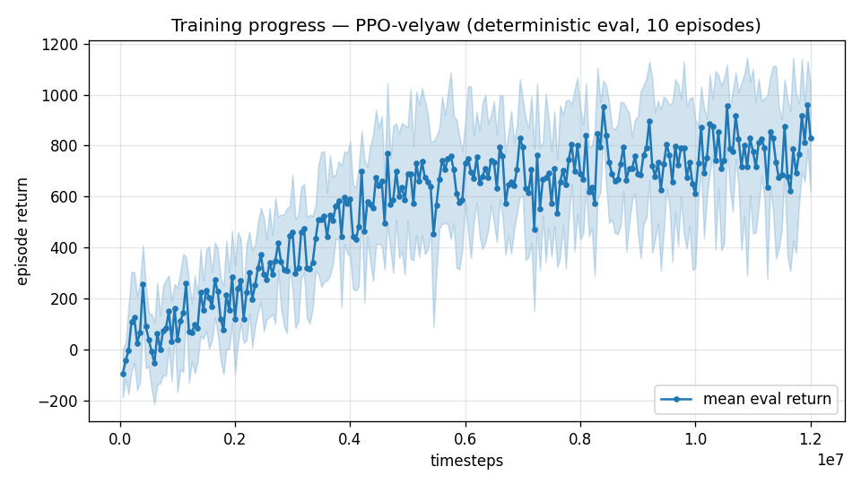

# Trial 09 — LOOP iter 3: fresh full-stack run (12M)

| | |
|---|---|
| run dir | `results_velyaw_xw13` (FRESH — no continuation) |
| date | 2026-07-29 |
| loop goal | velocity error **< 1 m/s** |
| baseline | xw12: 6.82 m/s / 16.2° (best so far; built by 3 stacked continuations) |
| changes | **no new ingredient** — all validated pieces, trained together from scratch: yaw gate (floor 0.2) + attitude gate + precision peak 0.7 + ent 0.003; 12M steps, 10 envs |
| status | **IN PROGRESS** — auto-analyzed + auto-logged on completion |

## Hypothesis (iteration 3)
The xw10→11→12 chain changed the reward three times mid-stream. Each continuation peaked
~1.2M steps in and then drifted (xw11 best @9.2M, xw12 best @15.2M), and the α-diagnostic
shows the policy only *drifting* toward aligned flight (α 53°→44° at 20–30 m/s) instead of
committing — consistent with value-function baggage from older reward regimes. A fresh run
under the final reward lets the whole strategy (transition → aligned cruise) form coherently.
Precedent: fresh-gate xw10 beat expectations; the tailsitter project also found that large
config changes mid-continuation ≈ retraining anyway.

## Exact changes
**No code changes.** Command only — first run to combine all validated flags from step 0:
```bash
python train.py --xwing-aero --yaw-bias 0.3 --max-speed 25 \
                --yaw-gate --yaw-att-gate --vel-precision 0.7 --ent-coef 0.003 \
                --n-envs 10 --timesteps 12000000 --device cpu \
                --out-dir results_velyaw_xw13
# auto: analyze_velyaw.py --dir results_velyaw_xw13 && log_trial.py
```
(No tough-init, no wind curriculum — per the trial-06 ablation. LR default 3e-4.)

## Decision criteria
- < 1.0 → SUCCESS.
- < 6.0 (beats xw12) → the fresh-run hypothesis holds; next: continue best + LR decay,
  and/or sharpen precision to width 0.3.
- ≈ xw12 (6.5–7.5) → stacked-continuation baggage was not the issue; remaining floor is
  likely environmental (wind 0–20 m/s with S=C=b=1 buffeting) — escalate the two
  benchmark-level questions to the user: real S/C/b values, and wind spec (note: the real
  XWing DLL trains with wind 0–15 m/s; our 0–20 was an inherited default from the quad env,
  never a user spec).
- Worse → revert attention to xw12 best; investigate eval-vs-train gap.

## Open questions surfaced to the user (pending answers; loop continues meanwhile)
1. Real aero reference dims S, C, b (model was fitted with them; S=C=b=1 inflates moments
   ~11× and forces ~3×, and makes low-speed wind buffeting brutal).
2. Wind spec: is 0–20 m/s actually required? The reference XWing DLL uses `15·rand()` = 0–15.

---

## AUTO-CAPTURED RESULTS (2026-07-29 04:26)

**config**: `{"max_speed": 25.0, "use_integral": true, "use_yaw_integral": true, "use_wind_est": true, "yaw_width": 0.35, "yaw_weight": 1.0, "yaw_bias": 0.3, "heading_frame": false, "xwing_aero": true, "tough_init": 0.0, "wind_curriculum": false, "yaw_gate": true, "yaw_gate_floor": 0.2, "vel_precision": 0.7, "yaw_att_gate": true, "ent_coef": 0.003}`

**eval curve**: n=240, first -94, best 960 @ 11,950,000, last 831 (final steps 12,000,000)

**late trend**: plateaued (last-10% mean 776 vs prior-10% 776)





### Physical eval
```
=== PHYSICAL EVAL (level start, full wind) ===

band           n  vel err (m/s)  yaw err (deg)
----------------------------------------------
hover(0-1)     1           2.48            1.3
low(1-10)     45           3.43            1.9
mid(10-18)    43           6.68            4.1
high(18-25)   31          11.60            7.5
----------------------------------------------
ALL          120           6.70            4.1   crash 0.0%
```


### Dive-recovery test
```
=== DIVE-RECOVERY TEST (60 episodes, all starting in failure states) ===
  recovered (final-2s vel err < 8 m/s):  22/60 = 37%
  partial   (8-15 m/s):                  6/60 = 10%
  median final err: 17.4 m/s   mean: 20.4 m/s
```


### Behavior traces
```
--- trace seed 1005: target [11.9  5.2  0.3] (|v|=13.0), wind [ -4.8 -15.4  -4.2] ---
  t= 0.0 |v|=  0.2 vz=   0.1 tilt=   0 verr= 13.1 yawerr=+103.5 fins=( +9.0, +7.5) thr=-0.46
  t= 2.0 |v|=  6.4 vz=   1.5 tilt=  41 verr= 10.7 yawerr=  +1.5 fins=( +4.7,-19.3) thr=-0.73
  t= 4.0 |v|=  6.8 vz=   2.1 tilt=  33 verr=  9.8 yawerr=  -7.4 fins=(+18.5,-13.6) thr=-0.91
  t= 6.0 |v|=  8.9 vz=  -0.8 tilt=  44 verr= 10.0 yawerr= -15.6 fins=(+18.1,-16.3) thr=-0.36
  t= 8.0 |v|=  9.2 vz=  -0.6 tilt=  40 verr=  9.9 yawerr= -16.1 fins=(+17.6,-19.3) thr=-0.37
--- trace seed 1012: target [  6.3 -16.6   1.4] (|v|=17.8), wind [-0.4  5.5 -8.2] ---
  t= 0.0 |v|=  0.0 vz=   0.0 tilt=   0 verr= 17.8 yawerr= +46.7 fins=(+10.1, +5.7) thr=-0.05
  t= 2.0 |v|=  5.4 vz=   0.6 tilt=  27 verr= 12.4 yawerr=  -9.7 fins=( +5.7,-17.9) thr=-0.42
  t= 4.0 |v|=  7.4 vz=   0.2 tilt=  29 verr= 10.5 yawerr=  -6.5 fins=( -2.2,-18.2) thr=-0.45
  t= 6.0 |v|=  7.9 vz=   0.8 tilt=  27 verr= 10.0 yawerr=  -8.3 fins=( -4.3,-18.2) thr=-0.60
  t= 8.0 |v|=  7.7 vz=   0.9 tilt=  27 verr= 10.2 yawerr=  -7.2 fins=( +0.9,-18.2) thr=-0.38
--- trace seed 1020: target [-9.8 11.   0.9] (|v|=14.8), wind [-0.4 -1.5 -0.8] ---
  t= 0.0 |v|=  0.0 vz=   0.0 tilt=   0 verr= 14.8 yawerr= -65.7 fins=( -9.7, +2.9) thr=-1.00
  t= 2.0 |v|=  4.1 vz=   1.2 tilt=  17 verr= 11.3 yawerr= +39.5 fins=(+17.3,-20.0) thr=+0.08
  t= 4.0 |v|=  8.6 vz=  -1.7 tilt=  27 verr=  6.8 yawerr=  +0.0 fins=( -7.2, -9.3) thr=-0.02
  t= 6.0 |v|= 10.9 vz=   0.4 tilt=  25 verr=  4.3 yawerr=  +2.2 fins=( -8.1,-16.3) thr=-0.30
  t= 8.0 |v|= 10.5 vz=   0.8 tilt=  19 verr=  4.6 yawerr=  +2.8 fins=( -3.9,-13.3) thr=-0.23
```

---

## VERDICT (loop ladder: velocity tie → floor evidence; yaw breakthrough)
| | xw12 (stacked) | **xw13 (fresh)** |
|---|---|---|
| vel ALL | 6.82 | **6.70** (tie) |
| yaw ALL | 16.2° | **4.1°** — hover 1.3°, low 1.9°, mid 4.1°, high 7.5° |
| recovery | 43%+13% | 37%+10% |

1. **Velocity: the fresh-run hypothesis is rejected** — same ~6.7 m/s floor as the stacked
   lineage. Three independently-built policies (xw8b 7.36, xw12 6.82, xw13 6.70) converge to
   the same band pattern (low ~3.4, mid ~6.7, high ~11.6): strong evidence of a floor set by
   the environment (0–20 m/s wind + S=C=b=1 aero + DR) or by model capacity — not by the
   training recipe.
2. **Yaw: solved by the fresh run** (16.2° → 4.1°, high band 7.5°). Trained under the
   attitude gate from step 0, the policy tracks heading superbly wherever it is enforceable.
   xw13 = best overall policy so far.
3. → Iteration 4 = **capacity probe** (512×512 net, fresh, same config): the last in-loop
   lever that could explain a shared floor. If it also lands ~6.7, the floor is definitively
   environmental → the user's answers on real S/C/b and the wind spec become the gating
   factor for the <1 m/s target.

**Best policy: `results_velyaw_xw13/best/best_model.zip`.**
