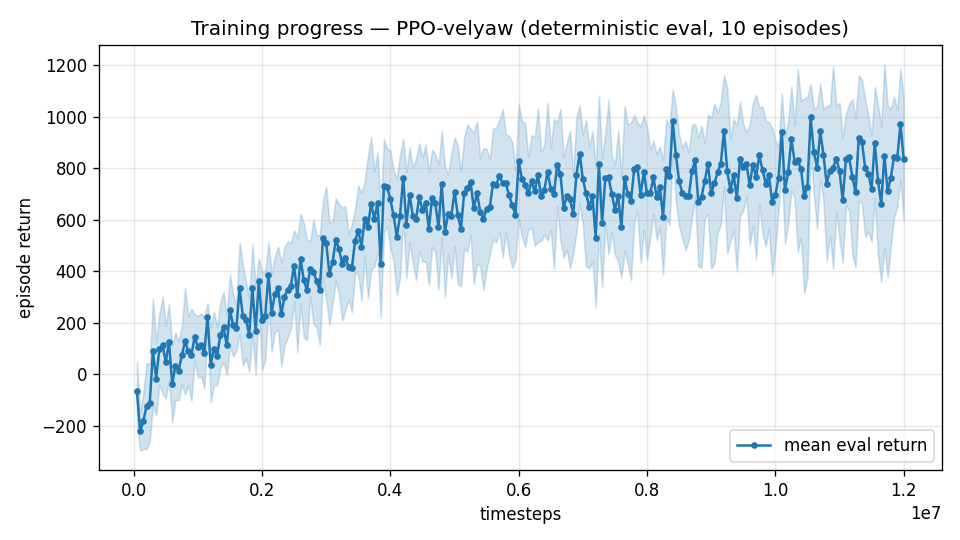

# Trial 11 — LOOP iter 5: REAL SPEC (wind 0–15, S=C=b=1 confirmed) + 512×512

| | |
|---|---|
| run dir | `results_velyaw_xw15` (FRESH) |
| date | 2026-07-29 |
| loop goal | velocity error **< 1 m/s** on the REAL benchmark (level start, wind U(0,15)) |
| baseline | xw13 (trained @wind 0–20) re-evaluated on the real benchmark: **5.61 m/s / 3.9°** (hover 2.05/0.5°, low 2.62/1.5°, mid 5.50/3.7°, high 10.21/7.8°) |
| spec confirmed by user | **wind 0–15 m/s** ("set the wind to 0 to 15m/s") and **S=C=b=1 is the real value** — aero magnitudes are correct physics; benchmark = real spec |
| changes | train AND eval at wind_max=15; net 256×256 → **512×512** (re-runs the interrupted trial-10 capacity probe under the real spec); everything else = trial 09 stack |
| status | **IN PROGRESS** — auto-analyzed + auto-logged on completion |

## Hypotheses
1. Training at the real wind spec stops spending capacity on 15–20 m/s robustness that the
   real aircraft never faces → all bands improve beyond the 5.61 eval-only gain.
2. Capacity: three 256×256 policies converged to one floor; the nonlinear XWing aero may need
   a wider net (the interrupted xw14 was testing exactly this).

## Exact code changes (wind-spec wiring; net change is a flag)
### `train.py` (ADDED)
```python
    ap.add_argument("--wind-max", type=float, default=15.0,
                    help="per-episode wind is U(0, wind_max); real XWing spec = 15 m/s")
# config.json: "wind_max": args.wind_max,
# base_kwargs: ..., wind_max=args.wind_max,
```
### `eval_velyaw.py` / `continue_train.py` (ADDED — config passthrough, old configs default 20)
```python
              wind_max=cfg.get("wind_max", 20.0),
```
### `eval_velyaw.py` (FIXED — evaluate() silently ignored overrides)
```python
# BEFORE: def evaluate(D, n=120, ep_len=10.0, steady_window=3.0):
#             model, venv, base = load(D, ep_len)
def evaluate(D, n=120, ep_len=10.0, steady_window=3.0, **overrides):
    model, venv, base = load(D, ep_len, **overrides)
```
(caught because the first "re-baseline at 0–15" reproduced the 0–20 numbers exactly)

## Command
```bash
python train.py --xwing-aero --yaw-bias 0.3 --max-speed 25 --wind-max 15 \
                --yaw-gate --yaw-att-gate --vel-precision 0.7 --ent-coef 0.003 \
                --net 512,512 --n-envs 10 --timesteps 12000000 --device cpu \
                --out-dir results_velyaw_xw15
# auto: analyze_velyaw.py --dir results_velyaw_xw15 && log_trial.py
```

## Decision criteria (vs the 5.61 real-benchmark baseline)
- < 1.0 → SUCCESS.
- ≤ 4.0 → real-spec training + capacity paying off → continue best + LR decay + sharpen.
- 5–6 → net didn't matter; iterate on the low-band floor (wind-buffet analysis, obs).
- Also read the net effect: if ≈ xw13-at-15 (5.6) exactly, capacity ruled out for good.

---

## AUTO-CAPTURED RESULTS (2026-07-29 17:35)

**config**: `{"max_speed": 25.0, "wind_max": 15.0, "use_integral": true, "use_yaw_integral": true, "use_wind_est": true, "yaw_width": 0.35, "yaw_weight": 1.0, "yaw_bias": 0.3, "heading_frame": false, "xwing_aero": true, "tough_init": 0.0, "wind_curriculum": false, "yaw_gate": true, "yaw_gate_floor": 0.2, "vel_precision": 0.7, "yaw_att_gate": true, "ent_coef": 0.003}`

**eval curve**: n=240, first -67, best 999 @ 10,550,000, last 836 (final steps 12,000,000)

**late trend**: plateaued (last-10% mean 804 vs prior-10% 804)





### Physical eval
```
=== PHYSICAL EVAL (level start, full wind) ===

band           n  vel err (m/s)  yaw err (deg)
----------------------------------------------
hover(0-1)     1           1.28            8.4
low(1-10)     45           2.71            3.0
mid(10-18)    43           5.72            6.2
high(18-25)   31           9.56            8.3
----------------------------------------------
ALL          120           5.55            5.6   crash 0.0%
```


### Dive-recovery test
```
=== DIVE-RECOVERY TEST (60 episodes, all starting in failure states) ===
  recovered (final-2s vel err < 8 m/s):  20/60 = 33%
  partial   (8-15 m/s):                  7/60 = 12%
  median final err: 22.3 m/s   mean: 26.8 m/s
```


### Behavior traces
```
--- trace seed 1005: target [11.9  5.2  0.3] (|v|=13.0), wind [ -3.6 -11.6  -3.1] ---
  t= 0.0 |v|=  0.1 vz=   0.0 tilt=   0 verr= 13.0 yawerr=+103.5 fins=( +7.5,-10.5) thr=+0.55
  t= 2.0 |v|=  9.0 vz=   2.3 tilt=  72 verr=  9.5 yawerr=  +3.7 fins=(+17.6, -6.5) thr=-0.80
  t= 4.0 |v|=  9.0 vz=   1.9 tilt=  21 verr=  9.1 yawerr=  -2.2 fins=(+13.9,-12.0) thr=-0.52
  t= 6.0 |v|=  9.6 vz=   3.3 tilt=  14 verr=  8.8 yawerr=  -0.1 fins=( +2.6,-18.5) thr=-0.89
  t= 8.0 |v|=  9.9 vz=   5.5 tilt=  20 verr=  9.8 yawerr=  -0.1 fins=(+10.4,-10.0) thr=-0.90
--- trace seed 1012: target [  6.3 -16.6   1.4] (|v|=17.8), wind [-0.3  4.1 -6.1] ---
  t= 0.0 |v|=  0.0 vz=   0.0 tilt=   0 verr= 17.8 yawerr= +46.7 fins=( +7.7, -8.9) thr=-1.00
  t= 2.0 |v|=  4.6 vz=   0.9 tilt=  24 verr= 13.4 yawerr= -18.0 fins=(-20.0,-18.1) thr=-0.63
  t= 4.0 |v|=  7.5 vz=   2.7 tilt=  30 verr= 11.2 yawerr=  +4.3 fins=( -9.6,-17.8) thr=-0.89
  t= 6.0 |v|=  8.3 vz=   3.0 tilt=  21 verr= 10.5 yawerr=  +8.8 fins=(-10.6, -8.7) thr=-1.00
  t= 8.0 |v|=  8.1 vz=   2.8 tilt=  23 verr= 10.9 yawerr=  +7.9 fins=( -6.0, -5.2) thr=-1.00
--- trace seed 1020: target [-9.8 11.   0.9] (|v|=14.8), wind [-0.3 -1.2 -0.6] ---
  t= 0.0 |v|=  0.0 vz=   0.0 tilt=   0 verr= 14.8 yawerr= -65.7 fins=( -9.7,-10.3) thr=+1.00
  t= 2.0 |v|=  8.3 vz=   3.6 tilt=  40 verr=  7.9 yawerr= +12.8 fins=(-19.9,-20.0) thr=-0.78
  t= 4.0 |v|=  9.4 vz=  -1.0 tilt=  26 verr=  5.9 yawerr=  +1.1 fins=(-19.9,-20.0) thr=-0.18
  t= 6.0 |v|=  9.7 vz=  -1.2 tilt=  25 verr=  6.7 yawerr=  +5.9 fins=(-19.9,-20.0) thr=+0.00
  t= 8.0 |v|= 10.5 vz=   0.3 tilt=  25 verr=  5.8 yawerr=  +4.1 fins=(-19.9,-20.0) thr=+0.02
```

---

## VERDICT (loop ladder: "5–6" rung — both hypotheses rejected)
| band | xw13 @ real benchmark | **xw15** |
|---|---|---|
| hover | 2.05 | **1.28** |
| low | 2.62 | 2.71 |
| mid | 5.50 | 5.72 |
| high | 10.21 | **9.56** |
| ALL | 5.61 | **5.55** (tie) / yaw 5.6° |

1. **Real-spec training: no significant gain** beyond evaluating at the real spec (5.55 vs 5.61).
2. **Capacity ruled out definitively**: 512×512 = 256×256. Four independent lineages now share
   the floor.
3. **Root cause found in the traces**: on demanding targets (23 m/s relative) the policy loiters
   at tilt 14–21° with error pinned ≈9.5 m/s — it still never commits to wing-borne flight.
   Reward accounting (third instance of the same trap class): the wide coverage Gaussian
   (width 12.5) pays **75% at 9.5 m/s error** and holds the yaw gate open (0.80) — the
   loitering equilibrium is subsidized; mid-range gradient ≈0.05/m/s is too weak to justify a
   risky transition.

**→ Iteration 6 (trial 12): narrow the coverage width 12.5 → 5 m/s** (parameterized as
`cov_width`): at d=9.5 coverage 0.75→0.16 and yaw-gate 0.80→0.33; mid-range gradient ~3×.
