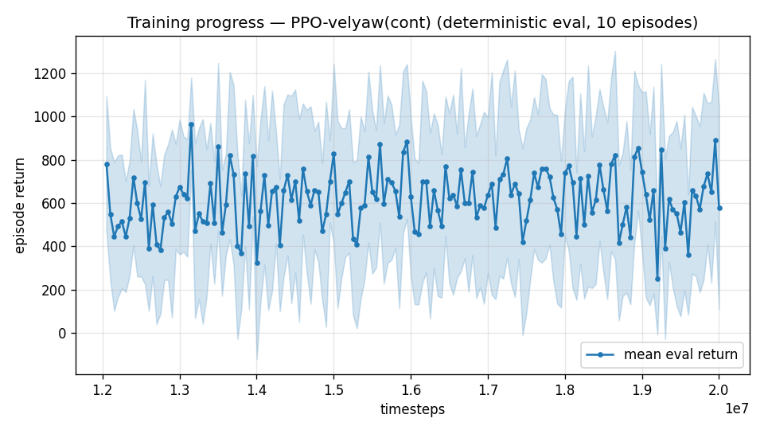

# Trial 12 — LOOP iter 6: narrow the coverage term (stop subsidizing loitering)

| | |
|---|---|
| run dir | `results_velyaw_xw16` (continues `results_velyaw_xw15`, 12M → 20M) |
| date | 2026-07-29 |
| loop goal | velocity error **< 1 m/s** (real benchmark: wind 0–15) |
| baseline | xw15: **5.55 m/s / 5.6°** (hover 1.28 / low 2.71 / mid 5.72 / high 9.56) |
| changes | **coverage Gaussian width 12.5 → 5 m/s** (`cov_width=5`); everything else unchanged |
| status | **IN PROGRESS** — auto-analyzed + auto-logged on completion |

## Hypothesis (iteration 6) — the third reward-subsidy trap
xw15 traces: on demanding targets the policy loiters at low tilt with ~9.5 m/s error forever.
Per-step accounting at d=9.5 with the legacy width (12.5): coverage pays 0.75 (75%!), the yaw
gate stays 0.80 open, and the total mid-range velocity gradient is ~0.05/m/s — a risky
multi-second transition maneuver cannot compete. Same trap class as the dive optimum (trial
04) and the yaw-vs-alignment conflict (trial 08): a reward term paying generously inside the
failure regime. Narrowing the coverage to 5 m/s:
```
   d     coverage 12.5 -> 5     yaw gate 12.5 -> 5
  3.0        0.97 -> 0.84          0.98 -> 0.87
  5.0        0.92 -> 0.61          0.94 -> 0.69
  9.5        0.75 -> 0.16          0.80 -> 0.33
 15.0        0.49 -> 0.01          0.59 -> 0.21
```
Mid-range gradient ≈3× (Gaussian inflection now at d=5); loitering at 9.5 stops paying on both
the velocity and yaw channels. Far field still guided by the linear term + sharp/precision
peaks unchanged.

## Exact code changes
### `rate_vel_aviary.py` (ADDED)
```python
                 cov_width: float = 0.0,           # wide-coverage Gaussian width (m/s); 0 = legacy
                 #                                   10*(MAX_SPEED/20). 12.5 pays 75% at 9.5 m/s err
                 #                                   -> subsidizes not transitioning; ~5 fixes that
```
```python
        self.COV_WIDTH = float(cov_width)
```
`_computeReward` (CHANGED):
```python
# BEFORE:
        cov = np.exp(-0.5 * (d / (10.0 * s)) ** 2)             # wide velocity coverage
# AFTER:
        W = self.COV_WIDTH if self.COV_WIDTH > 0.0 else 10.0 * s
        cov = np.exp(-0.5 * (d / W) ** 2)                      # wide velocity coverage
```
### `train.py` / `continue_train.py` / `eval_velyaw.py` (ADDED — flag/override + passthrough)
```python
    ap.add_argument("--cov-width", type=float, default=0.0, ...)      # train.py
    ap.add_argument("--cov-width", type=float, default=None, ...)     # continue_train.py
    if args.cov_width is not None: cfg["cov_width"] = args.cov_width  # reward-only: safe on resume
              cov_width=cfg.get("cov_width", 0.0),                    # env kwargs, all three
```

## Command
```bash
python continue_train.py --src results_velyaw_xw15 --out results_velyaw_xw16 \
                         --extra 8000000 --n-envs 10 --lr 3e-4 --cov-width 5
# auto: analyze_velyaw.py --dir results_velyaw_xw16 && log_trial.py
```

## Decision criteria (vs xw15's 5.55)
- < 1.0 → SUCCESS.
- ≤ 4.0 → trap confirmed broken → next rung: LR-decay polish + precision sharpening.
- ~5 → coverage wasn't the binding subsidy; next suspects: high-band target oversampling,
  heading-frame obs (fresh), episode length (8 s may be too short to finish transition+settle).
- regression / instability → the narrower coverage starved the far field; retry width 7.

---

## AUTO-CAPTURED RESULTS (2026-07-29 19:34)

**config**: `{"max_speed": 25.0, "wind_max": 15.0, "use_integral": true, "use_yaw_integral": true, "use_wind_est": true, "yaw_width": 0.35, "yaw_weight": 1.0, "yaw_bias": 0.3, "heading_frame": false, "xwing_aero": true, "tough_init": 0.0, "wind_curriculum": false, "yaw_gate": true, "yaw_gate_floor": 0.2, "vel_precision": 0.7, "yaw_att_gate": true, "ent_coef": 0.003, "cov_width": 5.0}`

**eval curve**: n=160, first 781, best 966 @ 13,151,280, last 577 (final steps 20,001,280)

**late trend**: DECLINING (last-10% mean 612 vs prior-10% 626)





### Physical eval
```
=== PHYSICAL EVAL (level start, full wind) ===

band           n  vel err (m/s)  yaw err (deg)
----------------------------------------------
hover(0-1)     1           1.34            2.0
low(1-10)     45           2.27            1.9
mid(10-18)    43           5.44            4.8
high(18-25)   31          10.16            8.4
----------------------------------------------
ALL          120           5.44            4.6   crash 0.0%
```


### Dive-recovery test
```
=== DIVE-RECOVERY TEST (60 episodes, all starting in failure states) ===
  recovered (final-2s vel err < 8 m/s):  12/60 = 20%
  partial   (8-15 m/s):                  3/60 = 5%
  median final err: 39.8 m/s   mean: 39.4 m/s
```


### Behavior traces
```
--- trace seed 1005: target [11.9  5.2  0.3] (|v|=13.0), wind [ -3.6 -11.6  -3.1] ---
  t= 0.0 |v|=  0.1 vz=   0.0 tilt=   0 verr= 13.0 yawerr=+103.5 fins=( +9.0,-10.5) thr=-0.15
  t= 2.0 |v|=  4.8 vz=   1.1 tilt=  23 verr= 11.5 yawerr= -34.8 fins=( +4.0, -6.4) thr=-0.59
  t= 4.0 |v|=  7.2 vz=  -2.5 tilt=  51 verr= 14.2 yawerr= +26.6 fins=( +7.5,-20.0) thr=-0.34
  t= 6.0 |v|= 15.2 vz=  -2.6 tilt=  44 verr= 13.2 yawerr=  +9.8 fins=( -9.6,-15.1) thr=+0.02
  t= 8.0 |v|=  9.6 vz=   0.5 tilt=  26 verr= 12.0 yawerr=  +4.9 fins=(+18.4, -6.8) thr=-0.42
--- trace seed 1012: target [  6.3 -16.6   1.4] (|v|=17.8), wind [-0.3  4.1 -6.1] ---
  t= 0.0 |v|=  0.0 vz=   0.0 tilt=   0 verr= 17.8 yawerr= +46.7 fins=(+10.1, -8.9) thr=-1.00
  t= 2.0 |v|=  4.2 vz=   1.8 tilt=  25 verr= 14.0 yawerr= -28.1 fins=(-10.2,-13.6) thr=-1.00
  t= 4.0 |v|=  4.9 vz=   2.6 tilt=  15 verr= 13.8 yawerr=  -6.0 fins=(-18.8,-15.4) thr=-0.93
  t= 6.0 |v|=  5.9 vz=   3.7 tilt=  26 verr= 13.5 yawerr=  -1.1 fins=( -0.6,-16.2) thr=-1.00
  t= 8.0 |v|=  6.2 vz=   4.1 tilt=  19 verr= 13.4 yawerr=  -1.1 fins=( -9.5,-16.3) thr=-1.00
--- trace seed 1020: target [-9.8 11.   0.9] (|v|=14.8), wind [-0.3 -1.2 -0.6] ---
  t= 0.0 |v|=  0.0 vz=   0.0 tilt=   0 verr= 14.8 yawerr= -65.7 fins=( -9.7,-10.3) thr=+1.00
  t= 2.0 |v|= 10.1 vz=   6.2 tilt=  35 verr=  8.6 yawerr= +12.9 fins=(-19.7,-20.0) thr=-1.00
  t= 4.0 |v|= 11.8 vz=   1.7 tilt=  27 verr=  3.3 yawerr=  +1.1 fins=(-19.9,-20.0) thr=-0.73
  t= 6.0 |v|= 10.5 vz=   0.1 tilt=  23 verr=  4.3 yawerr=  +3.9 fins=(-19.4,-20.0) thr=-0.38
  t= 8.0 |v|= 10.0 vz=  -0.4 tilt=  24 verr=  5.0 yawerr=  +4.8 fins=(-19.9,-20.0) thr=-0.10
```

---

## VERDICT (final 20M, vs interim 13.15M best)
| band | xw15 | xw16 interim (13.15M) | **xw16 final (20M)** |
|---|---|---|---|
| hover | 1.28 | — | 1.34 |
| low | 2.71 | 2.44 | **2.27** |
| mid | 5.72 | 5.74 | **5.44** |
| high | 9.56 | 9.26 | 10.16 |
| ALL | 5.55 | 5.40 | **5.44** / 4.6° |

1. Narrowing the coverage bought a real but small gain (5.55 → ~5.4), concentrated in the
   low/mid bands; the extra 4.4M steps past the early best added nothing (matches the flat
   curve the user spotted). **Reward-shaping rungs are exhausted** — six consecutive
   small-gain-then-plateau outcomes.
2. Side effect: dive recovery eroded to 20%+5% (with coverage ≈ 0 at 40 m/s error, deep-dive
   states now carry almost no gradient and the gate-only recipe has no tough-init exposure).
   Not the velocity mandate, but worth restoring later (small tough-init or a recovery floor).
3. The structural bet is already in flight: **trial 13 (xw17), γ 0.997 + 14 s episodes** —
   repricing the 3 s transition investment that every diagnosis finds at the bottom.

Best velocity policy so far: xw16 best checkpoint (**5.40–5.44 m/s / ~5°**).
