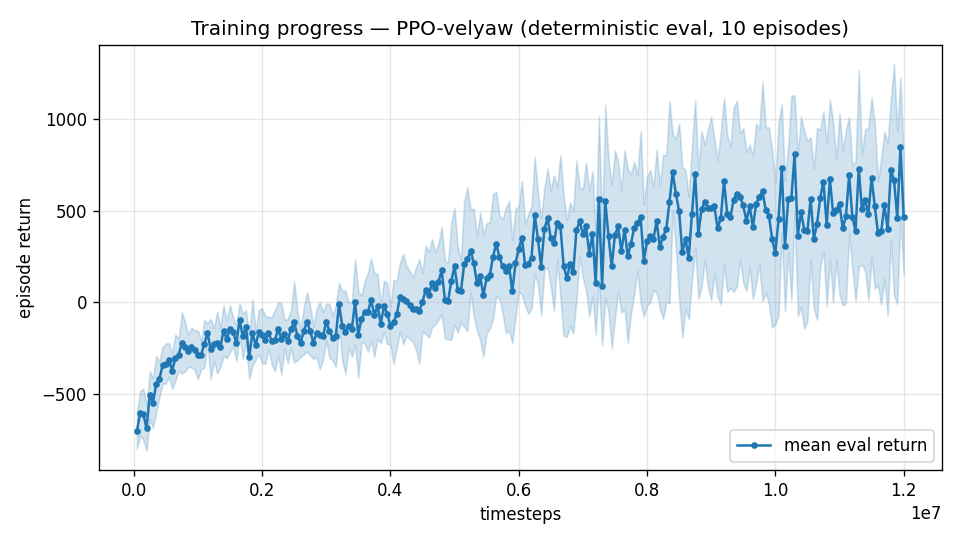

# Trial 13 — LOOP iter 7: transition economics (γ 0.997 + 14 s episodes)

| | |
|---|---|
| run dir | `results_velyaw_xw17` (FRESH) |
| date | 2026-07-29 |
| loop goal | velocity error **< 1 m/s** (real benchmark: wind 0–15, eval protocol unchanged) |
| baseline | xw16 best-checkpoint interim: **5.40 m/s / 5.2°** (low 2.44 / mid 5.74 / high 9.26) |
| changes | **γ 0.99 → 0.997** (PPO + VecNormalize return-norm); **training episodes 8 → 14 s**; net back to 256×256 (capacity ruled out, 2× faster); reward = full stack incl. cov_width 5 |
| status | **IN PROGRESS** — auto-analyzed + auto-logged on completion |

## Hypothesis (iteration 7) — structural, not another reward tweak
Six iterations of reward surgery each bought ~0.2–0.3 m/s and re-plateaued at a loitering
equilibrium. The remaining common factor is the **economics of the transition maneuver**:
- γ=0.99 at 50 Hz ⇒ effective value horizon ≈ **2 s**. A wing-borne transition costs ~3 s of
  degraded reward before it pays — **the payoff lies beyond the critic's horizon**, so the
  policy can literally never see that transitioning is worth it. γ=0.997 ⇒ horizon ≈ 6.7 s.
- 8 s episodes leave ≤ 4–5 s of payoff after a transition; 14 s triples the harvest window.
Both changes directly reprice "invest 3 s in a transition" vs "loiter" — the trade every
diagnosis since trial 08 keeps finding at the bottom.

## Exact code changes (`train.py`)
```python
    ap.add_argument("--gamma", type=float, default=0.99,
                    help="discount; 0.99@50Hz = ~2s horizon, too short to value a 3s transition")
    ap.add_argument("--episode-len", type=float, default=8.0,
                    help="TRAINING episode length (s); longer amortizes the transition cost")
# base_kwargs: episode_len_sec=8.0 -> episode_len_sec=args.episode_len
# PPO(...):    gamma=0.99 -> gamma=args.gamma
# VecNormalize return normalization now uses the same gamma:
def norm_env(n_envs, seed, subproc, norm_reward, training, env_kwargs, norm_gamma=0.99):
    env = VecNormalize(venv, norm_obs=True, norm_reward=norm_reward,
                       clip_obs=10.0, gamma=norm_gamma, training=training)
# config.json: + "gamma", "episode_len"
```
(Physical eval protocol unchanged: 10 s episodes, steady window 3 s, wind 0–15.)

## Command
```bash
python train.py --xwing-aero --yaw-bias 0.3 --max-speed 25 --wind-max 15 \
                --yaw-gate --yaw-att-gate --vel-precision 0.7 --cov-width 5 \
                --ent-coef 0.003 --gamma 0.997 --episode-len 14 \
                --net 256,256 --n-envs 10 --timesteps 12000000 --device cpu \
                --out-dir results_velyaw_xw17
# auto: analyze_velyaw.py --dir results_velyaw_xw17 && log_trial.py
```
Runs in parallel with xw16's final 2.4M (whose completed eval doubles as the cov-width-only
data point at 20M).

## Decision criteria (vs 5.40)
- < 1.0 → SUCCESS.
- ≤ 3.5 → economics confirmed → polish rungs (LR decay, precision 0.3, longer training).
- ~5 → economics not binding either → escalation review with user: remaining levers are
  high-band-only specialist training, heading-frame obs, or accepting a revised target; the
  systematic floor may be the 15 m/s wind DR itself (train/eval variance across wind draws).
- Watch: γ=0.997 + 14 s episodes can destabilize PPO value learning (larger returns) —
  VecNormalize return-norm now matched to γ mitigates; if curves diverge early, retry γ=0.995.

---

## AUTO-CAPTURED RESULTS (2026-07-29 21:20)

**config**: `{"max_speed": 25.0, "wind_max": 15.0, "use_integral": true, "use_yaw_integral": true, "use_wind_est": true, "yaw_width": 0.35, "yaw_weight": 1.0, "yaw_bias": 0.3, "heading_frame": false, "xwing_aero": true, "tough_init": 0.0, "wind_curriculum": false, "yaw_gate": true, "yaw_gate_floor": 0.2, "vel_precision": 0.7, "yaw_att_gate": true, "cov_width": 5.0, "ent_coef": 0.003, "gamma": 0.997, "episode_len": 14.0}`

**eval curve**: n=240, first -701, best 846 @ 11,950,000, last 467 (final steps 12,000,000)

**late trend**: still rising (last-10% mean 539 vs prior-10% 490)





### Physical eval
```
=== PHYSICAL EVAL (level start, full wind) ===

band           n  vel err (m/s)  yaw err (deg)
----------------------------------------------
hover(0-1)     1           1.56           12.1
low(1-10)     45           3.16           49.7
mid(10-18)    43           5.14           57.8
high(18-25)   31           8.58           61.4
----------------------------------------------
ALL          120           5.26           55.3   crash 0.0%
```


### Dive-recovery test
```
=== DIVE-RECOVERY TEST (60 episodes, all starting in failure states) ===
  recovered (final-2s vel err < 8 m/s):  34/60 = 57%
  partial   (8-15 m/s):                  14/60 = 23%
  median final err: 6.8 m/s   mean: 12.0 m/s
```


### Behavior traces
```
--- trace seed 1005: target [11.9  5.2  0.3] (|v|=13.0), wind [ -3.6 -11.6  -3.1] ---
  t= 0.0 |v|=  0.1 vz=   0.0 tilt=   0 verr= 13.0 yawerr=+103.5 fins=( +0.3, -4.5) thr=+1.00
  t= 2.0 |v|= 11.0 vz=   2.6 tilt= 104 verr= 20.2 yawerr=+122.9 fins=(-18.0,-20.0) thr=-1.00
  t= 4.0 |v|= 11.1 vz=  -9.2 tilt=  46 verr= 18.8 yawerr= -15.6 fins=(+11.0,+10.2) thr=+0.49
  t= 6.0 |v|=  5.8 vz=  -0.8 tilt=   9 verr= 11.6 yawerr=-126.9 fins=( +1.3, +8.6) thr=+0.97
  t= 8.0 |v|= 12.1 vz=   7.2 tilt=  42 verr=  8.8 yawerr=  +9.3 fins=(+18.5, -4.4) thr=-0.98
--- trace seed 1012: target [  6.3 -16.6   1.4] (|v|=17.8), wind [-0.3  4.1 -6.1] ---
  t= 0.0 |v|=  0.0 vz=   0.0 tilt=   0 verr= 17.8 yawerr= +46.7 fins=( +2.9, +9.8) thr=+0.83
  t= 2.0 |v|=  4.5 vz=   2.7 tilt=  28 verr= 14.3 yawerr= -82.2 fins=(+20.0,-18.2) thr=-1.00
  t= 4.0 |v|= 11.3 vz=   1.6 tilt=  49 verr=  7.2 yawerr=-101.3 fins=( +9.6, -7.6) thr=-0.17
  t= 6.0 |v|= 14.1 vz=   2.9 tilt=  31 verr=  4.3 yawerr= -93.6 fins=(+12.3,-18.2) thr=-1.00
  t= 8.0 |v|= 17.0 vz=   3.9 tilt=  27 verr=  3.0 yawerr= -96.5 fins=(+20.0,-14.9) thr=-0.73
--- trace seed 1020: target [-9.8 11.   0.9] (|v|=14.8), wind [-0.3 -1.2 -0.6] ---
  t= 0.0 |v|=  0.0 vz=   0.0 tilt=   0 verr= 14.8 yawerr= -65.7 fins=( -5.4, -3.2) thr=+1.00
  t= 2.0 |v|= 12.0 vz=   5.0 tilt=  25 verr=  7.5 yawerr= +90.4 fins=(+20.0, -9.4) thr=-0.07
  t= 4.0 |v|=  7.6 vz=   5.2 tilt=  29 verr= 10.1 yawerr= +52.0 fins=(+17.6,+12.4) thr=-0.15
  t= 6.0 |v|= 11.8 vz=   0.4 tilt=  25 verr=  4.2 yawerr=+179.7 fins=(+20.0,-20.0) thr=+0.06
  t= 8.0 |v|= 15.0 vz=   4.2 tilt=  57 verr=  3.7 yawerr= +41.2 fins=(+19.4, +1.9) thr=-1.00
```

---

## VERDICT (mixed: mechanisms confirmed, magnitude insufficient, yaw collapsed)
| | xw16 | xw17 |
|---|---|---|
| high | 10.16 | **8.58** (best ever) |
| mid | 5.44 | **5.14** (best ever) |
| low | 2.27 | 3.16 |
| ALL | 5.44 | **5.26** (new best) |
| recovery | 20%+5% | **57%+23%** (best ever) |
| yaw | 4.6° | **55.3°** — COLLAPSED |

1. The economics hypothesis was *directionally right*: the two regimes it targeted (high-band
   transitions, dive recovery) both improved to their best values. But the total gain (0.18)
   keeps the ~5 m/s floor intact → per pre-registered criteria, escalation review triggered.
2. **Yaw collapse**: at γ=0.997 the discounted velocity stream dwarfs the doubly-gated yaw
   term; the policy abandoned heading everywhere (55° even in the low band). Fix when velocity
   is settled: raise yaw_weight ~3-4× under long horizon, or scale gates.
3. Eval curve still rising at cutoff (best 846 @11.95M) → continuation (xw17b) launched as the
   cheap next data point while the escalation review is with the user.
