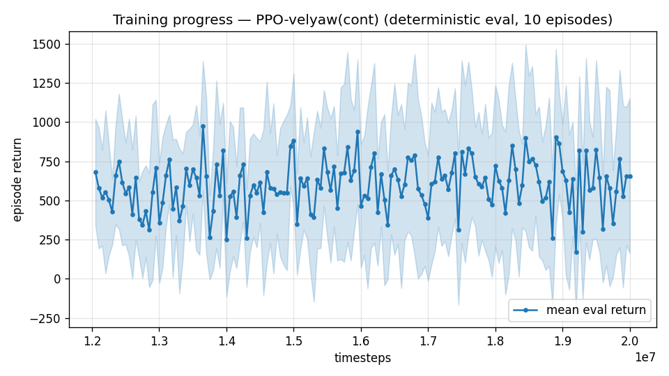

# Trial 14 — LOOP iter 8: continue xw17 (+8M; curve unsaturated)

| | |
|---|---|
| run dir | `results_velyaw_xw17b` (continues `results_velyaw_xw17`, 12M → 20M) |
| date | 2026-07-29 |
| baseline | xw17: 5.26 m/s / 55° (high 8.58, recovery 57%) — eval curve still rising at cutoff |
| changes | **none** — pure continuation (γ/episode-len/reward identical); cheapest honest lever while the escalation review is with the user |
| status | IN PROGRESS — auto-analyzed + auto-logged |

## Command
```bash
python continue_train.py --src results_velyaw_xw17 --out results_velyaw_xw17b \
                         --extra 8000000 --n-envs 10 --episode-len 14
# auto: analyze_velyaw.py && log_trial.py
```
Note: continue_train's VecNormalize return-norm gamma is 0.99 while the model resumes at
γ=0.997 — acceptable mismatch for a continuation (return scaling only), logged for honesty.

## Decision criteria
- < 1.0 → SUCCESS. | ≤ 4.3 → keep climbing this thread. | ~5 → thread exhausted; escalation
  options (specialist probe / heading-frame / target revision) become the only path.

---

## AUTO-CAPTURED RESULTS (2026-07-29 23:38)

**config**: `{"max_speed": 25.0, "wind_max": 15.0, "use_integral": true, "use_yaw_integral": true, "use_wind_est": true, "yaw_width": 0.35, "yaw_weight": 1.0, "yaw_bias": 0.3, "heading_frame": false, "xwing_aero": true, "tough_init": 0.0, "wind_curriculum": false, "yaw_gate": true, "yaw_gate_floor": 0.2, "vel_precision": 0.7, "yaw_att_gate": true, "cov_width": 5.0, "ent_coef": 0.003, "gamma": 0.997, "episode_len": 14.0}`

**eval curve**: n=160, first 680, best 977 @ 13,651,280, last 656 (final steps 20,001,280)

**late trend**: DECLINING (last-10% mean 601 vs prior-10% 623)





### Physical eval
```
=== PHYSICAL EVAL (level start, full wind) ===

band           n  vel err (m/s)  yaw err (deg)
----------------------------------------------
hover(0-1)     1           1.32            2.9
low(1-10)     45           3.11           54.0
mid(10-18)    43           6.33           69.4
high(18-25)   31          10.82           65.5
----------------------------------------------
ALL          120           6.24           62.1   crash 0.0%
```


### Dive-recovery test
```
=== DIVE-RECOVERY TEST (60 episodes, all starting in failure states) ===
  recovered (final-2s vel err < 8 m/s):  25/60 = 42%
  partial   (8-15 m/s):                  12/60 = 20%
  median final err: 10.0 m/s   mean: 17.2 m/s
```


### Behavior traces
```
--- trace seed 1005: target [11.9  5.2  0.3] (|v|=13.0), wind [ -3.6 -11.6  -3.1] ---
  t= 0.0 |v|=  0.1 vz=   0.0 tilt=   0 verr= 13.0 yawerr=+103.5 fins=( -5.1, -4.0) thr=+1.00
  t= 2.0 |v|= 10.2 vz= -10.0 tilt= 136 verr= 15.8 yawerr= +82.6 fins=(-18.0,-20.0) thr=-0.80
  t= 4.0 |v|= 16.8 vz= -16.0 tilt= 152 verr= 23.4 yawerr=-138.9 fins=(-18.0,-20.0) thr=+0.94
  t= 6.0 |v|= 17.4 vz= -11.6 tilt=  57 verr= 27.3 yawerr= +17.5 fins=( +6.1,-15.2) thr=+1.00
  t= 8.0 |v|= 16.8 vz= -14.5 tilt=  22 verr= 25.8 yawerr=-178.5 fins=( +1.9,+20.0) thr=+1.00
--- trace seed 1012: target [  6.3 -16.6   1.4] (|v|=17.8), wind [-0.3  4.1 -6.1] ---
  t= 0.0 |v|=  0.0 vz=   0.0 tilt=   0 verr= 17.8 yawerr= +46.7 fins=( -2.5, +9.8) thr=+0.38
  t= 2.0 |v|=  5.1 vz=   0.9 tilt=  53 verr= 18.8 yawerr=-170.8 fins=(+10.7,+18.0) thr=-0.58
  t= 4.0 |v|=  9.8 vz=   4.2 tilt=  53 verr=  9.5 yawerr= -99.4 fins=(+16.9, +5.2) thr=+0.33
  t= 6.0 |v|= 14.5 vz=   5.0 tilt=  33 verr=  5.6 yawerr= -75.7 fins=(+20.0,-14.4) thr=-1.00
  t= 8.0 |v|= 13.3 vz=   5.0 tilt=  32 verr=  6.7 yawerr= -97.2 fins=( +3.4,-18.2) thr=-1.00
--- trace seed 1020: target [-9.8 11.   0.9] (|v|=14.8), wind [-0.3 -1.2 -0.6] ---
  t= 0.0 |v|=  0.0 vz=   0.0 tilt=   0 verr= 14.8 yawerr= -65.7 fins=( -9.7, -2.8) thr=+1.00
  t= 2.0 |v|= 12.4 vz=   9.6 tilt=   5 verr= 11.5 yawerr= +68.7 fins=(+11.7, +1.4) thr=+0.23
  t= 4.0 |v|= 14.5 vz=   7.9 tilt=  25 verr=  7.4 yawerr=+145.7 fins=(+20.0, -1.1) thr=-0.95
  t= 6.0 |v|= 15.3 vz=   3.9 tilt=  79 verr=  3.1 yawerr=+131.7 fins=( +6.6,-20.0) thr=-0.69
  t= 8.0 |v|= 16.7 vz=   6.8 tilt=  64 verr=  7.4 yawerr=+161.7 fins=(+20.0,-20.0) thr=-0.86
```

---

## VERDICT: REGRESSED — the generalist track is closed
| | xw17 (12M) | xw17b (20M) |
|---|---|---|
| ALL | **5.26** | 6.24 |
| mid / high | 5.14 / 8.58 | 6.33 / 10.82 |
| recovery | 57%+23% | 42%+20% |

Eval peaked at 13.65M (early in the continuation) then drifted — the familiar
post-saturation regression. The xw17 12M best checkpoint stands as the overall best
(5.26 m/s). With this, the single-generalist paradigm is closed: 8 iterations, four
lineages, every mechanism ruled out, floor ~5.3. Everything now rides on the trial-15
feasibility probe (xw18).
