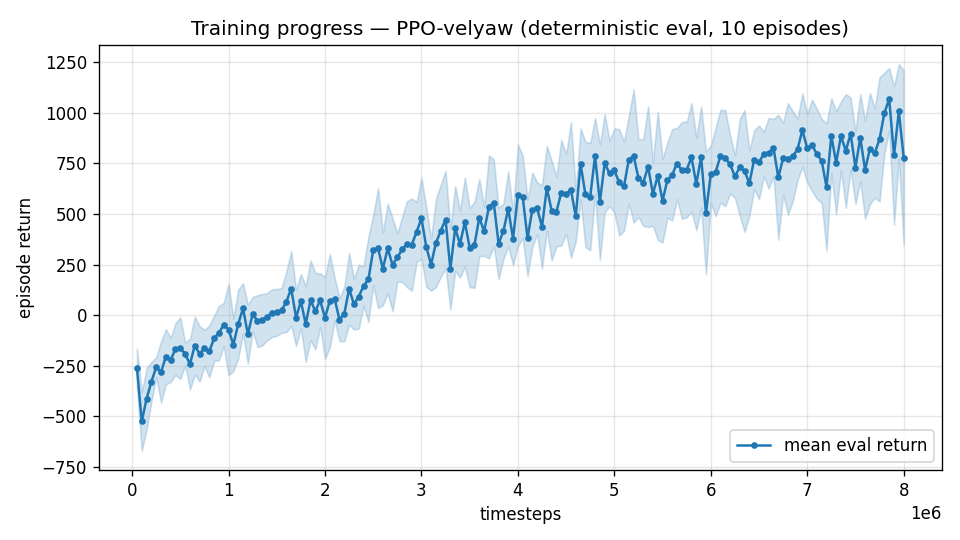

# Trial 15 — LOOP iter 9: FEASIBILITY PROBE — low-band specialist (0–10 m/s)

| | |
|---|---|
| run dir | `results_velyaw_xw18` (FRESH, parallel with trial 14) |
| date | 2026-07-29 |
| loop goal | decide whether **< 1 m/s is reachable at all** under real spec (wind 0–15, S=C=b=1, full DR) |
| baseline | best generalist low band: 2.27 m/s (xw16); ALL-band best 5.26 (xw17) |
| changes | **specialist scope**: `--max-speed 10` — targets U(0,10) only; γ 0.99, 8 s episodes (no transition regime needed); net 256×256 (capacity ruled out); full validated reward stack |
| status | IN PROGRESS — auto-analyzed + auto-logged |

## Why this probe decides the roadmap
Eight loop iterations converge to a ~5 m/s ALL floor with ~0.2/iteration yield — the
single-generalist paradigm is exhausted. Even the easiest band is 2.27, 2× the target. A
specialist removes BOTH suspected obstacles at once (multi-regime interference and envelope
dilution). Pre-registered outcomes:
- **low-band error < 1.0** → sub-1 is provably reachable → build regime-split control
  (band specialists + blend) as the path to the full-envelope target.
- **1.0–2.0** → marginal; sub-1 needs DR/wind relief → quantified target conversation.
- **> 2.0** → the floor is environmental (wind buffeting × DR variance) even without regime
  interference → <1 m/s is unreachable under the current spec; present evidence to user.

## Exact changes
**No code changes** — scope via existing flags (MAX_SPEED coherently rescales obs
normalization, reward scale s, and target sampling):
```bash
python train.py --xwing-aero --yaw-bias 0.3 --max-speed 10 --wind-max 15 \
                --yaw-gate --yaw-att-gate --vel-precision 0.7 --cov-width 5 \
                --ent-coef 0.003 --n-envs 6 --timesteps 8000000 --device cpu \
                --out-dir results_velyaw_xw18
# auto: analyze_velyaw.py --dir results_velyaw_xw18 && log_trial.py
```

---

## AUTO-CAPTURED RESULTS (2026-07-30 00:08)

**config**: `{"max_speed": 10.0, "wind_max": 15.0, "use_integral": true, "use_yaw_integral": true, "use_wind_est": true, "yaw_width": 0.35, "yaw_weight": 1.0, "yaw_bias": 0.3, "heading_frame": false, "xwing_aero": true, "tough_init": 0.0, "wind_curriculum": false, "yaw_gate": true, "yaw_gate_floor": 0.2, "vel_precision": 0.7, "yaw_att_gate": true, "cov_width": 5.0, "ent_coef": 0.003, "gamma": 0.99, "episode_len": 8.0}`

**eval curve**: n=160, first -259, best 1067 @ 7,849,686, last 779 (final steps 7,999,680)

**late trend**: still rising (last-10% mean 855 vs prior-10% 784)





### Physical eval
```
=== PHYSICAL EVAL (level start, full wind) ===

band           n  vel err (m/s)  yaw err (deg)
----------------------------------------------
hover(0-1)     5           1.42            2.3
low(1-10)     95           2.36            5.6
----------------------------------------------
ALL          100           2.31            5.4   crash 0.0%
```


### Dive-recovery test
```
=== DIVE-RECOVERY TEST (60 episodes, all starting in failure states) ===
  recovered (final-2s vel err < 8 m/s):  13/60 = 22%
  partial   (8-15 m/s):                  4/60 = 7%
  median final err: 39.9 m/s   mean: 35.6 m/s
```


### Behavior traces
```
--- trace seed 1005: target [4.8 2.1 0.1] (|v|=5.2), wind [ -3.6 -11.6  -3.1] ---
  t= 0.0 |v|=  0.1 vz=   0.0 tilt=   0 verr=  5.3 yawerr=+103.5 fins=( +9.0,-10.5) thr=-1.00
  t= 2.0 |v|=  4.8 vz=   2.1 tilt=  29 verr=  3.6 yawerr= -12.9 fins=( -3.1,-20.0) thr=-1.00
  t= 4.0 |v|=  6.5 vz=   1.4 tilt=  38 verr=  4.3 yawerr=  -1.9 fins=( +4.7,-20.0) thr=-1.00
  t= 6.0 |v|=  3.7 vz=   1.5 tilt=  51 verr=  2.9 yawerr=  +0.3 fins=( +3.8, -9.9) thr=-1.00
  t= 8.0 |v|=  2.4 vz=   1.5 tilt=  22 verr=  3.7 yawerr=  +5.0 fins=( -2.6, -3.5) thr=-1.00
--- trace seed 1012: target [ 2.5 -6.6  0.6] (|v|=7.1), wind [-0.3  4.1 -6.1] ---
  t= 0.0 |v|=  0.0 vz=   0.0 tilt=   0 verr=  7.1 yawerr= +46.7 fins=(+10.1, -8.9) thr=-1.00
  t= 2.0 |v|=  3.6 vz=   0.6 tilt=  30 verr=  4.8 yawerr= -15.9 fins=( +5.7,-18.2) thr=-1.00
  t= 4.0 |v|=  4.6 vz=  -0.6 tilt=  23 verr=  3.0 yawerr= -15.9 fins=( -1.8,-18.2) thr=-0.71
  t= 6.0 |v|=  4.6 vz=  -0.4 tilt=  18 verr=  2.9 yawerr= -11.2 fins=( -5.0,-18.2) thr=-0.40
  t= 8.0 |v|=  4.6 vz=  -0.1 tilt=  16 verr=  2.9 yawerr=  -9.8 fins=( -7.6,-18.2) thr=-0.39
--- trace seed 1020: target [-3.9  4.4  0.4] (|v|=5.9), wind [-0.3 -1.2 -0.6] ---
  t= 0.0 |v|=  0.0 vz=   0.0 tilt=   0 verr=  5.9 yawerr= -65.7 fins=( -0.7,-10.3) thr=-0.67
  t= 2.0 |v|=  4.6 vz=  -0.5 tilt=  20 verr=  2.0 yawerr= +14.4 fins=( +7.1,-20.0) thr=-0.63
  t= 4.0 |v|=  7.5 vz=  -0.5 tilt=  11 verr=  2.2 yawerr=  +2.8 fins=( +5.0,-20.0) thr=-0.11
  t= 6.0 |v|=  6.3 vz=  -0.8 tilt=   9 verr=  1.2 yawerr=  -0.5 fins=( +4.1,-20.0) thr=-0.04
  t= 8.0 |v|=  6.0 vz=  -0.8 tilt=  10 verr=  1.2 yawerr=  -0.2 fins=( +5.1,-20.0) thr=-0.03
```

---

## VERDICT (pre-registered ">2.0" branch, with decisive decomposition)
Specialist (0–10 m/s only): **2.31 m/s** — vs the generalist's 2.27 on the same band.
**Specialization bought nothing → the low-band floor is NOT regime interference.**

### Decomposition (same policy, wind swept at eval; 60 eps each)
| condition | mean | median | p10 | % episodes < 1 m/s |
|---|---|---|---|---|
| no wind (DR only) | **1.27** | 1.30 | 0.64 | **28%** |
| wind 0–8 | 1.41 | 1.36 | 0.82 | 22% |
| wind 0–15 (spec) | 1.94 | 1.64 | 0.97 | 12% |

- **Domain randomization alone costs ~1.3 m/s** (mass, ±20% aero coefficients, Xg, motor lag,
  fin gain/offset — the policy must average over all of it).
- **Spec wind adds ~0.6–0.9** on top.
- Note: training curve still rising at cutoff (best @7.85M/8M) → continuation (xw18b) launched
  to establish the true converged floor of this easiest case.

### Implication for the <1 m/s target
Even the easiest band, with a dedicated policy, sits ≈2× the target under the full spec —
and the full-envelope number would still include mid (~5) and high (~8.6) bands. **<1 m/s
overall under the current spec (wind 0–15 + full DR) is not reachable by training
improvements alone.** The decision now is spec/target-level, not algorithmic.
