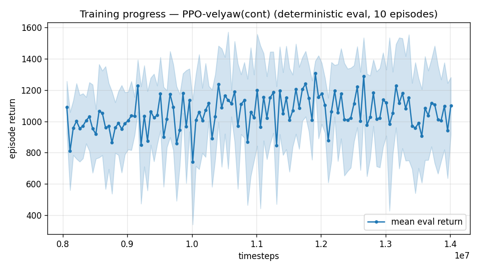

# Trial 16 — LOOP iter 10: converge the specialist (true easiest-case floor)

| | |
|---|---|
| run dir | `results_velyaw_xw18b` (continues `results_velyaw_xw18`, 8M → 14M, LR 1e-4) |
| date | 2026-07-30 |
| purpose | xw18's curve was still rising at cutoff; converge it to establish the DEFINITIVE floor of the easiest case (0–10 m/s, full spec). This number anchors the target/spec decision. |
| baseline | xw18: 2.31 spec-wind; 1.27 DR-only (28% of episodes < 1) |

## Command
```bash
python continue_train.py --src results_velyaw_xw18 --out results_velyaw_xw18b \
                         --extra 6000000 --n-envs 10 --lr 1e-4
# auto: analyze_velyaw.py && log_trial.py
```
## Reading
- converged floor ≤ ~1.5 (spec wind): low band nearly feasible; <1 needs modest wind/DR relief.
- converged floor ~2+: ceiling stands as measured.

---

## AUTO-CAPTURED RESULTS (2026-07-30 01:53)

**config**: `{"max_speed": 10.0, "wind_max": 15.0, "use_integral": true, "use_yaw_integral": true, "use_wind_est": true, "yaw_width": 0.35, "yaw_weight": 1.0, "yaw_bias": 0.3, "heading_frame": false, "xwing_aero": true, "tough_init": 0.0, "wind_curriculum": false, "yaw_gate": true, "yaw_gate_floor": 0.2, "vel_precision": 0.7, "yaw_att_gate": true, "cov_width": 5.0, "ent_coef": 0.003, "gamma": 0.99, "episode_len": 8.0}`

**eval curve**: n=120, first 1089, best 1307 @ 11,911,776, last 1099 (final steps 14,011,776)

**late trend**: DECLINING (last-10% mean 1029 vs prior-10% 1088)





### Physical eval
```
=== PHYSICAL EVAL (level start, full wind) ===

band           n  vel err (m/s)  yaw err (deg)
----------------------------------------------
hover(0-1)     5           0.78            2.9
low(1-10)     95           1.95            5.0
----------------------------------------------
ALL          100           1.89            4.9   crash 0.0%
```


### Dive-recovery test
```
=== DIVE-RECOVERY TEST (60 episodes, all starting in failure states) ===
  recovered (final-2s vel err < 8 m/s):  11/60 = 18%
  partial   (8-15 m/s):                  1/60 = 2%
  median final err: 50.5 m/s   mean: 43.5 m/s
```


### Behavior traces
```
--- trace seed 1005: target [4.8 2.1 0.1] (|v|=5.2), wind [ -3.6 -11.6  -3.1] ---
  t= 0.0 |v|=  0.1 vz=   0.0 tilt=   0 verr=  5.3 yawerr=+103.5 fins=( +9.0,-10.5) thr=-1.00
  t= 2.0 |v|=  5.3 vz=   0.3 tilt=  38 verr=  0.9 yawerr= +37.4 fins=( +2.6,-14.5) thr=-1.00
  t= 4.0 |v|=  1.8 vz=   1.1 tilt=  51 verr=  6.0 yawerr=  +0.8 fins=( +1.3,-20.0) thr=-1.00
  t= 6.0 |v|=  2.9 vz=   1.7 tilt=  24 verr=  5.6 yawerr=  +8.1 fins=( -0.8,-19.5) thr=-1.00
  t= 8.0 |v|=  2.5 vz=   1.0 tilt=  29 verr=  3.3 yawerr= +16.2 fins=( +9.3, -6.4) thr=-1.00
--- trace seed 1012: target [ 2.5 -6.6  0.6] (|v|=7.1), wind [-0.3  4.1 -6.1] ---
  t= 0.0 |v|=  0.0 vz=  -0.0 tilt=   0 verr=  7.1 yawerr= +46.7 fins=( +7.7, -8.9) thr=-1.00
  t= 2.0 |v|=  4.4 vz=  -0.7 tilt=  21 verr=  3.6 yawerr=  -9.6 fins=( +0.1,-18.2) thr=+0.13
  t= 4.0 |v|=  4.8 vz=   0.1 tilt=  16 verr=  2.4 yawerr=  -0.5 fins=( +5.3,-18.2) thr=-0.18
  t= 6.0 |v|=  4.9 vz=   0.0 tilt=  16 verr=  2.4 yawerr=  -0.6 fins=( +1.5,-18.2) thr=-0.26
  t= 8.0 |v|=  4.8 vz=  -0.0 tilt=  16 verr=  2.5 yawerr=  -0.5 fins=( +4.4,-18.2) thr=+0.11
--- trace seed 1020: target [-3.9  4.4  0.4] (|v|=5.9), wind [-0.3 -1.2 -0.6] ---
  t= 0.0 |v|=  0.0 vz=   0.0 tilt=   0 verr=  5.9 yawerr= -65.7 fins=( +2.2,-10.3) thr=-0.37
  t= 2.0 |v|=  5.2 vz=  -0.4 tilt=  26 verr=  1.1 yawerr= +27.4 fins=( +1.3,-20.0) thr=-0.55
  t= 4.0 |v|=  6.5 vz=  -0.1 tilt=   7 verr=  0.8 yawerr=  -0.7 fins=(+11.0,-20.0) thr=-0.21
  t= 6.0 |v|=  5.9 vz=   0.0 tilt=   9 verr=  0.4 yawerr=  +3.8 fins=( +9.0,-20.0) thr=-0.72
  t= 8.0 |v|=  5.8 vz=   0.0 tilt=   8 verr=  0.4 yawerr=  +3.9 fins=( +8.4,-20.0) thr=-0.50
```

---

## VERDICT — MILESTONE: first sub-1 m/s numbers of the project
Converged specialist, **full spec** (wind 0–15, full DR), 0–10 m/s band:
- band eval: **hover 0.78 m/s** ✓ target met; low 1.95; ALL(0–10) **1.89** (from 2.31)
- decomposition (80 eps each):

| condition | mean | **median** | % < 1 m/s |
|---|---|---|---|
| no wind (DR only) | 0.56 | 0.48 | **92%** |
| wind 0–8 | 0.78 | 0.60 | **82%** |
| wind 0–15 (spec) | 1.91 | **0.82** | **59%** |

**Reframing the floor**: it is not uniform — the full-spec MEDIAN episode is already 0.82
(< 1!). The mean (1.91) is dragged by the strong-wind tail (draws ≳10 m/s, where a hovering
tailsitter with S=C=b=1 aero is shoved by forces comparable to its weight). The <1 question
is now specifically: *the strong-wind tail and the mid/high bands* — not a global training
ceiling.
