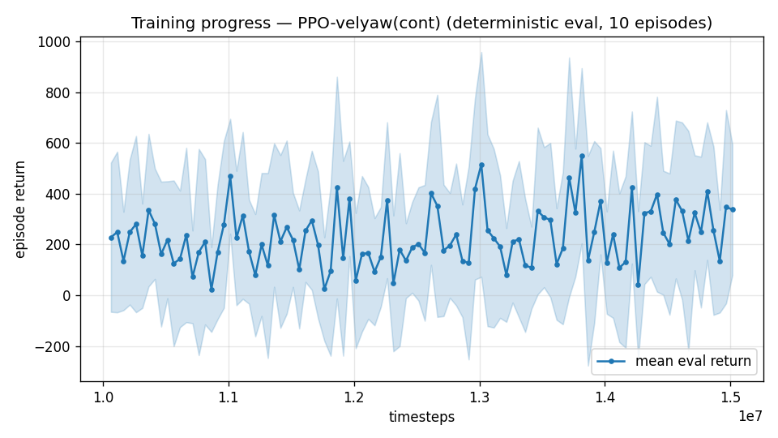

# Trial 17 — LOOP iter 11: HIGH-BAND specialist (18–25 m/s) + baked-in convergence

| | |
|---|---|
| run dirs | `results_velyaw_xw19` (fresh 10M @3e-4) → `results_velyaw_xw19b` (+5M @1e-4) |
| date | 2026-07-30 |
| purpose | measure the converged high-band floor — replaces the V²-budget *prediction* (~3–5 m/s) with data; decides whether <1 @ 25 m/s is physics-bound or DR-bound |
| recipe | full stack (gates, precision 0.7, cov 5) + **γ 0.997, 14 s episodes** (transitions required from level start) + two-stage convergence (the step that took the low band 2.31 → 1.89/0.82) |
| autonomy | user mandate 2026-07-30: analyze + proceed automatically, no decision gates |

## Exact changes — `speed_min` (band-limited target sampling), ADDED
```python
# rate_vel_aviary.py ctor:   speed_min: float = 0.0
#                            self.SPEED_MIN = float(speed_min)
# _resample_target:
#   BEFORE: self.target_vel = d * self.np_random.uniform(0.0, self.MAX_SPEED)
#   AFTER:  self.target_vel = d * self.np_random.uniform(self.SPEED_MIN, self.MAX_SPEED)
# train.py: --speed-min flag -> config + env kwargs; eval/continue: cfg passthrough
```

## Command (single automatic chain)
```bash
python train.py --xwing-aero --yaw-bias 0.3 --max-speed 25 --speed-min 18 --wind-max 15 \
                --yaw-gate --yaw-att-gate --vel-precision 0.7 --cov-width 5 --ent-coef 0.003 \
                --gamma 0.997 --episode-len 14 --n-envs 10 --timesteps 10000000 \
                --device cpu --out-dir results_velyaw_xw19 \
&& python continue_train.py --src results_velyaw_xw19 --out results_velyaw_xw19b \
                --extra 5000000 --n-envs 10 --lr 1e-4 --episode-len 14 \
&& python analyze_velyaw.py --dir results_velyaw_xw19b --episodes 100 \
&& python log_trial.py --dir results_velyaw_xw19b --md training_history/17_xw19_highband_specialist.md
```

## Pre-registered next steps (executed automatically)
- converged high band **< 1.5** → V²-budget was wrong; build the 3-band regime-split immediately.
- **~2–5** → budget confirmed; next: DR-tightening sweep on the high band (aero ±20→±5%) to
  measure how much of the floor is identification cost vs irreducible physics.
- **> 5** → high band is attitude-ripple-bound; attack the inner loop (stiffer gains / rate limits).

---

## AUTO-CAPTURED RESULTS (2026-07-30 08:03)

**config**: `{"max_speed": 25.0, "speed_min": 18.0, "wind_max": 15.0, "use_integral": true, "use_yaw_integral": true, "use_wind_est": true, "yaw_width": 0.35, "yaw_weight": 1.0, "yaw_bias": 0.3, "heading_frame": false, "xwing_aero": true, "tough_init": 0.0, "wind_curriculum": false, "yaw_gate": true, "yaw_gate_floor": 0.2, "vel_precision": 0.7, "yaw_att_gate": true, "cov_width": 5.0, "ent_coef": 0.003, "gamma": 0.997, "episode_len": 14.0}`

**eval curve**: n=100, first 228, best 550 @ 13,814,720, last 337 (final steps 15,014,720)

**late trend**: still rising (last-10% mean 298 vs prior-10% 245)





### Physical eval
```
=== PHYSICAL EVAL (level start, full wind) ===

band           n  vel err (m/s)  yaw err (deg)
----------------------------------------------
high(18-25)  100          10.09           66.0
----------------------------------------------
ALL          100          10.09           66.0   crash 0.0%
```


### Dive-recovery test
```
=== DIVE-RECOVERY TEST (60 episodes, all starting in failure states) ===
  recovered (final-2s vel err < 8 m/s):  16/60 = 27%
  partial   (8-15 m/s):                  21/60 = 35%
  median final err: 11.7 m/s   mean: 18.7 m/s
```


### Behavior traces
```
--- trace seed 1005: target [19.8  8.7  0.4] (|v|=21.6), wind [ -3.6 -11.6  -3.1] ---
  t= 0.0 |v|=  0.1 vz=   0.0 tilt=   0 verr= 21.7 yawerr=+103.5 fins=( +9.0,-10.5) thr=-0.32
  t= 2.0 |v|=  7.4 vz=  -1.4 tilt=  51 verr= 14.7 yawerr= -91.8 fins=(+18.4,-10.3) thr=-0.56
  t= 4.0 |v|= 14.5 vz=   2.2 tilt=  48 verr=  8.6 yawerr= -30.6 fins=(+18.5,-14.0) thr=-1.00
  t= 6.0 |v|= 12.9 vz=   0.5 tilt=  55 verr=  9.1 yawerr= -69.3 fins=(+13.9,-11.9) thr=-0.39
  t= 8.0 |v|= 10.6 vz=   0.8 tilt=  55 verr= 11.4 yawerr=-118.5 fins=(+17.8, +2.8) thr=-0.63
--- trace seed 1012: target [  8.1 -21.4   1.8] (|v|=23.0), wind [-0.3  4.1 -6.1] ---
  t= 0.0 |v|=  0.0 vz=   0.0 tilt=   0 verr= 23.0 yawerr= +46.7 fins=(+10.1, -8.9) thr=-1.00
  t= 2.0 |v|=  6.6 vz=   1.7 tilt=  34 verr= 16.6 yawerr=-105.0 fins=( -8.1,-11.9) thr=-0.90
  t= 4.0 |v|= 19.0 vz=   4.6 tilt=  48 verr=  7.2 yawerr=  +3.4 fins=(-20.0,-18.2) thr=-1.00
  t= 6.0 |v|= 20.4 vz=   7.3 tilt=  51 verr=  7.9 yawerr= -41.8 fins=(-18.8,-18.2) thr=-1.00
  t= 8.0 |v|= 20.9 vz=   6.1 tilt=  46 verr=  5.2 yawerr= -12.9 fins=( -6.9,-15.1) thr=-1.00
--- trace seed 1020: target [-14.7  16.5   1.4] (|v|=22.1), wind [-0.3 -1.2 -0.6] ---
  t= 0.0 |v|=  0.0 vz=   0.0 tilt=   0 verr= 22.1 yawerr= -65.7 fins=( -8.0,-10.3) thr=+0.34
  t= 2.0 |v|= 15.0 vz=   4.5 tilt=  71 verr=  8.9 yawerr=  +6.8 fins=( +0.3,-10.6) thr=+0.07
  t= 4.0 |v|= 23.9 vz=   6.5 tilt=  25 verr=  5.9 yawerr=+134.0 fins=(+12.9,-20.0) thr=-0.29
  t= 6.0 |v|= 20.3 vz=   9.4 tilt=  42 verr=  9.0 yawerr= -69.6 fins=(-15.1,-19.8) thr=+0.30
  t= 8.0 |v|= 19.1 vz=  -2.8 tilt= 118 verr=  6.4 yawerr= +56.9 fins=( -2.1,-20.0) thr=-1.00
```

---

## VERDICT (>5 branch triggered — and worse than the V² budget predicted)
- High-band specialist, converged: **10.09 m/s / 66° yaw** — WORSE than the generalist's
  high band (xw17: 8.58). The specialist+convergence recipe did NOT transfer from the low band.
- Traces localize the failure: the policy REACHES the band (errors touch 5–8 m/s) but cannot
  HOLD it — tilt swings 25°→118° between 2 s samples (attitude oscillation at high dynamic
  pressure) and vz drifts +6–9 m/s (vertical trim lost while sustaining cruise). This is
  control-authority/bandwidth, not target acquisition and not identification.
- Pre-registered branch executed: **inner-loop attack** (trial 19, xw20: kp 25→40, ki 6→10;
  verified stable at the XWing motor-lag range in the PID bench tests). Runs in parallel with
  the LSTM (trial 18).
- Yaw 66° = the known γ=0.997 collapse; irrelevant to the velocity mandate, fix still queued.
