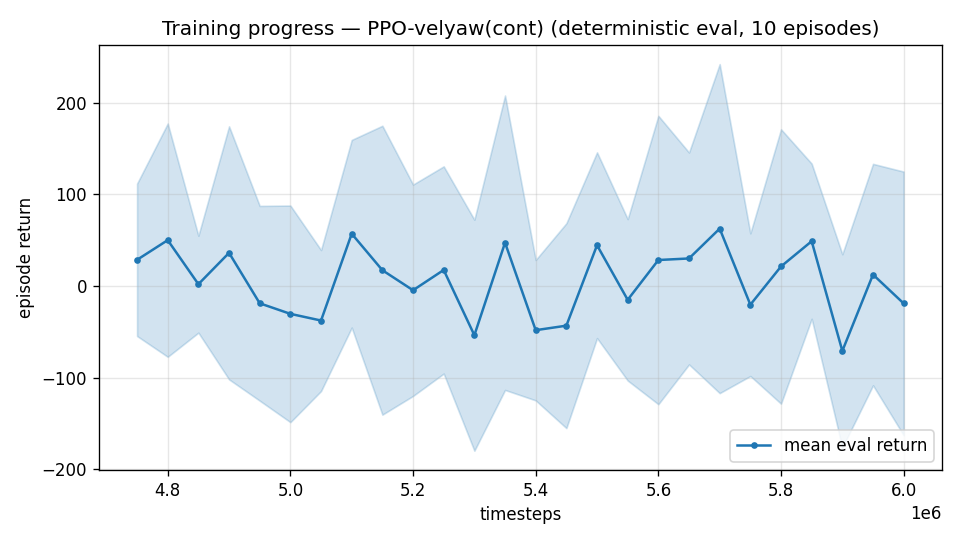

# Trial 18 — QUEUED: RecurrentPPO (LSTM) full-envelope generalist

| | |
|---|---|
| run dir | `results_velyaw_lstm` |
| queued behind | trial 17 (high-band chain); starts automatically when it completes |
| date queued | 2026-07-30 |
| question (user) | can ONE model cover 0–25 m/s AND handle the ±20% aero DR? |
| hypothesis | the LSTM performs implicit per-episode system-ID (infers THIS aircraft's coefficients from its response to actions, then adapts) — directly attacks the DR-identification term, the largest item in the V² error budget (±100–200 N at 40 m/s relative). Memory-study caveats apply: keep hand features (they helped even the LSTM), ~3× wall-clock. |
| baseline to beat | best full-envelope generalist: xw17 @12M = **5.26 m/s** |

## Exact changes
1. **`train_lstm.py` REBUILT** for the current env (old version targeted the deleted
   task API): mirrors train.py's full flag set + env kwargs; `RecurrentPPO("MlpLstmPolicy",
   n_steps=2048, batch_size=4096, net_arch=[256,256], lstm_hidden_size=256)`; γ/norm-γ wired;
   `config.json` gains `"algo": "recurrent_ppo"`.
2. **`eval_velyaw.py`** — LSTM support (exact code):
```python
class _Predictor:
    def __init__(self, model, recurrent):
        self.m = model; self.rec = recurrent; self.state = None; self.start = True
    def reset(self):
        self.state = None; self.start = True
    def predict(self, obs, deterministic=True):
        if self.rec:
            a, self.state = self.m.predict(obs, state=self.state,
                                           episode_start=np.array([self.start]),
                                           deterministic=deterministic)
            self.start = False
            return a, None
        return self.m.predict(obs, deterministic=deterministic)
# load(): algo=="recurrent_ppo" -> RecurrentPPO.load(...); returns _Predictor(model, recurrent)
# + fallback to ppo_ratevel_final.zip when best/ absent; model.reset() after every venv.reset()
#   (also added to analyze_velyaw's dive_recovery_test and traces loops)
```
3. Smoke-tested: 8k-step train + full eval path through the recurrent predictor. ✓

## Command (auto-queued)
```bash
python train_lstm.py --xwing-aero --yaw-bias 0.3 --max-speed 25 --wind-max 15 \
    --yaw-gate --yaw-att-gate --vel-precision 0.7 --cov-width 5 --ent-coef 0.003 \
    --gamma 0.997 --episode-len 14 --n-envs 10 --timesteps 10000000 \
    --out-dir results_velyaw_lstm
# auto: analyze_velyaw.py --dir results_velyaw_lstm && log_trial.py   (~8h at LSTM throughput)
```

## Decision criteria (auto)
- vs xw17's 5.26: **≤ 4.0** → identification value confirmed; next: LSTM + convergence stage,
  and consider LSTM band specialists. **≈ 5** → memory adds nothing over the hand features
  here (consistent with the old memory study); drop the LSTM branch. Also compare its
  DR-only decomposition vs xw18b's 0.56 — the cleanest read on identification value.

---

## INCIDENT (2026-07-30 ~09:03): run killed at 287k steps
No traceback — external kill (probable RAM pressure from RecurrentPPO's 14 s-episode BPTT
buffers, or session teardown). Measured throughput was also impractical: **84 fps** → 10M ≈
33 h. **Relaunched leaner**: `--n-steps 1024` (new flag; halves buffer), 8 envs, episode-len
10 s (shorter BPTT sequences), 6M steps (sufficient for the A/B signal vs xw17; can continue
if promising). γ 0.997 retained.
```bash
python train_lstm.py --xwing-aero --yaw-bias 0.3 --max-speed 25 --wind-max 15 \
    --yaw-gate --yaw-att-gate --vel-precision 0.7 --cov-width 5 --ent-coef 0.003 \
    --gamma 0.997 --episode-len 10 --n-steps 1024 --n-envs 8 --timesteps 6000000 \
    --out-dir results_velyaw_lstm2
```

## INCIDENT 2 (lstm2 killed at 565k, same signature) → crash-resilient supervisor
Two identical no-traceback deaths (287k, 565k) while MLP runs never die → RAM-pressure kill.
Mitigations (exact code in repo): `VecNormSaveCallback` (stats snapshot every 200k so resume
is consistent), `continue_train.py` gains RecurrentPPO support + `--model-file` (resume from
any checkpoint), and `lstm_supervisor.sh` auto-resumes from the latest checkpoint up to 8
times until the 6M target, then analyzes. Run dir: `results_velyaw_lstm3`, 6 envs.

---

## AUTO-CAPTURED RESULTS (2026-07-31 12:17)

**config**: `{"algo": "recurrent_ppo", "lstm_size": 256, "max_speed": 25.0, "speed_min": 0.0, "wind_max": 15.0, "use_integral": true, "use_yaw_integral": true, "use_wind_est": true, "yaw_width": 0.35, "yaw_weight": 1.0, "yaw_bias": 0.3, "heading_frame": false, "xwing_aero": true, "tough_init": 0.0, "wind_curriculum": false, "yaw_gate": true, "yaw_gate_floor": 0.2, "vel_precision": 0.7, "yaw_att_gate": true, "cov_width": 5.0, "ent_coef": 0.003, "gamma": 0.997, "episode_len": 10.0}`

**eval curve**: n=26, first 28, best 62 @ 5,699,838, last -19 (final steps 5,999,826)

**late trend**: DECLINING (last-10% mean -26 vs prior-10% 16)





### Physical eval
```
=== PHYSICAL EVAL (level start, full wind, 10s episodes) ===

band           n  vel err (m/s)  yaw err (deg)
----------------------------------------------
low(1-10)     39          13.79           81.2
mid(10-18)    34          17.67           78.0
high(18-25)   27          21.53           86.6
----------------------------------------------
ALL          100          17.20           81.6   crash 0.0%
```


### Dive-recovery test
```
=== DIVE-RECOVERY TEST (60 episodes, all starting in failure states) ===
  recovered (final-2s vel err < 8 m/s):  11/60 = 18%
  partial   (8-15 m/s):                  18/60 = 30%
  median final err: 15.9 m/s   mean: 18.0 m/s
```


### Behavior traces
```
--- trace seed 1005: target [11.9  5.2  0.3] (|v|=13.0), wind [ -3.6 -11.6  -3.1] ---
  t= 0.0 |v|=  0.1 vz=   0.0 tilt=   0 verr= 13.0 yawerr=+103.5 fins=( +9.0,-10.5) thr=+1.00
  t= 2.0 |v|=  0.6 vz=  -0.5 tilt=  56 verr= 13.2 yawerr= +84.9 fins=( -5.3,-18.4) thr=-1.00
  t= 4.0 |v|=  6.1 vz=  -5.2 tilt=  40 verr= 14.6 yawerr=+167.0 fins=( -3.4, +3.0) thr=-1.00
  t= 6.0 |v|= 15.4 vz= -14.4 tilt= 125 verr= 17.1 yawerr= -65.7 fins=( -6.5,-20.0) thr=+0.29
  t= 8.0 |v|= 19.5 vz= -18.5 tilt=  21 verr= 20.1 yawerr=-130.0 fins=(+12.5, +0.1) thr=-1.00
--- trace seed 1012: target [  6.3 -16.6   1.4] (|v|=17.8), wind [-0.3  4.1 -6.1] ---
  t= 0.0 |v|=  0.0 vz=   0.0 tilt=   0 verr= 17.8 yawerr= +46.7 fins=(-10.5, -8.9) thr=+1.00
  t= 2.0 |v|=  5.9 vz=   4.8 tilt=  59 verr= 14.9 yawerr=+108.3 fins=( -6.3, +3.7) thr=-1.00
  t= 4.0 |v|= 11.1 vz=   1.2 tilt=  57 verr= 18.8 yawerr= +35.9 fins=(-14.6, -8.6) thr=+0.30
  t= 6.0 |v|= 15.0 vz=  -1.5 tilt=  13 verr=  7.0 yawerr= +49.3 fins=(-19.6,-18.2) thr=+0.36
  t= 8.0 |v|=  8.8 vz=   3.5 tilt=   5 verr= 10.2 yawerr=  +8.3 fins=(-17.8,-18.2) thr=-1.00
--- trace seed 1020: target [-9.8 11.   0.9] (|v|=14.8), wind [-0.3 -1.2 -0.6] ---
  t= 0.0 |v|=  0.0 vz=   0.0 tilt=   0 verr= 14.8 yawerr= -65.7 fins=(+10.6,-10.3) thr=+1.00
  t= 2.0 |v|= 12.9 vz=   4.3 tilt=  57 verr=  6.9 yawerr= -38.0 fins=(+20.0,-15.2) thr=-1.00
  t= 4.0 |v|= 25.3 vz= -20.9 tilt= 124 verr= 22.0 yawerr=+100.0 fins=(+15.8,-17.2) thr=+1.00
  t= 6.0 |v|= 20.0 vz= -15.0 tilt= 112 verr= 16.6 yawerr=-109.5 fins=(-19.5,-13.2) thr=-1.00
  t= 8.0 |v|= 15.6 vz= -10.6 tilt=  52 verr= 12.0 yawerr= +62.7 fins=(+20.0,-17.4) thr=+0.92
```

## VERDICT (hand-written): DECISIVE FAILURE — LSTM path closed
Full-envelope RecurrentPPO at 6M: **17.20 m/s mean (low 13.8 / mid 17.7 / high 21.5), yaw
81.6°** — catastrophically worse than the MLP generalist xw17 (5.26 @ 10 s protocol). Even
granting the OOM-fragmented training (3 crash-resumes), the gap is not a convergence
artifact: the curve had plateaued. Combined with trial 20 (aero-DR-OFF made things WORSE),
the implicit-system-ID hypothesis is now dead twice over: the task does not need memory,
and PPO+MLP remains the right family (LESSONS §1 confirmed). No further LSTM/frame-stack
arms (ULTIMATE_PLAN K5).
