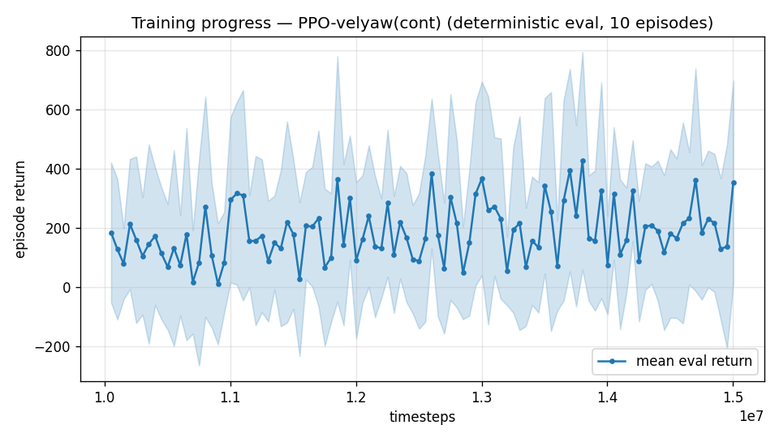

# Trial 19 — LOOP iter 12: stiff inner loop for the high band

| | |
|---|---|
| run dir | `results_velyaw_xw20` (FRESH, parallel with the LSTM run) |
| date | 2026-07-30 |
| baseline | trial 17: high-band specialist 10.09 m/s — attitude oscillation + vertical-trim loss at high Q |
| changes | **inner-loop rate gains kp (25,25,15) → (40,40,25), ki (6,6,3) → (10,10,5)** — verified stable at the real XWing motor-lag range (τ≤0.16 s: ±0.12°/s bench ripple); tightens the attitude ripple that the V² budget converts into m/s |
| everything else | identical to trial 17 (18–25 band, γ 0.997, 14 s, full stack, 10M + 5M converge) |

## Exact code changes — gains made configurable
```python
# train.py (ADDED):
    ap.add_argument("--kp-rate", type=str, default="25,25,15", ...)
    ap.add_argument("--ki-rate", type=str, default="6,6,3", ...)
# config.json: "kp_rate"/"ki_rate"; env kwargs: kp_rate=tuple(...), ki_rate=tuple(...)
# rate_vel_aviary.py (CHANGED): the USE_XWING_AERO branch previously OVERWROTE caller gains:
#   BEFORE: self.KP_RATE = np.array([25.0, 25.0, 15.0]); self.KI_RATE = ...  (unconditional)
#   AFTER:  only applied if the caller left the legacy default (6,6,4) — explicit gains win:
            if tuple(np.asarray(kp_rate, dtype=float)) == (6.0, 6.0, 4.0):
                self.KP_RATE = np.array([25.0, 25.0, 15.0])
                self.KI_RATE = np.array([6.0, 6.0, 3.0])
            self.INT_LIMIT = max(self.INT_LIMIT, 15.0)
# eval_velyaw.py / continue_train.py: kp_rate/ki_rate read from config (the inner loop is part
# of the plant — eval MUST match training)
```

## Command (auto chain)
```bash
python train.py --xwing-aero --yaw-bias 0.3 --max-speed 25 --speed-min 18 --wind-max 15 \
    --yaw-gate --yaw-att-gate --vel-precision 0.7 --cov-width 5 --ent-coef 0.003 \
    --gamma 0.997 --episode-len 14 --kp-rate 40,40,25 --ki-rate 10,10,5 \
    --n-envs 6 --timesteps 10000000 --device cpu --out-dir results_velyaw_xw20 \
&& continue_train --src results_velyaw_xw20 --out results_velyaw_xw20b --extra 5000000 --lr 1e-4 --episode-len 14 \
&& analyze && log_trial
```

## Decision criteria (auto)
- high band ≤ 6 → attitude ripple was the binding term; propagate stiff gains everywhere.
- ~8–10 → ripple not binding → identification/strategy → weight on the LSTM result (trial 18).
- unstable/crashes → gains too hot at τ=0.16 corner; retry 32/8.

---

## AUTO-CAPTURED RESULTS (2026-07-30 11:51)

**config**: `{"max_speed": 25.0, "speed_min": 18.0, "wind_max": 15.0, "use_integral": true, "use_yaw_integral": true, "use_wind_est": true, "yaw_width": 0.35, "yaw_weight": 1.0, "yaw_bias": 0.3, "heading_frame": false, "xwing_aero": true, "tough_init": 0.0, "wind_curriculum": false, "yaw_gate": true, "yaw_gate_floor": 0.2, "vel_precision": 0.7, "yaw_att_gate": true, "cov_width": 5.0, "kp_rate": "40,40,25", "ki_rate": "10,10,5", "ent_coef": 0.003, "gamma": 0.997, "episode_len": 14.0}`

**eval curve**: n=100, first 185, best 427 @ 13,802,280, last 355 (final steps 15,002,232)

**late trend**: still rising (last-10% mean 223 vs prior-10% 190)





### Physical eval
```
=== PHYSICAL EVAL (level start, full wind) ===

band           n  vel err (m/s)  yaw err (deg)
----------------------------------------------
high(18-25)  100           8.94           71.0
----------------------------------------------
ALL          100           8.94           71.0   crash 0.0%
```


### Dive-recovery test
```
=== DIVE-RECOVERY TEST (60 episodes, all starting in failure states) ===
  recovered (final-2s vel err < 8 m/s):  17/60 = 28%
  partial   (8-15 m/s):                  17/60 = 28%
  median final err: 11.2 m/s   mean: 18.8 m/s
```


### Behavior traces
```
--- trace seed 1005: target [19.8  8.7  0.4] (|v|=21.6), wind [ -3.6 -11.6  -3.1] ---
  t= 0.0 |v|=  0.1 vz=   0.0 tilt=   0 verr= 21.7 yawerr=+103.5 fins=( -1.3, +7.2) thr=-0.62
  t= 2.0 |v|=  7.2 vz=   4.3 tilt=  88 verr= 16.3 yawerr= +15.6 fins=(-11.3,-20.0) thr=+1.00
  t= 4.0 |v|= 12.1 vz=  -3.6 tilt=  10 verr= 15.5 yawerr=-125.8 fins=(-18.0,-20.0) thr=+1.00
  t= 6.0 |v|= 18.8 vz=  -0.2 tilt=  45 verr= 13.6 yawerr=  +0.5 fins=(-10.8,-14.8) thr=+0.90
  t= 8.0 |v|= 10.9 vz=   8.7 tilt=  31 verr= 17.3 yawerr=-158.1 fins=( +6.4, -4.1) thr=-1.00
--- trace seed 1012: target [  8.1 -21.4   1.8] (|v|=23.0), wind [-0.3  4.1 -6.1] ---
  t= 0.0 |v|=  0.0 vz=   0.0 tilt=   0 verr= 23.0 yawerr= +46.7 fins=( +3.7, +4.2) thr=+0.46
  t= 2.0 |v|= 13.7 vz=   2.9 tilt=  70 verr=  9.6 yawerr=-116.2 fins=(-20.0,-18.2) thr=+1.00
  t= 4.0 |v|= 21.1 vz=   3.7 tilt=  11 verr=  3.3 yawerr= -97.4 fins=(-20.0, -4.7) thr=+0.26
  t= 6.0 |v|= 20.6 vz=   5.4 tilt=  77 verr=  6.0 yawerr=-115.3 fins=(+20.0,+20.0) thr=-0.85
  t= 8.0 |v|= 21.1 vz=   2.8 tilt=  13 verr=  3.3 yawerr= -81.2 fins=( -3.8, +1.8) thr=-1.00
--- trace seed 1020: target [-14.7  16.5   1.4] (|v|=22.1), wind [-0.3 -1.2 -0.6] ---
  t= 0.0 |v|=  0.0 vz=   0.0 tilt=   0 verr= 22.1 yawerr= -65.7 fins=( -9.7, -5.2) thr=-1.00
  t= 2.0 |v|= 13.0 vz=   2.8 tilt= 101 verr= 10.0 yawerr=-101.1 fins=(-16.4,-20.0) thr=+0.51
  t= 4.0 |v|= 24.7 vz=   7.1 tilt=  28 verr=  6.3 yawerr= +36.5 fins=(+19.4, -4.8) thr=-0.81
  t= 6.0 |v|= 23.4 vz=   5.6 tilt=  17 verr=  5.2 yawerr= +84.6 fins=(+20.0, +8.4) thr=-0.62
  t= 8.0 |v|= 25.2 vz=   8.1 tilt=  22 verr=  8.5 yawerr= +43.6 fins=(+13.0,-20.0) thr=-0.03
```

---

## VERDICT (middle branch: ripple real but not dominant)
| high band (18–25) | vel err |
|---|---|
| generalist (xw17) | 8.58 |
| specialist, kp 25/ki 6 (trial 17) | 10.09 |
| **specialist, kp 40/ki 10 (this trial)** | **8.94** |

Stiff gains recovered ~1.1 m/s of the specialist's deficit — attitude ripple was REAL but
worth ~1 m/s, not the ~4–8 needed. The high-band floor stands at ~8.6–9 across three
different approaches. Per the V² budget, the dominant remaining term is per-episode
**identification** (±20% aero at high Q = ±100–200 N) → the LSTM (trial 18, in flight) is
now the decisive experiment for the high band as well. Dive recovery 28%+28%; yaw 71°
(known γ-collapse, queued).
