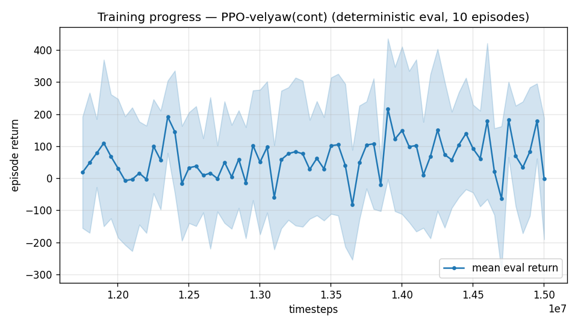

# Trial 20 — ABLATION (user request): aerodynamics randomization OFF

| | |
|---|---|
| run dirs | `results_velyaw_xw21` → `results_velyaw_xw21b` (converge) |
| date | 2026-07-30 |
| question (user) | "removing aerodynamics random and training — to check what is the real problem" |
| design | identical to trial 19 (high band 18–25, stiff gains kp40/ki10, γ0.997, 14 s, full stack, 10M+5M) **except `aero_dr=False`**: all 17 aero coefficients fixed at nominal, Xg fixed 0.4045. Wind/mass/motor-lag/fin DR unchanged. |
| the triangle | MLP+aeroDR = **8.94** (trial 19) · MLP no-aeroDR = **this run** · LSTM+aeroDR = trial 18 (running) |

## Pre-registered readings
- **≤ ~4–5** → identification (±20% aero) confirmed as the dominant high-band term →
  LSTM/adaptation or real-tolerance DR is the path; ask user for true aero tolerances.
- **≈ 8–9 (unchanged)** → aero DR is NOT the problem → remaining suspects: wind (0–15 across
  a 3–40 m/s relative envelope), actuation limits at high Q, or task geometry; LSTM will
  likely also show ≈ MLP.

## Exact code changes
```python
# rate_vel_aviary.py ctor (ADDED):
                 aero_dr: bool = True,           # per-episode aero randomization (17 coeffs +/-20% + Xg
                 #                                 jitter); False = fixed NOMINAL aircraft (ablation)
        self.AERO_DR = bool(aero_dr)
# _housekeeping (CHANGED):
        if self.USE_XWING_AERO and self.AERO_DR:
            self.aero_rand = 1.0 + self.np_random.uniform(-0.20, 0.20, size=17)
            self.XG = 0.4045 + self.np_random.uniform(-0.02, 0.02)
        else:
            self.aero_rand = np.ones(17)
            self.XG = 0.4045
# train.py: --no-aero-dr flag -> config "aero_dr" -> env kwargs; eval/continue passthrough
```

## Command (auto chain)
```bash
python train.py --xwing-aero --yaw-bias 0.3 --max-speed 25 --speed-min 18 --wind-max 15 \
    --yaw-gate --yaw-att-gate --vel-precision 0.7 --cov-width 5 --ent-coef 0.003 \
    --gamma 0.997 --episode-len 14 --kp-rate 40,40,25 --ki-rate 10,10,5 --no-aero-dr \
    --n-envs 6 --timesteps 10000000 --device cpu --out-dir results_velyaw_xw21 \
&& continue +5M @1e-4 && analyze && log_trial
```

---

## AUTO-CAPTURED RESULTS (2026-07-30 18:28)

**config**: `{"max_speed": 25.0, "speed_min": 18.0, "wind_max": 15.0, "use_integral": true, "use_yaw_integral": true, "use_wind_est": true, "yaw_width": 0.35, "yaw_weight": 1.0, "yaw_bias": 0.3, "heading_frame": false, "xwing_aero": true, "tough_init": 0.0, "wind_curriculum": false, "yaw_gate": true, "yaw_gate_floor": 0.2, "vel_precision": 0.7, "yaw_att_gate": true, "cov_width": 5.0, "kp_rate": "40,40,25", "ki_rate": "10,10,5", "aero_dr": false, "ent_coef": 0.003, "gamma": 0.997, "episode_len": 14.0}`

**eval curve**: n=66, first 18, best 216 @ 13,902,276, last -1 (final steps 15,002,232)

**late trend**: still rising (last-10% mean 91 vs prior-10% 76)





### Physical eval
```
=== PHYSICAL EVAL (level start, full wind) ===

band           n  vel err (m/s)  yaw err (deg)
----------------------------------------------
high(18-25)  100          11.40           83.4
----------------------------------------------
ALL          100          11.40           83.4   crash 0.0%
```


### Dive-recovery test
```
=== DIVE-RECOVERY TEST (60 episodes, all starting in failure states) ===
  recovered (final-2s vel err < 8 m/s):  9/60 = 15%
  partial   (8-15 m/s):                  20/60 = 33%
  median final err: 15.2 m/s   mean: 19.3 m/s
```


### Behavior traces
```
--- trace seed 1005: target [-14.3 -15.7   9.4] (|v|=23.2), wind [ -3.6 -11.6  -3.1] ---
  t= 0.0 |v|=  0.1 vz=   0.0 tilt=   0 verr= 23.1 yawerr=+118.6 fins=( -8.8, -9.8) thr=+1.00
  t= 2.0 |v|= 20.4 vz=   4.6 tilt=  35 verr= 14.2 yawerr=+157.9 fins=(-10.2,-20.0) thr=-0.77
  t= 4.0 |v|= 24.1 vz=   4.5 tilt=  13 verr=  5.6 yawerr=-111.5 fins=( -3.4,-20.0) thr=-0.30
  t= 6.0 |v|= 25.5 vz=   7.9 tilt=  34 verr=  5.2 yawerr= -44.9 fins=(+11.5,-20.0) thr=-0.46
  t= 8.0 |v|= 24.7 vz=   8.8 tilt=  22 verr=  3.4 yawerr=  -4.1 fins=(+10.0,-20.0) thr=-0.38
--- trace seed 1012: target [ -4.3   2.2 -19.6] (|v|=20.2), wind [-0.3  4.1 -6.1] ---
  t= 0.0 |v|=  0.0 vz=   0.0 tilt=   0 verr= 20.2 yawerr=+105.6 fins=( -9.3, +0.6) thr=+0.83
  t= 2.0 |v|= 10.5 vz=  -9.8 tilt= 165 verr= 12.9 yawerr=+159.1 fins=( +1.8,-18.1) thr=-1.00
  t= 4.0 |v|= 22.2 vz= -22.0 tilt=  62 verr=  7.3 yawerr= +97.1 fins=( -7.7,-17.8) thr=+0.25
  t= 6.0 |v|= 23.0 vz= -21.7 tilt=  72 verr= 12.1 yawerr= -24.9 fins=(-19.2,-18.1) thr=-1.00
  t= 8.0 |v|= 18.2 vz= -16.5 tilt=  76 verr=  6.1 yawerr= -29.7 fins=(+20.0,-12.1) thr=+0.70
--- trace seed 1020: target [ -2.3 -12.4  19.3] (|v|=23.1), wind [-0.3 -1.2 -0.6] ---
  t= 0.0 |v|=  0.0 vz=   0.0 tilt=   0 verr= 23.1 yawerr= -89.8 fins=( -9.5, +0.2) thr=+1.00
  t= 2.0 |v|= 10.5 vz=   6.6 tilt=  50 verr= 18.9 yawerr=-170.9 fins=(+10.1,-11.0) thr=+1.00
  t= 4.0 |v|= 10.9 vz=   6.7 tilt=  40 verr= 15.6 yawerr= -78.9 fins=( -3.2,-20.0) thr=+1.00
  t= 6.0 |v|= 20.6 vz=  18.0 tilt=   9 verr=  4.7 yawerr= +63.8 fins=(+14.5,-18.3) thr=+0.42
  t= 8.0 |v|= 24.6 vz=  20.6 tilt=   6 verr=  3.1 yawerr=+163.3 fins=( +8.8,-20.0) thr=+1.00
```

---

## VERDICT: identification hypothesis REFUTED at the high band
| high band (18–25) | vel err |
|---|---|
| with ±20% aero DR (trial 19, stiff gains) | 8.94 |
| **WITHOUT aero DR (this trial, same recipe)** | **11.40** (yaw 83° — γ-collapse) |

Removing the aero uncertainty entirely did not help — it came out WORSE (DR evidently also
regularizes training; fixed-nominal converged to a more brittle policy). **The ±20% aero
randomization is NOT the high-band bottleneck.** Combined with trial 19 (ripple ≈1 m/s) and
the capacity/recipe eliminations, the high-band residual points to high-Q dynamics themselves
(wind-draw spread + oscillatory margins), to be attacked with the corrected recipe (true
integrator + settle time — never yet tried at speed) in trials 23 (mid) → 24 (high).
