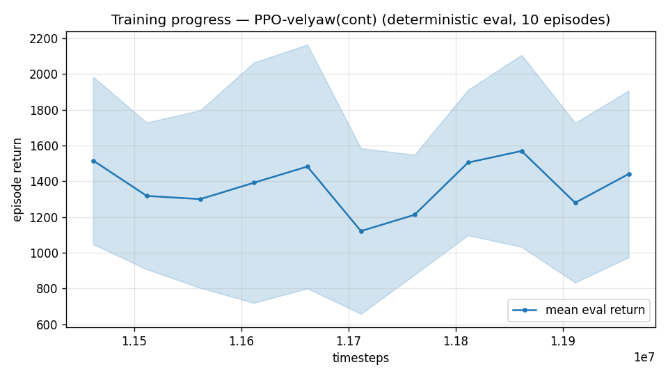

# Trial 22 — LOOP: true integrator + settle-time training (low band)

| | |
|---|---|
| run dirs | `results_velyaw_xw22` → `xw22b` (converge) |
| date | 2026-07-30 |
| basis | trial 21: classical hits 0.65 @20 s with a TRUE integrator; RL stuck at 2.0 with leaky τ=3 + 10 s horizon |
| changes | **integral_tau 3 → 1e6 (effectively true integrator, clamp = anti-windup)**; **episode-len 20 s** (train AND the eval standard for this run); γ 0.999 (horizon ≥ episode); low band (0–10), stiff gains, full stack |
| target | ≤ 0.65 (match classical) — ideally < 0.5 (beat it: RL should handle the wind tail better) |

## Exact code changes
```python
# train.py (ADDED):
    ap.add_argument("--integral-tau", type=float, default=3.0,
                    help="velocity/yaw integral leak (s); large (1e6) = TRUE integrator: "
                         "classical baseline proved leak tau=3 bounds steady error ~3x")
# config "integral_tau" -> env kwargs integral_tau=...; eval/continue passthrough (both integrals
# share INTEGRAL_TAU in the env; clamps ±MAX_SPEED / ±pi act as anti-windup)
```
## Command (auto chain)
```bash
python train.py --xwing-aero --yaw-bias 0.3 --max-speed 10 --wind-max 15 \
    --yaw-gate --yaw-att-gate --vel-precision 0.7 --cov-width 5 --ent-coef 0.003 \
    --gamma 0.999 --episode-len 20 --integral-tau 1e6 --kp-rate 40,40,25 --ki-rate 10,10,5 \
    --n-envs 6 --timesteps 8000000 --device cpu --out-dir results_velyaw_xw22 \
&& continue +4M @1e-4 (episode-len 20) && analyze (ep_len 20) && log_trial
```

## CRASH + RELAUNCH (2026-07-30 18:5x)
First attempt OOM-died at 1,929,216 steps (`numpy ArrayMemoryError`, RAM pressure with 3
chains + diagnostics). Not resumable: train.py only saved `vecnormalize.pkl` at the END, so
ckpts had no matching obs-norm stats. Fixed for all future runs, then relaunched fresh
(same command/config).

# train.py (ADDED — periodic VecNormalize save, ported from train_lstm.py):
```python
class VecNormSaveCallback(BaseCallback):
    """Save VecNormalize stats on the checkpoint cadence so a killed run can resume
    consistently (model ckpt + matching obs-normalization stats). Added after xw22
    OOM-died at 1.9M steps with NO vecnormalize.pkl on disk (only saved at the end)."""
    def __init__(self, env, path, every):
        super().__init__(); self.env = env; self.path = path; self.every = every; self._last = 0

    def _on_step(self):
        if self.num_timesteps - self._last >= self.every:
            self.env.save(self.path); self._last = self.num_timesteps
        return True
```
```python
    cbs = [ckpt, evalcb,
           VecNormSaveCallback(train_env, os.path.join(args.out_dir, "vecnormalize.pkl"),
                               every=100_000)]
```
# continue_train.py (ADDED — same callback):
```python
    vns = VecNormSaveCallback(train_env, os.path.join(args.out, "vecnormalize.pkl"),
                              every=100_000)
    model.learn(total_timesteps=args.extra, reset_num_timesteps=False,
                callback=[ckpt, evalcb, vns], progress_bar=True)
```

---

## AUTO-CAPTURED RESULTS (2026-07-31 00:29)

**config**: `{"max_speed": 10.0, "speed_min": 0.0, "wind_max": 15.0, "use_integral": true, "use_yaw_integral": true, "use_wind_est": true, "yaw_width": 0.35, "yaw_weight": 1.0, "yaw_bias": 0.3, "heading_frame": false, "xwing_aero": true, "tough_init": 0.0, "wind_curriculum": false, "yaw_gate": true, "yaw_gate_floor": 0.2, "vel_precision": 0.7, "yaw_att_gate": true, "cov_width": 5.0, "kp_rate": "40,40,25", "ki_rate": "10,10,5", "aero_dr": true, "integral_tau": 1000000.0, "ent_coef": 0.003, "gamma": 0.999, "episode_len": 20.0}`

**eval curve**: n=11, first 1516, best 1569 @ 11,861,622, last 1441 (final steps 11,961,618)

**late trend**: still rising (last-10% mean 1430 vs prior-10% 1279)





### Physical eval
```
=== PHYSICAL EVAL (level start, full wind) ===

band           n  vel err (m/s)  yaw err (deg)
----------------------------------------------
hover(0-1)     5           2.78           32.5
low(1-10)     95           3.05           56.0
----------------------------------------------
ALL          100           3.04           54.8   crash 0.0%
```


### Dive-recovery test
```
=== DIVE-RECOVERY TEST (60 episodes, all starting in failure states) ===
  recovered (final-2s vel err < 8 m/s):  10/60 = 17%
  partial   (8-15 m/s):                  4/60 = 7%
  median final err: 49.8 m/s   mean: 45.9 m/s
```


### Behavior traces
```
--- trace seed 1005: target [4.8 2.1 0.1] (|v|=5.2), wind [ -3.6 -11.6  -3.1] ---
  t= 0.0 |v|=  0.1 vz=   0.0 tilt=   0 verr=  5.3 yawerr=+103.5 fins=( +9.0,-10.2) thr=+1.00
  t= 2.0 |v|=  4.3 vz=   1.6 tilt=  81 verr=  5.9 yawerr=-124.1 fins=(-18.0,-19.0) thr=-0.77
  t= 4.0 |v|=  8.7 vz=   0.6 tilt=  28 verr=  8.5 yawerr= -70.6 fins=(+18.2,-19.2) thr=-0.42
  t= 6.0 |v|=  2.9 vz=   1.9 tilt=  45 verr=  4.8 yawerr= -51.2 fins=(-18.0,-20.0) thr=-1.00
  t= 8.0 |v|=  5.4 vz=   1.0 tilt=  57 verr=  5.8 yawerr= -26.5 fins=(+15.1, -0.5) thr=+0.34
--- trace seed 1012: target [ 2.5 -6.6  0.6] (|v|=7.1), wind [-0.3  4.1 -6.1] ---
  t= 0.0 |v|=  0.0 vz=   0.0 tilt=   0 verr=  7.1 yawerr= +46.7 fins=(+10.1, -8.9) thr=+0.51
  t= 2.0 |v|=  7.8 vz=   0.2 tilt=  45 verr=  2.6 yawerr=-140.8 fins=(+11.9,-10.9) thr=-0.79
  t= 4.0 |v|= 11.6 vz=   3.2 tilt=  22 verr=  4.8 yawerr=-169.8 fins=(-18.5,-18.2) thr=-1.00
  t= 6.0 |v|=  9.6 vz=   4.0 tilt=  58 verr=  3.9 yawerr=+151.5 fins=(+20.0,+20.0) thr=-1.00
  t= 8.0 |v|=  7.5 vz=   4.0 tilt=  61 verr=  4.4 yawerr=+133.4 fins=( +9.5, -5.2) thr=-1.00
--- trace seed 1020: target [-3.9  4.4  0.4] (|v|=5.9), wind [-0.3 -1.2 -0.6] ---
  t= 0.0 |v|=  0.0 vz=   0.0 tilt=   0 verr=  5.9 yawerr= -65.7 fins=( +9.6, -4.0) thr=+0.96
  t= 2.0 |v|=  4.4 vz=   2.1 tilt=  33 verr=  4.0 yawerr= +66.6 fins=(-19.9, -7.9) thr=-1.00
  t= 4.0 |v|=  6.2 vz=  -0.1 tilt=  63 verr=  2.2 yawerr= +27.8 fins=( +4.3, -6.1) thr=-1.00
  t= 6.0 |v|=  7.1 vz=  -0.8 tilt=  33 verr=  1.8 yawerr= +41.5 fins=(-19.9, +6.4) thr=-0.73
  t= 8.0 |v|=  8.2 vz=  -0.6 tilt=  22 verr=  3.0 yawerr= +44.2 fins=(-19.1,-20.0) thr=-1.00
```

## VERDICT (hand-written): FAILURE — the 4-variable "corrected recipe" REGRESSED the low band
The auto-captured eval above ran at the legacy 10 s protocol (chain bug, since fixed:
analyze_velyaw.py now defaults to the TRAINED episode_len from config.json). The fair
**20 s re-eval (100 eps)**: **2.66 mean / 2.08 median / 3% < 1 m/s, yaw 53.5°, crash 0%** —
versus xw18b's 1.89 / **0.82 median** / 59% < 1 with single-digit yaw. Both objectives
regressed badly; dive recovery also collapsed (17% vs ~50%).

Config diff vs xw18b (the 0.82-median best) — FOUR variables changed at once:
| var | xw18b | xw22b |
|---|---|---|
| gamma | 0.99 | 0.999 |
| episode_len | 8 s | 20 s |
| integral_tau | 3 s (leaky) | 1e6 (true) |
| rate gains | xwing default 25,25,15 / 6,6,3 | stiff 40,40,25 / 10,10,5 |

Diagnosis: the yaw collapse signature (53°) matches xw17's known γ≈1 failure (γ 0.997 →
yaw 55°, fix queued and never applied); traces show violent fin/yaw thrash coupling into
velocity. The classical-baseline insight (true integrator + settle time) was IMPORTED
CORRECTLY but BUNDLED with the γ jump that poisons the reward balance.

Lesson re-learned: **one variable per trial.** Follow-ups:
- xw23/xw24 (mid/high) revised to **γ 0.997** — the value that produced the best-ever
  high-band velocity (xw17: 8.58) — keeping true integrator + 20 s + stiff gains
  (stiffness is proven at speed by xw20, and speed is where those bands live).
- **xw25 queued**: low-band isolation — xw18b recipe + ONLY true integrator + 20 s
  (γ 0.99, default gains). Exact command in run_xw25.sh /
  [25_xw25_lowband_isolation.md](25_xw25_lowband_isolation.md).
