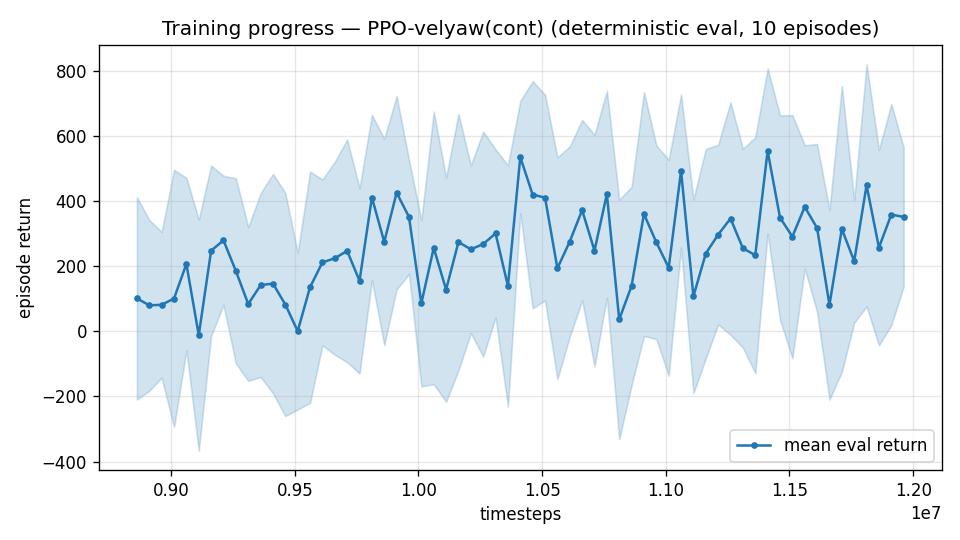

# Trial 23 — LOOP: mid band with the CORRECTED recipe (first fair RL test at speed)

| | |
|---|---|
| run dirs | `results_velyaw_xw23` → `xw23b` (converge) |
| date | 2026-07-30 |
| context | ALL prior mid/high RL runs used the leaky integrator + short episodes — the two artifacts PROVEN binding in the low band. Never tested corrected at speed. Classical ceiling probe: mid-band **median 0.20 m/s** (60% < 1) — task doable at speed; residual = robustness across DR draws = RL's home turf. |
| changes | mid band (10–18) + **integral_tau 1e6 (true integrator)** + **20 s episodes** + γ 0.999 + stiff gains + full stack |
| target | convert the classical's "stable majority" into (nearly) all episodes: mean ≤ 2, median ≤ 0.5 |

## Command (auto chain, script file run_xw23.sh)
```bash
python train.py --xwing-aero --yaw-bias 0.3 --max-speed 18 --speed-min 10 --wind-max 15 \
    --yaw-gate --yaw-att-gate --vel-precision 0.7 --cov-width 5 --ent-coef 0.003 \
    --gamma 0.999 --episode-len 20 --integral-tau 1e6 --kp-rate 40,40,25 --ki-rate 10,10,5 \
    --n-envs 6 --timesteps 8000000 --device cpu --out-dir results_velyaw_xw23 \
&& continue +4M @1e-4 (ep 20) && analyze && log_trial
```

## CRASH + QUEUED RELAUNCH (2026-07-30 22:2x)
First attempt OOM-died at 2,015,232 steps (`numpy ArrayMemoryError` — same Windows commit
exhaustion that killed xw22; "paging file too small" DLL errors hit lstm3 at the same time).
Launched BEFORE the VecNormSaveCallback fix -> no vecnormalize.pkl -> not resumable.
Relaunch queued via `scheduler.sh` (RAM-staggered: max 2 chains at once): waits for the
xw22b chain to finish, then reruns this chain fresh with the resumable train.py, then
auto-launches xw24 (high band). Eval reward at death was still climbing (-594 -> -498, new
bests) — no verdict.

## RECIPE REVISED before relaunch (2026-07-31 00:5x) — γ 0.999 → 0.997
xw22b's verdict landed first: the 4-variable recipe at γ 0.999 REGRESSED the low band
(0.82 → 2.08 median) with the known γ≈1 yaw collapse (53°). The first xw23 attempt (same
γ 0.999) was killed at ~10 min rather than spend half a day on a demonstrated-poisoned
config. Relaunched with **--gamma 0.997** — the value that produced the best-ever velocity
at speed (xw17 high band 8.58) — keeping true integrator + 20 s episodes + stiff gains.
```bash
# run_xw23.sh (revised line)
--gamma 0.997 --episode-len 20 --integral-tau 1e6 --kp-rate 40,40,25 --ki-rate 10,10,5
```

---

## AUTO-CAPTURED RESULTS (2026-07-31 10:44)

**config**: `{"max_speed": 18.0, "speed_min": 10.0, "wind_max": 15.0, "use_integral": true, "use_yaw_integral": true, "use_wind_est": true, "yaw_width": 0.35, "yaw_weight": 1.0, "yaw_bias": 0.3, "heading_frame": false, "xwing_aero": true, "tough_init": 0.0, "wind_curriculum": false, "yaw_gate": true, "yaw_gate_floor": 0.2, "vel_precision": 0.7, "yaw_att_gate": true, "cov_width": 5.0, "kp_rate": "40,40,25", "ki_rate": "10,10,5", "aero_dr": true, "integral_tau": 1000000.0, "ent_coef": 0.003, "gamma": 0.997, "episode_len": 20.0}`

**eval curve**: n=63, first 101, best 555 @ 11,411,640, last 352 (final steps 11,961,618)

**late trend**: DECLINING (last-10% mean 325 vs prior-10% 330)





### Physical eval
```
=== PHYSICAL EVAL (level start, full wind, 20s episodes) ===

band           n  vel err (m/s)  yaw err (deg)
----------------------------------------------
mid(10-18)   100          10.51           77.4
----------------------------------------------
ALL          100          10.51           77.4   crash 0.0%
```


### Dive-recovery test
```
=== DIVE-RECOVERY TEST (60 episodes, all starting in failure states) ===
  recovered (final-2s vel err < 8 m/s):  28/60 = 47%
  partial   (8-15 m/s):                  22/60 = 37%
  median final err: 8.5 m/s   mean: 10.9 m/s
```


### Behavior traces
```
--- trace seed 1005: target [13.   5.7  0.3] (|v|=14.1), wind [ -3.6 -11.6  -3.1] ---
  t= 0.0 |v|=  0.1 vz=   0.0 tilt=   0 verr= 14.2 yawerr=+103.5 fins=( +9.0, -3.6) thr=+1.00
  t= 2.0 |v|=  4.5 vz=  -3.0 tilt=  22 verr= 16.3 yawerr= +46.0 fins=(+18.5, -6.9) thr=+1.00
  t= 4.0 |v|= 15.1 vz=  -8.4 tilt=  14 verr= 15.5 yawerr=  -4.0 fins=(+18.5,-11.2) thr=+1.00
  t= 6.0 |v|=  8.9 vz=   4.3 tilt=  67 verr= 11.3 yawerr= -64.1 fins=(+12.4,-13.4) thr=+0.98
  t= 8.0 |v|= 13.3 vz=   1.0 tilt=  13 verr= 13.9 yawerr= -18.0 fins=( -5.9,-20.0) thr=+1.00
  t=10.0 |v|=  4.9 vz=   0.4 tilt=  63 verr= 10.1 yawerr= -75.8 fins=( -4.5,-14.1) thr=+1.00
  t=12.0 |v|=  7.3 vz=   0.6 tilt=  45 verr=  9.1 yawerr= -58.8 fins=(+14.9, -3.9) thr=+0.40
  t=14.0 |v|=  4.4 vz=  -1.5 tilt=  27 verr= 18.3 yawerr= +59.9 fins=(+18.5,-20.0) thr=+1.00
  t=16.0 |v|= 11.1 vz=  -0.2 tilt=  85 verr= 24.0 yawerr=-109.0 fins=(-18.0,-20.0) thr=+1.00
  t=18.0 |v|=  7.7 vz=   3.7 tilt=  70 verr= 16.3 yawerr= -54.6 fins=(-18.0,-20.0) thr=+1.00
--- trace seed 1012: target [  5.5 -14.6   1.2] (|v|=15.7), wind [-0.3  4.1 -6.1] ---
  t= 0.0 |v|=  0.0 vz=   0.0 tilt=   0 verr= 15.7 yawerr= +46.7 fins=(+10.1, -6.7) thr=-0.65
  t= 2.0 |v|=  4.5 vz=   3.3 tilt=  41 verr= 13.5 yawerr=-150.7 fins=( -8.9,-16.3) thr=-0.49
  t= 4.0 |v|= 15.1 vz=   4.4 tilt=  38 verr=  4.0 yawerr= +47.7 fins=(-17.6,-14.8) thr=-1.00
  t= 6.0 |v|= 13.6 vz=   4.5 tilt=  30 verr=  4.9 yawerr= -45.7 fins=(-20.0,-18.2) thr=-0.48
  t= 8.0 |v|= 14.4 vz=   2.3 tilt=  44 verr=  1.8 yawerr= -36.3 fins=(-19.1,-17.7) thr=-1.00
  t=10.0 |v|=  8.1 vz=   1.4 tilt=  77 verr=  8.4 yawerr=-169.2 fins=(-20.0,-18.2) thr=-0.69
  t=12.0 |v|=  9.8 vz=   2.3 tilt=  47 verr=  7.1 yawerr= +65.6 fins=(+20.0, -4.2) thr=-1.00
  t=14.0 |v|=  7.2 vz=   0.1 tilt=  49 verr=  9.8 yawerr=-172.7 fins=(-20.0,-18.2) thr=-0.34
  t=16.0 |v|= 13.9 vz=  -0.9 tilt=  16 verr=  4.5 yawerr=-124.9 fins=( +0.2,-17.2) thr=-0.61
  t=18.0 |v|= 10.7 vz=   2.1 tilt=  53 verr= 11.1 yawerr=+143.7 fins=(-17.1,-18.2) thr=-1.00
--- trace seed 1020: target [-9.8 11.   0.9] (|v|=14.7), wind [-0.3 -1.2 -0.6] ---
  t= 0.0 |v|=  0.0 vz=   0.0 tilt=   0 verr= 14.7 yawerr= -65.7 fins=( +8.1, -5.2) thr=-1.00
  t= 2.0 |v|= 14.3 vz=  -1.7 tilt=  68 verr=  3.6 yawerr=+121.7 fins=(-19.9,-20.0) thr=+0.67
  t= 4.0 |v|= 15.8 vz=   1.1 tilt=  30 verr=  1.9 yawerr=+163.5 fins=(+20.0,+14.7) thr=+1.00
  t= 6.0 |v|= 18.0 vz=  -2.1 tilt=  82 verr=  5.8 yawerr=  -4.6 fins=(-19.9,-20.0) thr=-1.00
  t= 8.0 |v|= 18.9 vz=  -3.0 tilt= 102 verr=  5.7 yawerr= -17.9 fins=(-19.9,-20.0) thr=-0.88
  t=10.0 |v|= 13.6 vz=  -2.7 tilt=  29 verr=  4.4 yawerr=-120.5 fins=(+20.0, -8.3) thr=+1.00
  t=12.0 |v|= 13.7 vz=   4.4 tilt=  44 verr=  3.9 yawerr=-128.6 fins=(+10.4, +1.8) thr=-1.00
  t=14.0 |v|= 12.9 vz=   4.2 tilt=  32 verr=  6.0 yawerr= -45.1 fins=(+20.0, +8.4) thr=-0.45
  t=16.0 |v|= 13.4 vz=   6.3 tilt=  43 verr=  6.2 yawerr= -97.1 fins=(+14.4, -2.6) thr=-0.15
  t=18.0 |v|= 18.1 vz=  -0.3 tilt=  34 verr=  4.8 yawerr= -97.0 fins=(+20.0,+15.8) thr=-1.00
```

## VERDICT (hand-written): DECISIVE FAILURE — 10.51 mean / yaw 77.4° @ 20 s eval
Pre-registered target was mean ≤2 / median ≤0.5 (classical proves 0.20 median at this band).
Result: **10.51 m/s mean, 77.4° yaw, 0% crash** — the policy never settles at any point in
the 20 s episodes (traces: error GROWS 14→24 m/s mid-episode at seed 1005, thrust pinned
+1.0, continuous fin thrash). Dive recovery 47%+37% (that part is fine). Reward curve was
flat-noisy around ~300 (best 555 @11.4M) — training itself plateaued at a thrashing policy.

**Two consecutive failures now share three ingredients: TRUE integrator (τ=1e6), 20 s
episodes, stiff rate gains** (xw22b: 2.66 @ low γ0.999; xw23b: 10.51 @ mid γ0.997 — worse
than xw19/xw20 got at the HARDER high band with 10 s + leaky). Leading suspect: the true
integral as an OBSERVATION rails at its clamp while the early policy is bad and stays
railed (no leak to recover within an episode) — a saturated, gradient-free input that
poisons training. It helped the CLASSICAL controller because that controller USES the
integral in its law; RL merely observes it. Second suspect: 20 s episodes halve episode
count per rollout and dilute the settle-phase reward signal.

Response (documented in trials 24/25/26): xw24 ABORTED pre-verdict (same doomed combo);
isolation ladder launched — xw26 = mid-band anchor with xw18b's proven recipe VERBATIM
(only the band changed), then xw25 = proven + [true-int + 20 s] only, at γ 0.99.
The 2×2 readout: xw26 good + xw25 good → the pair is safe, γ/stiffness was the poison.
xw26 good + xw25 bad → the pair is the poison (drop it; iterate on the anchor).
xw26 bad → mid-band specialization needs its own diagnosis before any recipe question.
