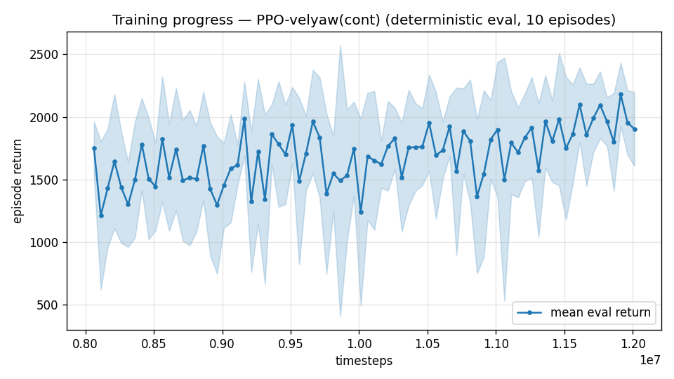

# Trial 25 — xw25: LOW band isolation of the corrected-recipe ingredients

## Why
xw22b bundled 4 changes (γ 0.999, 20 s episodes, true integrator, stiff gains) and
regressed the low band 0.82 → 2.08 median with yaw collapse (trial 22 verdict). The
classical baseline proved two of those ingredients matter (true integrator + settle time:
0.65 median at 20 s under full spec). This trial adds ONLY those two to xw18b's proven
recipe — γ stays 0.99, rate gains stay xwing-default — to isolate their value in RL.

## What (vs xw18b, exactly two changes)
- `--integral-tau 1e6` (true integrator; xw18b: leaky τ=3)
- `--episode-len 20` train/continue/eval (xw18b: 8 s)

## Command (auto chain, queued by scheduler.sh after xw24)
```bash
python train.py --xwing-aero --yaw-bias 0.3 --max-speed 10 --wind-max 15 \
    --yaw-gate --yaw-att-gate --vel-precision 0.7 --cov-width 5 --ent-coef 0.003 \
    --gamma 0.99 --episode-len 20 --integral-tau 1e6 \
    --n-envs 6 --timesteps 8000000 --device cpu --out-dir results_velyaw_xw25 \
&& continue +4M @1e-4 (episode-len 20) && analyze && log_trial
```
No new code (runs on the VecNormSaveCallback-fixed scripts; analyze_velyaw now evaluates
at the trained episode_len by default — exact code in trials 22).

## Pre-registered criteria (20 s eval, 100 eps)
- **SUCCESS**: median ≤ 0.65 (classical ceiling) or mean < 1.89 with yaw < 15° — the
  ingredients transfer to RL; adopt for all bands.
- **NEUTRAL**: ≈ xw18b (0.8–1.0 median) — ingredients neither help nor hurt in RL;
  the classical settle-time gain was protocol-only.
- **FAILURE**: median > 1.5 or yaw > 30° — one of the two ingredients is harmful in RL;
  split further (xw26a: integrator only, xw26b: 20 s only).

## Result
*(auto-appended by log_trial.py when the chain lands)*

---

## AUTO-CAPTURED RESULTS (2026-07-31 18:10)

**config**: `{"max_speed": 10.0, "speed_min": 0.0, "wind_max": 15.0, "use_integral": true, "use_yaw_integral": true, "use_wind_est": true, "yaw_width": 0.35, "yaw_weight": 1.0, "yaw_bias": 0.3, "heading_frame": false, "xwing_aero": true, "tough_init": 0.0, "wind_curriculum": false, "yaw_gate": true, "yaw_gate_floor": 0.2, "vel_precision": 0.7, "yaw_att_gate": true, "cov_width": 5.0, "kp_rate": "25,25,15", "ki_rate": "6,6,3", "aero_dr": true, "integral_tau": 1000000.0, "ent_coef": 0.003, "gamma": 0.99, "episode_len": 20.0}`

**eval curve**: n=80, first 1751, best 2180 @ 11,911,620, last 1904 (final steps 12,011,616)

**late trend**: still rising (last-10% mean 1968 vs prior-10% 1869)





### Physical eval
```
=== PHYSICAL EVAL (level start, full wind, 20s episodes) ===

band           n    mean  median   %<1     p90     yaw
--------------------------------------------------------
hover(0-1)     5    0.70    0.54   80%    1.04   89.6°
low(1-10)     95    2.40    0.97   54%    2.96   90.6°
--------------------------------------------------------
ALL          100    2.32    0.93   55%    2.95   90.6°   crash 0.0%
wind bins: [0-5) n=23 med 0.55 <1: 78%  [5-10) n=42 med 0.76 <1: 67%  [10-15) n=35 med 1.71 <1: 26%
```


### Dive-recovery test
```
=== DIVE-RECOVERY TEST (60 episodes, all starting in failure states) ===
  recovered (final-2s vel err < 8 m/s):  27/60 = 45%
  partial   (8-15 m/s):                  0/60 = 0%
  median final err: 26.0 m/s   mean: 24.5 m/s
```


### Behavior traces
```
--- trace seed 1005: target [4.8 2.1 0.1] (|v|=5.2), wind [ -3.6 -11.6  -3.1] ---
  t= 0.0 |v|=  0.1 vz=   0.0 tilt=   0 verr=  5.3 yawerr=+103.5 fins=( +9.0, +9.0) thr=-1.00
  t= 2.0 |v|=  2.2 vz=   0.9 tilt=  48 verr=  6.6 yawerr= -32.3 fins=( -4.0,-19.6) thr=-0.41
  t= 4.0 |v|=  4.5 vz=  -0.3 tilt=  33 verr=  1.7 yawerr=-152.2 fins=( -8.2,-16.4) thr=-0.22
  t= 6.0 |v|=  6.1 vz=  -0.5 tilt=  32 verr=  2.6 yawerr= +83.7 fins=(-13.6,-20.0) thr=+0.19
  t= 8.0 |v|=  4.9 vz=  -1.1 tilt=  37 verr=  3.7 yawerr= -46.8 fins=( +5.3,-20.0) thr=-0.44
  t=10.0 |v|=  4.0 vz=  -0.3 tilt=  32 verr=  2.2 yawerr=-168.9 fins=( -6.9,-19.8) thr=-0.54
  t=12.0 |v|=  5.8 vz=  -0.5 tilt=  26 verr=  3.2 yawerr= +65.6 fins=( -9.4,-20.0) thr=-0.07
  t=14.0 |v|=  4.1 vz=  -0.8 tilt=  32 verr=  3.3 yawerr= -69.6 fins=( -0.3,-20.0) thr=-0.27
  t=16.0 |v|=  3.8 vz=  -0.3 tilt=  32 verr=  2.2 yawerr=+169.8 fins=( -8.8,-20.0) thr=-0.89
  t=18.0 |v|=  5.7 vz=  -0.4 tilt=  24 verr=  3.4 yawerr= +47.4 fins=( +6.2,-20.0) thr=-0.12
--- trace seed 1012: target [ 2.5 -6.6  0.6] (|v|=7.1), wind [-0.3  4.1 -6.1] ---
  t= 0.0 |v|=  0.0 vz=   0.0 tilt=   0 verr=  7.1 yawerr= +46.7 fins=(-10.5, +3.2) thr=-0.91
  t= 2.0 |v|=  3.4 vz=   1.3 tilt=  32 verr=  4.0 yawerr=-168.0 fins=(-20.0, -9.7) thr=-0.41
  t= 4.0 |v|=  6.5 vz=   0.3 tilt=  14 verr=  0.7 yawerr= +70.6 fins=(-12.0, +5.3) thr=+0.37
  t= 6.0 |v|=  6.4 vz=   0.4 tilt=  10 verr=  0.9 yawerr= -53.3 fins=( -3.0, -4.7) thr=-1.00
  t= 8.0 |v|=  5.8 vz=   0.7 tilt=  26 verr=  1.4 yawerr=-174.1 fins=(-20.0, +6.6) thr=-0.32
  t=10.0 |v|=  6.6 vz=   0.3 tilt=  16 verr=  0.6 yawerr= +56.9 fins=( -7.6, +6.3) thr=-1.00
  t=12.0 |v|=  6.8 vz=   0.4 tilt=  12 verr=  0.7 yawerr= -67.0 fins=( +4.3,-10.2) thr=-1.00
  t=14.0 |v|=  5.9 vz=   0.8 tilt=  22 verr=  1.3 yawerr=+164.0 fins=(-14.7, -3.0) thr=-0.88
  t=16.0 |v|=  6.5 vz=   0.4 tilt=  19 verr=  0.7 yawerr= +36.0 fins=( -7.1, +8.5) thr=-0.63
  t=18.0 |v|=  7.2 vz=   0.5 tilt=  19 verr=  0.3 yawerr= -85.4 fins=( -8.9, -4.9) thr=-1.00
--- trace seed 1020: target [-3.9  4.4  0.4] (|v|=5.9), wind [-0.3 -1.2 -0.6] ---
  t= 0.0 |v|=  0.0 vz=   0.0 tilt=   0 verr=  5.9 yawerr= -65.7 fins=( -6.0,+10.9) thr=-1.00
  t= 2.0 |v|=  6.4 vz=   0.7 tilt=  15 verr=  8.6 yawerr=+119.8 fins=(+20.0,-12.1) thr=-1.00
  t= 4.0 |v|=  5.0 vz=   0.4 tilt=  11 verr=  1.0 yawerr= +33.2 fins=(-19.9,-16.6) thr=-0.01
  t= 6.0 |v|=  5.8 vz=  -0.7 tilt=  10 verr=  1.3 yawerr=-108.2 fins=( +1.7,+13.9) thr=-0.15
  t= 8.0 |v|=  5.4 vz=  -0.5 tilt=   9 verr=  1.1 yawerr=+114.9 fins=(-11.6,-20.0) thr=-0.05
  t=10.0 |v|=  5.3 vz=  -0.3 tilt=   4 verr=  1.2 yawerr= -20.3 fins=(-18.9, -7.7) thr=+0.01
  t=12.0 |v|=  5.7 vz=  -0.4 tilt=  12 verr=  0.8 yawerr=-154.9 fins=(+10.3, -7.3) thr=-0.08
  t=14.0 |v|=  5.2 vz=  -0.6 tilt=  13 verr=  1.2 yawerr= +74.5 fins=( -9.4,-20.0) thr=-0.06
  t=16.0 |v|=  5.7 vz=  -0.5 tilt=   4 verr=  1.0 yawerr= -56.4 fins=(-12.7, -6.5) thr=+0.05
  t=18.0 |v|=  5.6 vz=  -0.6 tilt=   9 verr=  1.0 yawerr=+172.0 fins=( +5.1,-20.0) thr=+0.03
```

## VERDICT (hand-written): the pair is EXONERATED on velocity — and the yaw confound is BROKEN
20 s protocol (auto): **2.32 mean / 0.93 median / 55% <1** — statistically identical to
xw18b's velocity (0.88 median / 57% <1 at the same protocol). **BUT yaw collapsed to 90.6°**
at γ 0.99, low band.

2×2 isolation readout (with trial 26):
- xw26 (mid, NO pair): velocity FAILED (4.44 med), yaw 52°.
- xw25 (low, WITH pair): velocity FINE (0.93 med ≈ xw18b), yaw 90°.
→ The true-integrator + 20 s pair does NOT harm velocity (trials 22/23's velocity damage
came from γ 0.999/0.997 + stiff gains, or the mid band itself). E4 (integral-memory
surgery) is DEAD. But the pair — at γ 0.99, at the LOW band, where xw18b holds 4.1° —
**collapses yaw**. Combined with trial 26 (yaw 52° at 8 s / γ 0.99 / mid), the yaw story
is now: (a) at speed bands, the attitude gate releases yaw (band property, expected);
(b) LONG EPISODES and/or the true yaw-integral collapse yaw even at γ 0.99 at the low
band — γ was never the driver (the "7/7 at γ≥0.997" correlation was confounded exactly as
the verification pass suspected). Standing recipe: leaky τ=3, 8 s episodes, γ 0.99 —
everywhere. Velocity gains nothing from the pair; yaw loses everything.
