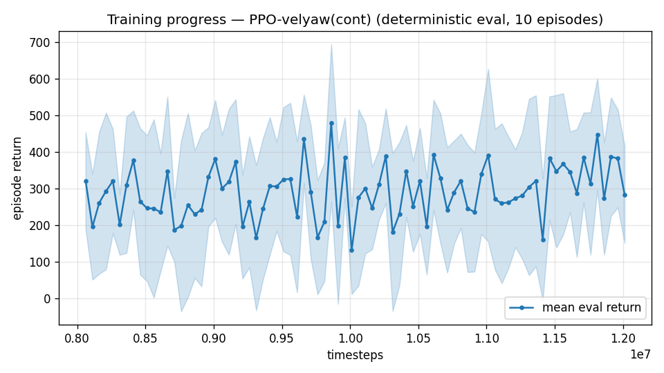

# Trial 26 — xw26: MID-band anchor — xw18b's proven recipe, only the band changed

## Why
xw23b (corrected recipe) failed 10.51 @ mid (trial 23). Before isolating which new
ingredient poisoned it, establish the anchor: what does the PROVEN low-band recipe
(xw18b: 0.82 median) do at the mid band, changing nothing but the speed range?
Classical ceiling here: median 0.20, 60% < 1 (trial 21 addendum 2) — the band is provably
doable; if this anchor lands ~2–3, iterate from it; if it also fails, mid-band
specialization itself needs diagnosis (exploration from standstill to 10–18 m/s targets
under the coverage Gaussian may be the real issue).

## What (vs xw18b: ONE change)
- `--speed-min 10 --max-speed 18` (band); everything else VERBATIM: γ 0.99, leaky
  integral τ=3, 8 s episodes, default xwing rate gains (25,25,15 / 6,6,3), yaw+attitude
  gates, precision 0.7, cov width 5, ent 0.003, wind 0–15, aero DR on.

## Command (auto chain, running since 2026-07-31 11:35)
```bash
python train.py --xwing-aero --yaw-bias 0.3 --max-speed 18 --speed-min 10 --wind-max 15 \
    --yaw-gate --yaw-att-gate --vel-precision 0.7 --cov-width 5 --ent-coef 0.003 \
    --n-envs 6 --timesteps 8000000 --device cpu --out-dir results_velyaw_xw26 \
&& continue +4M @1e-4 && analyze && log_trial
```
No new code.

## Pre-registered criteria (8 s-trained → auto-eval at 8 s protocol, 100 eps)
- **GOOD ANCHOR**: mean ≤ 3.5 with yaw < 15° — proven recipe transfers; iterate
  convergence/precision from here toward the classical ceiling (0.20 median).
- **WEAK**: 3.5–6 — specialization gives little (echoes trial 15's low-band lesson);
  compare against generalist-at-mid before iterating.
- **FAILURE**: > 6 or yaw > 30° — mid-band training has a structural issue independent
  of the corrected-recipe ingredients (suspect: standstill→fast-target exploration gap).

## Result
*(auto-appended by log_trial.py when the chain lands)*

---

## AUTO-CAPTURED RESULTS (2026-07-31 15:29)

**config**: `{"max_speed": 18.0, "speed_min": 10.0, "wind_max": 15.0, "use_integral": true, "use_yaw_integral": true, "use_wind_est": true, "yaw_width": 0.35, "yaw_weight": 1.0, "yaw_bias": 0.3, "heading_frame": false, "xwing_aero": true, "tough_init": 0.0, "wind_curriculum": false, "yaw_gate": true, "yaw_gate_floor": 0.2, "vel_precision": 0.7, "yaw_att_gate": true, "cov_width": 5.0, "kp_rate": "25,25,15", "ki_rate": "6,6,3", "aero_dr": true, "integral_tau": 3.0, "ent_coef": 0.003, "gamma": 0.99, "episode_len": 8.0}`

**eval curve**: n=80, first 322, best 479 @ 9,861,702, last 284 (final steps 12,011,616)

**late trend**: still rising (last-10% mean 345 vs prior-10% 314)





### Physical eval
```
=== PHYSICAL EVAL (level start, full wind, 8s episodes) ===

band           n    mean  median   %<1     p90     yaw
--------------------------------------------------------
mid(10-18)   100    6.33    4.44    0%   11.81   52.3°
--------------------------------------------------------
ALL          100    6.33    4.44    0%   11.81   52.3°   crash 0.0%
wind bins: [0-5) n=23 med 4.09 <1: 0%  [5-10) n=42 med 4.27 <1: 0%  [10-15) n=35 med 5.74 <1: 0%
```


### Dive-recovery test
```
=== DIVE-RECOVERY TEST (60 episodes, all starting in failure states) ===
  recovered (final-2s vel err < 8 m/s):  15/60 = 25%
  partial   (8-15 m/s):                  5/60 = 8%
  median final err: 25.8 m/s   mean: 27.7 m/s
```


### Behavior traces
```
--- trace seed 1005: target [13.   5.7  0.3] (|v|=14.1), wind [ -3.6 -11.6  -3.1] ---
  t= 0.0 |v|=  0.1 vz=   0.0 tilt=   0 verr= 14.2 yawerr=+103.5 fins=( +5.7, -6.5) thr=+0.68
  t= 2.0 |v|=  8.7 vz=   2.7 tilt=  23 verr=  6.5 yawerr=-110.4 fins=(+18.5,-20.0) thr=-0.66
  t= 4.0 |v|= 15.8 vz=  -5.8 tilt=  77 verr= 12.1 yawerr=-120.6 fins=( -0.6,-20.0) thr=+1.00
  t= 6.0 |v|= 23.6 vz= -20.1 tilt=  58 verr= 20.8 yawerr=-143.2 fins=(-18.0,-20.0) thr=+1.00
--- trace seed 1012: target [  5.5 -14.6   1.2] (|v|=15.7), wind [-0.3  4.1 -6.1] ---
  t= 0.0 |v|=  0.0 vz=   0.0 tilt=   0 verr= 15.7 yawerr= +46.7 fins=( +4.3, -8.9) thr=+0.08
  t= 2.0 |v|=  8.8 vz=   1.1 tilt=  43 verr=  7.4 yawerr=-114.9 fins=( -4.5,-18.2) thr=-0.81
  t= 4.0 |v|= 13.3 vz=   1.7 tilt=  46 verr=  4.2 yawerr=  +8.8 fins=(-13.7,-18.2) thr=-0.54
  t= 6.0 |v|= 12.8 vz=   0.9 tilt=  42 verr=  4.0 yawerr= -77.6 fins=(-16.4,-18.2) thr=-1.00
--- trace seed 1020: target [-9.8 11.   0.9] (|v|=14.7), wind [-0.3 -1.2 -0.6] ---
  t= 0.0 |v|=  0.0 vz=   0.0 tilt=   0 verr= 14.7 yawerr= -65.7 fins=( -5.7,-10.3) thr=+0.56
  t= 2.0 |v|= 11.6 vz= -11.3 tilt=  18 verr= 19.0 yawerr= -77.3 fins=(-13.0,-20.0) thr=+1.00
  t= 4.0 |v|=  9.9 vz=  -1.1 tilt=   2 verr=  5.5 yawerr=+153.0 fins=(+15.5,-20.0) thr=-0.57
  t= 6.0 |v|= 12.0 vz=  -3.3 tilt=  18 verr=  7.4 yawerr= +42.2 fins=( -6.6,-20.0) thr=-0.06
```

## VERDICT (hand-written): FAILURE by pre-registration — but the most informative run yet
8 s protocol (auto): **6.33 mean / 4.44 median / 0% <1 / yaw 52.3°**; dive recovery 25%+8%.
(20 s rescore pending → rescore26b.log.)

Three findings, each worth more than the run:
1. **Yaw "collapse" at speed is NOT a γ property — it's the attitude gate.** This run is
   γ 0.99 / 8 s (identical to xw18b, which holds yaw at 4.2°), yet yaw sits at 52.3°. At mid
   band the vehicle flies wing-borne (tilted), R22→0, the trial-08 attitude gate releases
   the yaw reward, and the policy rationally ignores heading. Every "γ≥0.997 collapses yaw"
   claim (7 runs) is RE-ATTRIBUTED: those were all speed-band or long-horizon runs where
   wing-borne flight dominates. Yaw is a hover/low objective; band-conditioned yaw scoring
   (ULTIMATE_PLAN M1) is the right frame, and E3's γ-isolation pair is now LOW priority.
2. **The mid-band velocity failure is UNIFORM across wind draws** (bins: 4.09 / 4.27 / 5.74
   median) — NOT the strong-wind tail that explains the low band (xw18b bins: 0.42 / 0.77 /
   1.75, i.e. 100%<1 under calm wind). Mid is a mechanism problem, not a robustness tail.
3. With the specialist ≈ generalist once again (xw26b 6.33 @8s vs xw17 mid 6.40 @20s;
   protocol-matched comparison pending), specialization alone bought ~nothing at mid —
   echoing trial 15 at low band. Whatever blocks the last ~4 m/s at mid blocks BOTH.

Per ULTIMATE_PLAN Stage 1 FAILURE branch: next is the **inflight-hold discriminator**
(eval mode that starts AT the target in per-draw trim): if the policy can hold from trim
(median ≪ approach median), the deficit is approach/settle dynamics → E1 trim-init; if it
cannot hold even from trim, the deficit is the hold policy itself → reward accounting
(M4d) decides between S2 floor cleanup and E2 speed-mix.
