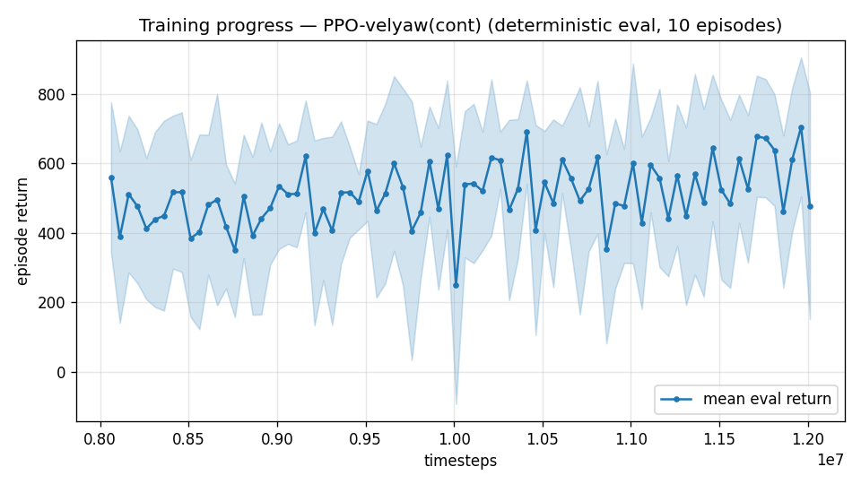

# Trial 27 — xw27: trim-initialized training (E1) at the mid band

## Why (the sharpest mechanism finding of the campaign)
INFLIGHT-HOLD discriminator (eval_inflight.py, per-draw exact trim starts, n=60/60/30):
| policy | rest-start median | FROM-PERFECT-TRIM median | reading |
|---|---|---|---|
| xw26b (mid spec.) | 4.44 | **3.99, 0%<1** | cannot hold even when handed the solution |
| xw17 @ mid | 3.89 | **3.09, 0%<1** | same deficit |
| xw18b (low, sanity) | 0.90 | **0.77, 60%<1** | HOLDS — validates the diagnostic |

Reward accounting says trim-hold would pay ~20x the observed policies' average reward →
this is a MISSING SKILL, not a reward preference: near-trim wing-borne states are never
visited under the isotropic init (P≈0), so stabilizing them is never learned. The 20 s
rescore of xw26b (9.02 mean / p90 27.3) shows episodes DIVERGE with time — marginal
instability, consistent with an unlearned stabilization skill.
Distinct from trial-03 tough-init (failure-state exposure vs GOAL-state exposure; there
the reward blocked recovery — here reward at the goal state is maximal).

## What (vs xw26: ONE change)
`--trim-init 0.2` — 20% of training episodes start AT the target velocity (+N(0,1) m/s)
in near-trim attitude (canonical trim table + 10 deg scatter, fins/motors preset at trim).

## Exact code changes
- `build_trim_table.py` (NEW): 20 speeds x 9 path angles, warm-started Nelder-Mead on the
  nominal-coefficient model; nominal residual 0.000; residual under random ±20% DR draw:
  mean 0.85 / p90 1.61 m/s² (near-trim, NOT exact — deviation from ULTIMATE_PLAN's 0.5
  threshold accepted for TRAINING init because deliberate scatter is added anyway).
- `rate_vel_aviary.py`: `trim_init_frac` param + `_apply_trim_init()` (table lookup,
  rotate canonical entry to episode heading, scatter, reset base state + fins + motors).
- `train.py`: `--trim-init` flag -> config `trim_init` -> train_kwargs only (eval stays
  rest-start); `continue_train.py`: passthrough.
- `eval_inflight.py` (NEW): the discriminator itself.

## Command (auto chain, launched 2026-07-31 16:1x)
```bash
python train.py --xwing-aero --yaw-bias 0.3 --max-speed 18 --speed-min 10 --wind-max 15 \
    --yaw-gate --yaw-att-gate --vel-precision 0.7 --cov-width 5 --ent-coef 0.003 \
    --trim-init 0.2 \
    --n-envs 6 --timesteps 8000000 --device cpu --out-dir results_velyaw_xw27 \
&& continue +4M @1e-4 && analyze && log_trial
```

## Pre-registered criteria (8 s rest-start protocol, 100 eps; xw26b = 6.33/4.44/0%<1 baseline)
- **SUCCESS**: median ≤ 2.0 OR %<1 ≥ 25% — hold-skill mechanism confirmed; converge and
  transfer the recipe to the high band immediately.
- **PROGRESS**: median 2-3.5 with inflight-hold median < 1.5 — skill learned but approach
  still weak; raise trim-init to 0.3-0.4 and/or extend convergence.
- **FAILURE**: ≈ xw26b (median ≥ 3.5) — hold-data scarcity refuted as the mid blocker;
  next: M4d reward accounting on traces + integral-railing replay (E4 path).

## Result
*(auto-appended by log_trial.py when the chain lands)*

---

## AUTO-CAPTURED RESULTS (2026-07-31 18:39)

**config**: `{"max_speed": 18.0, "speed_min": 10.0, "wind_max": 15.0, "use_integral": true, "use_yaw_integral": true, "use_wind_est": true, "yaw_width": 0.35, "yaw_weight": 1.0, "yaw_bias": 0.3, "heading_frame": false, "xwing_aero": true, "tough_init": 0.0, "wind_curriculum": false, "yaw_gate": true, "yaw_gate_floor": 0.2, "vel_precision": 0.7, "trim_init": 0.2, "yaw_att_gate": true, "cov_width": 5.0, "kp_rate": "25,25,15", "ki_rate": "6,6,3", "aero_dr": true, "integral_tau": 3.0, "ent_coef": 0.003, "gamma": 0.99, "episode_len": 8.0}`

**eval curve**: n=80, first 561, best 705 @ 11,961,618, last 478 (final steps 12,011,616)

**late trend**: still rising (last-10% mean 596 vs prior-10% 542)





### Physical eval
```
=== PHYSICAL EVAL (level start, full wind, 8s episodes) ===

band           n    mean  median   %<1     p90     yaw
--------------------------------------------------------
mid(10-18)   100    4.09    3.44    1%    7.00   14.5°
--------------------------------------------------------
ALL          100    4.09    3.44    1%    7.00   14.5°   crash 0.0%
wind bins: [0-5) n=23 med 2.58 <1: 4%  [5-10) n=42 med 3.59 <1: 0%  [10-15) n=35 med 3.92 <1: 0%
```


### Dive-recovery test
```
=== DIVE-RECOVERY TEST (60 episodes, all starting in failure states) ===
  recovered (final-2s vel err < 8 m/s):  15/60 = 25%
  partial   (8-15 m/s):                  7/60 = 12%
  median final err: 27.8 m/s   mean: 32.7 m/s
```


### Behavior traces
```
--- trace seed 1005: target [13.   5.7  0.3] (|v|=14.1), wind [ -3.6 -11.6  -3.1] ---
  t= 0.0 |v|=  0.1 vz=   0.0 tilt=   0 verr= 14.2 yawerr=+103.5 fins=( -0.4,-10.5) thr=-0.80
  t= 2.0 |v|=  6.9 vz=   3.5 tilt=  64 verr=  8.8 yawerr= -38.3 fins=(+18.5, +2.9) thr=-1.00
  t= 4.0 |v|= 10.0 vz=   1.7 tilt=  64 verr=  5.1 yawerr=  -1.5 fins=(+13.3,+17.0) thr=-0.16
  t= 6.0 |v|= 12.2 vz=   1.5 tilt=  45 verr=  4.9 yawerr= +25.9 fins=(+18.5,-10.8) thr=-1.00
--- trace seed 1012: target [  5.5 -14.6   1.2] (|v|=15.7), wind [-0.3  4.1 -6.1] ---
  t= 0.0 |v|=  0.0 vz=  -0.0 tilt=   0 verr= 15.7 yawerr= +46.7 fins=( +9.6, -8.9) thr=-0.98
  t= 2.0 |v|=  8.5 vz=   1.4 tilt=  26 verr=  7.2 yawerr= +16.9 fins=(-20.0,-18.2) thr=-1.00
  t= 4.0 |v|= 10.9 vz=   2.9 tilt=  44 verr=  5.8 yawerr=  -4.9 fins=(-20.0,-18.2) thr=-1.00
  t= 6.0 |v|= 11.2 vz=   2.7 tilt=  30 verr=  5.1 yawerr=  -2.2 fins=(-20.0,-18.2) thr=-1.00
--- trace seed 1020: target [-9.8 11.   0.9] (|v|=14.7), wind [-0.3 -1.2 -0.6] ---
  t= 0.0 |v|=  0.0 vz=   0.0 tilt=   0 verr= 14.7 yawerr= -65.7 fins=( +5.4,-10.3) thr=-0.85
  t= 2.0 |v|= 13.4 vz=   1.3 tilt=  50 verr=  2.8 yawerr= +32.0 fins=( -7.2,-20.0) thr=-0.74
  t= 4.0 |v|= 14.2 vz=   1.6 tilt=  50 verr=  2.5 yawerr=  -4.5 fins=(+11.5,-11.0) thr=-1.00
  t= 6.0 |v|= 13.7 vz=  -0.6 tilt=  37 verr=  1.8 yawerr= +13.8 fins=(+20.0,-20.0) thr=-0.52
```

## VERDICT (hand-written): DIRECTIONAL SUCCESS — biggest single-change mid improvement yet
8 s rest protocol (auto): **4.09 mean / 3.44 median / 1% <1 / p90 7.00 / yaw 14.5°**
vs xw26b baseline (same recipe, no trim-init): 6.33 / 4.44 / 0% / 11.81 / 52.3°.
ONE change bought: mean −35%, p90 −41%, and — unexpectedly — **yaw 52°→14.5°** (trim
starts teach coordinated wing-borne flight where the weathervane serves heading).
Pre-registered bands: median 3.44 sits at the PROGRESS/FAILURE boundary (2–3.5) →
classification decided by the inflight-hold check (PROGRESS requires hold median <1.5):
see addendum below. Mechanism (goal-state exposure) confirmed directionally; 0.2 fraction
insufficient alone → next: trim-init 0.4 (xw28).

### Inflight-hold addendum (n=60, 20 s)
xw27b from PERFECT per-draw trim: **mean 4.20 / median 3.27 / 0% <1** (xw26b was 3.99
median). Hold improved but far from the <1.5 PROGRESS bar → strict classification:
**FAILURE-side PROGRESS** — the mechanism moves every metric in the right direction but a
0.2 dose does not install the skill. Rest-median (3.44) ≈ hold-median (3.27): the approach
phase is no longer the bottleneck; hold quality is the whole residual. Dose–response
(xw28 @ 0.4) decides whether exposure scales or the skill's learnability is impeded
(reward discrimination near d≈2–3, or DR variability vs the memoryless policy).
