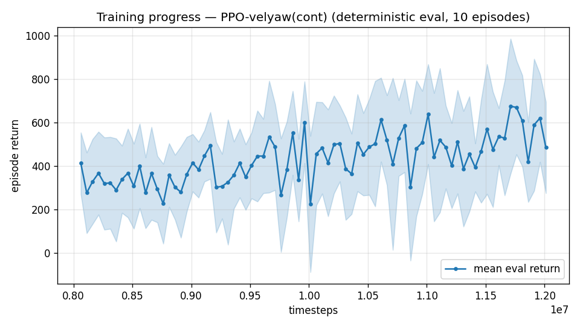

# Trial 28 — xw28: mid band, trim-init 0.4

## Why
xw27 (trim-init 0.2) delivered the biggest single-change mid improvement of the campaign
(6.33→4.09 mean, yaw 52°→14.5°) but median 3.44 is short of the target. Mechanism
(goal-state exposure → hold skill) confirmed directionally; dose–response test: 0.2 → 0.4.
ONE change vs xw27 (which is the controlled baseline).

## Command (auto chain)
xw27 command with `--trim-init 0.4`, out-dir results_velyaw_xw28. No new code.

## Pre-registered criteria (8 s rest protocol, 100 eps; xw27b = 4.09/3.44/1% baseline)
- **SUCCESS**: median ≤ 2.0 OR %<1 ≥ 25% → converge (S1) and push to <1.
- **PROGRESS**: median 2.4–3.4 (monotone dose–response) → try 0.6 + longer convergence.
- **FAILURE**: ≥ xw27b (3.44) — dose saturated at 0.2; the remaining deficit is approach/
  transition, not hold → E2 speed-mix or approach-shaping next.

## Result
*(auto-appended)*

---

## AUTO-CAPTURED RESULTS (2026-08-01 00:11)

**config**: `{"max_speed": 18.0, "speed_min": 10.0, "wind_max": 15.0, "use_integral": true, "use_yaw_integral": true, "use_wind_est": true, "yaw_width": 0.35, "yaw_weight": 1.0, "yaw_bias": 0.3, "heading_frame": false, "xwing_aero": true, "tough_init": 0.0, "wind_curriculum": false, "yaw_gate": true, "yaw_gate_floor": 0.2, "vel_precision": 0.7, "trim_init": 0.4, "yaw_att_gate": true, "cov_width": 5.0, "kp_rate": "25,25,15", "ki_rate": "6,6,3", "aero_dr": true, "integral_tau": 3.0, "ent_coef": 0.003, "gamma": 0.99, "episode_len": 8.0}`

**eval curve**: n=80, first 413, best 676 @ 11,711,628, last 486 (final steps 12,011,616)

**late trend**: still rising (last-10% mean 575 vs prior-10% 475)





### Physical eval
```
=== PHYSICAL EVAL (level start, full wind, 8s episodes) ===

band           n    mean  median   %<1     p90     yaw
--------------------------------------------------------
mid(10-18)   100    4.64    3.38    2%    9.90   13.0°
--------------------------------------------------------
ALL          100    4.64    3.38    2%    9.90   13.0°   crash 0.0%
wind bins: [0-5) n=23 med 2.98 <1: 0%  [5-10) n=42 med 3.22 <1: 2%  [10-15) n=35 med 6.03 <1: 3%
```


### Dive-recovery test
```
=== DIVE-RECOVERY TEST (60 episodes, all starting in failure states) ===
  recovered (final-2s vel err < 8 m/s):  16/60 = 27%
  partial   (8-15 m/s):                  6/60 = 10%
  median final err: 31.6 m/s   mean: 33.1 m/s
```


### Behavior traces
```
--- trace seed 1005: target [13.   5.7  0.3] (|v|=14.1), wind [ -3.6 -11.6  -3.1] ---
  t= 0.0 |v|=  0.1 vz=   0.0 tilt=   0 verr= 14.2 yawerr=+103.5 fins=( +9.0,-10.5) thr=-1.00
  t= 2.0 |v|= 11.5 vz=   0.4 tilt=  59 verr=  6.2 yawerr= +45.6 fins=( +4.1, +7.0) thr=-1.00
  t= 4.0 |v|= 12.6 vz=   4.7 tilt=  57 verr= 10.0 yawerr= +13.4 fins=(-18.0,-20.0) thr=-1.00
  t= 6.0 |v|= 13.7 vz=  -0.9 tilt=  31 verr= 11.3 yawerr= +16.1 fins=(-14.3,-20.0) thr=-1.00
--- trace seed 1012: target [  5.5 -14.6   1.2] (|v|=15.7), wind [-0.3  4.1 -6.1] ---
  t= 0.0 |v|=  0.0 vz=  -0.0 tilt=   0 verr= 15.7 yawerr= +46.7 fins=(+10.1, -8.9) thr=-1.00
  t= 2.0 |v|=  7.7 vz=  -1.0 tilt=  28 verr=  8.5 yawerr=  -7.2 fins=(-20.0,-11.3) thr=-0.18
  t= 4.0 |v|= 10.8 vz=   0.3 tilt=  32 verr=  5.1 yawerr= +12.2 fins=(-20.0,-10.4) thr=-1.00
  t= 6.0 |v|= 11.0 vz=  -0.1 tilt=  32 verr=  4.8 yawerr= +20.4 fins=(-17.9,-12.5) thr=-0.81
--- trace seed 1020: target [-9.8 11.   0.9] (|v|=14.7), wind [-0.3 -1.2 -0.6] ---
  t= 0.0 |v|=  0.0 vz=   0.0 tilt=   0 verr= 14.7 yawerr= -65.7 fins=( -9.7, -8.9) thr=-1.00
  t= 2.0 |v|= 14.4 vz=   1.0 tilt=  66 verr=  1.9 yawerr= +15.3 fins=(-19.9,-20.0) thr=-0.38
  t= 4.0 |v|= 13.0 vz=   0.1 tilt=  32 verr=  2.2 yawerr= +11.9 fins=(-19.9,-20.0) thr=-0.27
  t= 6.0 |v|= 12.4 vz=   0.1 tilt=  30 verr=  3.0 yawerr=  -2.1 fins=(-19.9,-20.0) thr=-0.16
```

---

## AUTO-CAPTURED RESULTS (2026-08-01 00:16)

**config**: `{"max_speed": 18.0, "speed_min": 10.0, "wind_max": 15.0, "use_integral": true, "use_yaw_integral": true, "use_wind_est": true, "yaw_width": 0.35, "yaw_weight": 1.0, "yaw_bias": 0.3, "heading_frame": false, "xwing_aero": true, "tough_init": 0.0, "wind_curriculum": false, "yaw_gate": true, "yaw_gate_floor": 0.2, "vel_precision": 0.7, "trim_init": 0.4, "yaw_att_gate": true, "cov_width": 5.0, "kp_rate": "25,25,15", "ki_rate": "6,6,3", "aero_dr": true, "integral_tau": 3.0, "ent_coef": 0.003, "gamma": 0.99, "episode_len": 8.0}`

**eval curve**: n=80, first 413, best 676 @ 11,711,628, last 486 (final steps 12,011,616)

**late trend**: still rising (last-10% mean 575 vs prior-10% 475)


### Physical eval
```
=== PHYSICAL EVAL (level start, full wind, 8s episodes) ===

band           n    mean  median   %<1     p90     yaw
--------------------------------------------------------
mid(10-18)   100    4.64    3.38    2%    9.90   13.0°
--------------------------------------------------------
ALL          100    4.64    3.38    2%    9.90   13.0°   crash 0.0%
wind bins: [0-5) n=23 med 2.98 <1: 0%  [5-10) n=42 med 3.22 <1: 2%  [10-15) n=35 med 6.03 <1: 3%
```


### Dive-recovery test
```
=== DIVE-RECOVERY TEST (60 episodes, all starting in failure states) ===
  recovered (final-2s vel err < 8 m/s):  16/60 = 27%
  partial   (8-15 m/s):                  6/60 = 10%
  median final err: 31.6 m/s   mean: 33.1 m/s
```


### Behavior traces
```
--- trace seed 1005: target [13.   5.7  0.3] (|v|=14.1), wind [ -3.6 -11.6  -3.1] ---
  t= 0.0 |v|=  0.1 vz=   0.0 tilt=   0 verr= 14.2 yawerr=+103.5 fins=( +9.0,-10.5) thr=-1.00
  t= 2.0 |v|= 11.5 vz=   0.4 tilt=  59 verr=  6.2 yawerr= +45.6 fins=( +4.1, +7.0) thr=-1.00
  t= 4.0 |v|= 12.6 vz=   4.7 tilt=  57 verr= 10.0 yawerr= +13.4 fins=(-18.0,-20.0) thr=-1.00
  t= 6.0 |v|= 13.7 vz=  -0.9 tilt=  31 verr= 11.3 yawerr= +16.1 fins=(-14.3,-20.0) thr=-1.00
--- trace seed 1012: target [  5.5 -14.6   1.2] (|v|=15.7), wind [-0.3  4.1 -6.1] ---
  t= 0.0 |v|=  0.0 vz=  -0.0 tilt=   0 verr= 15.7 yawerr= +46.7 fins=(+10.1, -8.9) thr=-1.00
  t= 2.0 |v|=  7.7 vz=  -1.0 tilt=  28 verr=  8.5 yawerr=  -7.2 fins=(-20.0,-11.3) thr=-0.18
  t= 4.0 |v|= 10.8 vz=   0.3 tilt=  32 verr=  5.1 yawerr= +12.2 fins=(-20.0,-10.4) thr=-1.00
  t= 6.0 |v|= 11.0 vz=  -0.1 tilt=  32 verr=  4.8 yawerr= +20.4 fins=(-17.9,-12.5) thr=-0.81
--- trace seed 1020: target [-9.8 11.   0.9] (|v|=14.7), wind [-0.3 -1.2 -0.6] ---
  t= 0.0 |v|=  0.0 vz=   0.0 tilt=   0 verr= 14.7 yawerr= -65.7 fins=( -9.7, -8.9) thr=-1.00
  t= 2.0 |v|= 14.4 vz=   1.0 tilt=  66 verr=  1.9 yawerr= +15.3 fins=(-19.9,-20.0) thr=-0.38
  t= 4.0 |v|= 13.0 vz=   0.1 tilt=  32 verr=  2.2 yawerr= +11.9 fins=(-19.9,-20.0) thr=-0.27
  t= 6.0 |v|= 12.4 vz=   0.1 tilt=  30 verr=  3.0 yawerr=  -2.1 fins=(-19.9,-20.0) thr=-0.16
```

## VERDICT (hand-written): DOSE–RESPONSE FLAT — exposure saturated at 0.2
8 s rest protocol: **4.64 mean / 3.38 median / 2% <1 / p90 9.90 / yaw 13.0°** vs xw27b
(dose 0.2): 4.09 / 3.44 / 1% / 7.00 / 14.5°. Median unchanged (3.38≈3.44), mean and p90
WORSE. Doubling goal-state exposure bought nothing → the hold skill is not exposure-limited;
its LEARNABILITY is impeded. Per ULTIMATE_PLAN the two suspects are (a) advantage noise
under DR (critic cannot predict returns across hidden draws → fine corrections drown) →
E6 privileged critic (xw30), and (b) insufficient reward discrimination near d≈2–3 →
precision reshaping (xw31). Both launched as parallel single-variable arms vs xw27.
