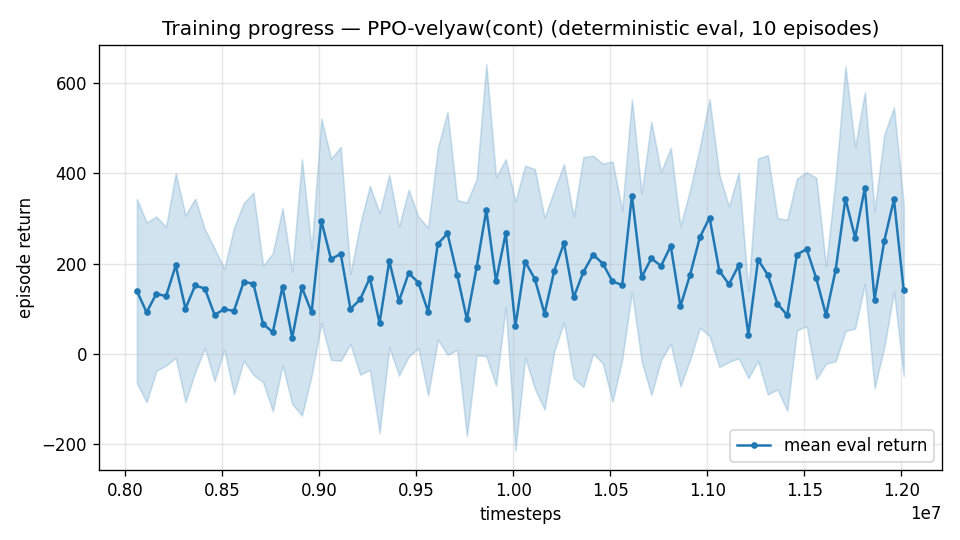

# Trial 29 — xw29: HIGH band anchor + trim-init 0.2

## Why
The high band has NO clean RL datapoint (all prior: γ-0.997/stiff-contaminated; best 8.94
mean / 8.62 median @ 20 s). Physics is proven feasible for 100% of draws (trial 21 add.
5–6). This run establishes the high anchor on the proven recipe (γ 0.99, leaky τ=3, 8 s,
default gains) **plus trim-init 0.2**.

**Documented deviation from one-variable discipline** (ULTIMATE_PLAN S3 wanted the anchor
verbatim): trim-init is bundled because (a) it is now directionally validated at mid with
a clear mechanism (hold-skill exposure), (b) it showed zero downside (yaw improved too),
(c) the high band's approach phase is longest, so pure-recipe anchors risk never sampling
the band at all (3.2% usable-gradient starts per the desert analysis). Attribution is
recovered post-hoc via the inflight-hold discriminator (hold skill measured directly).

## Command (auto chain)
xw27 command with `--speed-min 18 --max-speed 25 --trim-init 0.2`, out results_velyaw_xw29.

## Pre-registered criteria (8 s rest protocol, 100 eps)
- **GOOD**: mean ≤ 6 AND median ≤ 3.9 (classical parity) → converge + dose-response next.
- **PROGRESS**: median 3.9–6.5 but inflight-hold median < 2 → hold learned, approach is
  the residual → E2 speed-mix at high.
- **FAILURE**: median ≥ 6.5 AND inflight-hold ≥ 3 → hold unlearnable at high Q with this
  inner loop → revisit actuation (elevon-led control) before more RL.

## Result
*(auto-appended)*

---

## AUTO-CAPTURED RESULTS (2026-08-01 00:11)

**config**: `{"max_speed": 25.0, "speed_min": 18.0, "wind_max": 15.0, "use_integral": true, "use_yaw_integral": true, "use_wind_est": true, "yaw_width": 0.35, "yaw_weight": 1.0, "yaw_bias": 0.3, "heading_frame": false, "xwing_aero": true, "tough_init": 0.0, "wind_curriculum": false, "yaw_gate": true, "yaw_gate_floor": 0.2, "vel_precision": 0.7, "trim_init": 0.2, "yaw_att_gate": true, "cov_width": 5.0, "kp_rate": "25,25,15", "ki_rate": "6,6,3", "aero_dr": true, "integral_tau": 3.0, "ent_coef": 0.003, "gamma": 0.99, "episode_len": 8.0}`

**eval curve**: n=80, first 139, best 367 @ 11,811,624, last 141 (final steps 12,011,616)

**late trend**: still rising (last-10% mean 251 vs prior-10% 160)





### Physical eval
```
=== PHYSICAL EVAL (level start, full wind, 8s episodes) ===

band           n    mean  median   %<1     p90     yaw
--------------------------------------------------------
high(18-25)  100    7.38    5.88    0%   12.36   35.6°
--------------------------------------------------------
ALL          100    7.38    5.88    0%   12.36   35.6°   crash 0.0%
wind bins: [0-5) n=23 med 5.52 <1: 0%  [5-10) n=42 med 5.86 <1: 0%  [10-15) n=35 med 6.69 <1: 0%
```


### Dive-recovery test
```
=== DIVE-RECOVERY TEST (60 episodes, all starting in failure states) ===
  recovered (final-2s vel err < 8 m/s):  16/60 = 27%
  partial   (8-15 m/s):                  16/60 = 27%
  median final err: 13.6 m/s   mean: 21.2 m/s
```


### Behavior traces
```
--- trace seed 1005: target [19.8  8.7  0.4] (|v|=21.6), wind [ -3.6 -11.6  -3.1] ---
  t= 0.0 |v|=  0.1 vz=   0.0 tilt=   0 verr= 21.7 yawerr=+103.5 fins=( +9.0,-10.5) thr=-1.00
  t= 2.0 |v|= 10.6 vz=   0.3 tilt=  39 verr= 12.7 yawerr= +28.7 fins=(+18.4, -4.3) thr=-1.00
  t= 4.0 |v|= 12.4 vz=  -6.8 tilt=  48 verr= 16.6 yawerr= +38.4 fins=(+18.5, -5.3) thr=-0.67
  t= 6.0 |v|= 13.5 vz=  -4.7 tilt=  38 verr= 10.6 yawerr= +61.6 fins=(+18.5,-12.2) thr=+0.00
--- trace seed 1012: target [  8.1 -21.4   1.8] (|v|=23.0), wind [-0.3  4.1 -6.1] ---
  t= 0.0 |v|=  0.0 vz=   0.0 tilt=   0 verr= 23.0 yawerr= +46.7 fins=(+10.1, -8.3) thr=+0.03
  t= 2.0 |v|= 15.6 vz=  -2.8 tilt=  54 verr=  8.9 yawerr= -17.2 fins=(-19.8,-18.2) thr=-0.82
  t= 4.0 |v|= 18.1 vz=   2.2 tilt=  48 verr=  5.0 yawerr=  +4.7 fins=( -5.2,-18.2) thr=-0.96
  t= 6.0 |v|= 18.4 vz=   3.3 tilt=  45 verr=  5.0 yawerr=  -5.2 fins=(+10.4,-18.2) thr=-1.00
--- trace seed 1020: target [-14.7  16.5   1.4] (|v|=22.1), wind [-0.3 -1.2 -0.6] ---
  t= 0.0 |v|=  0.0 vz=   0.0 tilt=   0 verr= 22.1 yawerr= -65.7 fins=( -9.7,+10.9) thr=-0.96
  t= 2.0 |v|= 14.1 vz=   0.1 tilt=  45 verr=  8.5 yawerr= +77.1 fins=( +8.6,-20.0) thr=-0.63
  t= 4.0 |v|= 21.5 vz=   6.5 tilt=  41 verr=  5.5 yawerr= +39.1 fins=(+11.7,-20.0) thr=-1.00
  t= 6.0 |v|= 18.1 vz=   4.7 tilt=  58 verr=  6.1 yawerr= +24.6 fins=(-14.5,-20.0) thr=-1.00
```

---

## AUTO-CAPTURED RESULTS (2026-08-01 00:19)

**config**: `{"max_speed": 25.0, "speed_min": 18.0, "wind_max": 15.0, "use_integral": true, "use_yaw_integral": true, "use_wind_est": true, "yaw_width": 0.35, "yaw_weight": 1.0, "yaw_bias": 0.3, "heading_frame": false, "xwing_aero": true, "tough_init": 0.0, "wind_curriculum": false, "yaw_gate": true, "yaw_gate_floor": 0.2, "vel_precision": 0.7, "trim_init": 0.2, "yaw_att_gate": true, "cov_width": 5.0, "kp_rate": "25,25,15", "ki_rate": "6,6,3", "aero_dr": true, "integral_tau": 3.0, "ent_coef": 0.003, "gamma": 0.99, "episode_len": 8.0}`

**eval curve**: n=80, first 139, best 367 @ 11,811,624, last 141 (final steps 12,011,616)

**late trend**: still rising (last-10% mean 251 vs prior-10% 160)


### Physical eval
```
=== PHYSICAL EVAL (level start, full wind, 8s episodes) ===

band           n    mean  median   %<1     p90     yaw
--------------------------------------------------------
high(18-25)  100    7.38    5.88    0%   12.36   35.6°
--------------------------------------------------------
ALL          100    7.38    5.88    0%   12.36   35.6°   crash 0.0%
wind bins: [0-5) n=23 med 5.52 <1: 0%  [5-10) n=42 med 5.86 <1: 0%  [10-15) n=35 med 6.69 <1: 0%
```


### Dive-recovery test
```
=== DIVE-RECOVERY TEST (60 episodes, all starting in failure states) ===
  recovered (final-2s vel err < 8 m/s):  16/60 = 27%
  partial   (8-15 m/s):                  16/60 = 27%
  median final err: 13.6 m/s   mean: 21.2 m/s
```


### Behavior traces
```
--- trace seed 1005: target [19.8  8.7  0.4] (|v|=21.6), wind [ -3.6 -11.6  -3.1] ---
  t= 0.0 |v|=  0.1 vz=   0.0 tilt=   0 verr= 21.7 yawerr=+103.5 fins=( +9.0,-10.5) thr=-1.00
  t= 2.0 |v|= 10.6 vz=   0.3 tilt=  39 verr= 12.7 yawerr= +28.7 fins=(+18.4, -4.3) thr=-1.00
  t= 4.0 |v|= 12.4 vz=  -6.8 tilt=  48 verr= 16.6 yawerr= +38.4 fins=(+18.5, -5.3) thr=-0.67
  t= 6.0 |v|= 13.5 vz=  -4.7 tilt=  38 verr= 10.6 yawerr= +61.6 fins=(+18.5,-12.2) thr=+0.00
--- trace seed 1012: target [  8.1 -21.4   1.8] (|v|=23.0), wind [-0.3  4.1 -6.1] ---
  t= 0.0 |v|=  0.0 vz=   0.0 tilt=   0 verr= 23.0 yawerr= +46.7 fins=(+10.1, -8.3) thr=+0.03
  t= 2.0 |v|= 15.6 vz=  -2.8 tilt=  54 verr=  8.9 yawerr= -17.2 fins=(-19.8,-18.2) thr=-0.82
  t= 4.0 |v|= 18.1 vz=   2.2 tilt=  48 verr=  5.0 yawerr=  +4.7 fins=( -5.2,-18.2) thr=-0.96
  t= 6.0 |v|= 18.4 vz=   3.3 tilt=  45 verr=  5.0 yawerr=  -5.2 fins=(+10.4,-18.2) thr=-1.00
--- trace seed 1020: target [-14.7  16.5   1.4] (|v|=22.1), wind [-0.3 -1.2 -0.6] ---
  t= 0.0 |v|=  0.0 vz=   0.0 tilt=   0 verr= 22.1 yawerr= -65.7 fins=( -9.7,+10.9) thr=-0.96
  t= 2.0 |v|= 14.1 vz=   0.1 tilt=  45 verr=  8.5 yawerr= +77.1 fins=( +8.6,-20.0) thr=-0.63
  t= 4.0 |v|= 21.5 vz=   6.5 tilt=  41 verr=  5.5 yawerr= +39.1 fins=(+11.7,-20.0) thr=-1.00
  t= 6.0 |v|= 18.1 vz=   4.7 tilt=  58 verr=  6.1 yawerr= +24.6 fins=(-14.5,-20.0) thr=-1.00
```

## VERDICT (hand-written): BEST HIGH-BAND RESULT EVER — and the same hold signature as mid
8 s rest protocol: **7.38 mean / 5.88 median / 0% <1 / yaw 35.6°** vs prior best 8.94 mean /
8.62 median (20 s, γ-contaminated) and classical median 3.90. Uniform across wind bins.
Inflight-hold (n=60, 20 s): **6.29 median from PERFECT trim** ≈ rest median → identical
signature to mid: approach is fine, HOLD is the whole deficit. Pre-registered: not GOOD
(median >3.9), not PROGRESS (hold ≥2), not FAILURE (median <6.5) — classified as
**velocity-best/hold-unlearned**. Consequence: the mid-band arms (xw30 priv-critic vs
xw31 precision) decide the high band too; no separate high-band mechanism hunt needed yet.
