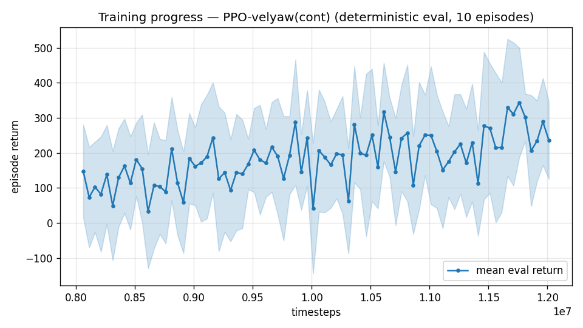

# Trial 30 — xw30: asymmetric privileged critic (E6) at the mid band

## Why
Trim-init dose–response is FLAT (trials 27/28: 0.2→0.4 changed nothing) and hold-from-
perfect-trim stalls at ~3.3 (mid) / ~6.3 (high): the hold skill's learnability is impeded,
not its exposure. Leading suspect (ULTIMATE_PLAN E6): under ±20% aero DR + hidden mass/
motor/fin/wind draws, the SAME state-action yields wildly different returns → the critic's
value error is irreducible → advantage noise drowns the small gradient of fine (<1 m/s)
corrections. Fix: critic sees the hidden draw; actor stays deployable.

## What (vs xw27: ONE training-machinery change, zero deployment change)
`--priv-critic`: obs +27 dims (aero_rand−1 [17], XG/mass/motor-τ normalized [3],
fin gain−1 [2], fin offset [2], wind/15 [3]) consumed ONLY by the value network;
the policy network slices the first 40 dims (priv_policy.py).

## Exact code changes
- `priv_policy.py` (NEW): PrivExtractor (policy branch reads obs[..., :actor_dim];
  value branch reads all) + PrivACPolicy (actor_dim via policy_kwargs).
- `rate_vel_aviary.py`: `priv_obs` flag; +27 obs dims appended in _computeObs;
  _observationSpace grows accordingly.
- `train.py`: `--priv-critic` → env priv_obs + PrivACPolicy + actor_dim = obs−27;
  config key priv_critic; eval_velyaw/continue_train passthrough.
Smoke-tested: 20k steps + eval load OK.

## Command (auto chain; analysis via watchdog.sh)
xw27 command + `--priv-critic`, out results_velyaw_xw30.

## Pre-registered criteria (8 s rest, 100 eps; xw27b = 4.09/3.44/1% baseline)
- **SUCCESS**: median ≤ 2.4 (−30%) or %<1 ≥ 15% → E6 confirmed; adopt everywhere,
  converge, transfer to high band.
- **PROGRESS**: median 2.4–3.1 → combine with xw31's winner, extend convergence.
- **FAILURE**: ≥ 3.4 → advantage noise refuted as the binder; escalate to the
  teacher–student path (K4b) or actuation review.

---

## AUTO-CAPTURED RESULTS (2026-08-01 02:37)

**config**: `{"max_speed": 18.0, "speed_min": 10.0, "wind_max": 15.0, "use_integral": true, "use_yaw_integral": true, "use_wind_est": true, "yaw_width": 0.35, "yaw_weight": 1.0, "yaw_bias": 0.3, "heading_frame": false, "xwing_aero": true, "tough_init": 0.0, "wind_curriculum": false, "yaw_gate": true, "yaw_gate_floor": 0.2, "vel_precision": 0.7, "trim_init": 0.2, "priv_critic": true, "yaw_att_gate": true, "cov_width": 5.0, "kp_rate": "25,25,15", "ki_rate": "6,6,3", "aero_dr": true, "integral_tau": 3.0, "ent_coef": 0.003, "gamma": 0.99, "episode_len": 8.0}`

**eval curve**: n=80, first 148, best 344 @ 11,761,626, last 236 (final steps 12,011,616)

**late trend**: still rising (last-10% mean 281 vs prior-10% 215)





### Physical eval
```
=== PHYSICAL EVAL (level start, full wind, 8s episodes) ===

band           n    mean  median   %<1     p90     yaw
--------------------------------------------------------
mid(10-18)   100    7.49    5.13    0%   15.78   54.3°
--------------------------------------------------------
ALL          100    7.49    5.13    0%   15.78   54.3°   crash 0.0%
wind bins: [0-5) n=23 med 3.72 <1: 0%  [5-10) n=42 med 5.56 <1: 0%  [10-15) n=35 med 6.33 <1: 0%
```


### Dive-recovery test
```
=== DIVE-RECOVERY TEST (60 episodes, all starting in failure states) ===
  recovered (final-2s vel err < 8 m/s):  16/60 = 27%
  partial   (8-15 m/s):                  9/60 = 15%
  median final err: 22.8 m/s   mean: 21.9 m/s
```


### Behavior traces
```
--- trace seed 1005: target [13.   5.7  0.3] (|v|=14.1), wind [ -3.6 -11.6  -3.1] ---
  t= 0.0 |v|=  0.1 vz=   0.0 tilt=   0 verr= 14.2 yawerr=+103.5 fins=( +4.9,+10.4) thr=+0.31
  t= 2.0 |v|=  3.8 vz=  -1.9 tilt=  48 verr= 12.8 yawerr= +85.8 fins=(+18.4,+20.0) thr=+0.13
  t= 4.0 |v|=  9.7 vz=  -5.7 tilt=  31 verr= 11.3 yawerr=+157.7 fins=(-18.0,-12.2) thr=+0.30
  t= 6.0 |v|= 15.8 vz=  -8.6 tilt= 101 verr= 16.0 yawerr= +29.8 fins=(-18.0,-10.4) thr=+1.00
--- trace seed 1012: target [  5.5 -14.6   1.2] (|v|=15.7), wind [-0.3  4.1 -6.1] ---
  t= 0.0 |v|=  0.0 vz=   0.0 tilt=   0 verr= 15.7 yawerr= +46.7 fins=( -2.2, +9.8) thr=+0.10
  t= 2.0 |v|=  9.2 vz=   3.7 tilt=  31 verr=  7.8 yawerr= -39.0 fins=( -8.6,+17.0) thr=+0.23
  t= 4.0 |v|= 13.1 vz=   4.9 tilt=  14 verr=  5.1 yawerr= +52.8 fins=(-13.5, -0.3) thr=-0.53
  t= 6.0 |v|= 14.6 vz=   8.5 tilt=  33 verr=  8.7 yawerr=  +4.4 fins=( +4.3, +8.0) thr=-1.00
--- trace seed 1020: target [-9.8 11.   0.9] (|v|=14.7), wind [-0.3 -1.2 -0.6] ---
  t= 0.0 |v|=  0.0 vz=   0.0 tilt=   0 verr= 14.7 yawerr= -65.7 fins=( +7.4, +5.6) thr=+0.14
  t= 2.0 |v|=  8.5 vz=   1.4 tilt= 107 verr=  6.7 yawerr= +16.1 fins=( -5.1,-16.8) thr=+0.37
  t= 4.0 |v|= 13.1 vz=   3.8 tilt=  10 verr=  4.6 yawerr=  +9.4 fins=(+14.8, -7.6) thr=+0.26
  t= 6.0 |v|= 15.2 vz=   0.2 tilt=  78 verr=  4.0 yawerr= -28.8 fins=(-16.6,-20.0) thr=+0.52
```

## VERDICT: FAILURE — regression (7.49 / median 5.13 / yaw 54°). Advantage-noise REFUTED
as the hold binder (the asymmetric critic made things worse, likely value-feature shift
destabilizing early training). E6 closed for the mid band.
