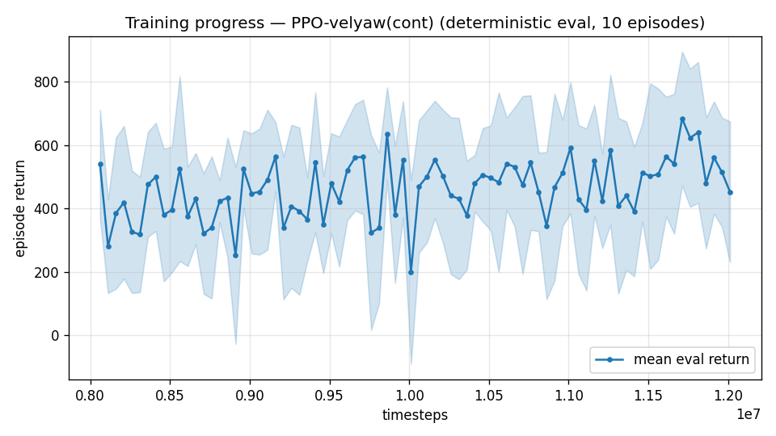

# Trial 31 — xw31: precision-weight reshape at the mid band (parallel arm to xw30)

## Why
The competing suspect for the flat trim-init dose–response: reward discrimination near
d≈2–3 m/s is too weak to pay for the risk/effort of tighter hold (precision peak
0.7·(1−tanh(d/0.5)) is ≈0 beyond d≈1.5; the sharp peak's slope at d=3 is modest).

## What (vs xw27: ONE reward change)
`--vel-precision 1.5` (from 0.7) — doubles the near-zero payout; peak width unchanged.

## Command (auto chain; analysis via watchdog.sh)
xw27 command with `--vel-precision 1.5`, out results_velyaw_xw31. No new code.

## Pre-registered criteria (8 s rest, 100 eps; xw27b = 4.09/3.44/1% baseline)
- **SUCCESS**: median ≤ 2.4 or %<1 ≥ 15% → incentive was the binder; iterate shaping.
- **FAILURE**: ≥ 3.4 → incentive refuted (with trial 07 precedent: precision helped low
  band only); E6's verdict stands alone.
Joint readout with xw30 decides the mechanism; winner's recipe goes to convergence + the
high band.

---

## AUTO-CAPTURED RESULTS (2026-08-01 02:38)

**config**: `{"max_speed": 18.0, "speed_min": 10.0, "wind_max": 15.0, "use_integral": true, "use_yaw_integral": true, "use_wind_est": true, "yaw_width": 0.35, "yaw_weight": 1.0, "yaw_bias": 0.3, "heading_frame": false, "xwing_aero": true, "tough_init": 0.0, "wind_curriculum": false, "yaw_gate": true, "yaw_gate_floor": 0.2, "vel_precision": 1.5, "trim_init": 0.2, "priv_critic": false, "yaw_att_gate": true, "cov_width": 5.0, "kp_rate": "25,25,15", "ki_rate": "6,6,3", "aero_dr": true, "integral_tau": 3.0, "ent_coef": 0.003, "gamma": 0.99, "episode_len": 8.0}`

**eval curve**: n=80, first 540, best 684 @ 11,711,628, last 452 (final steps 12,011,616)

**late trend**: still rising (last-10% mean 562 vs prior-10% 489)





### Physical eval
```
=== PHYSICAL EVAL (level start, full wind, 8s episodes) ===

band           n    mean  median   %<1     p90     yaw
--------------------------------------------------------
mid(10-18)   100    4.53    3.67    0%    6.99   11.8°
--------------------------------------------------------
ALL          100    4.53    3.67    0%    6.99   11.8°   crash 0.0%
wind bins: [0-5) n=23 med 2.85 <1: 0%  [5-10) n=42 med 3.66 <1: 0%  [10-15) n=35 med 5.07 <1: 0%
```


### Dive-recovery test
```
=== DIVE-RECOVERY TEST (60 episodes, all starting in failure states) ===
  recovered (final-2s vel err < 8 m/s):  15/60 = 25%
  partial   (8-15 m/s):                  3/60 = 5%
  median final err: 33.1 m/s   mean: 34.3 m/s
```


### Behavior traces
```
--- trace seed 1005: target [13.   5.7  0.3] (|v|=14.1), wind [ -3.6 -11.6  -3.1] ---
  t= 0.0 |v|=  0.1 vz=   0.0 tilt=   0 verr= 14.2 yawerr=+103.5 fins=( +5.9, -8.6) thr=-0.30
  t= 2.0 |v|=  9.6 vz=   0.9 tilt=  31 verr=  5.9 yawerr=-162.9 fins=(-10.1,-20.0) thr=+0.22
  t= 4.0 |v|= 16.1 vz=   0.4 tilt=  32 verr=  4.5 yawerr= -15.1 fins=(+18.5,+11.8) thr=-0.55
  t= 6.0 |v|=  8.5 vz=   4.0 tilt=  64 verr=  7.7 yawerr=  -3.2 fins=(+18.1,+20.0) thr=-1.00
--- trace seed 1012: target [  5.5 -14.6   1.2] (|v|=15.7), wind [-0.3  4.1 -6.1] ---
  t= 0.0 |v|=  0.0 vz=   0.0 tilt=   0 verr= 15.7 yawerr= +46.7 fins=(+10.1, -8.9) thr=-1.00
  t= 2.0 |v|=  4.0 vz=  -1.8 tilt=  24 verr= 12.5 yawerr= -22.6 fins=(-20.0, -1.7) thr=+0.06
  t= 4.0 |v|=  5.2 vz=   0.1 tilt=  31 verr= 10.5 yawerr=  -7.2 fins=(-19.3,-13.1) thr=-0.32
  t= 6.0 |v|=  6.3 vz=   1.2 tilt=  23 verr= 10.1 yawerr=  -2.4 fins=(-14.8, +7.9) thr=-0.51
--- trace seed 1020: target [-9.8 11.   0.9] (|v|=14.7), wind [-0.3 -1.2 -0.6] ---
  t= 0.0 |v|=  0.0 vz=   0.0 tilt=   0 verr= 14.7 yawerr= -65.7 fins=( -9.7,-10.3) thr=-0.63
  t= 2.0 |v|=  8.1 vz=   2.5 tilt=  58 verr=  7.2 yawerr= +48.5 fins=(+20.0,-20.0) thr=-0.85
  t= 4.0 |v|= 10.1 vz=  -2.8 tilt=  31 verr=  6.3 yawerr=  +3.8 fins=( +7.5,-20.0) thr=-0.08
  t= 6.0 |v|= 11.2 vz=  -1.0 tilt=  27 verr=  4.7 yawerr=  +5.0 fins=( +5.1,-20.0) thr=-0.18
```

## VERDICT: FLAT — 4.53 / median 3.67 ≈ xw27b (3.44). Incentive refuted (trial 07
precedent holds: precision shaping never moves the speed bands). Joint readout with
trial 30: NEITHER value noise nor incentive binds the hold skill.
→ Fine-grained trim traces (trial 32 'Why') found the real mechanism: an unstable
wing-borne equilibrium + a half-tilt zero-thrust behavioral attractor. The policy
cannot learn 50 Hz stabilization of an unstable state by exposure; the classical
cascade holds 0.20 median there because its attitude P-loop stabilizes STRUCTURALLY.

## Exact code changes
No env/trainer code change — one flag value on the existing precision term:
```bash
python train.py ... --vel-precision 1.5     # was 0.7
```
```python
# rate_vel_aviary.py — the term being scaled (unchanged, quoted for reference):
        r_vel = (1.0 - np.tanh(d / 2.0)) + cov
        if self.VEL_PRECISION > 0.0:
            r_vel += self.VEL_PRECISION * (1.0 - np.tanh(d / 0.5))
```
