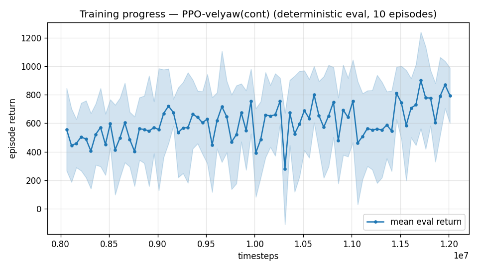
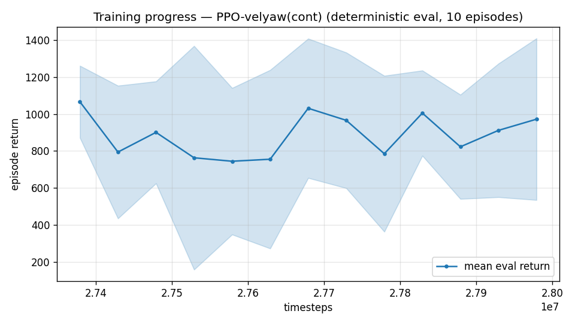
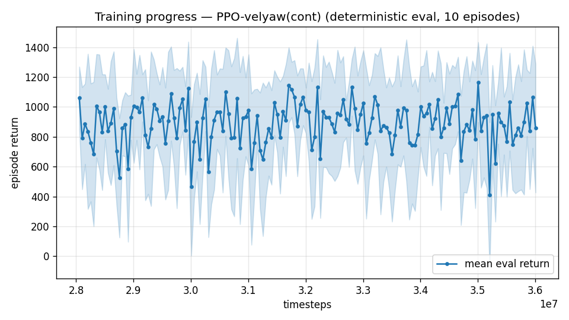

# Trial 32 — xw32: attitude-setpoint action interface (att-cmd), mid band

## Why (mechanism finally pinned)
Fine trim-start traces of xw27b: from EXACT trim the policy jerks away within 0.5 s
(saturated rate commands), then parks in a **half-tilt (30–43°) zero-thrust attractor** at
4–5 m/s error — while table trim needs ~0° elevator and 80–130 N (large margins: authority
is NOT the binder). The wing-borne trim is dynamically unstable; a memoryless 50 Hz
rate-interface policy never learns to stabilize it (exposure at the state produces
divergence within ~1 s regardless — hence FLAT trim-init dose–response, and hence
priv-critic/precision failures: neither touches stabilization).
The classical cascade holds 0.20 median at mid with an attitude P-loop doing exactly this
stabilization structurally. This trial moves that structure INSIDE the action interface —
policy remains full RL (it learns thrust, fins, attitude setpoints, yaw rate end-to-end).

## What
`--att-cmd`: action = [finL, finR, thrust, bz_x, bz_y, yaw_rate]; desired body-z direction
tracked by an inner attitude P (katt 1.5, every physics substep) feeding the existing rate
PID. + trim-init 0.2 (from trim, holding = emitting a constant setpoint — now stable:
constant-attitude sanity test drifts only ~1-2 m/s per 3 s vs sub-second departure before).

## Exact code changes
- `rate_vel_aviary.py`: `att_cmd`/`katt` params; step() decodes a[3:5]→bz_des (norm≤0.985),
  a[5]→yaw rate; `_control_wrench` computes omega_des = katt·axis(bz→bz_des) per substep
  (classical-baseline attitude law), clipped to MAX_RATE.
- `train.py` `--att-cmd --katt`; config + eval/continue passthrough. Smoke-tested 20k.

## Command (auto chain; analysis via watchdog)
xw27 command + `--att-cmd`, out results_velyaw_xw32.

## Pre-registered criteria (8 s rest, 100 eps; xw27b = 4.09/3.44/1%)
- **SUCCESS**: median ≤ 2.0 or %<1 ≥ 20% → interface confirmed; converge + transfer to
  high band and the 25–45 extension immediately.
- **PROGRESS**: median 2.0–3.0 → tune katt / raise trim-init with the stable interface.
- **FAILURE**: ≥ 3.4 → stabilization hypothesis wrong too; escalate to teacher–student
  (K4b) with the full evidence chain.

---

## AUTO-CAPTURED RESULTS (2026-08-01 11:00)

**config**: `{"max_speed": 18.0, "speed_min": 10.0, "wind_max": 15.0, "use_integral": true, "use_yaw_integral": true, "use_wind_est": true, "yaw_width": 0.35, "yaw_weight": 1.0, "yaw_bias": 0.3, "heading_frame": false, "xwing_aero": true, "tough_init": 0.0, "wind_curriculum": false, "yaw_gate": true, "yaw_gate_floor": 0.2, "vel_precision": 0.7, "trim_init": 0.2, "priv_critic": false, "att_cmd": true, "katt": 1.5, "yaw_att_gate": true, "cov_width": 5.0, "kp_rate": "25,25,15", "ki_rate": "6,6,3", "aero_dr": true, "integral_tau": 3.0, "ent_coef": 0.003, "gamma": 0.99, "episode_len": 8.0}`

**eval curve**: n=80, first 556, best 903 @ 11,711,628, last 796 (final steps 12,011,616)

**late trend**: still rising (last-10% mean 782 vs prior-10% 637)





### Physical eval
```
=== PHYSICAL EVAL (level start, full wind, 8s episodes) ===

band           n    mean  median   %<1     p90     yaw
--------------------------------------------------------
mid(10-18)   100    4.61    2.35    7%    8.82   15.7°
--------------------------------------------------------
ALL          100    4.61    2.35    7%    8.82   15.7°   crash 0.0%
wind bins: [0-5) n=23 med 1.59 <1: 13%  [5-10) n=42 med 2.60 <1: 2%  [10-15) n=35 med 3.55 <1: 9%
```


### Dive-recovery test
```
=== DIVE-RECOVERY TEST (60 episodes, all starting in failure states) ===
  recovered (final-2s vel err < 8 m/s):  6/60 = 10%
  partial   (8-15 m/s):                  2/60 = 3%
  median final err: 35.3 m/s   mean: 36.0 m/s
```


### Behavior traces
```
--- trace seed 1005: target [13.   5.7  0.3] (|v|=14.1), wind [ -3.6 -11.6  -3.1] ---
  t= 0.0 |v|=  0.1 vz=   0.0 tilt=   0 verr= 14.2 yawerr=+103.5 fins=( +1.4,-10.5) thr=-0.31
  t= 2.0 |v|=  9.4 vz=  -1.1 tilt=  34 verr=  5.3 yawerr=  +4.2 fins=(-17.3,-20.0) thr=-0.32
  t= 4.0 |v|= 14.1 vz=  -0.8 tilt=  70 verr=  1.4 yawerr= -48.1 fins=(+18.0, +6.5) thr=-0.87
  t= 6.0 |v|=  9.0 vz=  -7.3 tilt=  53 verr= 11.7 yawerr=+152.9 fins=(+18.5,+20.0) thr=+0.77
--- trace seed 1012: target [  5.5 -14.6   1.2] (|v|=15.7), wind [-0.3  4.1 -6.1] ---
  t= 0.0 |v|=  0.0 vz=   0.0 tilt=   0 verr= 15.7 yawerr= +46.7 fins=(-10.5, -8.9) thr=-0.93
  t= 2.0 |v|= 12.8 vz=   0.2 tilt=  42 verr=  3.1 yawerr= -20.8 fins=(-20.0,-18.2) thr=+0.05
  t= 4.0 |v|= 13.4 vz=   0.5 tilt=  40 verr=  2.4 yawerr=  -1.3 fins=(-20.0,-18.2) thr=-0.11
  t= 6.0 |v|= 13.1 vz=   0.5 tilt=  39 verr=  2.7 yawerr=  -0.7 fins=(-20.0,-18.2) thr=-0.16
--- trace seed 1020: target [-9.8 11.   0.9] (|v|=14.7), wind [-0.3 -1.2 -0.6] ---
  t= 0.0 |v|=  0.0 vz=   0.0 tilt=   0 verr= 14.7 yawerr= -65.7 fins=(+10.6, -4.1) thr=-0.23
  t= 2.0 |v|= 12.0 vz=  -3.6 tilt=  48 verr=  5.7 yawerr= +13.6 fins=(-19.9,-20.0) thr=+0.22
  t= 4.0 |v|= 13.9 vz=   1.3 tilt=  28 verr=  1.5 yawerr=  +6.3 fins=( +6.5,-20.0) thr=-1.00
  t= 6.0 |v|= 13.1 vz=   1.9 tilt=  24 verr=  2.1 yawerr=  +8.9 fins=( +3.0,-20.0) thr=-1.00
```

## VERDICT (hand-written): PROGRESS→SUCCESS-adjacent — the mechanism holds
**4.61 / median 2.35 / 7% <1 / yaw 15.7°** vs xw27b 4.09/3.44/1%. Median −32% in one
change; first meaningful %<1 at mid ever; calm-wind median 1.59. The stabilization
hypothesis is CONFIRMED: giving the policy an attitude-setpoint interface (structural
stabilization of the unstable wing-borne trim) unlocks what exposure/critics/incentives
could not. Combined with trial 33's finding (budget now pays under trim-init: 3.44→2.61
@20M), the two productive mechanisms are combinable → ladder_xw32.sh launched (evidence-
gated +8M stages @1e-4 on this policy), then transfer to high band.

### Ladder stage 1 (xw32c, 20M): median 2.35 → **1.52** (−35%) — auto-continued to 28M.
The att-cmd lineage now leads (1.52 @20M vs rate-interface 1.72 @28M): structural
stabilization + trim-init + budget compound.

### Ladder stage 2 (xw32d, 28M): ROBUST median **1.09 [CI 0.99–1.20], 45% <1** — the CI
touches the goal line. Extension ladder (e,f → 36/44M, robust gates) armed; the dose-0.4
retest (xw34) re-queued behind the xw27g finetune verdict.

---

## AUTO-CAPTURED RESULTS (2026-08-01 21:21)

**config**: `{"max_speed": 18.0, "speed_min": 10.0, "wind_max": 15.0, "use_integral": true, "use_yaw_integral": true, "use_wind_est": true, "yaw_width": 0.35, "yaw_weight": 1.0, "yaw_bias": 0.3, "heading_frame": false, "xwing_aero": true, "tough_init": 0.0, "wind_curriculum": false, "yaw_gate": true, "yaw_gate_floor": 0.2, "vel_precision": 0.7, "trim_init": 0.2, "priv_critic": false, "att_cmd": true, "katt": 1.5, "yaw_att_gate": true, "cov_width": 5.0, "kp_rate": "25,25,15", "ki_rate": "6,6,3", "aero_dr": true, "integral_tau": 3.0, "ent_coef": 0.003, "gamma": 0.99, "episode_len": 8.0}`

**eval curve**: n=13, first 1066, best 1066 @ 27,379,146, last 972 (final steps 27,979,122)

**late trend**: DECLINING (last-10% mean 902 vs prior-10% 919)





### Physical eval
```
=== PHYSICAL EVAL (level start, full wind, 8s episodes) ===

band           n    mean  median   %<1     p90     yaw
--------------------------------------------------------
mid(10-18)   100    2.89    0.99   51%    4.00   13.2°
--------------------------------------------------------
ALL          100    2.89    0.99   51%    4.00   13.2°   crash 0.0%
wind bins: [0-5) n=23 med 0.67 <1: 78%  [5-10) n=42 med 0.99 <1: 52%  [10-15) n=35 med 2.17 <1: 31%
```


### Dive-recovery test
```
=== DIVE-RECOVERY TEST (60 episodes, all starting in failure states) ===
  recovered (final-2s vel err < 8 m/s):  7/60 = 12%
  partial   (8-15 m/s):                  1/60 = 2%
  median final err: 36.3 m/s   mean: 34.4 m/s
```


### Behavior traces
```
--- trace seed 1005: target [13.   5.7  0.3] (|v|=14.1), wind [ -3.6 -11.6  -3.1] ---
  t= 0.0 |v|=  0.1 vz=   0.0 tilt=   0 verr= 14.2 yawerr=+103.5 fins=( -1.6,-10.5) thr=-0.46
  t= 2.0 |v|= 10.2 vz=  -0.7 tilt=  58 verr=  4.6 yawerr=  +0.2 fins=( -3.3,+12.1) thr=-0.24
  t= 4.0 |v|= 12.9 vz=  -0.9 tilt=  41 verr=  1.9 yawerr=  -6.5 fins=(+18.5,+20.0) thr=-0.77
  t= 6.0 |v|= 15.4 vz=  -4.5 tilt=  89 verr=  5.8 yawerr= -96.0 fins=( +4.8,+19.7) thr=+1.00
--- trace seed 1012: target [  5.5 -14.6   1.2] (|v|=15.7), wind [-0.3  4.1 -6.1] ---
  t= 0.0 |v|=  0.0 vz=   0.0 tilt=   0 verr= 15.7 yawerr= +46.7 fins=( -8.0, -8.9) thr=+0.32
  t= 2.0 |v|= 14.2 vz=   1.4 tilt=  42 verr=  1.9 yawerr= -20.4 fins=(-20.0,-18.2) thr=-0.06
  t= 4.0 |v|= 15.3 vz=   1.3 tilt=  44 verr=  0.5 yawerr=  -7.9 fins=(-20.0,-18.2) thr=-0.65
  t= 6.0 |v|= 15.0 vz=   1.1 tilt=  43 verr=  0.8 yawerr=  -6.1 fins=(-20.0,-18.2) thr=-0.12
--- trace seed 1020: target [-9.8 11.   0.9] (|v|=14.7), wind [-0.3 -1.2 -0.6] ---
  t= 0.0 |v|=  0.0 vz=   0.0 tilt=   0 verr= 14.7 yawerr= -65.7 fins=(+10.6, -8.8) thr=-1.00
  t= 2.0 |v|= 12.0 vz=   0.9 tilt=  20 verr=  2.9 yawerr= +33.2 fins=(+16.9,-20.0) thr=-1.00
  t= 4.0 |v|= 13.9 vz=   0.6 tilt=  31 verr=  0.9 yawerr=  -2.1 fins=(-19.9,-20.0) thr=-0.25
  t= 6.0 |v|= 13.7 vz=   0.6 tilt=  38 verr=  1.1 yawerr=  -1.6 fins=(-18.9,-20.0) thr=-0.04
```

### ★ MILESTONE — ladder stage 3 (xw32e, 36M): robust median **0.92 [CI 0.85–1.04], 53% <1**
First sub-1 median at any speed band. Lineage: 6.33 (xw26 anchor) → 4.09 (trim-init) →
2.35 (att-cmd) → 1.52 → 1.09 → **0.92** across robust-gated budget stages. Stage f (44M)
auto-continuing to push the CI fully below 1. Recipe transferred to the high band as
trial 37 (xw34 dose arm preempted for the slot; re-queued).

### Ladder terminated (xw32f, 44M: 0.94 ≈ 0.92) — lineage CLOSED at xw32e:
**robust median 0.92 [0.85–1.04], 53% <1 @36M.** Median-<1 achieved at mid; the stricter
bar (≥85% episodes <1) requires taming the strong-wind tail — that residual is
tail-concentrated (calm-wind median 0.79/71%<1 already at the 28M stage) → xw35
wind-oversample arm remains the queued lever. Chain handed to xw36 (100 Hz, user request).

---

## AUTO-CAPTURED RESULTS (2026-08-02 09:22)

**config**: `{"max_speed": 18.0, "speed_min": 10.0, "wind_max": 15.0, "use_integral": true, "use_yaw_integral": true, "use_wind_est": true, "yaw_width": 0.35, "yaw_weight": 1.0, "yaw_bias": 0.3, "heading_frame": false, "xwing_aero": true, "tough_init": 0.0, "wind_curriculum": false, "yaw_gate": true, "yaw_gate_floor": 0.2, "vel_precision": 0.7, "trim_init": 0.2, "priv_critic": false, "att_cmd": true, "katt": 1.5, "yaw_att_gate": true, "cov_width": 5.0, "kp_rate": "25,25,15", "ki_rate": "6,6,3", "aero_dr": true, "integral_tau": 3.0, "ent_coef": 0.003, "gamma": 0.99, "episode_len": 8.0}`

**eval curve**: n=160, first 1059, best 1165 @ 35,004,708, last 858 (final steps 36,004,668)

**late trend**: DECLINING (last-10% mean 876 vs prior-10% 889)





### Physical eval
```
=== PHYSICAL EVAL (level start, full wind, 8s episodes) ===

band           n    mean  median   %<1     p90     yaw
--------------------------------------------------------
mid(10-18)   100    3.02    0.88   55%    6.36   14.4°
--------------------------------------------------------
ALL          100    3.02    0.88   55%    6.36   14.4°   crash 0.0%
wind bins: [0-5) n=23 med 0.67 <1: 78%  [5-10) n=42 med 0.76 <1: 57%  [10-15) n=35 med 1.75 <1: 37%
```


### Dive-recovery test
```
=== DIVE-RECOVERY TEST (60 episodes, all starting in failure states) ===
  recovered (final-2s vel err < 8 m/s):  6/60 = 10%
  partial   (8-15 m/s):                  2/60 = 3%
  median final err: 36.0 m/s   mean: 35.5 m/s
```


### Behavior traces
```
--- trace seed 1005: target [13.   5.7  0.3] (|v|=14.1), wind [ -3.6 -11.6  -3.1] ---
  t= 0.0 |v|=  0.1 vz=   0.0 tilt=   0 verr= 14.2 yawerr=+103.5 fins=( +3.2,-10.5) thr=+0.06
  t= 2.0 |v|=  9.2 vz=  -1.4 tilt=  77 verr=  5.4 yawerr= +18.4 fins=(+13.7, +5.2) thr=+0.32
  t= 4.0 |v|= 14.1 vz=   2.3 tilt=  46 verr=  2.1 yawerr=  +7.7 fins=(+18.5,+20.0) thr=-1.00
  t= 6.0 |v|= 12.3 vz=   0.6 tilt=  44 verr=  1.9 yawerr=  -2.5 fins=(+18.5,+20.0) thr=-1.00
--- trace seed 1012: target [  5.5 -14.6   1.2] (|v|=15.7), wind [-0.3  4.1 -6.1] ---
  t= 0.0 |v|=  0.0 vz=   0.0 tilt=   0 verr= 15.7 yawerr= +46.7 fins=( -4.9, -8.9) thr=+1.00
  t= 2.0 |v|= 14.8 vz=   1.8 tilt=  48 verr=  1.2 yawerr= -15.6 fins=(-20.0,-18.2) thr=-0.06
  t= 4.0 |v|= 16.1 vz=   1.2 tilt=  46 verr=  0.6 yawerr=  -4.5 fins=(-20.0,-18.2) thr=-0.09
  t= 6.0 |v|= 16.0 vz=   1.1 tilt=  45 verr=  0.4 yawerr=  -3.8 fins=(-20.0,-18.2) thr=-0.11
--- trace seed 1020: target [-9.8 11.   0.9] (|v|=14.7), wind [-0.3 -1.2 -0.6] ---
  t= 0.0 |v|=  0.0 vz=   0.0 tilt=   0 verr= 14.7 yawerr= -65.7 fins=(+10.6, -7.7) thr=-1.00
  t= 2.0 |v|= 13.6 vz=   1.4 tilt=  21 verr=  1.4 yawerr= +38.5 fins=( -6.1,-20.0) thr=-1.00
  t= 4.0 |v|= 13.8 vz=   0.9 tilt=  42 verr=  0.9 yawerr=  -2.7 fins=(-18.8,-20.0) thr=+0.23
  t= 6.0 |v|= 13.9 vz=   0.9 tilt=  28 verr=  0.9 yawerr=  +4.1 fins=(-19.9,-20.0) thr=-0.64
```

### Multi-seed acceptance (12M stage): seed 0 = 2.38 [2.28–2.56]; seed 1 = **3.03
[2.76–3.45]** — non-overlapping. The mechanism reproduces (both far below the 4.44
no-trim-init anchor) but SEED VARIANCE (~±0.6 at 12M) is real: single-seed CIs
understate uncertainty. Seed 2 running; final assessment after it lands.

### Multi-seed acceptance COMPLETE: seeds 0/1/2 @12M = 2.38 [2.28–2.56] / 3.03
[2.76–3.45] / 2.05 [1.86–2.21]. Mechanism SEED-ROBUST (all ≪ 4.44 anchor); magnitude
varies ±0.5 across seeds. Caveat: the champion ladder (0.82 final) is one lineage;
ladder-level seed variance untested (out of compute scope).
