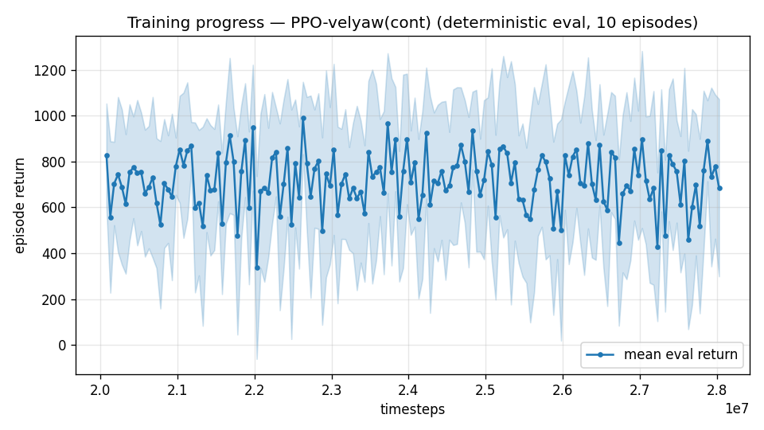
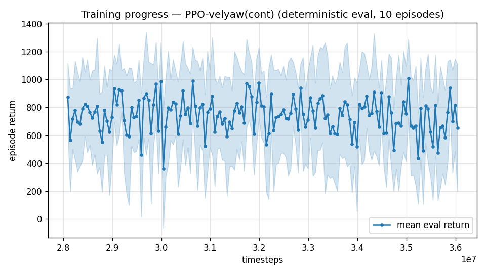

# Trial 33 — xw27 budget ladder (K4a): evidence-gated +8M stages

## Why
RC3's ceiling question was never answered: is 12M simply too little for the mid band?
ladder_xw27.sh continues xw27b in +8M stages @1e-4, AUTO-DECIDING: proceed only while the
physical median improves >7% per stage (max 2 stages → 28M). Runs opposite xw32.

## Pre-registered reading
- Any stage reaching median ≤2.4: budget was a real factor — extend the winner instead of
  new mechanisms. Ladder stops itself when improvement <7%: post-saturation drift
  (trials 05/12/14) is the expected outcome; confirming it retires "just train longer"
  permanently.

## Result
*(auto-appended)*

## Stage log (auto + hand notes)
- Stage 1 (xw27c, 20M): median 3.44 → **2.61** (−24%) → continued.
- Stage 2 (xw27d, 28M): median **1.72** (−34%) — cap reached STILL IMPROVING → extension
  ladder armed (stages e,f, same >7% gate). "Budget helps" is now real at mid — but only
  after trim-init changed the data distribution (trials 05/12/14's regressions were on the
  old distribution; RC3's ceiling was distribution-dependent, not universal).

---

## AUTO-CAPTURED RESULTS (2026-08-01 11:31)

**config**: `{"max_speed": 18.0, "speed_min": 10.0, "wind_max": 15.0, "use_integral": true, "use_yaw_integral": true, "use_wind_est": true, "yaw_width": 0.35, "yaw_weight": 1.0, "yaw_bias": 0.3, "heading_frame": false, "xwing_aero": true, "tough_init": 0.0, "wind_curriculum": false, "yaw_gate": true, "yaw_gate_floor": 0.2, "vel_precision": 0.7, "trim_init": 0.2, "yaw_att_gate": true, "cov_width": 5.0, "kp_rate": "25,25,15", "ki_rate": "6,6,3", "aero_dr": true, "integral_tau": 3.0, "ent_coef": 0.003, "gamma": 0.99, "episode_len": 8.0}`

**eval curve**: n=160, first 827, best 990 @ 22,629,336, last 686 (final steps 28,029,120)

**late trend**: still rising (last-10% mean 702 vs prior-10% 698)





### Physical eval
```
=== PHYSICAL EVAL (level start, full wind, 8s episodes) ===

band           n    mean  median   %<1     p90     yaw
--------------------------------------------------------
mid(10-18)   100    3.53    1.72   26%    8.01   11.2°
--------------------------------------------------------
ALL          100    3.53    1.72   26%    8.01   11.2°   crash 0.0%
wind bins: [0-5) n=23 med 1.11 <1: 43%  [5-10) n=42 med 1.92 <1: 24%  [10-15) n=35 med 3.01 <1: 17%
```


### Dive-recovery test
```
=== DIVE-RECOVERY TEST (60 episodes, all starting in failure states) ===
  recovered (final-2s vel err < 8 m/s):  13/60 = 22%
  partial   (8-15 m/s):                  0/60 = 0%
  median final err: 39.0 m/s   mean: 41.5 m/s
```


### Behavior traces
```
--- trace seed 1005: target [13.   5.7  0.3] (|v|=14.1), wind [ -3.6 -11.6  -3.1] ---
  t= 0.0 |v|=  0.1 vz=   0.0 tilt=   0 verr= 14.2 yawerr=+103.5 fins=( +9.0,-10.5) thr=-0.95
  t= 2.0 |v|=  8.2 vz=   0.5 tilt=  77 verr=  6.3 yawerr= +14.1 fins=(+16.0,+20.0) thr=+0.06
  t= 4.0 |v|=  8.4 vz=   3.0 tilt=  35 verr=  7.4 yawerr= -10.6 fins=(+18.4,-12.4) thr=-1.00
  t= 6.0 |v|= 12.4 vz=   2.1 tilt=  27 verr=  5.8 yawerr=  +9.2 fins=(+18.5,+10.8) thr=-1.00
--- trace seed 1012: target [  5.5 -14.6   1.2] (|v|=15.7), wind [-0.3  4.1 -6.1] ---
  t= 0.0 |v|=  0.0 vz=   0.0 tilt=   0 verr= 15.7 yawerr= +46.7 fins=(+10.1, -8.9) thr=-0.16
  t= 2.0 |v|=  9.6 vz=   2.3 tilt=  37 verr=  6.8 yawerr=  -4.5 fins=( -4.9,-18.2) thr=-0.38
  t= 4.0 |v|= 12.6 vz=   1.2 tilt=  39 verr=  3.1 yawerr= +10.0 fins=(-20.0,-18.2) thr=-0.87
  t= 6.0 |v|= 12.4 vz=   1.1 tilt=  34 verr=  3.3 yawerr= +14.3 fins=( -8.1,-18.2) thr=-0.58
--- trace seed 1020: target [-9.8 11.   0.9] (|v|=14.7), wind [-0.3 -1.2 -0.6] ---
  t= 0.0 |v|=  0.0 vz=   0.0 tilt=   0 verr= 14.7 yawerr= -65.7 fins=( +8.4,-10.3) thr=-0.15
  t= 2.0 |v|= 11.9 vz=   1.3 tilt=  45 verr=  3.0 yawerr= +10.4 fins=(+13.9,-13.9) thr=-0.88
  t= 4.0 |v|= 14.7 vz=   0.6 tilt=  33 verr=  1.8 yawerr=  -0.7 fins=(+20.0,-20.0) thr=-0.29
  t= 6.0 |v|= 13.7 vz=   0.8 tilt=  31 verr=  1.3 yawerr=  -1.0 fins=(+20.0,-20.0) thr=-0.27
```
- Stage 3 (xw27e, 36M): median **1.29** (−25%) → stage f (44M) auto-launched.

## Wind-bin decomposition of the residual (xw27e, n=150)
Overall median 1.32 / 39%<1 — but binned by the episode's wind draw:
| wind draw | median | %<1 |
|---|---|---|
| 0–5 m/s | **0.79** | **71%** |
| 5–10 m/s | 1.46 | 39% |
| 10–15 m/s | 2.95 | 17% |

**The mid band has reproduced the low band's structure: SUB-1 UNDER CALM WIND, residual
concentrated in the strong-wind tail** (draws where wind ≈ target speed). Same K1 pattern
as xw18b (0.42/0.77/1.75). The mean (3.27) is a tail statistic (p90 8.15). Implications:
(a) in-flight arms (xw27g finetune, xw34 dose) may lift the middle further; (b) the tail
needs its own lever — pre-registered next: wind-oversampled training (xw35: 50% of episodes
draw wind U(8,15)); (c) the success-criterion question (median+%<1 vs mean) is now concrete
and decides how much tail work "done" requires.
- Stage 4 (xw27f, 44M): median 1.37 ≈ xw27e (1.29 point / 1.39 robust) → **LADDER
  SELF-TERMINATED**. The rate-interface lineage's budget curve is exhausted at
  **~1.4 median / 35%<1** (robust). Fine-tune arm (xw27g @3e-5) auto-launches next.

---

## AUTO-CAPTURED RESULTS (2026-08-01 21:08)

**config**: `{"max_speed": 18.0, "speed_min": 10.0, "wind_max": 15.0, "use_integral": true, "use_yaw_integral": true, "use_wind_est": true, "yaw_width": 0.35, "yaw_weight": 1.0, "yaw_bias": 0.3, "heading_frame": false, "xwing_aero": true, "tough_init": 0.0, "wind_curriculum": false, "yaw_gate": true, "yaw_gate_floor": 0.2, "vel_precision": 0.7, "trim_init": 0.2, "yaw_att_gate": true, "cov_width": 5.0, "kp_rate": "25,25,15", "ki_rate": "6,6,3", "aero_dr": true, "integral_tau": 3.0, "ent_coef": 0.003, "gamma": 0.99, "episode_len": 8.0}`

**eval curve**: n=160, first 874, best 1007 @ 35,040,936, last 654 (final steps 36,040,896)

**late trend**: DECLINING (last-10% mean 694 vs prior-10% 709)





### Physical eval
```
=== PHYSICAL EVAL (level start, full wind, 8s episodes) ===

band           n    mean  median   %<1     p90     yaw
--------------------------------------------------------
mid(10-18)   100    3.18    1.29   40%    8.25   10.4°
--------------------------------------------------------
ALL          100    3.18    1.29   40%    8.25   10.4°   crash 0.0%
wind bins: [0-5) n=23 med 0.82 <1: 65%  [5-10) n=42 med 1.40 <1: 40%  [10-15) n=35 med 2.63 <1: 23%
```


### Dive-recovery test
```
=== DIVE-RECOVERY TEST (60 episodes, all starting in failure states) ===
  recovered (final-2s vel err < 8 m/s):  18/60 = 30%
  partial   (8-15 m/s):                  2/60 = 3%
  median final err: 30.0 m/s   mean: 33.5 m/s
```


### Behavior traces
```
--- trace seed 1005: target [13.   5.7  0.3] (|v|=14.1), wind [ -3.6 -11.6  -3.1] ---
  t= 0.0 |v|=  0.1 vz=   0.0 tilt=   0 verr= 14.2 yawerr=+103.5 fins=( +9.0,-10.5) thr=-1.00
  t= 2.0 |v|= 10.7 vz=   2.1 tilt=  52 verr=  6.2 yawerr=  -9.4 fins=(+18.4,+20.0) thr=-0.98
  t= 4.0 |v|=  8.6 vz=   1.6 tilt=  59 verr=  7.3 yawerr= -18.1 fins=(+18.1,+18.3) thr=-1.00
  t= 6.0 |v|= 14.1 vz=  -0.9 tilt=  58 verr=  1.2 yawerr=  -3.3 fins=(+18.5,+20.0) thr=-0.05
--- trace seed 1012: target [  5.5 -14.6   1.2] (|v|=15.7), wind [-0.3  4.1 -6.1] ---
  t= 0.0 |v|=  0.0 vz=   0.0 tilt=   0 verr= 15.7 yawerr= +46.7 fins=(+10.1, -8.9) thr=-0.59
  t= 2.0 |v|=  9.6 vz=   1.2 tilt=  42 verr=  6.4 yawerr= -17.4 fins=(-15.6,-18.2) thr=-0.24
  t= 4.0 |v|= 13.1 vz=   1.0 tilt=  39 verr=  2.6 yawerr=  +9.4 fins=(-10.2,-18.2) thr=-1.00
  t= 6.0 |v|= 12.7 vz=   1.0 tilt=  38 verr=  3.1 yawerr=  +7.3 fins=( +3.2,-18.2) thr=-0.71
--- trace seed 1020: target [-9.8 11.   0.9] (|v|=14.7), wind [-0.3 -1.2 -0.6] ---
  t= 0.0 |v|=  0.0 vz=   0.0 tilt=   0 verr= 14.7 yawerr= -65.7 fins=( +8.4,-10.3) thr=+0.20
  t= 2.0 |v|=  9.8 vz=   0.8 tilt=  25 verr=  5.4 yawerr= +86.0 fins=(+20.0,-20.0) thr=-1.00
  t= 4.0 |v|= 12.4 vz=   0.8 tilt=  32 verr=  3.5 yawerr= +12.0 fins=(+20.0,+12.1) thr=-0.14
  t= 6.0 |v|= 13.8 vz=   0.6 tilt=  35 verr=  1.3 yawerr= +11.3 fins=(+20.0,-20.0) thr=-0.31
```
- Fine-tune (xw27g, +6M @3e-5 from 44M): robust median **1.34 [1.20–1.62]** ≈ xw27e's
  1.39 [1.14–1.62] — **NULL**. Low-LR convergence does not break the plateau; the
  rate-interface lineage is closed at ~1.35–1.4 median. The att-cmd lineage (xw32e)
  carries the <1 push; xw34 (dose 0.4) auto-launched on this chain.
