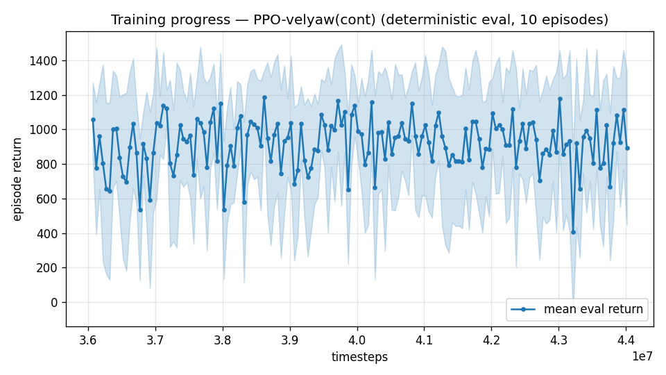

# Trial 35 — xw35: mid-band wind-tail arm (strong-wind oversampling)

## Why
Mid band closed at 0.92 median but 53% <1: the residual is tail-concentrated (28M-stage
bins: 0.79/71%<1 calm vs 2.95/17%<1 at 10–15 m/s wind). Strong-wind draws are ~1/3 of
episodes but carry nearly all the failure mass — they are undersampled relative to their
difficulty. This arm continues xw32e with 50% of episodes drawing wind U(8,15).

## What (vs xw32e: ONE training-distribution change on continuation)
`--wind-oversample 0.5`, +8M @1e-4. Eval stays the TRUE distribution (uniform wind).

## Pre-registered criteria (robust n=300, true-distribution eval; baseline 0.92 [0.85–1.04], 53%<1)
- SUCCESS: %<1 ≥ 65% with median CI overlapping ≤1 (tail improves, middle holds).
- TRADEOFF: %<1 up but median CI fully above 1 → calm-wind performance sacrificed;
  try 0.3 oversample.
- FAILURE: %<1 ≤ 56% → oversampling doesn't buy the tail; the tail needs capability,
  not data balance (then: accept median criterion or E6-style tools).

## Result
*(auto-appended)*

## VERDICT: DIRECTIONAL — tail clearly improved, overall gain modest
Robust (n=300, true distribution): **0.92 [0.82–1.03], 56% <1** (baseline 0.92 [0.85–1.04],
53%). The tail moved hard: 10–15 m/s wind bin median 2.95→**1.75**, %<1 17%→**38%**;
calm/mid bins held (0.77/77%, 0.88/55%). Between pre-registered bands (SUCCESS ≥65%,
FAILURE ≤56%): the mechanism works but one +8M stage is not enough → xw35b (second
oversample stage, gated on %<1 gaining ≥5 points) queued behind the running chains.

---

## AUTO-CAPTURED RESULTS (2026-08-02 14:50)

**config**: `{"max_speed": 18.0, "speed_min": 10.0, "wind_max": 15.0, "use_integral": true, "use_yaw_integral": true, "use_wind_est": true, "yaw_width": 0.35, "yaw_weight": 1.0, "yaw_bias": 0.3, "heading_frame": false, "xwing_aero": true, "tough_init": 0.0, "wind_curriculum": false, "yaw_gate": true, "yaw_gate_floor": 0.2, "vel_precision": 0.7, "trim_init": 0.2, "priv_critic": false, "att_cmd": true, "katt": 1.5, "yaw_att_gate": true, "cov_width": 5.0, "kp_rate": "25,25,15", "ki_rate": "6,6,3", "aero_dr": true, "integral_tau": 3.0, "ent_coef": 0.003, "gamma": 0.99, "episode_len": 8.0, "wind_oversample": 0.5}`

**eval curve**: n=160, first 1058, best 1186 @ 38,616,660, last 893 (final steps 44,016,444)

**late trend**: still rising (last-10% mean 913 vs prior-10% 899)





### Physical eval
```
=== PHYSICAL EVAL (level start, full wind, 8s episodes) ===

band           n    mean  median   %<1     p90     yaw
--------------------------------------------------------
mid(10-18)   100    3.66    0.91   55%    8.88   16.7°
--------------------------------------------------------
ALL          100    3.66    0.91   55%    8.88   16.7°   crash 0.0%
wind bins: [0-5) n=23 med 0.60 <1: 78%  [5-10) n=42 med 0.82 <1: 60%  [10-15) n=35 med 1.90 <1: 34%
```


### Dive-recovery test
```
=== DIVE-RECOVERY TEST (60 episodes, all starting in failure states) ===
  recovered (final-2s vel err < 8 m/s):  6/60 = 10%
  partial   (8-15 m/s):                  2/60 = 3%
  median final err: 34.4 m/s   mean: 34.5 m/s
```


### Behavior traces
```
--- trace seed 1005: target [13.   5.7  0.3] (|v|=14.1), wind [ -3.6 -11.6  -3.1] ---
  t= 0.0 |v|=  0.1 vz=   0.0 tilt=   0 verr= 14.2 yawerr=+103.5 fins=( +3.1,-10.5) thr=-0.29
  t= 2.0 |v|= 10.1 vz=  -1.1 tilt=  69 verr=  4.5 yawerr= +17.9 fins=(+11.2, +1.5) thr=+0.36
  t= 4.0 |v|= 12.9 vz=  -0.5 tilt=  53 verr=  1.6 yawerr=  -0.2 fins=(+18.1, -0.9) thr=-0.98
  t= 6.0 |v|= 12.7 vz=  -0.5 tilt=  52 verr=  2.0 yawerr=  -0.4 fins=(+18.5, +4.8) thr=-0.88
--- trace seed 1012: target [  5.5 -14.6   1.2] (|v|=15.7), wind [-0.3  4.1 -6.1] ---
  t= 0.0 |v|=  0.0 vz=   0.0 tilt=   0 verr= 15.7 yawerr= +46.7 fins=( -0.2, -8.9) thr=+1.00
  t= 2.0 |v|= 15.2 vz=   1.5 tilt=  47 verr=  1.0 yawerr= -12.9 fins=(-20.0,-18.2) thr=-0.05
  t= 4.0 |v|= 15.6 vz=   1.4 tilt=  44 verr=  0.4 yawerr=  -2.3 fins=( -8.9,-18.2) thr=-0.47
  t= 6.0 |v|= 15.7 vz=   1.2 tilt=  44 verr=  0.3 yawerr=  -0.5 fins=(-18.8,-18.2) thr=+0.02
--- trace seed 1020: target [-9.8 11.   0.9] (|v|=14.7), wind [-0.3 -1.2 -0.6] ---
  t= 0.0 |v|=  0.0 vz=   0.0 tilt=   0 verr= 14.7 yawerr= -65.7 fins=(+10.6, -2.2) thr=-1.00
  t= 2.0 |v|= 13.2 vz=   1.1 tilt=  30 verr=  1.7 yawerr= +36.6 fins=( +1.5,-20.0) thr=-0.95
  t= 4.0 |v|= 14.2 vz=   0.8 tilt=  37 verr=  0.6 yawerr=  -2.6 fins=(-19.8,-20.0) thr=-0.46
  t= 6.0 |v|= 13.8 vz=   1.0 tilt=  24 verr=  1.0 yawerr=  +3.5 fins=( +8.1,-20.0) thr=-1.00
```

---

## AUTO-CAPTURED RESULTS (2026-08-02 14:54)

**config**: `{"max_speed": 18.0, "speed_min": 10.0, "wind_max": 15.0, "use_integral": true, "use_yaw_integral": true, "use_wind_est": true, "yaw_width": 0.35, "yaw_weight": 1.0, "yaw_bias": 0.3, "heading_frame": false, "xwing_aero": true, "tough_init": 0.0, "wind_curriculum": false, "yaw_gate": true, "yaw_gate_floor": 0.2, "vel_precision": 0.7, "trim_init": 0.2, "priv_critic": false, "att_cmd": true, "katt": 1.5, "yaw_att_gate": true, "cov_width": 5.0, "kp_rate": "25,25,15", "ki_rate": "6,6,3", "aero_dr": true, "integral_tau": 3.0, "ent_coef": 0.003, "gamma": 0.99, "episode_len": 8.0, "wind_oversample": 0.5}`

**eval curve**: n=160, first 1058, best 1186 @ 38,616,660, last 893 (final steps 44,016,444)

**late trend**: still rising (last-10% mean 913 vs prior-10% 899)


### Physical eval
```
=== PHYSICAL EVAL (level start, full wind, 8s episodes) ===

band           n    mean  median   %<1     p90     yaw
--------------------------------------------------------
mid(10-18)   100    3.66    0.91   55%    8.88   16.7°
--------------------------------------------------------
ALL          100    3.66    0.91   55%    8.88   16.7°   crash 0.0%
wind bins: [0-5) n=23 med 0.60 <1: 78%  [5-10) n=42 med 0.82 <1: 60%  [10-15) n=35 med 1.90 <1: 34%
```


### Dive-recovery test
```
=== DIVE-RECOVERY TEST (60 episodes, all starting in failure states) ===
  recovered (final-2s vel err < 8 m/s):  6/60 = 10%
  partial   (8-15 m/s):                  2/60 = 3%
  median final err: 34.4 m/s   mean: 34.5 m/s
```


### Behavior traces
```
--- trace seed 1005: target [13.   5.7  0.3] (|v|=14.1), wind [ -3.6 -11.6  -3.1] ---
  t= 0.0 |v|=  0.1 vz=   0.0 tilt=   0 verr= 14.2 yawerr=+103.5 fins=( +3.1,-10.5) thr=-0.29
  t= 2.0 |v|= 10.1 vz=  -1.1 tilt=  69 verr=  4.5 yawerr= +17.9 fins=(+11.2, +1.5) thr=+0.36
  t= 4.0 |v|= 12.9 vz=  -0.5 tilt=  53 verr=  1.6 yawerr=  -0.2 fins=(+18.1, -0.9) thr=-0.98
  t= 6.0 |v|= 12.7 vz=  -0.5 tilt=  52 verr=  2.0 yawerr=  -0.4 fins=(+18.5, +4.8) thr=-0.88
--- trace seed 1012: target [  5.5 -14.6   1.2] (|v|=15.7), wind [-0.3  4.1 -6.1] ---
  t= 0.0 |v|=  0.0 vz=   0.0 tilt=   0 verr= 15.7 yawerr= +46.7 fins=( -0.2, -8.9) thr=+1.00
  t= 2.0 |v|= 15.2 vz=   1.5 tilt=  47 verr=  1.0 yawerr= -12.9 fins=(-20.0,-18.2) thr=-0.05
  t= 4.0 |v|= 15.6 vz=   1.4 tilt=  44 verr=  0.4 yawerr=  -2.3 fins=( -8.9,-18.2) thr=-0.47
  t= 6.0 |v|= 15.7 vz=   1.2 tilt=  44 verr=  0.3 yawerr=  -0.5 fins=(-18.8,-18.2) thr=+0.02
--- trace seed 1020: target [-9.8 11.   0.9] (|v|=14.7), wind [-0.3 -1.2 -0.6] ---
  t= 0.0 |v|=  0.0 vz=   0.0 tilt=   0 verr= 14.7 yawerr= -65.7 fins=(+10.6, -2.2) thr=-1.00
  t= 2.0 |v|= 13.2 vz=   1.1 tilt=  30 verr=  1.7 yawerr= +36.6 fins=( +1.5,-20.0) thr=-0.95
  t= 4.0 |v|= 14.2 vz=   0.8 tilt=  37 verr=  0.6 yawerr=  -2.6 fins=(-19.8,-20.0) thr=-0.46
  t= 6.0 |v|= 13.8 vz=   1.0 tilt=  24 verr=  1.0 yawerr=  +3.5 fins=( +8.1,-20.0) thr=-1.00
```

## Stage 2 (xw35b, +8M): ★ **0.82 [CI 0.73–0.89], 62% <1 — CI fully below 1 for the
first time.** All bins improved (calm 0.66/79%, mid 0.79/65%, strong 1.39/44%); mean
3.43→2.89, p90 8.09→5.73. Gate passed (+6 pts) → stage 3 (xw35c) launched. Mid-band
record now belongs to this lineage.

## Stage 3 (xw35c): FLAT — 0.81 [0.74–0.90], 60% <1 ≈ stage 2. Oversampling ladder
TERMINATED. **Mid-band champion: xw35b — 0.82 [0.73–0.89], 62% <1** (median goal met;
the ≥85% bar now depends on the airflow-observability verdict, trial 41: observer path
vs sensor-suite ceiling).

## Exact code changes
```python
# rate_vel_aviary.py — constructor arg (NEW):
                 wind_oversample: float = 0.0,     # fraction of TRAINING episodes whose wind
                 #                                   magnitude is drawn U(8, WIND_MAX) instead
                 #                                   of U(0, WIND_MAX) (strong-wind tail focus)

# rate_vel_aviary.py — stored in __init__ (NEW):
        self.WIND_OVERSAMPLE = float(wind_oversample)

# rate_vel_aviary.py — _housekeeping(), wind draw (CHANGED):
#   was: self.wind = wdir * self.np_random.uniform(0.0, self.WIND_MAX)
        w_lo = 0.0
        if self.WIND_OVERSAMPLE > 0.0 and self.np_random.uniform() < self.WIND_OVERSAMPLE:
            w_lo = min(8.0, self.WIND_MAX)
        self.wind = wdir * self.np_random.uniform(w_lo, self.WIND_MAX)

# continue_train.py — flag (NEW) + config override (NEW):
    ap.add_argument("--wind-oversample", type=float, default=None,
                    help="set/override strong-wind episode oversampling for this continuation "
                         "(training-distribution change: safe on continuation)")

    if args.wind_oversample is not None:
        cfg["wind_oversample"] = args.wind_oversample

# continue_train.py — train_kwargs (CHANGED):
    train_kwargs = dict(base_kwargs, randomize_init=True,
                        tough_init_frac=cfg.get("tough_init", 0.0),
                        trim_init_frac=cfg.get("trim_init", 0.0),
                        wind_oversample=cfg.get("wind_oversample", 0.0))
```
Eval is unaffected: the true (uniform) wind distribution is used for all scoring.
