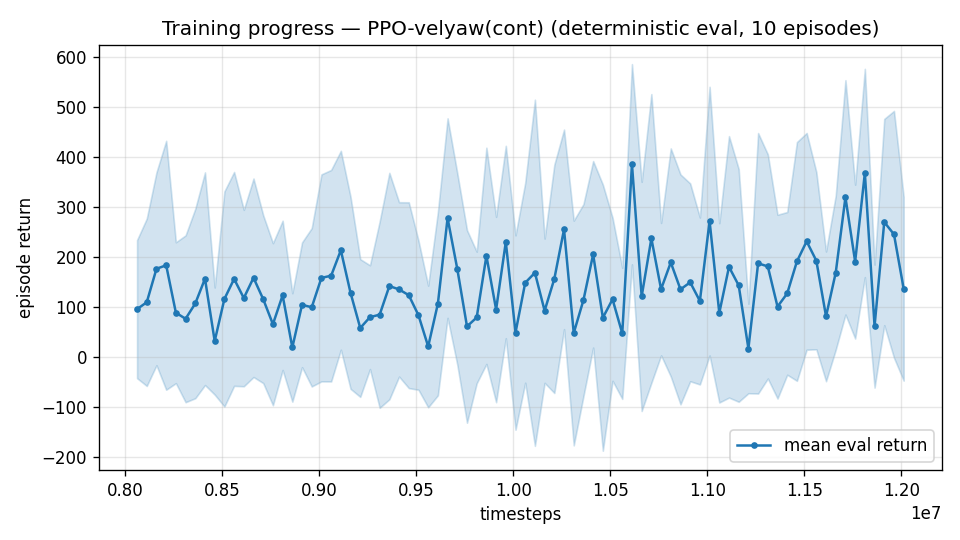

# Trial 37 — xw37: HIGH band with the proven mid recipe (att-cmd + trim-init + robust ladder)

## Why
The mid band crossed the goal line with this exact recipe (trial 32 lineage: 6.33 → 0.92
median [CI 0.85–1.04], 53% <1 at 36M). The high band showed the SAME hold-deficit signature
(trial 29: hold-from-trim ≈ rest error), so the same mechanism fixes should transfer.
Baselines: xw29b (rate-interface + trim-init) median 5.88; classical ceiling median 3.90.

## What
xw32 recipe verbatim at `--speed-min 18 --max-speed 25`: attitude-setpoint interface +
trim-init 0.2 + two-stage train (8M @3e-4, +4M @1e-4) + robust-CI budget ladder
(+8M stages while median improves >7%, n=300 bootstrap gates), all in one auto chain.

## Pre-registered criteria (8 s rest protocol, robust eval)
- **SUCCESS**: median < 3.9 (classical parity) by 12M; ladder pushes toward <1.
- **PROGRESS**: 3.9–5.9 with ladder still improving → let the ladder run.
- **FAILURE**: ≥ 5.9 (no better than xw29b) → high band needs its own mechanism
  (candidates: katt retune for high Q, trim-init dose, 100 Hz per trial 36's verdict).

## Result
*(auto-appended)*

---

## AUTO-CAPTURED RESULTS (2026-08-02 10:26)

**config**: `{"max_speed": 25.0, "speed_min": 18.0, "wind_max": 15.0, "use_integral": true, "use_yaw_integral": true, "use_wind_est": true, "yaw_width": 0.35, "yaw_weight": 1.0, "yaw_bias": 0.3, "heading_frame": false, "xwing_aero": true, "tough_init": 0.0, "wind_curriculum": false, "yaw_gate": true, "yaw_gate_floor": 0.2, "vel_precision": 0.7, "trim_init": 0.2, "priv_critic": false, "att_cmd": true, "katt": 1.5, "ctrl_freq": 50, "yaw_att_gate": true, "cov_width": 5.0, "kp_rate": "25,25,15", "ki_rate": "6,6,3", "aero_dr": true, "integral_tau": 3.0, "ent_coef": 0.003, "gamma": 0.99, "episode_len": 8.0}`

**eval curve**: n=80, first 96, best 386 @ 10,611,672, last 137 (final steps 12,011,616)

**late trend**: still rising (last-10% mean 220 vs prior-10% 162)





### Physical eval
```
=== PHYSICAL EVAL (level start, full wind, 8s episodes) ===

band           n    mean  median   %<1     p90     yaw
--------------------------------------------------------
high(18-25)  100   10.40    7.30    0%   19.04   30.0°
--------------------------------------------------------
ALL          100   10.40    7.30    0%   19.04   30.0°   crash 0.0%
wind bins: [0-5) n=23 med 6.59 <1: 0%  [5-10) n=42 med 7.30 <1: 0%  [10-15) n=35 med 8.45 <1: 0%
```


### Dive-recovery test
```
=== DIVE-RECOVERY TEST (60 episodes, all starting in failure states) ===
  recovered (final-2s vel err < 8 m/s):  8/60 = 13%
  partial   (8-15 m/s):                  8/60 = 13%
  median final err: 37.4 m/s   mean: 36.8 m/s
```


### Behavior traces
```
--- trace seed 1005: target [19.8  8.7  0.4] (|v|=21.6), wind [ -3.6 -11.6  -3.1] ---
  t= 0.0 |v|=  0.1 vz=   0.0 tilt=   0 verr= 21.7 yawerr=+103.5 fins=( +7.0,-10.5) thr=+1.00
  t= 2.0 |v|= 12.7 vz=   3.2 tilt=  38 verr=  9.8 yawerr= -18.2 fins=( -6.6, -4.9) thr=-0.92
  t= 4.0 |v|= 20.2 vz=  -3.9 tilt=  56 verr=  4.7 yawerr= -32.1 fins=(+18.5,+20.0) thr=-0.43
  t= 6.0 |v|= 16.4 vz=   5.5 tilt=  38 verr=  8.0 yawerr= -14.0 fins=(-15.0,-20.0) thr=-1.00
--- trace seed 1012: target [  8.1 -21.4   1.8] (|v|=23.0), wind [-0.3  4.1 -6.1] ---
  t= 0.0 |v|=  0.0 vz=   0.0 tilt=   0 verr= 23.0 yawerr= +46.7 fins=( +1.9, -8.9) thr=-0.07
  t= 2.0 |v|= 11.8 vz=  -1.5 tilt=  29 verr= 11.7 yawerr= -48.1 fins=(+16.0,+18.2) thr=-1.00
  t= 4.0 |v|= 16.3 vz=  -6.8 tilt=  57 verr= 12.1 yawerr= -26.7 fins=(-20.0,-18.2) thr=-0.90
  t= 6.0 |v|= 16.3 vz=  -7.3 tilt=  55 verr= 12.8 yawerr= -28.1 fins=(-20.0,-18.2) thr=-0.08
--- trace seed 1020: target [-14.7  16.5   1.4] (|v|=22.1), wind [-0.3 -1.2 -0.6] ---
  t= 0.0 |v|=  0.0 vz=   0.0 tilt=   0 verr= 22.1 yawerr= -65.7 fins=( +1.6, +8.7) thr=+1.00
  t= 2.0 |v|= 16.6 vz=  -1.1 tilt=  54 verr=  6.2 yawerr= +17.1 fins=(-19.9,-20.0) thr=-0.05
  t= 4.0 |v|= 18.9 vz=   1.0 tilt=  46 verr=  3.5 yawerr=  +2.1 fins=(-19.6,-17.6) thr=-0.48
  t= 6.0 |v|= 18.4 vz=   1.4 tilt=  42 verr=  3.9 yawerr=  +5.9 fins=(-13.4,-15.4) thr=-0.57
```
