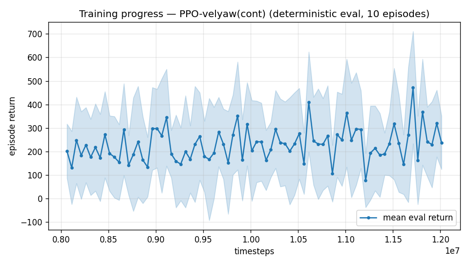
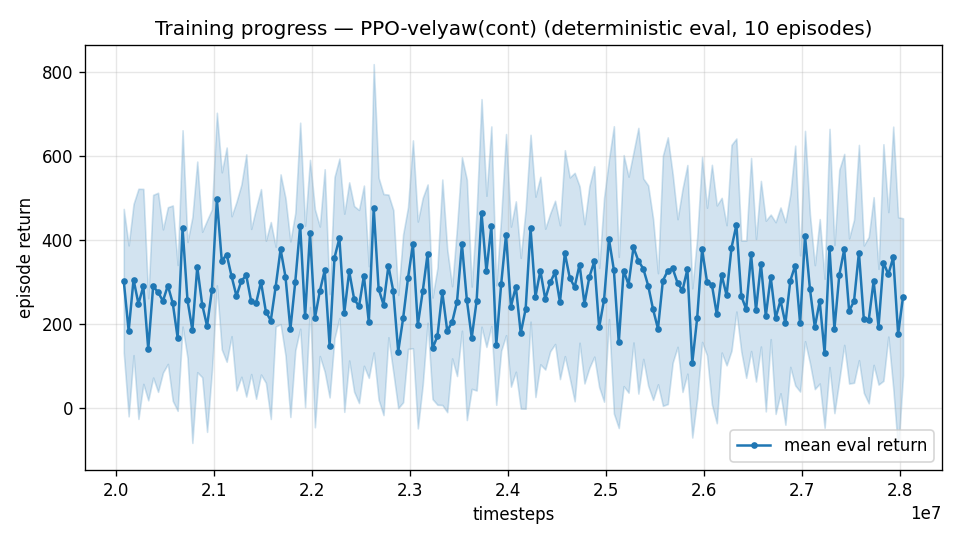

# Trial 38 — xw38: high band with the ATTITUDE-AUTHORITY bundle

## Why
Trial 37 failed (8.21 @12M) and the offline probe pinned it: the attitude loop is
overpowered by V²-scaling aero moments at 18–25 m/s. Single mechanism, three ingredients
(all validated directionally offline): stiff rate gains (40,40,25/10,10,5), katt 3.0,
fin-assist 2.0 (elevator follows pitch-rate command; policy fin action adds on top).
Bundle deviation from one-variable discipline documented: all three serve "attitude
authority at high Q", and the offline probe replaces the isolation runs.

## Command
xw37 chain (att-cmd + trim-init 0.2 + integrated robust ladder) + the bundle flags.

## Pre-registered criteria (vs xw37b 8.21 [7.69–8.92] and xw29b 5.88)
- SUCCESS: ≤3.9 (classical parity) by 12M → ladder pushes toward <1.
- PROGRESS: CI below xw29b's 5.88 → mechanism right, iterate gains/assist.
- FAILURE: ≥5.9 → authority hypothesis wrong at policy level → 100 Hz (xw36 verdict may
  inform) or band-split 18–21/21–25.

---

## AUTO-CAPTURED RESULTS (2026-08-02 15:05)

**config**: `{"max_speed": 25.0, "speed_min": 18.0, "wind_max": 15.0, "use_integral": true, "use_yaw_integral": true, "use_wind_est": true, "yaw_width": 0.35, "yaw_weight": 1.0, "yaw_bias": 0.3, "heading_frame": false, "xwing_aero": true, "tough_init": 0.0, "wind_curriculum": false, "yaw_gate": true, "yaw_gate_floor": 0.2, "vel_precision": 0.7, "trim_init": 0.2, "priv_critic": false, "att_cmd": true, "katt": 3.0, "ctrl_freq": 50, "fin_assist": 2.0, "yaw_att_gate": true, "cov_width": 5.0, "kp_rate": "40,40,25", "ki_rate": "10,10,5", "aero_dr": true, "integral_tau": 3.0, "ent_coef": 0.003, "gamma": 0.99, "episode_len": 8.0}`

**eval curve**: n=80, first 202, best 472 @ 11,711,628, last 238 (final steps 12,011,616)

**late trend**: still rising (last-10% mean 288 vs prior-10% 214)





### Physical eval
```
=== PHYSICAL EVAL (level start, full wind, 8s episodes) ===

band           n    mean  median   %<1     p90     yaw
--------------------------------------------------------
high(18-25)  100    5.63    5.13    0%    9.03   50.3°
--------------------------------------------------------
ALL          100    5.63    5.13    0%    9.03   50.3°   crash 0.0%
wind bins: [0-5) n=23 med 4.93 <1: 0%  [5-10) n=42 med 5.01 <1: 0%  [10-15) n=35 med 5.89 <1: 0%
```


### Dive-recovery test
```
=== DIVE-RECOVERY TEST (60 episodes, all starting in failure states) ===
  recovered (final-2s vel err < 8 m/s):  21/60 = 35%
  partial   (8-15 m/s):                  18/60 = 30%
  median final err: 11.2 m/s   mean: 16.3 m/s
```


### Behavior traces
```
--- trace seed 1005: target [19.8  8.7  0.4] (|v|=21.6), wind [ -3.6 -11.6  -3.1] ---
  t= 0.0 |v|=  0.1 vz=   0.0 tilt=   0 verr= 21.7 yawerr=+103.5 fins=( +3.8,+10.1) thr=-1.00
  t= 2.0 |v|= 18.0 vz=  -6.9 tilt=  80 verr=  8.9 yawerr= +48.7 fins=( +3.5,+16.4) thr=-0.07
  t= 4.0 |v|= 18.6 vz=  -4.1 tilt=  30 verr=  5.9 yawerr= +40.1 fins=( -7.4, -2.5) thr=+1.00
  t= 6.0 |v|= 22.6 vz=  -8.0 tilt= 105 verr=  8.5 yawerr= +45.7 fins=(-17.9,-20.0) thr=-1.00
--- trace seed 1012: target [  8.1 -21.4   1.8] (|v|=23.0), wind [-0.3  4.1 -6.1] ---
  t= 0.0 |v|=  0.0 vz=   0.0 tilt=   0 verr= 23.0 yawerr= +46.7 fins=( +9.3, +8.8) thr=-1.00
  t= 2.0 |v|= 18.1 vz=  -6.3 tilt=  41 verr= 10.1 yawerr= +45.3 fins=(+15.1,-13.8) thr=-0.33
  t= 4.0 |v|= 19.0 vz=   3.1 tilt=  28 verr=  4.4 yawerr= +36.3 fins=( -7.3,-17.3) thr=-1.00
  t= 6.0 |v|= 19.6 vz=   2.3 tilt=  26 verr=  3.6 yawerr= +37.7 fins=( +9.6,-14.1) thr=-1.00
--- trace seed 1020: target [-14.7  16.5   1.4] (|v|=22.1), wind [-0.3 -1.2 -0.6] ---
  t= 0.0 |v|=  0.0 vz=   0.0 tilt=   0 verr= 22.1 yawerr= -65.7 fins=( -9.7, +0.9) thr=+0.87
  t= 2.0 |v|= 21.2 vz=  -3.5 tilt=  53 verr=  5.3 yawerr= +72.4 fins=( +3.5,-16.3) thr=-0.82
  t= 4.0 |v|= 28.5 vz=   6.8 tilt=  78 verr=  8.0 yawerr=  +6.6 fins=(-17.1,-20.0) thr=-1.00
  t= 6.0 |v|= 18.8 vz=   5.0 tilt=  47 verr=  7.6 yawerr= -15.6 fins=(+18.0,+19.8) thr=-0.55
```

## Stage log
- 12M (xw38b): robust median **5.18** — the authority bundle bought −37% vs trial 37's
  8.21 at matched steps and beats the old band best (xw29b 5.88). PROGRESS per
  pre-registration; ladder auto-continuing (mid lineage's precedent from its 12M point:
  2.35→0.92 over three +8M stages).
- 20M (xw38c): robust median **4.67** (−9.8%) → gate passed, stage d (28M) running.
  Slower compounding than the mid lineage's same stage (−35%) — watching whether it
  approaches classical parity (3.9) by 28M.
- 28M (xw38d): 4.89 ≈ 4.67 → **ladder self-stopped; lineage best = xw38c (20M, 4.67)**.
  Band record improved 8.62→4.67 median in one day, but plateaued short of classical
  parity (3.9). Next-arm decision pends the xw38c inflight-hold discriminator (approach
  vs hold split) + offline authority probes at higher gains — and xw39's fair-100Hz
  verdict, which is directly relevant here (aero dynamics are fastest at high Q).

---

## AUTO-CAPTURED RESULTS (2026-08-02 19:42)

**config**: `{"max_speed": 25.0, "speed_min": 18.0, "wind_max": 15.0, "use_integral": true, "use_yaw_integral": true, "use_wind_est": true, "yaw_width": 0.35, "yaw_weight": 1.0, "yaw_bias": 0.3, "heading_frame": false, "xwing_aero": true, "tough_init": 0.0, "wind_curriculum": false, "yaw_gate": true, "yaw_gate_floor": 0.2, "vel_precision": 0.7, "trim_init": 0.2, "priv_critic": false, "att_cmd": true, "katt": 3.0, "ctrl_freq": 50, "fin_assist": 2.0, "yaw_att_gate": true, "cov_width": 5.0, "kp_rate": "40,40,25", "ki_rate": "10,10,5", "aero_dr": true, "integral_tau": 3.0, "ent_coef": 0.003, "gamma": 0.99, "episode_len": 8.0}`

**eval curve**: n=160, first 303, best 498 @ 21,029,400, last 265 (final steps 28,029,120)

**late trend**: still rising (last-10% mean 282 vs prior-10% 267)





### Physical eval
```
=== PHYSICAL EVAL (level start, full wind, 8s episodes) ===

band           n    mean  median   %<1     p90     yaw
--------------------------------------------------------
high(18-25)  100    6.29    5.01    1%   10.08   46.9°
--------------------------------------------------------
ALL          100    6.29    5.01    1%   10.08   46.9°   crash 0.0%
wind bins: [0-5) n=23 med 4.50 <1: 0%  [5-10) n=42 med 4.99 <1: 2%  [10-15) n=35 med 5.09 <1: 0%
```


### Dive-recovery test
```
=== DIVE-RECOVERY TEST (60 episodes, all starting in failure states) ===
  recovered (final-2s vel err < 8 m/s):  29/60 = 48%
  partial   (8-15 m/s):                  9/60 = 15%
  median final err: 8.6 m/s   mean: 19.0 m/s
```


### Behavior traces
```
--- trace seed 1005: target [19.8  8.7  0.4] (|v|=21.6), wind [ -3.6 -11.6  -3.1] ---
  t= 0.0 |v|=  0.1 vz=   0.0 tilt=   0 verr= 21.7 yawerr=+103.5 fins=( +8.6, +9.9) thr=-1.00
  t= 2.0 |v|= 13.7 vz=  -6.1 tilt=  77 verr= 11.9 yawerr= +60.8 fins=(+16.1,+17.1) thr=-0.08
  t= 4.0 |v|= 22.4 vz=  -2.9 tilt=  39 verr=  3.5 yawerr= +81.3 fins=(-13.4,-10.7) thr=-1.00
  t= 6.0 |v|= 25.2 vz=  -6.9 tilt=  57 verr= 10.1 yawerr=-167.3 fins=(+17.5, -2.0) thr=-0.57
--- trace seed 1012: target [  8.1 -21.4   1.8] (|v|=23.0), wind [-0.3  4.1 -6.1] ---
  t= 0.0 |v|=  0.0 vz=  -0.0 tilt=   0 verr= 23.0 yawerr= +46.7 fins=( +9.4, +9.1) thr=-0.89
  t= 2.0 |v|= 21.1 vz=  -0.1 tilt=  38 verr=  2.8 yawerr= +38.4 fins=( +6.6,-10.3) thr=-1.00
  t= 4.0 |v|= 23.2 vz=   4.4 tilt=  45 verr=  2.7 yawerr= +12.1 fins=(-20.0,-18.2) thr=-1.00
  t= 6.0 |v|= 23.8 vz=   0.8 tilt=  65 verr=  3.8 yawerr= +32.6 fins=(+13.2,-17.0) thr=-1.00
--- trace seed 1020: target [-14.7  16.5   1.4] (|v|=22.1), wind [-0.3 -1.2 -0.6] ---
  t= 0.0 |v|=  0.0 vz=   0.0 tilt=   0 verr= 22.1 yawerr= -65.7 fins=( -9.7, +0.3) thr=-0.24
  t= 2.0 |v|= 16.6 vz=  -6.8 tilt=  86 verr= 10.7 yawerr=+134.9 fins=(-19.9,-20.0) thr=-1.00
  t= 4.0 |v|= 18.8 vz=  -5.2 tilt=  59 verr=  7.8 yawerr=+127.6 fins=( +1.6,-20.0) thr=-1.00
  t= 6.0 |v|= 20.9 vz=  -0.3 tilt=  27 verr=  3.0 yawerr= +38.8 fins=(+11.6, +2.2) thr=-0.97
```

*(Note: the chain's final auto-analysis ran on xw38d — a script quirk on the STOP branch;
the band's BEST checkpoint remains xw38c per the robust evals above.)*

## Exact code changes
```python
# rate_vel_aviary.py — constructor arg (NEW):
                 fin_assist: float = 0.0,          # att_cmd: elevator follows the pitch-rate
                 #                                   command (fin authority scales with V^2,
                 #                                   motor torque does not); policy fin action
                 #                                   adds on top

# rate_vel_aviary.py — __init__ (NEW):
        self.FIN_ASSIST = float(fin_assist)
        self._omega_des_last = np.zeros(3)

# rate_vel_aviary.py — _control_wrench(), att_cmd branch (ADDED last line):
            omega_des = R.T @ omega_w
            omega_des[2] = self._yaw_rate_des
            omega_des = np.clip(omega_des, -self.MAX_RATE, self.MAX_RATE)
            self._omega_des_last = omega_des

# rate_vel_aviary.py — step(), elevon application (CHANGED):
            if self.USE_ELEVONS:
                fin_norm = self.current_action[:2]
                if self.ATT_CMD and self.FIN_ASSIST > 0.0:
                    assist = float(np.clip(self.FIN_ASSIST * self._omega_des_last[1]
                                           / self.MAX_RATE[1], -1.0, 1.0))
                    fin_norm = np.clip(fin_norm + assist, -1.0, 1.0)
                fin_cmd = (self.FIN_MAX * fin_norm) * self.fin_gain + self.fin_offset

# train.py — flags (NEW):
    ap.add_argument("--fin-assist", type=float, default=0.0,
                    help="att-cmd: elevator follows the pitch-rate command with this gain "
                         "(fin authority scales with V^2; motor torque does not)")
# config key "fin_assist"; eval_velyaw.py / continue_train.py pass it through with
# fin_assist=cfg.get("fin_assist", 0.0)
```

Run flags: `--katt 3.0 --fin-assist 2.0 --kp-rate 40,40,25 --ki-rate 10,10,5`.
