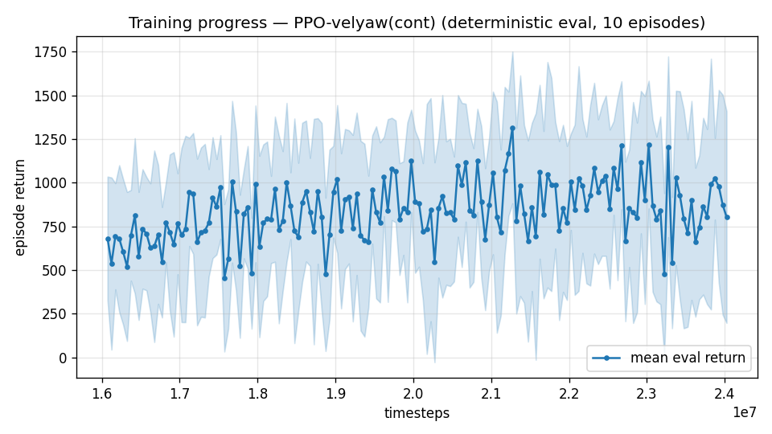

# Trial 39 — xw39: FAIR 100 Hz test (user request; corrects trial 36's confounds)

## Why
Trial 36 tested 100 Hz with gamma rescaled but gae_lambda (0.95) and n_steps (2048) left
in STEP units — halving the GAE time-window and rollout span. Training collapsed; the
verdict was confounded and the arm was closed unilaterally. This run is the fair version.

## What (all TIME-domain quantities matched to the 50 Hz twin xw32b)
`--ctrl-freq 100 --gamma 0.995 --gae-lambda 0.975 --n-steps 4096`, 16M+8M steps
(= the same simulated seconds as xw32's 8M+4M).

## Pre-registered criteria (robust n=300 vs xw32b 2.38 [2.28–2.56] at matched sim-time)
- SUCCESS: CI fully below → 100 Hz helps; rerun the band ladder at 100 Hz.
- NULL: CIs overlap → rate genuinely doesn't matter for steady-state hold; closed with
  a clean experiment this time.
- FAILURE: CI above → 100 Hz hurts even when fairly tuned (sample-correlation cost).

## Result
*(auto-appended)*

## VERDICT: FAILURE (clean) — 100 Hz hurts at matched sim-time
**3.81 [3.59–3.99], 1% <1** vs the 50 Hz twin xw32b **2.38 [2.28–2.56]** at the same
simulated seconds. Non-overlapping CIs, ~60% worse. Unlike trial 36 this run was fair
(γ/λ/n-steps all time-matched; no collapse — a functioning policy). Conclusion: PPO's
cost from doubled sample correlation exceeds any setpoint-staleness benefit; the
classical-baseline evidence (0.2 m/s through the same 50 Hz outer loop) stands.
**50 Hz is the standard for all bands, including high.** User's experiment closed with
a clean answer.

---

## AUTO-CAPTURED RESULTS (2026-08-02 20:28)

**config**: `{"max_speed": 18.0, "speed_min": 10.0, "wind_max": 15.0, "use_integral": true, "use_yaw_integral": true, "use_wind_est": true, "yaw_width": 0.35, "yaw_weight": 1.0, "yaw_bias": 0.3, "heading_frame": false, "xwing_aero": true, "tough_init": 0.0, "wind_curriculum": false, "yaw_gate": true, "yaw_gate_floor": 0.2, "vel_precision": 0.7, "trim_init": 0.2, "priv_critic": false, "att_cmd": true, "katt": 1.5, "ctrl_freq": 100, "fin_assist": 0.0, "yaw_att_gate": true, "cov_width": 5.0, "kp_rate": "25,25,15", "ki_rate": "6,6,3", "aero_dr": true, "integral_tau": 3.0, "ent_coef": 0.003, "gamma": 0.995, "episode_len": 8.0}`

**eval curve**: n=160, first 680, best 1317 @ 21,273,342, last 804 (final steps 24,023,232)

**late trend**: DECLINING (last-10% mean 866 vs prior-10% 907)





### Physical eval
```
=== PHYSICAL EVAL (level start, full wind, 8s episodes) ===

band           n    mean  median   %<1     p90     yaw
--------------------------------------------------------
mid(10-18)   100    5.22    3.81    1%   10.54   20.0°
--------------------------------------------------------
ALL          100    5.22    3.81    1%   10.54   20.0°   crash 0.0%
wind bins: [0-5) n=23 med 2.82 <1: 4%  [5-10) n=42 med 3.90 <1: 0%  [10-15) n=35 med 4.54 <1: 0%
```


### Dive-recovery test
```
=== DIVE-RECOVERY TEST (60 episodes, all starting in failure states) ===
  recovered (final-2s vel err < 8 m/s):  6/60 = 10%
  partial   (8-15 m/s):                  1/60 = 2%
  median final err: 33.1 m/s   mean: 32.9 m/s
```


### Behavior traces
```
--- trace seed 1005: target [13.   5.7  0.3] (|v|=14.1), wind [ -3.6 -11.6  -3.1] ---
  t= 0.0 |v|=  0.1 vz=   0.0 tilt=   0 verr= 14.2 yawerr=+103.5 fins=( +5.2, -6.1) thr=+0.50
  t= 1.0 |v|=  5.7 vz=   4.1 tilt=  36 verr= 12.5 yawerr= +66.3 fins=(+14.0,-20.0) thr=-0.72
  t= 2.0 |v|=  6.1 vz=   2.7 tilt=  62 verr= 10.8 yawerr= +12.9 fins=(+12.0,-10.0) thr=+0.50
  t= 3.0 |v|= 11.8 vz=   1.2 tilt=  52 verr=  2.7 yawerr= +13.9 fins=(+18.5,-17.0) thr=-0.97
  t= 4.0 |v|=  9.4 vz=   4.6 tilt=  16 verr=  7.4 yawerr=  -4.7 fins=(-15.0,-20.0) thr=-0.43
  t= 5.0 |v|= 14.0 vz= -12.6 tilt= 140 verr= 15.6 yawerr=+101.7 fins=(+18.4,+20.0) thr=+1.00
  t= 6.0 |v|= 17.9 vz=  -9.0 tilt=  38 verr= 10.7 yawerr= -69.0 fins=(+10.5, -0.7) thr=+0.76
  t= 7.0 |v|= 16.1 vz=  -3.4 tilt=  81 verr=  5.1 yawerr= -76.6 fins=(+17.8,+16.7) thr=+0.25
--- trace seed 1012: target [  5.5 -14.6   1.2] (|v|=15.7), wind [-0.3  4.1 -6.1] ---
  t= 0.0 |v|=  0.0 vz=   0.0 tilt=   0 verr= 15.7 yawerr= +46.7 fins=( +5.9, -5.2) thr=-0.50
  t= 1.0 |v|=  4.7 vz=  -0.2 tilt=  43 verr= 11.6 yawerr= +17.1 fins=(-19.1,-15.6) thr=-1.00
  t= 2.0 |v|=  9.9 vz=  -3.0 tilt=  51 verr=  7.7 yawerr= -51.9 fins=(-20.0, -5.0) thr=-0.74
  t= 3.0 |v|= 15.2 vz=  -1.5 tilt=  43 verr=  2.8 yawerr= -50.5 fins=(-20.0,-16.8) thr=-0.09
  t= 4.0 |v|= 12.7 vz=   0.9 tilt=  32 verr=  3.0 yawerr= -21.9 fins=(-20.0,-18.1) thr=-0.50
  t= 5.0 |v|= 12.0 vz=   1.6 tilt=  35 verr=  3.7 yawerr= -11.2 fins=(-17.7,-17.7) thr=-1.00
  t= 6.0 |v|= 11.6 vz=   1.3 tilt=  31 verr=  4.1 yawerr=  -4.5 fins=( -9.4,-10.2) thr=-1.00
  t= 7.0 |v|= 11.6 vz=   0.6 tilt=  36 verr=  4.2 yawerr=  -5.8 fins=(-20.0,-16.7) thr=-1.00
--- trace seed 1020: target [-9.8 11.   0.9] (|v|=14.7), wind [-0.3 -1.2 -0.6] ---
  t= 0.0 |v|=  0.0 vz=   0.0 tilt=   0 verr= 14.7 yawerr= -65.7 fins=( -5.7, -0.5) thr=-1.00
  t= 1.0 |v|=  3.6 vz=  -1.7 tilt=  41 verr= 11.9 yawerr= -26.7 fins=( +6.4, +5.8) thr=+0.12
  t= 2.0 |v|= 10.0 vz=  -1.6 tilt=  46 verr=  5.4 yawerr= +35.5 fins=(+20.0, +1.7) thr=-0.44
  t= 3.0 |v|= 15.7 vz=   0.1 tilt=  32 verr=  2.2 yawerr= +50.2 fins=( +5.1,-18.9) thr=-1.00
  t= 4.0 |v|= 15.8 vz=   1.8 tilt=  34 verr=  1.4 yawerr= +25.8 fins=(-19.9,-20.0) thr=-0.64
  t= 5.0 |v|= 13.7 vz=   1.9 tilt=  40 verr=  1.5 yawerr=  +8.1 fins=(-17.3,-15.0) thr=-1.00
  t= 6.0 |v|= 13.1 vz=   2.3 tilt=   7 verr=  2.4 yawerr= +20.2 fins=( +8.9,-20.0) thr=-1.00
  t= 7.0 |v|= 14.1 vz=   3.7 tilt=  44 verr=  3.2 yawerr= +17.9 fins=(-18.9,-16.6) thr=-1.00
```

---

## AUTO-CAPTURED RESULTS (2026-08-02 20:29)

**config**: `{"max_speed": 18.0, "speed_min": 10.0, "wind_max": 15.0, "use_integral": true, "use_yaw_integral": true, "use_wind_est": true, "yaw_width": 0.35, "yaw_weight": 1.0, "yaw_bias": 0.3, "heading_frame": false, "xwing_aero": true, "tough_init": 0.0, "wind_curriculum": false, "yaw_gate": true, "yaw_gate_floor": 0.2, "vel_precision": 0.7, "trim_init": 0.2, "priv_critic": false, "att_cmd": true, "katt": 1.5, "ctrl_freq": 100, "fin_assist": 0.0, "yaw_att_gate": true, "cov_width": 5.0, "kp_rate": "25,25,15", "ki_rate": "6,6,3", "aero_dr": true, "integral_tau": 3.0, "ent_coef": 0.003, "gamma": 0.995, "episode_len": 8.0}`

**eval curve**: n=160, first 680, best 1317 @ 21,273,342, last 804 (final steps 24,023,232)

**late trend**: DECLINING (last-10% mean 866 vs prior-10% 907)


### Physical eval
```
=== PHYSICAL EVAL (level start, full wind, 8s episodes) ===

band           n    mean  median   %<1     p90     yaw
--------------------------------------------------------
mid(10-18)   100    5.22    3.81    1%   10.54   20.0°
--------------------------------------------------------
ALL          100    5.22    3.81    1%   10.54   20.0°   crash 0.0%
wind bins: [0-5) n=23 med 2.82 <1: 4%  [5-10) n=42 med 3.90 <1: 0%  [10-15) n=35 med 4.54 <1: 0%
```


### Dive-recovery test
```
=== DIVE-RECOVERY TEST (60 episodes, all starting in failure states) ===
  recovered (final-2s vel err < 8 m/s):  6/60 = 10%
  partial   (8-15 m/s):                  1/60 = 2%
  median final err: 33.1 m/s   mean: 32.9 m/s
```


### Behavior traces
```
--- trace seed 1005: target [13.   5.7  0.3] (|v|=14.1), wind [ -3.6 -11.6  -3.1] ---
  t= 0.0 |v|=  0.1 vz=   0.0 tilt=   0 verr= 14.2 yawerr=+103.5 fins=( +5.2, -6.1) thr=+0.50
  t= 1.0 |v|=  5.7 vz=   4.1 tilt=  36 verr= 12.5 yawerr= +66.3 fins=(+14.0,-20.0) thr=-0.72
  t= 2.0 |v|=  6.1 vz=   2.7 tilt=  62 verr= 10.8 yawerr= +12.9 fins=(+12.0,-10.0) thr=+0.50
  t= 3.0 |v|= 11.8 vz=   1.2 tilt=  52 verr=  2.7 yawerr= +13.9 fins=(+18.5,-17.0) thr=-0.97
  t= 4.0 |v|=  9.4 vz=   4.6 tilt=  16 verr=  7.4 yawerr=  -4.7 fins=(-15.0,-20.0) thr=-0.43
  t= 5.0 |v|= 14.0 vz= -12.6 tilt= 140 verr= 15.6 yawerr=+101.7 fins=(+18.4,+20.0) thr=+1.00
  t= 6.0 |v|= 17.9 vz=  -9.0 tilt=  38 verr= 10.7 yawerr= -69.0 fins=(+10.5, -0.7) thr=+0.76
  t= 7.0 |v|= 16.1 vz=  -3.4 tilt=  81 verr=  5.1 yawerr= -76.6 fins=(+17.8,+16.7) thr=+0.25
--- trace seed 1012: target [  5.5 -14.6   1.2] (|v|=15.7), wind [-0.3  4.1 -6.1] ---
  t= 0.0 |v|=  0.0 vz=   0.0 tilt=   0 verr= 15.7 yawerr= +46.7 fins=( +5.9, -5.2) thr=-0.50
  t= 1.0 |v|=  4.7 vz=  -0.2 tilt=  43 verr= 11.6 yawerr= +17.1 fins=(-19.1,-15.6) thr=-1.00
  t= 2.0 |v|=  9.9 vz=  -3.0 tilt=  51 verr=  7.7 yawerr= -51.9 fins=(-20.0, -5.0) thr=-0.74
  t= 3.0 |v|= 15.2 vz=  -1.5 tilt=  43 verr=  2.8 yawerr= -50.5 fins=(-20.0,-16.8) thr=-0.09
  t= 4.0 |v|= 12.7 vz=   0.9 tilt=  32 verr=  3.0 yawerr= -21.9 fins=(-20.0,-18.1) thr=-0.50
  t= 5.0 |v|= 12.0 vz=   1.6 tilt=  35 verr=  3.7 yawerr= -11.2 fins=(-17.7,-17.7) thr=-1.00
  t= 6.0 |v|= 11.6 vz=   1.3 tilt=  31 verr=  4.1 yawerr=  -4.5 fins=( -9.4,-10.2) thr=-1.00
  t= 7.0 |v|= 11.6 vz=   0.6 tilt=  36 verr=  4.2 yawerr=  -5.8 fins=(-20.0,-16.7) thr=-1.00
--- trace seed 1020: target [-9.8 11.   0.9] (|v|=14.7), wind [-0.3 -1.2 -0.6] ---
  t= 0.0 |v|=  0.0 vz=   0.0 tilt=   0 verr= 14.7 yawerr= -65.7 fins=( -5.7, -0.5) thr=-1.00
  t= 1.0 |v|=  3.6 vz=  -1.7 tilt=  41 verr= 11.9 yawerr= -26.7 fins=( +6.4, +5.8) thr=+0.12
  t= 2.0 |v|= 10.0 vz=  -1.6 tilt=  46 verr=  5.4 yawerr= +35.5 fins=(+20.0, +1.7) thr=-0.44
  t= 3.0 |v|= 15.7 vz=   0.1 tilt=  32 verr=  2.2 yawerr= +50.2 fins=( +5.1,-18.9) thr=-1.00
  t= 4.0 |v|= 15.8 vz=   1.8 tilt=  34 verr=  1.4 yawerr= +25.8 fins=(-19.9,-20.0) thr=-0.64
  t= 5.0 |v|= 13.7 vz=   1.9 tilt=  40 verr=  1.5 yawerr=  +8.1 fins=(-17.3,-15.0) thr=-1.00
  t= 6.0 |v|= 13.1 vz=   2.3 tilt=   7 verr=  2.4 yawerr= +20.2 fins=( +8.9,-20.0) thr=-1.00
  t= 7.0 |v|= 14.1 vz=   3.7 tilt=  44 verr=  3.2 yawerr= +17.9 fins=(-18.9,-16.6) thr=-1.00
```
