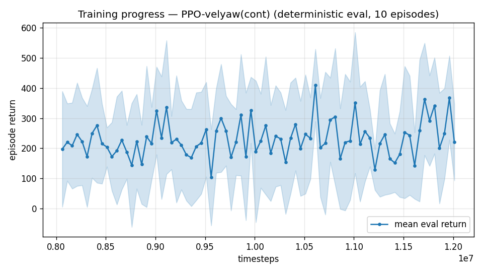

# Trial 40 — xw40: high band, authority bundle II (katt 5, fin-assist 4)

## Why
Trial 38 (katt 3 / fa 2) took the band 8.62→4.67 median then plateaued; hold-from-trim
(4.22) remains the whole deficit. Offline probes: katt 5 / fa 4 roughly halves attitude
error on most seeds (one hard draw saturates ~30° regardless — the expected residual tail).
Trial 39 ruled OUT the 100 Hz path (fair test: 60% worse at matched sim-time), so
authority is the remaining validated lever.

## What (vs xw38: gains only)
`--katt 5.0 --fin-assist 4.0` (stiff rate gains unchanged), same recipe + robust ladder.

## Pre-registered criteria (vs xw38c 4.67 [CI ~4.4-4.9])
- SUCCESS: ≤3.9 (classical parity) by 12M; ladder continues toward <1.
- PROGRESS: CI below xw38c → right lever, sweep further (katt 7/fa 6) or accept a
  band-split (18–21 / 21–25).
- FAILURE: ≥4.4 → authority saturated at policy level; next levers: band-split, or
  trim-init dose at high band (approach desert is real there: 3.2% usable-gradient starts).

---

## AUTO-CAPTURED RESULTS (2026-08-03 00:50)

**config**: `{"max_speed": 25.0, "speed_min": 18.0, "wind_max": 15.0, "use_integral": true, "use_yaw_integral": true, "use_wind_est": true, "yaw_width": 0.35, "yaw_weight": 1.0, "yaw_bias": 0.3, "heading_frame": false, "xwing_aero": true, "tough_init": 0.0, "wind_curriculum": false, "yaw_gate": true, "yaw_gate_floor": 0.2, "vel_precision": 0.7, "trim_init": 0.2, "priv_critic": false, "att_cmd": true, "katt": 5.0, "ctrl_freq": 50, "fin_assist": 4.0, "yaw_att_gate": true, "cov_width": 5.0, "kp_rate": "40,40,25", "ki_rate": "10,10,5", "aero_dr": true, "integral_tau": 3.0, "ent_coef": 0.003, "gamma": 0.99, "episode_len": 8.0}`

**eval curve**: n=80, first 197, best 409 @ 10,611,672, last 220 (final steps 12,011,616)

**late trend**: still rising (last-10% mean 286 vs prior-10% 200)




## VERDICT: FAILURE — 5.54 @12M ≥ authority-I's 5.18. Gains saturated: more attitude-loop
bandwidth does not help the POLICY learn (likely amplifies noise/oscillation costs).
Ladder killed. High-band base remains xw38c (4.67). Next levers per pre-registration:
band-split (18–21/21–25) or high-band trim-init dose — queued behind the airflow
diagnostic's verdict (wind observability may matter at high band too).

## Exact code changes
No code changes — flags only on the existing implementation (the feature's code is in the trial cited below).
(fin-assist + attitude authority: trial 38.)
```bash
# only these differ from trial 38:
  --katt 5.0 --fin-assist 4.0
```
