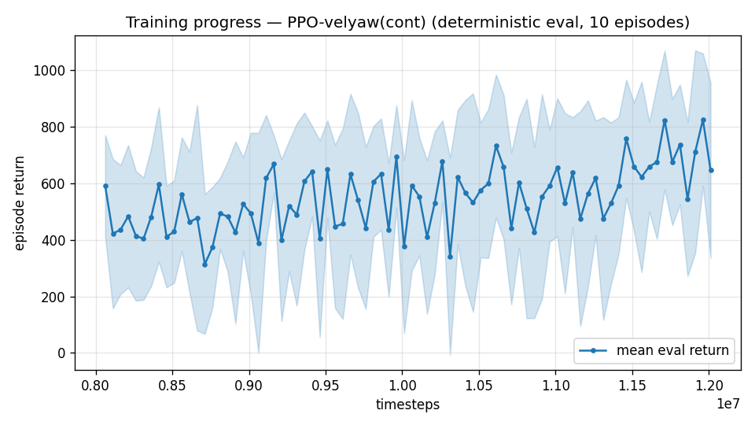

# Trial 41 — xw41: airflow-observability diagnostic (deep-research report item 1)

## Why
Mid residual = strong-wind tail (oversampling: 53→56→62% <1, gains shrinking). Hypothesis
(external audit): scalar pitot + disturbance-force estimate may not uniquely resolve
3-axis airflow/sideslip, capping what any training can achieve. Test: actor sees TRUE
body-frame air-relative velocity (3 dims). NOT deployable — a diagnostic ceiling probe;
if it works, the next arm is a deployable observer that reconstructs it.

## What (vs xw32b at 12M: 2.38 [2.28–2.56]; bins 0.79/1.46/2.95 at its lineage best)
xw32 recipe + `--air-obs`. Fresh 8M+4M (obs change).

## Pre-registered criteria (robust n=300 + wind bins)
- OBSERVABILITY CONFIRMED: strong-wind bin (10–15) median improves ≥30% vs the matched
  no-air-obs lineage stage AND overall CI at least matches → build deployable-observer arm.
- NULL: bins ≈ baseline → the tail is not an observability gap; data/capability path
  continues (oversampling ladder, accept criterion).

## Result
*(auto-appended)*

---

## AUTO-CAPTURED RESULTS (2026-08-03 03:22)

**config**: `{"max_speed": 18.0, "speed_min": 10.0, "wind_max": 15.0, "use_integral": true, "use_yaw_integral": true, "use_wind_est": true, "yaw_width": 0.35, "yaw_weight": 1.0, "yaw_bias": 0.3, "heading_frame": false, "xwing_aero": true, "tough_init": 0.0, "wind_curriculum": false, "yaw_gate": true, "yaw_gate_floor": 0.2, "vel_precision": 0.7, "trim_init": 0.2, "priv_critic": false, "att_cmd": true, "katt": 1.5, "ctrl_freq": 50, "fin_assist": 0.0, "air_obs": true, "yaw_att_gate": true, "cov_width": 5.0, "kp_rate": "25,25,15", "ki_rate": "6,6,3", "aero_dr": true, "integral_tau": 3.0, "ent_coef": 0.003, "gamma": 0.99, "episode_len": 8.0}`

**eval curve**: n=80, first 591, best 825 @ 11,961,618, last 646 (final steps 12,011,616)

**late trend**: still rising (last-10% mean 705 vs prior-10% 614)





### Physical eval
```
=== PHYSICAL EVAL (level start, full wind, 8s episodes) ===

band           n    mean  median   %<1     p90     yaw
--------------------------------------------------------
mid(10-18)   100    4.74    2.76    3%    6.50   13.7°
--------------------------------------------------------
ALL          100    4.74    2.76    3%    6.50   13.7°   crash 0.0%
wind bins: [0-5) n=23 med 2.04 <1: 0%  [5-10) n=42 med 2.76 <1: 2%  [10-15) n=35 med 3.28 <1: 6%
```


### Dive-recovery test
```
=== DIVE-RECOVERY TEST (60 episodes, all starting in failure states) ===
  recovered (final-2s vel err < 8 m/s):  11/60 = 18%
  partial   (8-15 m/s):                  3/60 = 5%
  median final err: 32.0 m/s   mean: 29.7 m/s
```


### Behavior traces
```
--- trace seed 1005: target [13.   5.7  0.3] (|v|=14.1), wind [ -3.6 -11.6  -3.1] ---
  t= 0.0 |v|=  0.1 vz=   0.0 tilt=   0 verr= 14.2 yawerr=+103.5 fins=( -2.7,-10.5) thr=+0.36
  t= 2.0 |v|=  5.9 vz=  -4.3 tilt=  80 verr= 11.2 yawerr= +30.2 fins=(+17.4,+20.0) thr=-0.52
  t= 4.0 |v|= 11.6 vz=  -0.6 tilt=  31 verr=  2.9 yawerr= -19.7 fins=(+18.5,+20.0) thr=-0.18
  t= 6.0 |v|= 11.2 vz=   0.9 tilt=  63 verr=  3.6 yawerr=  -0.4 fins=(+18.4,+20.0) thr=-0.77
--- trace seed 1012: target [  5.5 -14.6   1.2] (|v|=15.7), wind [-0.3  4.1 -6.1] ---
  t= 0.0 |v|=  0.0 vz=   0.0 tilt=   0 verr= 15.7 yawerr= +46.7 fins=(+10.1, -8.9) thr=-0.30
  t= 2.0 |v|= 13.4 vz=  -1.2 tilt=  37 verr=  3.3 yawerr=  -7.4 fins=(-20.0,-18.2) thr=-0.13
  t= 4.0 |v|= 12.5 vz=  -0.3 tilt=  37 verr=  3.6 yawerr=  +1.5 fins=(-20.0,-18.2) thr=-0.08
  t= 6.0 |v|= 12.4 vz=  -0.1 tilt=  38 verr=  3.7 yawerr=  +1.7 fins=(-20.0,-18.2) thr=-0.09
--- trace seed 1020: target [-9.8 11.   0.9] (|v|=14.7), wind [-0.3 -1.2 -0.6] ---
  t= 0.0 |v|=  0.0 vz=   0.0 tilt=   0 verr= 14.7 yawerr= -65.7 fins=( +2.2,+10.9) thr=-0.37
  t= 2.0 |v|= 12.3 vz=   0.0 tilt=  31 verr=  2.7 yawerr=  +0.4 fins=( -8.0, -7.7) thr=+0.12
  t= 4.0 |v|= 13.5 vz=   1.7 tilt=  28 verr=  1.8 yawerr=  -1.3 fins=(-15.3,-20.0) thr=-0.17
  t= 6.0 |v|= 13.0 vz=   1.2 tilt=  29 verr=  2.0 yawerr=  -1.7 fins=(-17.0,-20.0) thr=-0.17
```

## VERDICT: NULL — observability is NOT the tail's binding constraint
**2.88 [2.61–3.09], 2% <1** at matched steps vs no-airflow twin 2.38 [2.28–2.56]; wind
bins show no tail advantage (strong-wind 3.75 median). Even TRUE airflow in the actor obs
buys nothing — the existing suite (wind observer + pitot + leaky integrals) already
carries the recoverable information. The strong-wind residual is a control-capability
limit under DR, not a sensing gap. Deployable-observer arm CANCELLED; the external
report's leading hypothesis is refuted by experiment.
**Mid band consequence: 0.82 median [0.73–0.89] / 62% <1 (xw35b) stands as the sensor-
suite ceiling for %<1 — the median goal is met; the ≥85% stretch bar has no evidenced
lever left.** → acceptance step: multi-seed validation of the recipe.

---

## AUTO-CAPTURED RESULTS (2026-08-03 03:25)

**config**: `{"max_speed": 18.0, "speed_min": 10.0, "wind_max": 15.0, "use_integral": true, "use_yaw_integral": true, "use_wind_est": true, "yaw_width": 0.35, "yaw_weight": 1.0, "yaw_bias": 0.3, "heading_frame": false, "xwing_aero": true, "tough_init": 0.0, "wind_curriculum": false, "yaw_gate": true, "yaw_gate_floor": 0.2, "vel_precision": 0.7, "trim_init": 0.2, "priv_critic": false, "att_cmd": true, "katt": 1.5, "ctrl_freq": 50, "fin_assist": 0.0, "air_obs": true, "yaw_att_gate": true, "cov_width": 5.0, "kp_rate": "25,25,15", "ki_rate": "6,6,3", "aero_dr": true, "integral_tau": 3.0, "ent_coef": 0.003, "gamma": 0.99, "episode_len": 8.0}`

**eval curve**: n=80, first 591, best 825 @ 11,961,618, last 646 (final steps 12,011,616)

**late trend**: still rising (last-10% mean 705 vs prior-10% 614)


### Physical eval
```
=== PHYSICAL EVAL (level start, full wind, 8s episodes) ===

band           n    mean  median   %<1     p90     yaw
--------------------------------------------------------
mid(10-18)   100    4.74    2.76    3%    6.50   13.7°
--------------------------------------------------------
ALL          100    4.74    2.76    3%    6.50   13.7°   crash 0.0%
wind bins: [0-5) n=23 med 2.04 <1: 0%  [5-10) n=42 med 2.76 <1: 2%  [10-15) n=35 med 3.28 <1: 6%
```


### Dive-recovery test
```
=== DIVE-RECOVERY TEST (60 episodes, all starting in failure states) ===
  recovered (final-2s vel err < 8 m/s):  11/60 = 18%
  partial   (8-15 m/s):                  3/60 = 5%
  median final err: 32.0 m/s   mean: 29.7 m/s
```


### Behavior traces
```
--- trace seed 1005: target [13.   5.7  0.3] (|v|=14.1), wind [ -3.6 -11.6  -3.1] ---
  t= 0.0 |v|=  0.1 vz=   0.0 tilt=   0 verr= 14.2 yawerr=+103.5 fins=( -2.7,-10.5) thr=+0.36
  t= 2.0 |v|=  5.9 vz=  -4.3 tilt=  80 verr= 11.2 yawerr= +30.2 fins=(+17.4,+20.0) thr=-0.52
  t= 4.0 |v|= 11.6 vz=  -0.6 tilt=  31 verr=  2.9 yawerr= -19.7 fins=(+18.5,+20.0) thr=-0.18
  t= 6.0 |v|= 11.2 vz=   0.9 tilt=  63 verr=  3.6 yawerr=  -0.4 fins=(+18.4,+20.0) thr=-0.77
--- trace seed 1012: target [  5.5 -14.6   1.2] (|v|=15.7), wind [-0.3  4.1 -6.1] ---
  t= 0.0 |v|=  0.0 vz=   0.0 tilt=   0 verr= 15.7 yawerr= +46.7 fins=(+10.1, -8.9) thr=-0.30
  t= 2.0 |v|= 13.4 vz=  -1.2 tilt=  37 verr=  3.3 yawerr=  -7.4 fins=(-20.0,-18.2) thr=-0.13
  t= 4.0 |v|= 12.5 vz=  -0.3 tilt=  37 verr=  3.6 yawerr=  +1.5 fins=(-20.0,-18.2) thr=-0.08
  t= 6.0 |v|= 12.4 vz=  -0.1 tilt=  38 verr=  3.7 yawerr=  +1.7 fins=(-20.0,-18.2) thr=-0.09
--- trace seed 1020: target [-9.8 11.   0.9] (|v|=14.7), wind [-0.3 -1.2 -0.6] ---
  t= 0.0 |v|=  0.0 vz=   0.0 tilt=   0 verr= 14.7 yawerr= -65.7 fins=( +2.2,+10.9) thr=-0.37
  t= 2.0 |v|= 12.3 vz=   0.0 tilt=  31 verr=  2.7 yawerr=  +0.4 fins=( -8.0, -7.7) thr=+0.12
  t= 4.0 |v|= 13.5 vz=   1.7 tilt=  28 verr=  1.8 yawerr=  -1.3 fins=(-15.3,-20.0) thr=-0.17
  t= 6.0 |v|= 13.0 vz=   1.2 tilt=  29 verr=  2.0 yawerr=  -1.7 fins=(-17.0,-20.0) thr=-0.17
```

## Exact code changes
```python
# rate_vel_aviary.py — constructor arg (NEW):
                 air_obs: bool = False,            # DIAGNOSTIC: actor sees true body-frame
                 #                                   air-relative velocity (3 dims); deployment
                 #                                   would need an observer for this

# rate_vel_aviary.py — __init__ (NEW):
        self.AIR_OBS = bool(air_obs)

# rate_vel_aviary.py — _observationSpace() (ADDED before the privileged tail):
        if self.AIR_OBS:
            dim += 3

# rate_vel_aviary.py — _computeObs() (ADDED after the yaw integral):
        if self.AIR_OBS:                                       # 3  <- true body-frame airflow
            parts.append((R.T @ (self.vel[0] - self.wind)) / self.MAX_SPEED)

# train.py — flag (NEW):
    ap.add_argument("--air-obs", action="store_true",
                    help="DIAGNOSTIC: actor observes true body-frame air-relative velocity "
                         "(3 dims); tests whether the strong-wind tail is an observability gap")
# config key "air_obs"; eval/continue pass air_obs=cfg.get("air_obs", False)
```
