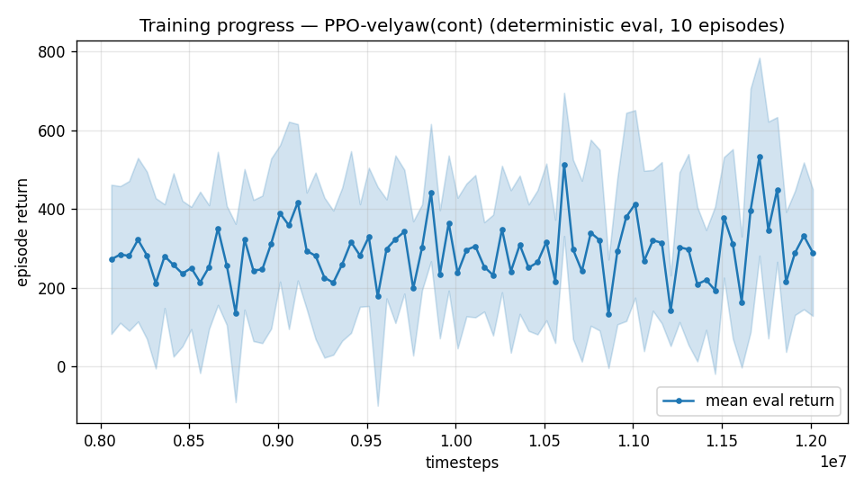

# Trial 42 — xw42: high-band SPLIT, lower half (18–21 m/s)

## Why
High band stuck at 4.67 (xw38c); authority-II refuted (trial 40: gain saturation). The
band spans a 2.4x dynamic-pressure range (Q at 18 vs 25+wind) — one policy may be
straddling incompatible trim regimes. Splitting 18–25 into 18–21 / 21–25 mirrors the
low/mid decomposition that worked. This trial = lower half with the best high config
(att-cmd + trim-init 0.2 + authority-I: katt 3, fin-assist 2, stiff gains) + robust ladder.

## Pre-registered criteria (vs xw38c's 4.67 over the full band)
- SUCCESS: 18–21 median ≤ 2.5 @12M → split confirmed; launch 21–25 half next.
- PROGRESS: 2.5–4.0 → ladder continues; split still plausible.
- FAILURE: ≥ 4.0 → width was not the problem; remaining suspects: airflow observability
  (trial 41 informs), approach desert at high speed (trim-init dose).

## Result
*(auto-appended)*

## VERDICT: FAILURE — 4.69 @12M ≈ full-band 4.67. Band width refuted; ladder killed.
With observability also refuted (trial 41), the remaining evidenced lever is the one that
worked at mid: strong-wind oversampling on the champion → trial 43.

---

## AUTO-CAPTURED RESULTS (2026-08-03 03:34)

**config**: `{"max_speed": 21.0, "speed_min": 18.0, "wind_max": 15.0, "use_integral": true, "use_yaw_integral": true, "use_wind_est": true, "yaw_width": 0.35, "yaw_weight": 1.0, "yaw_bias": 0.3, "heading_frame": false, "xwing_aero": true, "tough_init": 0.0, "wind_curriculum": false, "yaw_gate": true, "yaw_gate_floor": 0.2, "vel_precision": 0.7, "trim_init": 0.2, "priv_critic": false, "att_cmd": true, "katt": 3.0, "ctrl_freq": 50, "fin_assist": 2.0, "air_obs": false, "yaw_att_gate": true, "cov_width": 5.0, "kp_rate": "40,40,25", "ki_rate": "10,10,5", "aero_dr": true, "integral_tau": 3.0, "ent_coef": 0.003, "gamma": 0.99, "episode_len": 8.0}`

**eval curve**: n=80, first 272, best 533 @ 11,711,628, last 290 (final steps 12,011,616)

**late trend**: still rising (last-10% mean 356 vs prior-10% 260)





### Physical eval
```
=== PHYSICAL EVAL (level start, full wind, 8s episodes) ===

band           n    mean  median   %<1     p90     yaw
--------------------------------------------------------
high(18-25)  100    5.11    4.08    1%    8.53   43.2°
--------------------------------------------------------
ALL          100    5.11    4.08    1%    8.53   43.2°   crash 0.0%
wind bins: [0-5) n=23 med 3.76 <1: 4%  [5-10) n=42 med 3.85 <1: 0%  [10-15) n=35 med 4.57 <1: 0%
```


### Dive-recovery test
```
=== DIVE-RECOVERY TEST (60 episodes, all starting in failure states) ===
  recovered (final-2s vel err < 8 m/s):  41/60 = 68%
  partial   (8-15 m/s):                  3/60 = 5%
  median final err: 6.2 m/s   mean: 13.9 m/s
```


### Behavior traces
```
--- trace seed 1005: target [17.9  7.8  0.4] (|v|=19.6), wind [ -3.6 -11.6  -3.1] ---
  t= 0.0 |v|=  0.1 vz=   0.0 tilt=   0 verr= 19.6 yawerr=+103.5 fins=( +8.7, -0.8) thr=+0.98
  t= 2.0 |v|= 14.0 vz=  -0.0 tilt=  53 verr=  5.6 yawerr= +10.1 fins=(-17.4,-20.0) thr=-0.18
  t= 4.0 |v|= 17.6 vz=  -2.7 tilt=  46 verr=  4.6 yawerr= -67.4 fins=(+14.9,+11.4) thr=-0.96
  t= 6.0 |v|= 20.0 vz=  -2.8 tilt=  67 verr=  5.6 yawerr=-123.7 fins=(+18.2,+14.5) thr=-0.71
--- trace seed 1012: target [  7.1 -18.8   1.6] (|v|=20.1), wind [-0.3  4.1 -6.1] ---
  t= 0.0 |v|=  0.0 vz=   0.0 tilt=   0 verr= 20.1 yawerr= +46.7 fins=(+10.1, +0.5) thr=+0.50
  t= 2.0 |v|= 18.3 vz=  -1.2 tilt=  40 verr=  3.4 yawerr=  -0.3 fins=( -0.1,-17.8) thr=-0.77
  t= 4.0 |v|= 20.2 vz=   3.6 tilt=  53 verr=  2.2 yawerr= -33.4 fins=( +7.3, +8.5) thr=-1.00
  t= 6.0 |v|= 21.6 vz=   3.0 tilt=  45 verr=  2.4 yawerr= -57.0 fins=(-20.0,-18.2) thr=-1.00
--- trace seed 1020: target [-13.1  14.7   1.2] (|v|=19.8), wind [-0.3 -1.2 -0.6] ---
  t= 0.0 |v|=  0.0 vz=  -0.0 tilt=   0 verr= 19.8 yawerr= -65.7 fins=( -9.3,-10.3) thr=-1.00
  t= 2.0 |v|= 18.8 vz=  -1.5 tilt=  61 verr=  3.9 yawerr= +20.5 fins=(-19.9,-20.0) thr=-0.05
  t= 4.0 |v|= 21.4 vz=   2.9 tilt=  33 verr=  2.2 yawerr= +19.0 fins=(-19.9,-20.0) thr=-1.00
  t= 6.0 |v|= 15.5 vz=   1.2 tilt=  63 verr=  4.8 yawerr= -41.8 fins=(-15.2,-11.9) thr=-0.55
```
