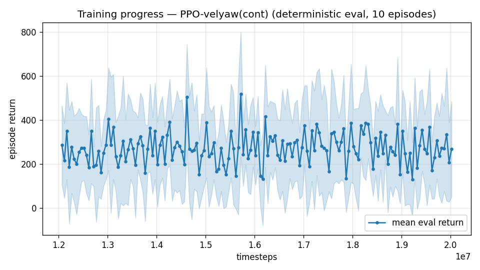
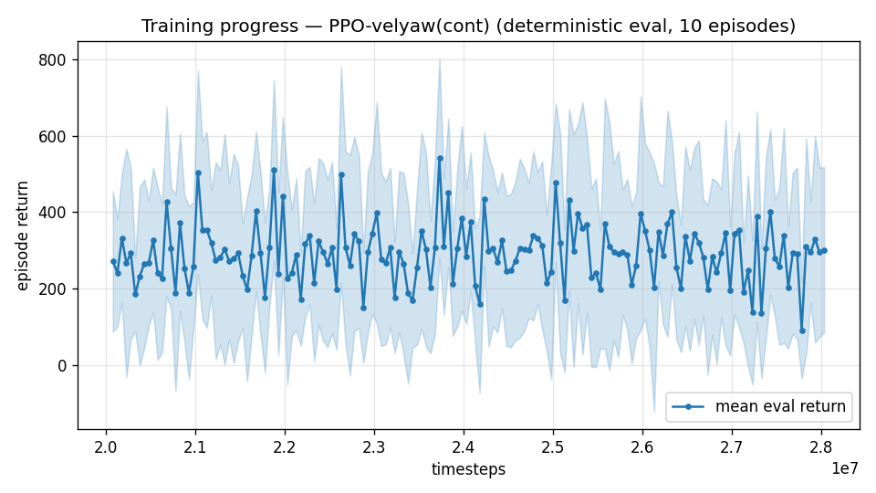

# Trial 43 — xw43: high-band wind-tail ladder (oversample 0.5 on xw38c)

## Why
High stuck at 4.67; refuted: authority-II (40), band split (42), observability (41),
100 Hz (39). The mid band's proven remaining lever was strong-wind oversampling
(0.92→0.82, tail 17→44% <1). High-band failures concentrate in the same strong-wind
draws (all bins fail, worst at 10–15). Staged +8M continuations @1e-4, oversample 0.5,
robust-gated (>7% median).

## Pre-registered
- SUCCESS trend: median ≤3.9 (classical parity) within two stages → keep laddering to <2.
- FAILURE: flat first stage → the high residual is not wind-dominated → next: trim-init
  dose 0.4 at high (approach desert), then honest capability discussion.

---

## AUTO-CAPTURED RESULTS (2026-08-03 05:07)

**config**: `{"max_speed": 25.0, "speed_min": 18.0, "wind_max": 15.0, "use_integral": true, "use_yaw_integral": true, "use_wind_est": true, "yaw_width": 0.35, "yaw_weight": 1.0, "yaw_bias": 0.3, "heading_frame": false, "xwing_aero": true, "tough_init": 0.0, "wind_curriculum": false, "yaw_gate": true, "yaw_gate_floor": 0.2, "vel_precision": 0.7, "trim_init": 0.2, "priv_critic": false, "att_cmd": true, "katt": 3.0, "ctrl_freq": 50, "fin_assist": 2.0, "yaw_att_gate": true, "cov_width": 5.0, "kp_rate": "40,40,25", "ki_rate": "10,10,5", "aero_dr": true, "integral_tau": 3.0, "ent_coef": 0.003, "gamma": 0.99, "episode_len": 8.0}`

**eval curve**: n=160, first 286, best 517 @ 15,717,516, last 268 (final steps 20,017,344)

**late trend**: still rising (last-10% mean 273 vs prior-10% 258)





### Physical eval
```
=== PHYSICAL EVAL (level start, full wind, 8s episodes) ===

band           n    mean  median   %<1     p90     yaw
--------------------------------------------------------
high(18-25)  100    5.47    4.43    0%    9.54   50.3°
--------------------------------------------------------
ALL          100    5.47    4.43    0%    9.54   50.3°   crash 0.0%
wind bins: [0-5) n=23 med 3.75 <1: 0%  [5-10) n=42 med 4.43 <1: 0%  [10-15) n=35 med 4.98 <1: 0%
```


### Dive-recovery test
```
=== DIVE-RECOVERY TEST (60 episodes, all starting in failure states) ===
  recovered (final-2s vel err < 8 m/s):  27/60 = 45%
  partial   (8-15 m/s):                  13/60 = 22%
  median final err: 8.8 m/s   mean: 19.3 m/s
```


### Behavior traces
```
--- trace seed 1005: target [19.8  8.7  0.4] (|v|=21.6), wind [ -3.6 -11.6  -3.1] ---
  t= 0.0 |v|=  0.1 vz=   0.0 tilt=   0 verr= 21.7 yawerr=+103.5 fins=( +6.7, +8.7) thr=-1.00
  t= 2.0 |v|= 16.8 vz=  -6.1 tilt=  75 verr=  9.0 yawerr= +19.3 fins=(+10.8,+15.4) thr=-0.57
  t= 4.0 |v|= 22.5 vz=  -0.7 tilt=  50 verr=  8.1 yawerr= -58.5 fins=( +4.5,-20.0) thr=-0.89
  t= 6.0 |v|= 18.9 vz=  -3.0 tilt=  53 verr=  6.5 yawerr=-128.1 fins=( -8.6,-20.0) thr=-1.00
--- trace seed 1012: target [  8.1 -21.4   1.8] (|v|=23.0), wind [-0.3  4.1 -6.1] ---
  t= 0.0 |v|=  0.0 vz=   0.0 tilt=   0 verr= 23.0 yawerr= +46.7 fins=( +8.9, +8.6) thr=-1.00
  t= 2.0 |v|= 20.7 vz=  -4.0 tilt=  45 verr=  6.4 yawerr= +38.2 fins=( -1.1,-18.1) thr=-1.00
  t= 4.0 |v|= 20.0 vz=   2.8 tilt=  42 verr=  3.4 yawerr= +20.4 fins=(-16.5,-18.2) thr=-1.00
  t= 6.0 |v|= 22.8 vz=   5.0 tilt=  35 verr=  4.9 yawerr= -45.2 fins=(-11.2,-11.0) thr=-1.00
--- trace seed 1020: target [-14.7  16.5   1.4] (|v|=22.1), wind [-0.3 -1.2 -0.6] ---
  t= 0.0 |v|=  0.0 vz=   0.0 tilt=   0 verr= 22.1 yawerr= -65.7 fins=( -9.2, +1.1) thr=-0.24
  t= 2.0 |v|= 19.5 vz=  -3.8 tilt=  61 verr=  6.1 yawerr= +89.4 fins=( -0.5,-20.0) thr=-1.00
  t= 4.0 |v|= 26.4 vz=   4.0 tilt=  82 verr=  5.0 yawerr=  -1.9 fins=(-17.7,-20.0) thr=-1.00
  t= 6.0 |v|= 20.4 vz=  -0.7 tilt=  77 verr=  2.7 yawerr= +77.7 fins=(-18.1,-20.0) thr=-1.00
```

---

## AUTO-CAPTURED RESULTS (2026-08-03 05:07)

**config**: `{"max_speed": 25.0, "speed_min": 18.0, "wind_max": 15.0, "use_integral": true, "use_yaw_integral": true, "use_wind_est": true, "yaw_width": 0.35, "yaw_weight": 1.0, "yaw_bias": 0.3, "heading_frame": false, "xwing_aero": true, "tough_init": 0.0, "wind_curriculum": false, "yaw_gate": true, "yaw_gate_floor": 0.2, "vel_precision": 0.7, "trim_init": 0.2, "priv_critic": false, "att_cmd": true, "katt": 3.0, "ctrl_freq": 50, "fin_assist": 2.0, "yaw_att_gate": true, "cov_width": 5.0, "kp_rate": "40,40,25", "ki_rate": "10,10,5", "aero_dr": true, "integral_tau": 3.0, "ent_coef": 0.003, "gamma": 0.99, "episode_len": 8.0, "wind_oversample": 0.5}`

**eval curve**: n=160, first 272, best 542 @ 23,729,292, last 302 (final steps 28,029,120)

**late trend**: still rising (last-10% mean 282 vs prior-10% 275)





### Physical eval
```
=== PHYSICAL EVAL (level start, full wind, 8s episodes) ===

band           n    mean  median   %<1     p90     yaw
--------------------------------------------------------
high(18-25)  100    5.32    4.54    0%    9.69   45.0°
--------------------------------------------------------
ALL          100    5.32    4.54    0%    9.69   45.0°   crash 0.0%
wind bins: [0-5) n=23 med 3.69 <1: 0%  [5-10) n=42 med 4.61 <1: 0%  [10-15) n=35 med 4.81 <1: 0%
```


### Dive-recovery test
```
=== DIVE-RECOVERY TEST (60 episodes, all starting in failure states) ===
  recovered (final-2s vel err < 8 m/s):  27/60 = 45%
  partial   (8-15 m/s):                  9/60 = 15%
  median final err: 10.5 m/s   mean: 22.3 m/s
```


### Behavior traces
```
--- trace seed 1005: target [19.8  8.7  0.4] (|v|=21.6), wind [ -3.6 -11.6  -3.1] ---
  t= 0.0 |v|=  0.1 vz=   0.0 tilt=   0 verr= 21.7 yawerr=+103.5 fins=( +8.8,+10.2) thr=-1.00
  t= 2.0 |v|= 15.9 vz=  -5.4 tilt=  90 verr=  9.0 yawerr= +69.1 fins=(+14.1,+13.1) thr=-0.96
  t= 4.0 |v|= 24.0 vz=  -3.9 tilt=  42 verr=  5.5 yawerr=+137.5 fins=(-15.8,-19.5) thr=-1.00
  t= 6.0 |v|= 17.6 vz=   0.1 tilt=  37 verr=  5.9 yawerr=+103.4 fins=(+17.9,+20.0) thr=-1.00
--- trace seed 1012: target [  8.1 -21.4   1.8] (|v|=23.0), wind [-0.3  4.1 -6.1] ---
  t= 0.0 |v|=  0.0 vz=  -0.0 tilt=   0 verr= 23.0 yawerr= +46.7 fins=(+10.1, +9.8) thr=-0.78
  t= 2.0 |v|= 22.5 vz=  -0.5 tilt=  40 verr=  2.5 yawerr= +43.8 fins=( +8.7,-14.0) thr=-1.00
  t= 4.0 |v|= 24.0 vz=   2.9 tilt=  31 verr=  1.6 yawerr= +39.9 fins=(-20.0,-18.1) thr=-1.00
  t= 6.0 |v|= 22.0 vz=   5.2 tilt=  22 verr=  3.9 yawerr= +15.4 fins=(-20.0,-18.2) thr=-1.00
--- trace seed 1020: target [-14.7  16.5   1.4] (|v|=22.1), wind [-0.3 -1.2 -0.6] ---
  t= 0.0 |v|=  0.0 vz=   0.0 tilt=   0 verr= 22.1 yawerr= -65.7 fins=( -9.7, +0.3) thr=-0.98
  t= 2.0 |v|= 23.1 vz=  -2.9 tilt=  50 verr=  4.6 yawerr= +89.4 fins=(-19.9,-20.0) thr=-1.00
  t= 4.0 |v|= 26.5 vz=   9.0 tilt=  70 verr=  8.3 yawerr= -20.4 fins=(+18.1, -6.7) thr=-1.00
  t= 6.0 |v|= 19.9 vz=   6.7 tilt=  49 verr=  7.2 yawerr= -17.9 fins=(+20.0,+20.0) thr=-1.00
```

## VERDICT: FLAT (4.53, −3%) — and the bins are the real finding
Wind bins UNIFORM: calm 3.69 / mid 4.61 / strong 4.81, 0% <1 everywhere. The high-band
residual is regime-wide — a steady-offset signature at high Q (hold-from-trim ≈ rest
error, ~3.7 even in calm air). Classical precedent (trial 21): the cascade ALSO plateaued
at high band with leak τ=3 and needed a true integrator (force errors scale V²; a 3 s
leak caps nullable offset). The policy's integral obs has the same τ=3 leak.
→ trial 44: integral memory τ=10 at high (supersedes the pre-registered trim-init dose
arm — hold≈rest refutes the approach-deficit theory behind dosing; deviation documented).
τ=1e6 is NOT used: trials 22/25 showed full integrators collapse yaw when paired with
long episodes; τ=10 at 8 s episodes is the mid-ground E4 design.
