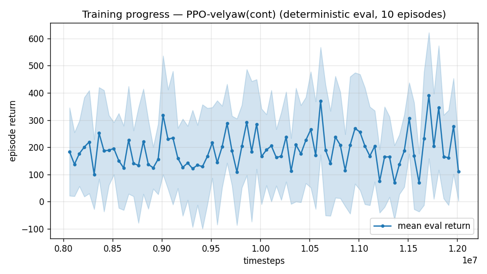

# Trial 44 — xw44: high band, integral memory τ=10

## Why (see trial 43 verdict)
High-band residual is a uniform steady offset (~3.7–4.8 across all wind bins; hold ≈ rest).
Classical needed a true integrator at this band (τ=3 leak caps nullable offset when force
errors scale with V²). τ=10 triples the policy's integral memory without the yaw-collapse
risk of a full integrator (trials 22/25: that pathology required long episodes).

## What (vs xw38: ONE obs-dynamics change)
`--integral-tau 10` on the xw38 recipe (att-cmd, trim-init 0.2, authority-I), fresh
8M+4M + robust ladder.

## Pre-registered (vs xw38c 4.67 [CI ~4.4–4.9])
- SUCCESS: median ≤ 3.9 @12M (classical parity) → ladder toward <2.
- PROGRESS: CI below xw38c → right mechanism, sweep τ (20, 30).
- FAILURE: ≈ 4.7 → integral memory refuted; the honest capability discussion follows
  (every single-variable lever will then have been tested at the high band).

---

## AUTO-CAPTURED RESULTS (2026-08-03 07:29)

**config**: `{"max_speed": 25.0, "speed_min": 18.0, "wind_max": 15.0, "use_integral": true, "use_yaw_integral": true, "use_wind_est": true, "yaw_width": 0.35, "yaw_weight": 1.0, "yaw_bias": 0.3, "heading_frame": false, "xwing_aero": true, "tough_init": 0.0, "wind_curriculum": false, "yaw_gate": true, "yaw_gate_floor": 0.2, "vel_precision": 0.7, "trim_init": 0.2, "priv_critic": false, "att_cmd": true, "katt": 3.0, "ctrl_freq": 50, "fin_assist": 2.0, "air_obs": false, "yaw_att_gate": true, "cov_width": 5.0, "kp_rate": "40,40,25", "ki_rate": "10,10,5", "aero_dr": true, "integral_tau": 10.0, "ent_coef": 0.003, "gamma": 0.99, "episode_len": 8.0}`

**eval curve**: n=80, first 183, best 390 @ 11,711,628, last 110 (final steps 12,011,616)

**late trend**: still rising (last-10% mean 235 vs prior-10% 158)





### Physical eval
```
=== PHYSICAL EVAL (level start, full wind, 8s episodes) ===

band           n    mean  median   %<1     p90     yaw
--------------------------------------------------------
high(18-25)  100    6.92    5.80    0%   12.26   54.0°
--------------------------------------------------------
ALL          100    6.92    5.80    0%   12.26   54.0°   crash 0.0%
wind bins: [0-5) n=23 med 4.36 <1: 0%  [5-10) n=42 med 5.80 <1: 0%  [10-15) n=35 med 6.83 <1: 0%
```


### Dive-recovery test
```
=== DIVE-RECOVERY TEST (60 episodes, all starting in failure states) ===
  recovered (final-2s vel err < 8 m/s):  24/60 = 40%
  partial   (8-15 m/s):                  14/60 = 23%
  median final err: 10.8 m/s   mean: 20.3 m/s
```


### Behavior traces
```
--- trace seed 1005: target [19.8  8.7  0.4] (|v|=21.6), wind [ -3.6 -11.6  -3.1] ---
  t= 0.0 |v|=  0.1 vz=   0.0 tilt=   0 verr= 21.7 yawerr=+103.5 fins=( +9.0, -0.8) thr=+0.26
  t= 2.0 |v|= 14.1 vz=  -1.8 tilt=  77 verr=  9.2 yawerr= -13.3 fins=(+15.2,+17.4) thr=-1.00
  t= 4.0 |v|= 23.2 vz=   0.2 tilt=  67 verr=  1.8 yawerr= +41.6 fins=( -2.8,-17.6) thr=-1.00
  t= 6.0 |v|= 19.5 vz=  -2.0 tilt=  75 verr=  8.0 yawerr=+110.3 fins=(+12.9,-18.1) thr=-1.00
--- trace seed 1012: target [  8.1 -21.4   1.8] (|v|=23.0), wind [-0.3  4.1 -6.1] ---
  t= 0.0 |v|=  0.0 vz=   0.0 tilt=   0 verr= 23.0 yawerr= +46.7 fins=( +9.4, +8.3) thr=-0.83
  t= 2.0 |v|= 18.0 vz=  -1.3 tilt=  47 verr=  5.9 yawerr= -57.9 fins=(+17.4,+19.1) thr=-0.85
  t= 4.0 |v|= 19.8 vz=   3.7 tilt=  50 verr=  4.0 yawerr= -35.1 fins=(+20.0,+19.9) thr=-1.00
  t= 6.0 |v|= 20.2 vz=   5.2 tilt=  27 verr=  4.9 yawerr= -33.0 fins=(-18.3,-13.8) thr=-1.00
--- trace seed 1020: target [-14.7  16.5   1.4] (|v|=22.1), wind [-0.3 -1.2 -0.6] ---
  t= 0.0 |v|=  0.0 vz=   0.0 tilt=   0 verr= 22.1 yawerr= -65.7 fins=( -9.7,-10.3) thr=-0.26
  t= 2.0 |v|= 17.9 vz=  -5.5 tilt=  83 verr=  8.6 yawerr=+143.1 fins=( -3.5,-20.0) thr=+0.55
  t= 4.0 |v|= 24.2 vz=   6.6 tilt=  45 verr=  6.4 yawerr= +80.8 fins=(+20.0,+17.9) thr=-0.73
  t= 6.0 |v|= 18.5 vz=   3.5 tilt=  51 verr=  5.5 yawerr= +76.3 fins=( +6.7,-13.9) thr=-0.65
```

## VERDICT: FAILURE — 5.98 @12M, worse than baseline 4.67. Integral memory refuted
(longer-memory integral obs likely rails during the long high-band approach, poisoning
more than it nulls). Ladder killed. Before the capability conclusion: PROTOCOL CHECK —
high-band evals are 8 s from rest while the approach alone eats most of that (classical
needed 20–30 s to settle here). xw38c re-eval @20 s running; if the median drops
substantially, the next arm is LONGER EPISODES at high band — newly viable because the
user's yaw spec (yaw free at speed) voids the yaw-collapse objection that killed long
episodes in trials 22/25.
