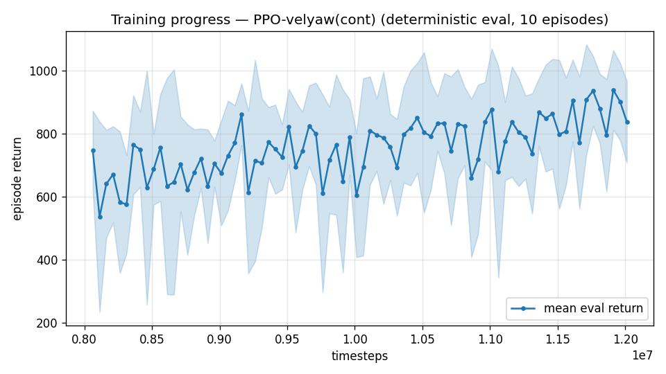

# Trial 46 — xw46: low-band revisit with the winning recipe

## Why
Low band's 0.88 median / 57% <1 (xw18b-era) predates trim-init and the attitude interface.
The mid band's winning combo should clear it and improve the tail. Yaw IS scored here
(user spec: heading matters at hover/low).

## Pre-registered (vs 0.88 / 57%<1 / yaw ~4°)
- SUCCESS: median ≤ 0.7 AND %<1 ≥ 65% AND yaw ≤ 8° → oversample ladder next for ≥85%.
- NULL: ≈ baseline → low band keeps xw18b-era champion; skip to vhigh/top extension.

---

## AUTO-CAPTURED RESULTS (2026-08-03 10:52)

**config**: `{"max_speed": 10.0, "speed_min": 0.0, "wind_max": 15.0, "use_integral": true, "use_yaw_integral": true, "use_wind_est": true, "yaw_width": 0.35, "yaw_weight": 1.0, "yaw_bias": 0.3, "heading_frame": false, "xwing_aero": true, "tough_init": 0.0, "wind_curriculum": false, "yaw_gate": true, "yaw_gate_floor": 0.2, "vel_precision": 0.7, "trim_init": 0.2, "priv_critic": false, "att_cmd": true, "katt": 1.5, "ctrl_freq": 50, "fin_assist": 0.0, "air_obs": false, "yaw_att_gate": true, "cov_width": 5.0, "kp_rate": "25,25,15", "ki_rate": "6,6,3", "aero_dr": true, "integral_tau": 3.0, "ent_coef": 0.003, "gamma": 0.99, "episode_len": 8.0}`

**eval curve**: n=80, first 746, best 938 @ 11,911,620, last 837 (final steps 12,011,616)

**late trend**: still rising (last-10% mean 871 vs prior-10% 827)





### Physical eval
```
=== PHYSICAL EVAL (level start, full wind, 8s episodes) ===

band           n    mean  median   %<1     p90     yaw
--------------------------------------------------------
hover(0-1)     5    0.87    0.58   80%    1.64   78.9°
low(1-10)     95    1.72    0.90   54%    2.65   72.9°
--------------------------------------------------------
ALL          100    1.68    0.88   55%    2.32   73.2°   crash 0.0%
wind bins: [0-5) n=23 med 0.37 <1: 70%  [5-10) n=42 med 0.71 <1: 71%  [10-15) n=35 med 1.42 <1: 26%
```


### Dive-recovery test
```
=== DIVE-RECOVERY TEST (60 episodes, all starting in failure states) ===
  recovered (final-2s vel err < 8 m/s):  7/60 = 12%
  partial   (8-15 m/s):                  1/60 = 2%
  median final err: 37.9 m/s   mean: 38.0 m/s
```


### Behavior traces
```
--- trace seed 1005: target [4.8 2.1 0.1] (|v|=5.2), wind [ -3.6 -11.6  -3.1] ---
  t= 0.0 |v|=  0.1 vz=   0.0 tilt=   0 verr=  5.3 yawerr=+103.5 fins=( +9.0,-10.5) thr=-0.58
  t= 2.0 |v|=  6.1 vz=  -0.2 tilt=  47 verr=  1.0 yawerr= -48.1 fins=(+18.5,+20.0) thr=-1.00
  t= 4.0 |v|=  6.4 vz=   0.3 tilt= 119 verr=  2.0 yawerr= +72.9 fins=(-15.7,-20.0) thr=-1.00
  t= 6.0 |v|= 16.6 vz= -12.4 tilt=  61 verr= 14.4 yawerr= +88.8 fins=(-18.0,-20.0) thr=+1.00
--- trace seed 1012: target [ 2.5 -6.6  0.6] (|v|=7.1), wind [-0.3  4.1 -6.1] ---
  t= 0.0 |v|=  0.0 vz=   0.0 tilt=   0 verr=  7.1 yawerr= +46.7 fins=( +6.1, -8.9) thr=-0.38
  t= 2.0 |v|=  6.0 vz=  -0.3 tilt=  18 verr=  1.4 yawerr= +36.2 fins=(+17.3,-18.1) thr=-0.23
  t= 4.0 |v|=  6.2 vz=  -0.4 tilt=  17 verr=  1.7 yawerr= -11.2 fins=(-17.1,-18.2) thr=-0.74
  t= 6.0 |v|=  5.6 vz=   0.3 tilt=  16 verr=  1.7 yawerr=  +6.1 fins=(-11.3,-18.2) thr=-1.00
--- trace seed 1020: target [-3.9  4.4  0.4] (|v|=5.9), wind [-0.3 -1.2 -0.6] ---
  t= 0.0 |v|=  0.0 vz=  -0.0 tilt=   0 verr=  5.9 yawerr= -65.7 fins=( +0.5,-10.3) thr=-1.00
  t= 2.0 |v|=  6.1 vz=  -0.4 tilt=  24 verr=  0.9 yawerr= +30.1 fins=( +5.3,-20.0) thr=+0.06
  t= 4.0 |v|=  5.9 vz=  -0.4 tilt=  13 verr=  0.8 yawerr= +19.2 fins=( -5.5,-20.0) thr=-0.03
  t= 6.0 |v|=  5.9 vz=  -0.7 tilt=  10 verr=  1.1 yawerr= +25.6 fins=( -8.6,-20.0) thr=-0.03
```

## VERDICT: velocity NEUTRAL (0.84 [0.70–0.96] ≈ 0.88 baseline), **yaw FAILURE (72°)**.
The att-cmd interface's yaw-RATE channel cannot track commanded headings the way the
rate-interface policy does (4.2°) — and at the low band yaw is scored (user spec).
Decision: **low band keeps the xw18b-class rate-interface champion**; att-cmd is the
speed-band interface. Composite routes by band, so no conflict. Remaining low-band gap =
strong-wind tail (27% <1 at 10–15 wind) → xw48 applies the proven oversample lever to
the existing champion.

---

## AUTO-CAPTURED RESULTS (2026-08-03 10:57)

**config**: `{"max_speed": 10.0, "speed_min": 0.0, "wind_max": 15.0, "use_integral": true, "use_yaw_integral": true, "use_wind_est": true, "yaw_width": 0.35, "yaw_weight": 1.0, "yaw_bias": 0.3, "heading_frame": false, "xwing_aero": true, "tough_init": 0.0, "wind_curriculum": false, "yaw_gate": true, "yaw_gate_floor": 0.2, "vel_precision": 0.7, "trim_init": 0.2, "priv_critic": false, "att_cmd": true, "katt": 1.5, "ctrl_freq": 50, "fin_assist": 0.0, "air_obs": false, "yaw_att_gate": true, "cov_width": 5.0, "kp_rate": "25,25,15", "ki_rate": "6,6,3", "aero_dr": true, "integral_tau": 3.0, "ent_coef": 0.003, "gamma": 0.99, "episode_len": 8.0}`

**eval curve**: n=80, first 746, best 938 @ 11,911,620, last 837 (final steps 12,011,616)

**late trend**: still rising (last-10% mean 871 vs prior-10% 827)


### Physical eval
```
=== PHYSICAL EVAL (level start, full wind, 8s episodes) ===

band           n    mean  median   %<1     p90     yaw
--------------------------------------------------------
hover(0-1)     5    0.87    0.58   80%    1.64   78.9°
low(1-10)     95    1.72    0.90   54%    2.65   72.9°
--------------------------------------------------------
ALL          100    1.68    0.88   55%    2.32   73.2°   crash 0.0%
wind bins: [0-5) n=23 med 0.37 <1: 70%  [5-10) n=42 med 0.71 <1: 71%  [10-15) n=35 med 1.42 <1: 26%
```


### Dive-recovery test
```
=== DIVE-RECOVERY TEST (60 episodes, all starting in failure states) ===
  recovered (final-2s vel err < 8 m/s):  7/60 = 12%
  partial   (8-15 m/s):                  1/60 = 2%
  median final err: 37.9 m/s   mean: 38.0 m/s
```


### Behavior traces
```
--- trace seed 1005: target [4.8 2.1 0.1] (|v|=5.2), wind [ -3.6 -11.6  -3.1] ---
  t= 0.0 |v|=  0.1 vz=   0.0 tilt=   0 verr=  5.3 yawerr=+103.5 fins=( +9.0,-10.5) thr=-0.58
  t= 2.0 |v|=  6.1 vz=  -0.2 tilt=  47 verr=  1.0 yawerr= -48.1 fins=(+18.5,+20.0) thr=-1.00
  t= 4.0 |v|=  6.4 vz=   0.3 tilt= 119 verr=  2.0 yawerr= +72.9 fins=(-15.7,-20.0) thr=-1.00
  t= 6.0 |v|= 16.6 vz= -12.4 tilt=  61 verr= 14.4 yawerr= +88.8 fins=(-18.0,-20.0) thr=+1.00
--- trace seed 1012: target [ 2.5 -6.6  0.6] (|v|=7.1), wind [-0.3  4.1 -6.1] ---
  t= 0.0 |v|=  0.0 vz=   0.0 tilt=   0 verr=  7.1 yawerr= +46.7 fins=( +6.1, -8.9) thr=-0.38
  t= 2.0 |v|=  6.0 vz=  -0.3 tilt=  18 verr=  1.4 yawerr= +36.2 fins=(+17.3,-18.1) thr=-0.23
  t= 4.0 |v|=  6.2 vz=  -0.4 tilt=  17 verr=  1.7 yawerr= -11.2 fins=(-17.1,-18.2) thr=-0.74
  t= 6.0 |v|=  5.6 vz=   0.3 tilt=  16 verr=  1.7 yawerr=  +6.1 fins=(-11.3,-18.2) thr=-1.00
--- trace seed 1020: target [-3.9  4.4  0.4] (|v|=5.9), wind [-0.3 -1.2 -0.6] ---
  t= 0.0 |v|=  0.0 vz=  -0.0 tilt=   0 verr=  5.9 yawerr= -65.7 fins=( +0.5,-10.3) thr=-1.00
  t= 2.0 |v|=  6.1 vz=  -0.4 tilt=  24 verr=  0.9 yawerr= +30.1 fins=( +5.3,-20.0) thr=+0.06
  t= 4.0 |v|=  5.9 vz=  -0.4 tilt=  13 verr=  0.8 yawerr= +19.2 fins=( -5.5,-20.0) thr=-0.03
  t= 6.0 |v|=  5.9 vz=  -0.7 tilt=  10 verr=  1.1 yawerr= +25.6 fins=( -8.6,-20.0) thr=-0.03
```

## Exact code changes
No code changes — flags only on the existing implementation (the feature's code is in the trial cited below).
(att-cmd: trial 32; trim-init: trial 27.)
```bash
python train.py --xwing-aero --yaw-bias 0.3 --max-speed 10 --wind-max 15 \
  --yaw-gate --yaw-att-gate --vel-precision 0.7 --cov-width 5 --ent-coef 0.003 \
  --trim-init 0.2 --att-cmd --timesteps 8000000 --out-dir results_velyaw_xw46
```
