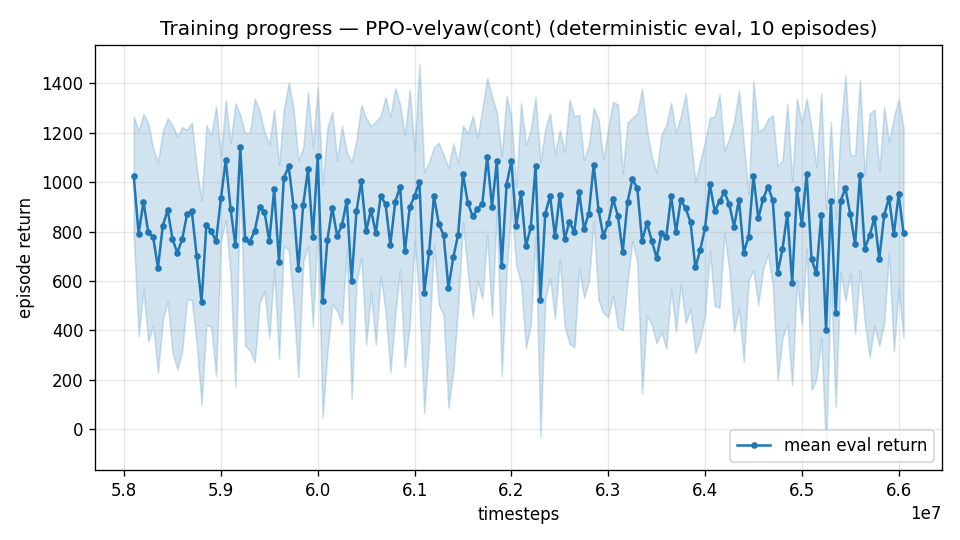

# Trial 47 — xw47: the staircase to 45 m/s

## Why
Band-extension transfer validated (trial 45 stage A: 18–21 at 1.51 median from one 6M
continuation vs 4.67 after 20M+ fresh). The same mechanism, applied stage by stage,
is the direct path to the user's 45 m/s envelope. Trim table covers Va≤60 ✓;
feasibility proven to the worst corner ✓ (trial 21 addendum 6 + extension scan).

## What
From xw45b (12–25): → 15–30 → 20–35 → 25–40 → 28–45, +8M @1e-4 each, oversample 0.5,
gate: top-5 m/s extension band robust median ≤ 3.0 per stage.

## Pre-registered
Each stage's verdict logged; staircase pauses on gate failure (then: smaller steps or
per-stage polish ladders). Final acceptance: per-band medians <1 via polish ladders +
composite routing (bands overlap by construction).

## Stage log
- 15–30 (xw47g): top-band (25–30) median 3.86, 9% <1 on FIRST exposure — gate (≤3.0)
  paused the staircase. Consolidation stage (xw47g2, +8M same range) launched; on pass
  the staircase auto-resumes (20–35 → 25–40 → 28–45).

---

## AUTO-CAPTURED RESULTS (2026-08-03 13:35)

**config**: `{"max_speed": 25.0, "speed_min": 12.0, "wind_max": 15.0, "use_integral": true, "use_yaw_integral": true, "use_wind_est": true, "yaw_width": 0.35, "yaw_weight": 1.0, "yaw_bias": 0.3, "heading_frame": false, "xwing_aero": true, "tough_init": 0.0, "wind_curriculum": false, "yaw_gate": true, "yaw_gate_floor": 0.2, "vel_precision": 0.7, "trim_init": 0.2, "priv_critic": false, "att_cmd": true, "katt": 1.5, "yaw_att_gate": true, "cov_width": 5.0, "kp_rate": "25,25,15", "ki_rate": "6,6,3", "aero_dr": true, "integral_tau": 3.0, "ent_coef": 0.003, "gamma": 0.99, "episode_len": 8.0, "wind_oversample": 0.5}`

**eval curve**: n=160, first 1023, best 1141 @ 59,199,102, last 795 (final steps 66,048,828)

**late trend**: still rising (last-10% mean 834 vs prior-10% 811)

- Consolidation (xw47g2, +8M @15–30): top-band 3.86→3.37 — improving but gate missed →
  FINE staircase launched per pre-registration (xw49: 15–27 → 18–31 → 21–35 → 24–40 →
  27–45, gate ≤3.0/stage).
- Fine stage 1 (xw49a, 15–27): top-band (22–27) median **2.78 — gate PASSED** → 18–31
  auto-launched (first stage with targets above 30... next stages enter untouched speed
  territory).
