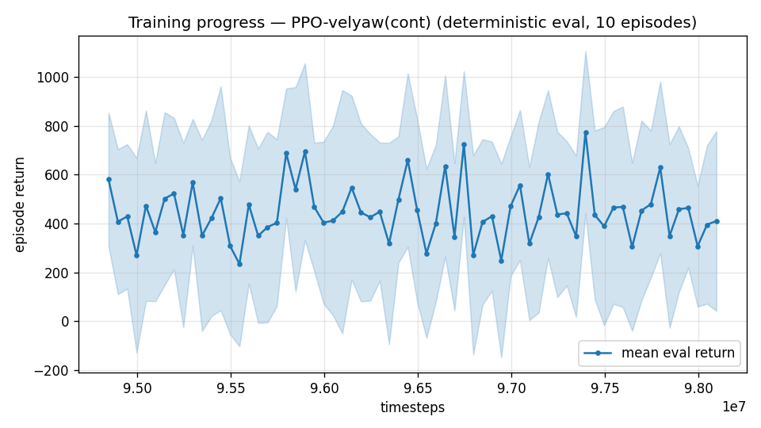

# Trial 47 — xw47: the staircase to 45 m/s

## Why
Band-extension transfer validated (trial 45 stage A: 18–21 at 1.51 median from one 6M
continuation vs 4.67 after 20M+ fresh). The same mechanism, applied stage by stage,
is the direct path to the user's 45 m/s envelope. Trim table covers Va≤60 ✓;
feasibility proven to the worst corner ✓ (trial 21 addendum 6 + extension scan).

## What
From xw45b (12–25): → 15–30 → 20–35 → 25–40 → 28–45, +8M @1e-4 each, oversample 0.5,
gate: top-5 m/s extension band robust median ≤ 3.0 per stage.

## Pre-registered
Each stage's verdict logged; staircase pauses on gate failure (then: smaller steps or
per-stage polish ladders). Final acceptance: per-band medians <1 via polish ladders +
composite routing (bands overlap by construction).

## Stage log
- 15–30 (xw47g): top-band (25–30) median 3.86, 9% <1 on FIRST exposure — gate (≤3.0)
  paused the staircase. Consolidation stage (xw47g2, +8M same range) launched; on pass
  the staircase auto-resumes (20–35 → 25–40 → 28–45).

---

## AUTO-CAPTURED RESULTS (2026-08-03 13:35)

**config**: `{"max_speed": 25.0, "speed_min": 12.0, "wind_max": 15.0, "use_integral": true, "use_yaw_integral": true, "use_wind_est": true, "yaw_width": 0.35, "yaw_weight": 1.0, "yaw_bias": 0.3, "heading_frame": false, "xwing_aero": true, "tough_init": 0.0, "wind_curriculum": false, "yaw_gate": true, "yaw_gate_floor": 0.2, "vel_precision": 0.7, "trim_init": 0.2, "priv_critic": false, "att_cmd": true, "katt": 1.5, "yaw_att_gate": true, "cov_width": 5.0, "kp_rate": "25,25,15", "ki_rate": "6,6,3", "aero_dr": true, "integral_tau": 3.0, "ent_coef": 0.003, "gamma": 0.99, "episode_len": 8.0, "wind_oversample": 0.5}`

**eval curve**: n=160, first 1023, best 1141 @ 59,199,102, last 795 (final steps 66,048,828)

**late trend**: still rising (last-10% mean 834 vs prior-10% 811)


- Consolidation (xw47g2, +8M @15–30): top-band 3.86→3.37 — improving but gate missed →
  FINE staircase launched per pre-registration (xw49: 15–27 → 18–31 → 21–35 → 24–40 →
  27–45, gate ≤3.0/stage).
- Fine stage 1 (xw49a, 15–27): top-band (22–27) median **2.78 — gate PASSED** → 18–31
  auto-launched (first stage with targets above 30... next stages enter untouched speed
  territory).

## STAIRCASE V2 — coverage-first redesign (evidence: xw49b band breakdown)
xw49b full report: 18–25 held at 2.49 (≈ xw45b's 2.39) while 25–31 landed at 4.20 —
trailing bands HOLD but don't mature during upward stages; each ~5 m/s of new territory
starts ~4. Design consequence: (1) climb to 45 with a FLYABILITY gate (top-band ≤4.5,
0 crash) — envelope coverage first; (2) then polish each band from its best covering
checkpoint with the proven stack (dedicated narrow range + oversample + robust ladder —
the same recipe that delivered low 0.50 and mid 0.82). run_xw50.sh: 21–35 → 24–40 → 27–45.
- Staircase v2 stage 1 (xw50a, 21–35): top-band (29–35) median 6.19 — flyability gate
  failed; the workable step size shrinks with dynamic pressure. → v3 (xw52): +3 m/s
  steps from xw49b: 21–34 → 24–37 → 27–40 → 30–43 → 32–45.

---

## AUTO-CAPTURED RESULTS (2026-08-04 00:21)

**config**: `{"max_speed": 31.0, "speed_min": 18.0, "wind_max": 15.0, "use_integral": true, "use_yaw_integral": true, "use_wind_est": true, "yaw_width": 0.35, "yaw_weight": 1.0, "yaw_bias": 0.3, "heading_frame": false, "xwing_aero": true, "tough_init": 0.0, "wind_curriculum": false, "yaw_gate": true, "yaw_gate_floor": 0.2, "vel_precision": 0.7, "trim_init": 0.2, "priv_critic": false, "att_cmd": true, "katt": 1.5, "yaw_att_gate": true, "cov_width": 5.0, "kp_rate": "25,25,15", "ki_rate": "6,6,3", "aero_dr": true, "integral_tau": 3.0, "ent_coef": 0.003, "gamma": 0.99, "episode_len": 8.0, "wind_oversample": 0.5}`

**eval curve**: n=66, first 580, best 774 @ 97,395,960, last 410 (final steps 98,095,932)

**late trend**: DECLINING (last-10% mean 397 vs prior-10% 456)





### Physical eval
```
=== PHYSICAL EVAL (level start, full wind, 8s episodes) ===

band           n    mean  median   %<1     p90     yaw
--------------------------------------------------------
high(18-25)   54    8.27    2.59   15%   28.74   30.9°
vhigh(25-35)  46    6.35    4.11    0%   12.65   15.3°
--------------------------------------------------------
ALL          100    7.39    3.17    8%   21.93   23.7°   crash 0.0%
wind bins: [0-5) n=23 med 2.44 <1: 9%  [5-10) n=42 med 2.89 <1: 10%  [10-15) n=35 med 4.88 <1: 6%
```


### Dive-recovery test
```
=== DIVE-RECOVERY TEST (60 episodes, all starting in failure states) ===
  recovered (final-2s vel err < 8 m/s):  8/60 = 13%
  partial   (8-15 m/s):                  3/60 = 5%
  median final err: 40.0 m/s   mean: 39.2 m/s
```


### Behavior traces
```
--- trace seed 1005: target [22.7  9.9  0.5] (|v|=24.7), wind [ -3.6 -11.6  -3.1] ---
  t= 0.0 |v|=  0.1 vz=   0.0 tilt=   0 verr= 24.8 yawerr=+103.5 fins=( +2.3,-10.5) thr=+1.00
  t= 2.0 |v|= 16.9 vz=  -0.5 tilt=  75 verr=  8.1 yawerr= +34.3 fins=(+18.5, +3.7) thr=+0.02
  t= 4.0 |v|= 20.9 vz=   2.1 tilt=  70 verr=  4.7 yawerr= +31.8 fins=(+18.5,-20.0) thr=-1.00
  t= 6.0 |v|= 21.3 vz=   2.5 tilt=  67 verr=  4.1 yawerr=  +1.4 fins=(+18.5,+20.0) thr=-1.00
--- trace seed 1012: target [  9.6 -25.4   2.2] (|v|=27.3), wind [-0.3  4.1 -6.1] ---
  t= 0.0 |v|=  0.0 vz=   0.0 tilt=   0 verr= 27.3 yawerr= +46.7 fins=( +8.8, -8.9) thr=+1.00
  t= 2.0 |v|= 22.0 vz=   1.1 tilt=  62 verr=  6.0 yawerr= +24.2 fins=(-17.2,-18.2) thr=+0.08
  t= 4.0 |v|= 25.2 vz=   1.1 tilt=  61 verr=  2.8 yawerr=  +8.4 fins=(-12.8,-18.2) thr=-0.20
  t= 6.0 |v|= 25.4 vz=   0.9 tilt=  61 verr=  2.7 yawerr= +10.5 fins=(-16.2,-18.2) thr=-0.31
--- trace seed 1020: target [-17.   19.2   1.6] (|v|=25.7), wind [-0.3 -1.2 -0.6] ---
  t= 0.0 |v|=  0.0 vz=   0.0 tilt=   0 verr= 25.7 yawerr= -65.7 fins=(+10.6, +7.8) thr=+0.75
  t= 2.0 |v|= 19.7 vz=   4.2 tilt=  51 verr=  7.1 yawerr= +15.7 fins=(+20.0,-20.0) thr=-1.00
  t= 4.0 |v|= 22.1 vz=   4.8 tilt=  54 verr=  5.3 yawerr=  +6.6 fins=( +7.4,-20.0) thr=-1.00
  t= 6.0 |v|= 21.5 vz=   1.9 tilt=  56 verr=  4.3 yawerr=  +3.5 fins=( +8.0,-20.0) thr=-1.00
```
- v3 stage 1 (xw52a, 21–34): top-band 6.49 — step size NOT the binder above 30 m/s.
  Elevator-margin scan: REFUTED (trim de ~0° for random draws). Root cause found:
  **table-trim residual under DR grows with Q (0.76 m/s² at Va 10-20 → 3.0 at Va 40-55)**
  — the goal-state exposure degrades exactly at top speeds. Fixed: per-episode trim
  REFINEMENT at reset (warm-started solve vs the episode's actual draw, 0.04 s/reset).
  → v4 (xw53): same +3 stages with refined trim-init.

---

## AUTO-CAPTURED RESULTS (2026-08-04 03:07)

**config**: `{"max_speed": 31.0, "speed_min": 18.0, "wind_max": 15.0, "use_integral": true, "use_yaw_integral": true, "use_wind_est": true, "yaw_width": 0.35, "yaw_weight": 1.0, "yaw_bias": 0.3, "heading_frame": false, "xwing_aero": true, "tough_init": 0.0, "wind_curriculum": false, "yaw_gate": true, "yaw_gate_floor": 0.2, "vel_precision": 0.7, "trim_init": 0.2, "priv_critic": false, "att_cmd": true, "katt": 1.5, "yaw_att_gate": true, "cov_width": 5.0, "kp_rate": "25,25,15", "ki_rate": "6,6,3", "aero_dr": true, "integral_tau": 3.0, "ent_coef": 0.003, "gamma": 0.99, "episode_len": 8.0, "wind_oversample": 0.5}`

**eval curve**: n=66, first 580, best 774 @ 97,395,960, last 410 (final steps 98,095,932)

**late trend**: DECLINING (last-10% mean 397 vs prior-10% 456)


### Physical eval
```
=== PHYSICAL EVAL (level start, full wind, 8s episodes) ===

band           n    mean  median   %<1     p90     yaw
--------------------------------------------------------
high(18-25)   54    8.27    2.59   15%   28.74   30.9°
vhigh(25-35)  46    6.35    4.11    0%   12.65   15.3°
--------------------------------------------------------
ALL          100    7.39    3.17    8%   21.93   23.7°   crash 0.0%
wind bins: [0-5) n=23 med 2.44 <1: 9%  [5-10) n=42 med 2.89 <1: 10%  [10-15) n=35 med 4.88 <1: 6%
```


### Dive-recovery test
```
=== DIVE-RECOVERY TEST (60 episodes, all starting in failure states) ===
  recovered (final-2s vel err < 8 m/s):  8/60 = 13%
  partial   (8-15 m/s):                  3/60 = 5%
  median final err: 40.0 m/s   mean: 39.2 m/s
```


### Behavior traces
```
--- trace seed 1005: target [22.7  9.9  0.5] (|v|=24.7), wind [ -3.6 -11.6  -3.1] ---
  t= 0.0 |v|=  0.1 vz=   0.0 tilt=   0 verr= 24.8 yawerr=+103.5 fins=( +2.3,-10.5) thr=+1.00
  t= 2.0 |v|= 16.9 vz=  -0.5 tilt=  75 verr=  8.1 yawerr= +34.3 fins=(+18.5, +3.7) thr=+0.02
  t= 4.0 |v|= 20.9 vz=   2.1 tilt=  70 verr=  4.7 yawerr= +31.8 fins=(+18.5,-20.0) thr=-1.00
  t= 6.0 |v|= 21.3 vz=   2.5 tilt=  67 verr=  4.1 yawerr=  +1.4 fins=(+18.5,+20.0) thr=-1.00
--- trace seed 1012: target [  9.6 -25.4   2.2] (|v|=27.3), wind [-0.3  4.1 -6.1] ---
  t= 0.0 |v|=  0.0 vz=   0.0 tilt=   0 verr= 27.3 yawerr= +46.7 fins=( +8.8, -8.9) thr=+1.00
  t= 2.0 |v|= 22.0 vz=   1.1 tilt=  62 verr=  6.0 yawerr= +24.2 fins=(-17.2,-18.2) thr=+0.08
  t= 4.0 |v|= 25.2 vz=   1.1 tilt=  61 verr=  2.8 yawerr=  +8.4 fins=(-12.8,-18.2) thr=-0.20
  t= 6.0 |v|= 25.4 vz=   0.9 tilt=  61 verr=  2.7 yawerr= +10.5 fins=(-16.2,-18.2) thr=-0.31
--- trace seed 1020: target [-17.   19.2   1.6] (|v|=25.7), wind [-0.3 -1.2 -0.6] ---
  t= 0.0 |v|=  0.0 vz=   0.0 tilt=   0 verr= 25.7 yawerr= -65.7 fins=(+10.6, +7.8) thr=+0.75
  t= 2.0 |v|= 19.7 vz=   4.2 tilt=  51 verr=  7.1 yawerr= +15.7 fins=(+20.0,-20.0) thr=-1.00
  t= 4.0 |v|= 22.1 vz=   4.8 tilt=  54 verr=  5.3 yawerr=  +6.6 fins=( +7.4,-20.0) thr=-1.00
  t= 6.0 |v|= 21.5 vz=   1.9 tilt=  56 verr=  4.3 yawerr=  +3.5 fins=( +8.0,-20.0) thr=-1.00
```

---

## AUTO-CAPTURED RESULTS (2026-08-04 06:23)

**config**: `{"max_speed": 31.0, "speed_min": 18.0, "wind_max": 15.0, "use_integral": true, "use_yaw_integral": true, "use_wind_est": true, "yaw_width": 0.35, "yaw_weight": 1.0, "yaw_bias": 0.3, "heading_frame": false, "xwing_aero": true, "tough_init": 0.0, "wind_curriculum": false, "yaw_gate": true, "yaw_gate_floor": 0.2, "vel_precision": 0.7, "trim_init": 0.2, "priv_critic": false, "att_cmd": true, "katt": 1.5, "yaw_att_gate": true, "cov_width": 5.0, "kp_rate": "25,25,15", "ki_rate": "6,6,3", "aero_dr": true, "integral_tau": 3.0, "ent_coef": 0.003, "gamma": 0.99, "episode_len": 8.0, "wind_oversample": 0.5}`

**eval curve**: n=66, first 580, best 774 @ 97,395,960, last 410 (final steps 98,095,932)

**late trend**: DECLINING (last-10% mean 397 vs prior-10% 456)


### Physical eval
```
=== PHYSICAL EVAL (level start, full wind, 8s episodes) ===

band           n    mean  median   %<1     p90     yaw
--------------------------------------------------------
high(18-25)   54    8.27    2.59   15%   28.74   30.9°
vhigh(25-35)  46    6.35    4.11    0%   12.65   15.3°
--------------------------------------------------------
ALL          100    7.39    3.17    8%   21.93   23.7°   crash 0.0%
wind bins: [0-5) n=23 med 2.44 <1: 9%  [5-10) n=42 med 2.89 <1: 10%  [10-15) n=35 med 4.88 <1: 6%
```


### Dive-recovery test
```
=== DIVE-RECOVERY TEST (60 episodes, all starting in failure states) ===
  recovered (final-2s vel err < 8 m/s):  8/60 = 13%
  partial   (8-15 m/s):                  3/60 = 5%
  median final err: 40.0 m/s   mean: 39.2 m/s
```


### Behavior traces
```
--- trace seed 1005: target [22.7  9.9  0.5] (|v|=24.7), wind [ -3.6 -11.6  -3.1] ---
  t= 0.0 |v|=  0.1 vz=   0.0 tilt=   0 verr= 24.8 yawerr=+103.5 fins=( +2.3,-10.5) thr=+1.00
  t= 2.0 |v|= 16.9 vz=  -0.5 tilt=  75 verr=  8.1 yawerr= +34.3 fins=(+18.5, +3.7) thr=+0.02
  t= 4.0 |v|= 20.9 vz=   2.1 tilt=  70 verr=  4.7 yawerr= +31.8 fins=(+18.5,-20.0) thr=-1.00
  t= 6.0 |v|= 21.3 vz=   2.5 tilt=  67 verr=  4.1 yawerr=  +1.4 fins=(+18.5,+20.0) thr=-1.00
--- trace seed 1012: target [  9.6 -25.4   2.2] (|v|=27.3), wind [-0.3  4.1 -6.1] ---
  t= 0.0 |v|=  0.0 vz=   0.0 tilt=   0 verr= 27.3 yawerr= +46.7 fins=( +8.8, -8.9) thr=+1.00
  t= 2.0 |v|= 22.0 vz=   1.1 tilt=  62 verr=  6.0 yawerr= +24.2 fins=(-17.2,-18.2) thr=+0.08
  t= 4.0 |v|= 25.2 vz=   1.1 tilt=  61 verr=  2.8 yawerr=  +8.4 fins=(-12.8,-18.2) thr=-0.20
  t= 6.0 |v|= 25.4 vz=   0.9 tilt=  61 verr=  2.7 yawerr= +10.5 fins=(-16.2,-18.2) thr=-0.31
--- trace seed 1020: target [-17.   19.2   1.6] (|v|=25.7), wind [-0.3 -1.2 -0.6] ---
  t= 0.0 |v|=  0.0 vz=   0.0 tilt=   0 verr= 25.7 yawerr= -65.7 fins=(+10.6, +7.8) thr=+0.75
  t= 2.0 |v|= 19.7 vz=   4.2 tilt=  51 verr=  7.1 yawerr= +15.7 fins=(+20.0,-20.0) thr=-1.00
  t= 4.0 |v|= 22.1 vz=   4.8 tilt=  54 verr=  5.3 yawerr=  +6.6 fins=( +7.4,-20.0) thr=-1.00
  t= 6.0 |v|= 21.5 vz=   1.9 tilt=  56 verr=  4.3 yawerr=  +3.5 fins=( +8.0,-20.0) thr=-1.00
```
- v4 stage 1 (xw53a, 21–34 with refined trim-init): 5.97 vs v3's 6.49 — refinement helps
  slightly. **Root diagnosis of all staircase stalls: one 8M stage per new range, while
  every band that reached goal needed 3–5 staged continuations.** → trial 55 commits a
  full ladder at 21–34.
- Teacher–student CLOSED by measurement: the classical teacher scores 9.61 mean at 30–45
  and 3.90 at 18–25 — worse than the policies it would teach. It only has headroom at mid
  (0.20 vs 0.82), which is already at goal.
- Body-relative attitude command (att_rel) implemented and REJECTED by smoke test:
  neutral action = "hold current attitude" gives no absolute reference, so disturbances
  integrate (98° drift in 3 s vs 35° for the world-frame form). Flag retained, default off.

## Exact code changes
The staircase itself is script-level (`run_xw47.sh` / `run_xw52.sh` / `run_xw53.sh`); it
uses the band-extension flags from trial 45 plus a per-stage flyability gate:
```bash
for S in "21 34 a" "24 37 b" "27 40 c" "30 43 d" "32 45 e"; do
  set -- $S; MIN=$1; MAX=$2; TAG=$3
  OUT=results_velyaw_xw52${TAG}
  "$PY" continue_train.py --src $SRC --out $OUT --extra 8000000 --n-envs 6 --lr 1e-4 \
    --max-speed-override $MAX --speed-min-override $MIN --wind-oversample 0.5 \
    > ${OUT}_train.log 2>&1 || { echo "[LADDER52] $OUT failed" >> ladder.log; exit 1; }
  MED=$(gate_eval $OUT $MAX)                      # top-band (MAX-4..MAX) robust median
  if [ "$("$PY" -c "print(1 if float('$MED') > 4.5 else 0)")" = "1" ]; then break; fi
  SRC=$OUT
done
```
Trim-table coverage for the extended envelope (`build_trim_table.py`, CHANGED):
```python
SPEEDS = np.arange(2.0, 61.0, 2.0)            # 30 values (45 m/s targets + 15 m/s wind)
```
Eval band structure (`eval_velyaw.py`, CHANGED):
```python
        band = ("hover(0-1)" if tgt_speed < 1 else "low(1-10)" if tgt_speed < 10 else
                "mid(10-18)" if tgt_speed < 18 else "high(18-25)" if tgt_speed < 25 else
                "vhigh(25-35)" if tgt_speed < 35 else "top(35-45)")
```
