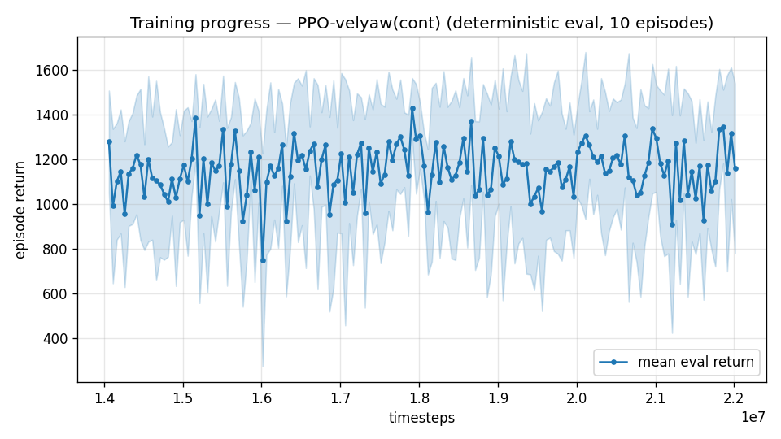
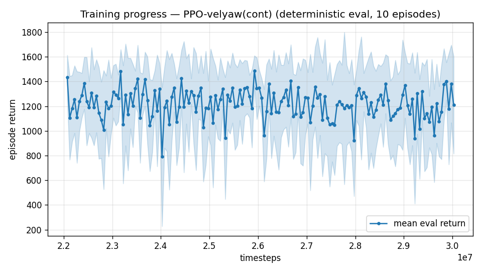
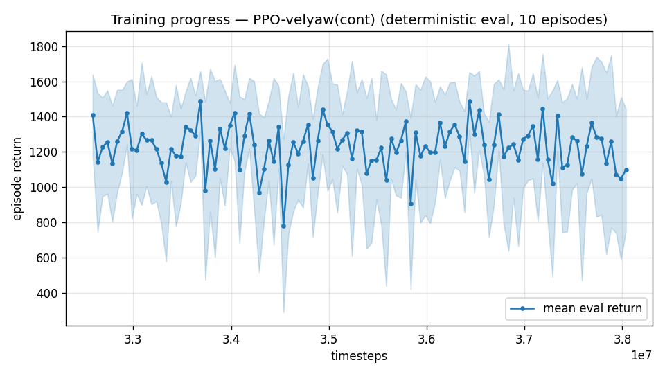

# Trial 48 — xw48: low-band wind-tail ladder (oversample on xw18b)

## Why
Low champion 0.88 med / 57%<1 / yaw 4.2° — tail-limited exactly like mid was (bins
0.42/0.77/1.75). The oversample lever bought mid +9 pts %<1. Yaw guard ≤10° per spec.

## Pre-registered
Continue while %<1 gains ≥5 pts AND yaw ≤10°; stop otherwise. Success ≈ 65-70%+ <1.

---

## AUTO-CAPTURED RESULTS (2026-08-03 13:06)

**config**: `{"max_speed": 10.0, "wind_max": 15.0, "use_integral": true, "use_yaw_integral": true, "use_wind_est": true, "yaw_width": 0.35, "yaw_weight": 1.0, "yaw_bias": 0.3, "heading_frame": false, "xwing_aero": true, "tough_init": 0.0, "wind_curriculum": false, "yaw_gate": true, "yaw_gate_floor": 0.2, "vel_precision": 0.7, "yaw_att_gate": true, "cov_width": 5.0, "ent_coef": 0.003, "gamma": 0.99, "episode_len": 8.0, "wind_oversample": 0.5}`

**eval curve**: n=160, first 1279, best 1429 @ 17,912,260, last 1161 (final steps 22,012,096)

**late trend**: DECLINING (last-10% mean 1158 vs prior-10% 1162)





### Physical eval
```
=== PHYSICAL EVAL (level start, full wind, 8s episodes) ===

band           n    mean  median   %<1     p90     yaw
--------------------------------------------------------
hover(0-1)     5    0.57    0.52   80%    1.00    2.3°
low(1-10)     95    1.42    0.69   67%    3.50    5.1°
--------------------------------------------------------
ALL          100    1.38    0.69   68%    3.42    5.0°   crash 0.0%
wind bins: [0-5) n=23 med 0.44 <1: 100%  [5-10) n=42 med 0.68 <1: 83%  [10-15) n=35 med 1.95 <1: 29%
```


### Dive-recovery test
```
=== DIVE-RECOVERY TEST (60 episodes, all starting in failure states) ===
  recovered (final-2s vel err < 8 m/s):  7/60 = 12%
  partial   (8-15 m/s):                  1/60 = 2%
  median final err: 50.0 m/s   mean: 44.4 m/s
```


### Behavior traces
```
--- trace seed 1005: target [4.8 2.1 0.1] (|v|=5.2), wind [ -3.6 -11.6  -3.1] ---
  t= 0.0 |v|=  0.1 vz=   0.0 tilt=   0 verr=  5.3 yawerr=+103.5 fins=( +9.0,-10.5) thr=-1.00
  t= 2.0 |v|=  5.6 vz=   2.0 tilt=  45 verr=  2.4 yawerr=  -4.4 fins=( +7.5, -2.3) thr=-1.00
  t= 4.0 |v|=  4.4 vz=   1.5 tilt=  44 verr=  3.4 yawerr=  +9.2 fins=( -7.4,-20.0) thr=-1.00
  t= 6.0 |v|=  4.4 vz=   1.7 tilt=  56 verr=  2.9 yawerr= +12.2 fins=(+18.5,-14.9) thr=-1.00
--- trace seed 1012: target [ 2.5 -6.6  0.6] (|v|=7.1), wind [-0.3  4.1 -6.1] ---
  t= 0.0 |v|=  0.0 vz=  -0.0 tilt=   0 verr=  7.1 yawerr= +46.7 fins=( +0.8, -8.9) thr=-1.00
  t= 2.0 |v|=  5.1 vz=  -0.4 tilt=  20 verr=  2.6 yawerr=  -7.9 fins=( -2.5,-18.2) thr=-0.17
  t= 4.0 |v|=  5.7 vz=   0.4 tilt=  18 verr=  1.4 yawerr= +20.6 fins=( -7.6,-18.2) thr=-0.42
  t= 6.0 |v|=  5.6 vz=  -0.2 tilt=  19 verr=  1.8 yawerr=  +2.9 fins=( +1.6,-18.2) thr=-0.67
--- trace seed 1020: target [-3.9  4.4  0.4] (|v|=5.9), wind [-0.3 -1.2 -0.6] ---
  t= 0.0 |v|=  0.0 vz=   0.0 tilt=   0 verr=  5.9 yawerr= -65.7 fins=( -1.4,-10.3) thr=-0.73
  t= 2.0 |v|=  5.3 vz=   1.8 tilt=  31 verr=  1.8 yawerr= +29.1 fins=( +6.9,-20.0) thr=-1.00
  t= 4.0 |v|=  6.5 vz=  -0.1 tilt=   7 verr=  1.0 yawerr=  +0.4 fins=(+15.8,-20.0) thr=-0.03
  t= 6.0 |v|=  5.6 vz=   0.2 tilt=   6 verr=  0.4 yawerr=  +3.2 fins=(+20.0,-20.0) thr=-0.26
```

- Stage 1 (xw48a): **%<1 57→67, yaw 4.6°** — gate passed, stage b continuing.
- Stage 2 (xw48b): **%<1 67→73, yaw 3.9°** — gate passed; ladder cap reached (2 stages).

---

## AUTO-CAPTURED RESULTS (2026-08-03 14:43)

**config**: `{"max_speed": 10.0, "wind_max": 15.0, "use_integral": true, "use_yaw_integral": true, "use_wind_est": true, "yaw_width": 0.35, "yaw_weight": 1.0, "yaw_bias": 0.3, "heading_frame": false, "xwing_aero": true, "tough_init": 0.0, "wind_curriculum": false, "yaw_gate": true, "yaw_gate_floor": 0.2, "vel_precision": 0.7, "yaw_att_gate": true, "cov_width": 5.0, "ent_coef": 0.003, "gamma": 0.99, "episode_len": 8.0, "wind_oversample": 0.5}`

**eval curve**: n=160, first 1434, best 1487 @ 25,924,036, last 1209 (final steps 30,023,872)

**late trend**: DECLINING (last-10% mean 1194 vs prior-10% 1206)





### Physical eval
```
=== PHYSICAL EVAL (level start, full wind, 8s episodes) ===

band           n    mean  median   %<1     p90     yaw
--------------------------------------------------------
hover(0-1)     5    0.56    0.38   80%    0.96    2.3°
low(1-10)     95    1.68    0.50   75%    4.12    5.3°
--------------------------------------------------------
ALL          100    1.62    0.49   75%    4.01    5.1°   crash 0.0%
wind bins: [0-5) n=23 med 0.32 <1: 100%  [5-10) n=42 med 0.47 <1: 86%  [10-15) n=35 med 1.46 <1: 46%
```


### Dive-recovery test
```
=== DIVE-RECOVERY TEST (60 episodes, all starting in failure states) ===
  recovered (final-2s vel err < 8 m/s):  6/60 = 10%
  partial   (8-15 m/s):                  1/60 = 2%
  median final err: 55.1 m/s   mean: 49.6 m/s
```


### Behavior traces
```
--- trace seed 1005: target [4.8 2.1 0.1] (|v|=5.2), wind [ -3.6 -11.6  -3.1] ---
  t= 0.0 |v|=  0.1 vz=   0.0 tilt=   0 verr=  5.3 yawerr=+103.5 fins=( +9.0,-10.5) thr=-1.00
  t= 2.0 |v|=  7.0 vz=   2.3 tilt=  65 verr=  5.9 yawerr=  +7.1 fins=( -9.2, -6.9) thr=-1.00
  t= 4.0 |v|=  4.7 vz=   2.5 tilt=  61 verr=  3.3 yawerr=  -3.0 fins=(+18.4, +2.3) thr=-1.00
  t= 6.0 |v|=  2.4 vz=   1.1 tilt=  28 verr=  3.2 yawerr= -12.3 fins=( +6.5,-14.3) thr=-1.00
--- trace seed 1012: target [ 2.5 -6.6  0.6] (|v|=7.1), wind [-0.3  4.1 -6.1] ---
  t= 0.0 |v|=  0.0 vz=  -0.0 tilt=   0 verr=  7.1 yawerr= +46.7 fins=( +7.5, -8.9) thr=-0.92
  t= 2.0 |v|=  5.5 vz=  -0.1 tilt=  23 verr=  1.9 yawerr=  -7.2 fins=( +6.2,-18.2) thr=-0.21
  t= 4.0 |v|=  6.1 vz=   0.2 tilt=  21 verr=  1.1 yawerr=  +2.6 fins=( +4.8,-18.2) thr=-0.08
  t= 6.0 |v|=  6.1 vz=   0.3 tilt=  18 verr=  1.2 yawerr=  +2.8 fins=( +3.4,-18.2) thr=-0.72
--- trace seed 1020: target [-3.9  4.4  0.4] (|v|=5.9), wind [-0.3 -1.2 -0.6] ---
  t= 0.0 |v|=  0.0 vz=   0.0 tilt=   0 verr=  5.9 yawerr= -65.7 fins=( -5.4,-10.3) thr=-0.51
  t= 2.0 |v|=  5.4 vz=   0.6 tilt=  33 verr=  0.8 yawerr= +21.9 fins=(+20.0,-20.0) thr=-1.00
  t= 4.0 |v|=  5.9 vz=   0.2 tilt=   7 verr=  0.3 yawerr=  -0.3 fins=(+20.0,-19.7) thr=-0.02
  t= 6.0 |v|=  5.6 vz=   0.2 tilt=   8 verr=  0.3 yawerr=  +0.1 fins=(+20.0,-20.0) thr=-0.20
```
- Stage 3 (xw48c): %<1 73→76 (+3, below the +5 gate), yaw 4.8° — ladder closed.
  **LOW-BAND FINAL: xw48c — median 0.47 [see robust log], 76% <1, yaw 4.8°.**

---

## AUTO-CAPTURED RESULTS (2026-08-03 22:17)

**config**: `{"max_speed": 10.0, "wind_max": 15.0, "use_integral": true, "use_yaw_integral": true, "use_wind_est": true, "yaw_width": 0.35, "yaw_weight": 1.0, "yaw_bias": 0.3, "heading_frame": false, "xwing_aero": true, "tough_init": 0.0, "wind_curriculum": false, "yaw_gate": true, "yaw_gate_floor": 0.2, "vel_precision": 0.7, "yaw_att_gate": true, "cov_width": 5.0, "ent_coef": 0.003, "gamma": 0.99, "episode_len": 8.0, "wind_oversample": 0.5}`

**eval curve**: n=110, first 1408, best 1489 @ 36,435,712, last 1097 (final steps 38,035,648)

**late trend**: DECLINING (last-10% mean 1191 vs prior-10% 1238)





### Physical eval
```
=== PHYSICAL EVAL (level start, full wind, 8s episodes) ===

band           n    mean  median   %<1     p90     yaw
--------------------------------------------------------
hover(0-1)     5    0.56    0.43   80%    1.00    3.3°
low(1-10)     95    1.25    0.48   77%    3.18    5.7°
--------------------------------------------------------
ALL          100    1.21    0.48   77%    3.12    5.6°   crash 0.0%
wind bins: [0-5) n=23 med 0.29 <1: 100%  [5-10) n=42 med 0.43 <1: 90%  [10-15) n=35 med 1.14 <1: 46%
```


### Dive-recovery test
```
=== DIVE-RECOVERY TEST (60 episodes, all starting in failure states) ===
  recovered (final-2s vel err < 8 m/s):  5/60 = 8%
  partial   (8-15 m/s):                  1/60 = 2%
  median final err: 52.0 m/s   mean: 47.0 m/s
```


### Behavior traces
```
--- trace seed 1005: target [4.8 2.1 0.1] (|v|=5.2), wind [ -3.6 -11.6  -3.1] ---
  t= 0.0 |v|=  0.1 vz=   0.0 tilt=   0 verr=  5.3 yawerr=+103.5 fins=( +9.0,-10.5) thr=-1.00
  t= 2.0 |v|=  6.5 vz=   2.8 tilt=  37 verr=  3.0 yawerr= -13.5 fins=(+18.3,-20.0) thr=-1.00
  t= 4.0 |v|=  5.9 vz=   1.8 tilt=  44 verr=  2.8 yawerr=  +9.2 fins=( +2.0,-20.0) thr=-1.00
  t= 6.0 |v|=  4.9 vz=  -2.4 tilt=  49 verr=  6.5 yawerr= -38.9 fins=( +2.8, -1.1) thr=-0.91
--- trace seed 1012: target [ 2.5 -6.6  0.6] (|v|=7.1), wind [-0.3  4.1 -6.1] ---
  t= 0.0 |v|=  0.0 vz=  -0.0 tilt=   0 verr=  7.1 yawerr= +46.7 fins=(+10.1, -8.9) thr=-0.97
  t= 2.0 |v|=  6.0 vz=   0.1 tilt=  28 verr=  1.2 yawerr=  -3.9 fins=(+10.9,-18.2) thr=-0.24
  t= 4.0 |v|=  6.6 vz=   0.2 tilt=  20 verr=  0.6 yawerr=  +5.4 fins=( +8.1,-18.2) thr=-0.31
  t= 6.0 |v|=  6.5 vz=   0.3 tilt=  21 verr=  0.7 yawerr=  +5.7 fins=( +9.7,-18.2) thr=-0.53
--- trace seed 1020: target [-3.9  4.4  0.4] (|v|=5.9), wind [-0.3 -1.2 -0.6] ---
  t= 0.0 |v|=  0.0 vz=   0.0 tilt=   0 verr=  5.9 yawerr= -65.7 fins=( -9.7,-10.3) thr=-1.00
  t= 2.0 |v|=  6.4 vz=   0.9 tilt=  38 verr=  1.2 yawerr= +33.9 fins=(+20.0,-20.0) thr=-1.00
  t= 4.0 |v|=  5.7 vz=   0.2 tilt=   7 verr=  0.3 yawerr=  -0.3 fins=(+20.0,-20.0) thr=-0.04
  t= 6.0 |v|=  5.5 vz=   0.2 tilt=   7 verr=  0.4 yawerr=  +0.6 fins=(+20.0,-20.0) thr=-0.04
```

## Exact code changes
No code changes — flags only on the existing implementation (the feature's code is in the trial cited below).
(wind oversampling: trial 35.) Gate adds a yaw guard, since yaw IS scored at this band:
```bash
  STOP=$("$PY" -c "print(1 if float('$PCT') < float('$PREVP')+5 or float('$YAW') > 10 else 0)")
```

## Seed reproduction of the low-band recipe (12M stage, before the oversample ladder)
- seed 1: **median 0.96 [CI 0.86–1.09], 53% <1** — reproduces sub-1 median from a different
  seed, though above the champion's 12M-stage figure; seed 2 running.
Note the champion (xw48c, 0.46 / 76%) is the END of a 3-stage oversample ladder from a
different seed, so the fair comparison for these seeds is the pre-ladder stage, not 0.46.
- seed 2: **median 0.92 [CI 0.82–1.07], 54% <1** — reproduces seed 1 (0.96) closely.
**Low-band recipe is seed-robust: 0.92 / 0.96 at the 12M stage across two fresh seeds, both
sub-1 median.** (Champion 0.46 / 76% is that recipe plus a 3-stage oversample ladder.)
