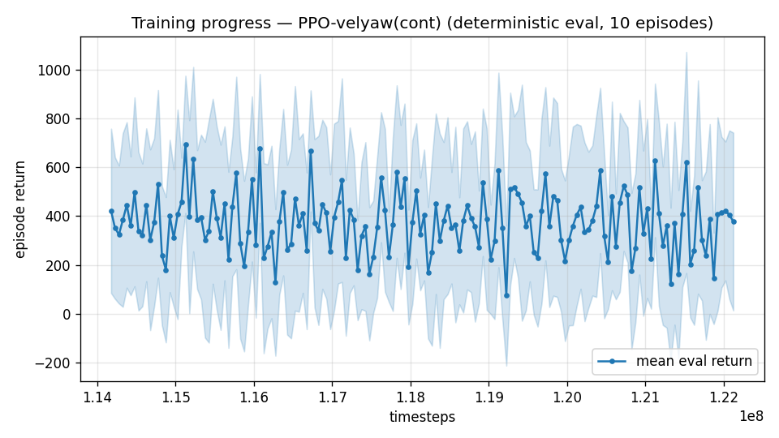
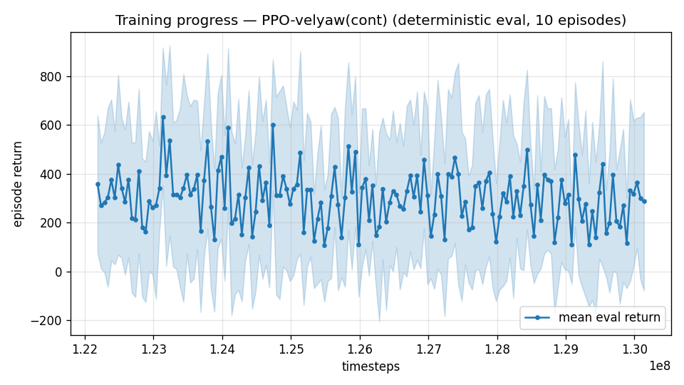

# Trial 58 — xw58: envelope climb to 45 m/s on the covering lineage

## Why
Two structural facts now established:
1. **Transfer beats fresh** at every band above mid (trial 54: fresh 18–25 = 5.07 @12M vs
   transfer = 2.39 in one 6M continuation).
2. **Each range's ladder yields 1–2 productive stages, then saturates** (mid polish
   2.40→2.03→stop; 21–34: 5.97→4.23→stop). So the climb should spend its stages on NEW
   territory, and precision should come from per-range polish afterwards — not from
   grinding stages at a range that has already saturated.

This trial therefore separates the two jobs: **coverage first** (climb 24–37 → 27–40 →
30–43 → 32–45, one 8M stage each, gate = new top band merely flyable ≤7.0), **precision
after** (per-range ladders on the covered policy).

## Exact code changes
None — band-extension flags (trial 45) + oversampling (trial 35) + the ladder pattern.
The gate differs from trials 47/50/52: it accepts ≤7.0 (flyability) rather than ≤4.5,
because demanding near-final precision from a range's FIRST stage is what falsely
"paused" the earlier staircases (diagnosed in trial 55).

```bash
SRC=results_velyaw_xw55a
for S in "24 37 a" "27 40 b" "30 43 c" "32 45 d"; do
  set -- $S; MIN=$1; MAX=$2; TAG=$3
  OUT=results_velyaw_xw58${TAG}
  "$PY" continue_train.py --src $SRC --out $OUT --extra 8000000 --n-envs 6 --lr 1e-4 \
    --max-speed-override $MAX --speed-min-override $MIN --wind-oversample 0.5
  MED=$(gate_eval $OUT $MAX)          # top-4 m/s band robust median, n=250
  if [ "$MED" > 7.0 ]; then break; fi   # coverage gate only
  SRC=$OUT
done
```

## Pre-registered
- Each stage logs its top-band median to `ladder.log`.
- **Coverage success**: a policy that reaches 45 m/s targets with the top band ≤7 —
  i.e. the full envelope is *flown*, if not yet precise. That is the prerequisite for the
  per-band precision phase and for the composite deliverable.
- **Pause**: any stage's top band >7 → the climb stops there and the honest coverage
  limit is recorded (with the trim-feedforward architecture as the escalation).

## Result
*(auto-appended)*

## Stage log
- Stage a (24–37, +8M): top band (33–37) median **6.95** — under the 7.0 coverage gate, so
  the climb continues to 27–40. Band detail: 18–25 at 2.84, 25–35 at 4.96, and the first
  35–45 samples at 11.65 (0% <1). Zero crashes at 250 episodes.
  Reading: the policy now *flies* targets above 35 m/s without diverging, but precision
  there is an order of magnitude off. Consistent with the campaign's V² scaling — and it is
  what the coverage-then-precision plan predicted at this stage.
- Stage b (27–40, +8M): top band (36–40) median **8.63** — coverage gate (7.0) failed, climb
  paused. One 8M stage per +3 m/s carried the policy to ~37 but not to 40.
  Band detail at the pause: 25–35 at 5.24, 35–45 at 7.33 (2% <1), zero crashes.
  **Coverage status: targets up to ~40 m/s are flown without divergence; 40–45 not yet.**
  → trial 60 consolidates at 27–40 (2 stages, improvement-gated) before resuming the climb,
  mirroring the 21–34 result where stage 1 alone bought −29%.

---

## AUTO-CAPTURED RESULTS (2026-08-04 20:07)

**config**: `{"max_speed": 37.0, "speed_min": 24.0, "wind_max": 15.0, "use_integral": true, "use_yaw_integral": true, "use_wind_est": true, "yaw_width": 0.35, "yaw_weight": 1.0, "yaw_bias": 0.3, "heading_frame": false, "xwing_aero": true, "tough_init": 0.0, "wind_curriculum": false, "yaw_gate": true, "yaw_gate_floor": 0.2, "vel_precision": 0.7, "trim_init": 0.2, "priv_critic": false, "att_cmd": true, "katt": 1.5, "yaw_att_gate": true, "cov_width": 5.0, "kp_rate": "25,25,15", "ki_rate": "6,6,3", "aero_dr": true, "integral_tau": 3.0, "ent_coef": 0.003, "gamma": 0.99, "episode_len": 8.0, "wind_oversample": 0.5}`

**eval curve**: n=160, first 421, best 693 @ 115,125,048, last 378 (final steps 122,124,768)

**late trend**: DECLINING (last-10% mean 353 vs prior-10% 373)





### Physical eval
```
=== PHYSICAL EVAL (level start, full wind, 8s episodes) ===

band           n    mean  median   %<1     p90     yaw
--------------------------------------------------------
high(18-25)    5    9.86    4.09   40%   24.97   38.6°
vhigh(25-35)  83    6.95    3.81   10%   16.64   18.8°
top(35-45)    12   14.07   12.13    0%   26.58   28.4°
--------------------------------------------------------
ALL          100    7.95    4.08   10%   18.85   20.9°   crash 0.0%
wind bins: [0-5) n=23 med 3.37 <1: 13%  [5-10) n=42 med 4.08 <1: 10%  [10-15) n=35 med 6.29 <1: 9%
```


### Dive-recovery test
```
=== DIVE-RECOVERY TEST (60 episodes, all starting in failure states) ===
  recovered (final-2s vel err < 8 m/s):  10/60 = 17%
  partial   (8-15 m/s):                  5/60 = 8%
  median final err: 33.9 m/s   mean: 36.9 m/s
```


### Behavior traces
```
--- trace seed 1005: target [28.2 12.3  0.6] (|v|=30.7), wind [ -3.6 -11.6  -3.1] ---
  t= 0.0 |v|=  0.1 vz=   0.0 tilt=   0 verr= 30.8 yawerr=+103.5 fins=( +9.0, -4.1) thr=+1.00
  t= 2.0 |v|= 18.1 vz=   2.5 tilt=  71 verr= 13.0 yawerr= +33.1 fins=(+18.5,+15.2) thr=-0.01
  t= 4.0 |v|= 25.7 vz=   0.2 tilt=  61 verr=  5.4 yawerr= -10.7 fins=(+18.5,+20.0) thr=-1.00
  t= 6.0 |v|= 29.2 vz=   4.6 tilt=  80 verr=  5.7 yawerr=  +7.1 fins=(+18.4,+20.0) thr=-1.00
--- trace seed 1012: target [ 11.7 -31.    2.6] (|v|=33.3), wind [-0.3  4.1 -6.1] ---
  t= 0.0 |v|=  0.0 vz=   0.0 tilt=   0 verr= 33.3 yawerr= +46.7 fins=(+10.1, -8.9) thr=+1.00
  t= 2.0 |v|= 25.0 vz=   3.4 tilt=  62 verr=  8.8 yawerr=  +6.6 fins=(-11.4,-18.2) thr=+0.62
  t= 4.0 |v|= 29.6 vz=   2.5 tilt=  62 verr=  4.0 yawerr=  +1.3 fins=(-11.1,-18.2) thr=-0.27
  t= 6.0 |v|= 30.1 vz=   2.1 tilt=  63 verr=  3.6 yawerr=  +3.1 fins=( -8.6,-18.2) thr=-0.59
--- trace seed 1020: target [-21.   23.6   2. ] (|v|=31.7), wind [-0.3 -1.2 -0.6] ---
  t= 0.0 |v|=  0.0 vz=   0.0 tilt=   0 verr= 31.7 yawerr= -65.7 fins=(+10.6,+10.9) thr=+1.00
  t= 2.0 |v|= 25.8 vz=   4.7 tilt=  47 verr=  7.3 yawerr= +11.1 fins=(+15.1,-20.0) thr=-1.00
  t= 4.0 |v|= 27.1 vz=   3.0 tilt=  61 verr=  5.1 yawerr= +14.6 fins=( +4.5,-20.0) thr=-1.00
  t= 6.0 |v|= 27.9 vz=   3.4 tilt=  64 verr=  4.4 yawerr=  +2.0 fins=(-19.6,-20.0) thr=-1.00
```
- Consolidation (xw60a, 27–40 +8M): top band 8.63 → **8.36** (−3%) → saturated after one
  stage. Unlike 21–34 (where stage 1 bought −29%), the 36–40 range does not respond to more
  of the same stages. **Coverage limit with current methods: ~40 m/s flown (0 crashes),
  40–45 not reached.** The climb stops here; the remaining gap is a mechanism question, not
  a compute question — and the per-band precision phase is the higher-value use of the
  chains meanwhile.

---

## AUTO-CAPTURED RESULTS (2026-08-04 22:03)

**config**: `{"max_speed": 40.0, "speed_min": 27.0, "wind_max": 15.0, "use_integral": true, "use_yaw_integral": true, "use_wind_est": true, "yaw_width": 0.35, "yaw_weight": 1.0, "yaw_bias": 0.3, "heading_frame": false, "xwing_aero": true, "tough_init": 0.0, "wind_curriculum": false, "yaw_gate": true, "yaw_gate_floor": 0.2, "vel_precision": 0.7, "trim_init": 0.2, "priv_critic": false, "att_cmd": true, "katt": 1.5, "yaw_att_gate": true, "cov_width": 5.0, "kp_rate": "25,25,15", "ki_rate": "6,6,3", "aero_dr": true, "integral_tau": 3.0, "ent_coef": 0.003, "gamma": 0.99, "episode_len": 8.0, "wind_oversample": 0.5}`

**eval curve**: n=160, first 357, best 634 @ 123,136,824, last 287 (final steps 130,136,544)

**late trend**: DECLINING (last-10% mean 267 vs prior-10% 281)





### Physical eval
```
=== PHYSICAL EVAL (level start, full wind, 8s episodes) ===

band           n    mean  median   %<1     p90     yaw
--------------------------------------------------------
vhigh(25-35)  65    8.27    4.63    5%   19.83   22.3°
top(35-45)    35   10.38    5.97    6%   21.92   16.7°
--------------------------------------------------------
ALL          100    9.01    4.78    5%   21.08   20.3°   crash 0.0%
wind bins: [0-5) n=23 med 4.46 <1: 9%  [5-10) n=42 med 5.08 <1: 7%  [10-15) n=35 med 4.71 <1: 0%
```


### Dive-recovery test
```
=== DIVE-RECOVERY TEST (60 episodes, all starting in failure states) ===
  recovered (final-2s vel err < 8 m/s):  6/60 = 10%
  partial   (8-15 m/s):                  8/60 = 13%
  median final err: 32.1 m/s   mean: 36.3 m/s
```


### Behavior traces
```
--- trace seed 1005: target [30.9 13.5  0.7] (|v|=33.7), wind [ -3.6 -11.6  -3.1] ---
  t= 0.0 |v|=  0.1 vz=   0.0 tilt=   0 verr= 33.8 yawerr=+103.5 fins=( +9.0, -7.8) thr=+1.00
  t= 2.0 |v|= 19.3 vz=   2.9 tilt=  70 verr= 14.8 yawerr= +23.3 fins=(+18.5,+20.0) thr=-0.20
  t= 4.0 |v|= 31.1 vz=  -0.4 tilt=  80 verr=  2.9 yawerr=  +0.8 fins=(+18.5,+20.0) thr=-0.82
  t= 6.0 |v|= 28.4 vz=   9.4 tilt=  59 verr= 11.7 yawerr= +28.4 fins=(+18.5,-20.0) thr=-1.00
--- trace seed 1012: target [ 12.8 -33.8   2.9] (|v|=36.3), wind [-0.3  4.1 -6.1] ---
  t= 0.0 |v|=  0.0 vz=   0.0 tilt=   0 verr= 36.3 yawerr= +46.7 fins=(+10.1, -8.9) thr=+1.00
  t= 2.0 |v|= 24.0 vz=   6.2 tilt=  63 verr= 13.4 yawerr=  +5.4 fins=(-20.0,-17.9) thr=+0.16
  t= 4.0 |v|= 31.7 vz=   3.5 tilt=  62 verr=  4.8 yawerr=  -1.5 fins=( -3.4,-17.8) thr=-0.38
  t= 6.0 |v|= 32.2 vz=   2.8 tilt=  64 verr=  4.2 yawerr=  +0.7 fins=( -8.3,-18.1) thr=-0.22
--- trace seed 1020: target [-23.   25.9   2.2] (|v|=34.7), wind [-0.3 -1.2 -0.6] ---
  t= 0.0 |v|=  0.0 vz=   0.0 tilt=   0 verr= 34.7 yawerr= -65.7 fins=(+10.6,+10.9) thr=+1.00
  t= 2.0 |v|= 28.1 vz=   4.6 tilt=  54 verr=  8.2 yawerr=  -0.5 fins=( +1.4,-20.0) thr=-1.00
  t= 4.0 |v|= 27.6 vz=   4.8 tilt=  59 verr=  8.1 yawerr=  +5.1 fins=( +1.1,-20.0) thr=-1.00
  t= 6.0 |v|= 30.2 vz=   4.4 tilt=  60 verr=  5.3 yawerr=  +4.5 fins=( +5.2,-20.0) thr=-1.00
```
