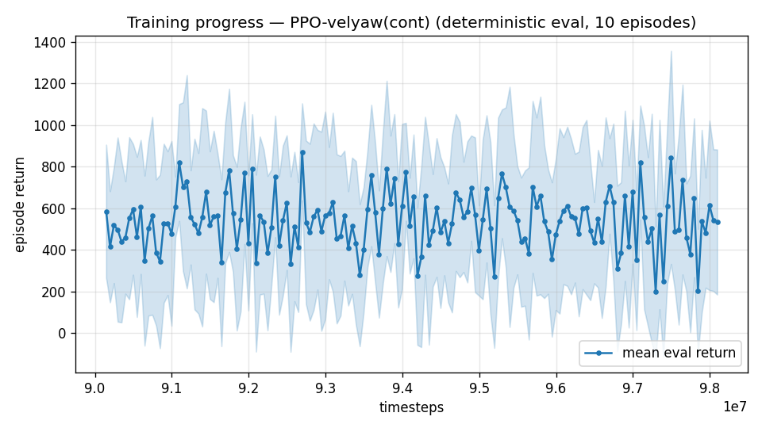

# Trial 61 — xw61: split integral on the HIGH-BAND CHAMPION

## Why
Trial 56 tested the long-velocity/protected-yaw integral pair on a fresh lineage, which
trial 54 had already shown to be uninformative at this band. This is the same mechanism on
xw51b (2.03 median), where a steady-offset remedy should actually show — the high band's
diagnosed signature is a persistent offset (hold-from-trim ≈ rest error, uniform across
wind bins, trial 43).

## What
`continue_train.py --src results_velyaw_xw51b --integral-tau-override 30
--yaw-integral-tau-override 3 --wind-oversample 0.5 --extra 8000000 --lr 1e-4`,
then a second stage without the override (the new leak persists via config) so the policy
gets a chance to exploit the changed observation rather than merely absorb the shift.

## Exact code changes
The continuation-override flags are quoted in trial 56's section; the split-leak env code is
in trial 56's "Exact code changes". No new code for this trial.

## Pre-registered (vs champion 2.03, 23% <1, yaw ~16°)
- SUCCESS: median <1.7 by stage b → the true-integrator idea works once the yaw channel is
  protected; adopt across bands and retest tighter clamps.
- NULL: 1.9–2.2 → integral memory genuinely adds nothing for an RL policy that already
  observes the disturbance estimate. The "why not use the true integrator" question closes:
  the PID *uses* its integral in a control law; a policy only *observes* it, and the wind
  observer already carries that information without windup.
- FAILURE: >2.3 or yaw >40° → long velocity memory is harmful; revert to τ=3 everywhere.

## Result
*(auto-appended)*

## Stage a verdict: 3.09 median (pct 15, yaw 24.9°) vs the champion's 2.03 — the obs-dynamics
shift cost precision immediately. Stage b (no override, same leak) runs next to see whether
the policy can exploit the changed integral once it re-adapts; if it does not recover past
2.03, this closes the true-integrator question by the pre-registered NULL/FAILURE reading.

## VERDICT: FAILURE by pre-registration — the true-integrator question is CLOSED
Stage b recovered to **2.72 [CI 2.25–3.07], 19% <1, yaw 20.4°** but never returned to the
champion's 2.03 (CI's do not overlap). Two stages / 16M steps of re-adaptation left the
policy worse than before the change.

**Conclusion on "why don't we use the true integrator?" — the definitive answer:**
a longer velocity-error memory does not help an RL policy here, and the yaw coupling was
not the hidden blocker (protecting the yaw channel worked exactly as designed — yaw stayed
at 20° instead of collapsing to 90° as in trial 25 — and the velocity precision STILL got
worse). The reason is structural, not a bug:
- The PID *uses* its integral inside a control law with a fixed gain: the integral term
  directly produces corrective force, so more memory = more offset rejection.
- The policy only *observes* the integral. It must learn a mapping from it, and a
  longer-memory signal is a slower, more history-dependent, more easily saturated input
  (measured: rails at ±25/axis during any bad stretch). Meanwhile the policy already
  receives the disturbance-observer force estimate, which carries the same information
  *instantaneously* and without windup — so the marginal value of integral memory is small
  and its cost in input conditioning is real.
High-band champion remains **xw51b, 2.03**. This was the last mechanism on the list for
this band; the remaining option is architectural (trim feedforward), which requires the
user's decision on full-RL purity.

---

## AUTO-CAPTURED RESULTS (2026-08-05 01:04)

**config**: `{"max_speed": 25.0, "speed_min": 18.0, "wind_max": 15.0, "use_integral": true, "use_yaw_integral": true, "use_wind_est": true, "yaw_width": 0.35, "yaw_weight": 1.0, "yaw_bias": 0.3, "heading_frame": false, "xwing_aero": true, "tough_init": 0.0, "wind_curriculum": false, "yaw_gate": true, "yaw_gate_floor": 0.2, "vel_precision": 0.7, "trim_init": 0.2, "priv_critic": false, "att_cmd": true, "katt": 1.5, "yaw_att_gate": true, "cov_width": 5.0, "kp_rate": "25,25,15", "ki_rate": "6,6,3", "aero_dr": true, "integral_tau": 30.0, "ent_coef": 0.003, "gamma": 0.99, "episode_len": 8.0, "wind_oversample": 0.5, "yaw_integral_tau": 3.0}`

**eval curve**: n=160, first 585, best 871 @ 92,696,148, last 533 (final steps 98,095,932)

**late trend**: still rising (last-10% mean 524 vs prior-10% 516)





### Physical eval
```
=== PHYSICAL EVAL (level start, full wind, 8s episodes) ===

band           n    mean  median   %<1     p90     yaw
--------------------------------------------------------
high(18-25)  100    5.38    2.44   18%   13.20   16.5°
--------------------------------------------------------
ALL          100    5.38    2.44   18%   13.20   16.5°   crash 0.0%
wind bins: [0-5) n=23 med 2.63 <1: 13%  [5-10) n=42 med 1.70 <1: 24%  [10-15) n=35 med 3.02 <1: 14%
```


### Dive-recovery test
```
=== DIVE-RECOVERY TEST (60 episodes, all starting in failure states) ===
  recovered (final-2s vel err < 8 m/s):  8/60 = 13%
  partial   (8-15 m/s):                  1/60 = 2%
  median final err: 35.9 m/s   mean: 37.0 m/s
```


### Behavior traces
```
--- trace seed 1005: target [19.8  8.7  0.4] (|v|=21.6), wind [ -3.6 -11.6  -3.1] ---
  t= 0.0 |v|=  0.1 vz=   0.0 tilt=   0 verr= 21.7 yawerr=+103.5 fins=( -5.3,-10.5) thr=+0.50
  t= 2.0 |v|= 15.6 vz=   0.9 tilt=  56 verr=  6.7 yawerr= +37.4 fins=(+18.5, -7.7) thr=-1.00
  t= 4.0 |v|= 19.8 vz=  -0.6 tilt=  63 verr=  2.6 yawerr=  +0.8 fins=(+18.5,+15.4) thr=-1.00
  t= 6.0 |v|= 19.2 vz=  -0.5 tilt=  68 verr=  2.8 yawerr= +11.0 fins=(+18.5, +0.9) thr=-1.00
--- trace seed 1012: target [  8.1 -21.4   1.8] (|v|=23.0), wind [-0.3  4.1 -6.1] ---
  t= 0.0 |v|=  0.0 vz=   0.0 tilt=   0 verr= 23.0 yawerr= +46.7 fins=( +4.8, -8.9) thr=+1.00
  t= 2.0 |v|= 20.3 vz=   2.4 tilt=  56 verr=  3.1 yawerr= +12.2 fins=(-12.9,-18.2) thr=-0.53
  t= 4.0 |v|= 22.2 vz=   2.0 tilt=  56 verr=  0.9 yawerr=  -2.6 fins=(-11.0,-18.2) thr=-0.23
  t= 6.0 |v|= 22.3 vz=   1.6 tilt=  56 verr=  0.9 yawerr=  -0.8 fins=(-12.0,-18.2) thr=-0.18
--- trace seed 1020: target [-14.7  16.5   1.4] (|v|=22.1), wind [-0.3 -1.2 -0.6] ---
  t= 0.0 |v|=  0.0 vz=   0.0 tilt=   0 verr= 22.1 yawerr= -65.7 fins=(+10.6,+10.9) thr=-0.23
  t= 2.0 |v|= 17.0 vz=   1.3 tilt=  51 verr=  5.1 yawerr= +17.3 fins=(+20.0,-20.0) thr=-1.00
  t= 4.0 |v|= 20.1 vz=   2.2 tilt=  47 verr=  2.6 yawerr=  +6.4 fins=( -9.1,-20.0) thr=-1.00
  t= 6.0 |v|= 21.7 vz=   5.2 tilt=  39 verr=  4.1 yawerr=  +1.1 fins=(+18.3,-20.0) thr=-1.00
```

---

## AUTO-CAPTURED RESULTS (2026-08-05 01:07)

**config**: `{"max_speed": 25.0, "speed_min": 18.0, "wind_max": 15.0, "use_integral": true, "use_yaw_integral": true, "use_wind_est": true, "yaw_width": 0.35, "yaw_weight": 1.0, "yaw_bias": 0.3, "heading_frame": false, "xwing_aero": true, "tough_init": 0.0, "wind_curriculum": false, "yaw_gate": true, "yaw_gate_floor": 0.2, "vel_precision": 0.7, "trim_init": 0.2, "priv_critic": false, "att_cmd": true, "katt": 1.5, "yaw_att_gate": true, "cov_width": 5.0, "kp_rate": "25,25,15", "ki_rate": "6,6,3", "aero_dr": true, "integral_tau": 30.0, "ent_coef": 0.003, "gamma": 0.99, "episode_len": 8.0, "wind_oversample": 0.5, "yaw_integral_tau": 3.0}`

**eval curve**: n=160, first 585, best 871 @ 92,696,148, last 533 (final steps 98,095,932)

**late trend**: still rising (last-10% mean 524 vs prior-10% 516)


### Physical eval
```
=== PHYSICAL EVAL (level start, full wind, 8s episodes) ===

band           n    mean  median   %<1     p90     yaw
--------------------------------------------------------
high(18-25)  100    5.38    2.44   18%   13.20   16.5°
--------------------------------------------------------
ALL          100    5.38    2.44   18%   13.20   16.5°   crash 0.0%
wind bins: [0-5) n=23 med 2.63 <1: 13%  [5-10) n=42 med 1.70 <1: 24%  [10-15) n=35 med 3.02 <1: 14%
```


### Dive-recovery test
```
=== DIVE-RECOVERY TEST (60 episodes, all starting in failure states) ===
  recovered (final-2s vel err < 8 m/s):  8/60 = 13%
  partial   (8-15 m/s):                  1/60 = 2%
  median final err: 35.9 m/s   mean: 37.0 m/s
```


### Behavior traces
```
--- trace seed 1005: target [19.8  8.7  0.4] (|v|=21.6), wind [ -3.6 -11.6  -3.1] ---
  t= 0.0 |v|=  0.1 vz=   0.0 tilt=   0 verr= 21.7 yawerr=+103.5 fins=( -5.3,-10.5) thr=+0.50
  t= 2.0 |v|= 15.6 vz=   0.9 tilt=  56 verr=  6.7 yawerr= +37.4 fins=(+18.5, -7.7) thr=-1.00
  t= 4.0 |v|= 19.8 vz=  -0.6 tilt=  63 verr=  2.6 yawerr=  +0.8 fins=(+18.5,+15.4) thr=-1.00
  t= 6.0 |v|= 19.2 vz=  -0.5 tilt=  68 verr=  2.8 yawerr= +11.0 fins=(+18.5, +0.9) thr=-1.00
--- trace seed 1012: target [  8.1 -21.4   1.8] (|v|=23.0), wind [-0.3  4.1 -6.1] ---
  t= 0.0 |v|=  0.0 vz=   0.0 tilt=   0 verr= 23.0 yawerr= +46.7 fins=( +4.8, -8.9) thr=+1.00
  t= 2.0 |v|= 20.3 vz=   2.4 tilt=  56 verr=  3.1 yawerr= +12.2 fins=(-12.9,-18.2) thr=-0.53
  t= 4.0 |v|= 22.2 vz=   2.0 tilt=  56 verr=  0.9 yawerr=  -2.6 fins=(-11.0,-18.2) thr=-0.23
  t= 6.0 |v|= 22.3 vz=   1.6 tilt=  56 verr=  0.9 yawerr=  -0.8 fins=(-12.0,-18.2) thr=-0.18
--- trace seed 1020: target [-14.7  16.5   1.4] (|v|=22.1), wind [-0.3 -1.2 -0.6] ---
  t= 0.0 |v|=  0.0 vz=   0.0 tilt=   0 verr= 22.1 yawerr= -65.7 fins=(+10.6,+10.9) thr=-0.23
  t= 2.0 |v|= 17.0 vz=   1.3 tilt=  51 verr=  5.1 yawerr= +17.3 fins=(+20.0,-20.0) thr=-1.00
  t= 4.0 |v|= 20.1 vz=   2.2 tilt=  47 verr=  2.6 yawerr=  +6.4 fins=( -9.1,-20.0) thr=-1.00
  t= 6.0 |v|= 21.7 vz=   5.2 tilt=  39 verr=  4.1 yawerr=  +1.1 fins=(+18.3,-20.0) thr=-1.00
```
