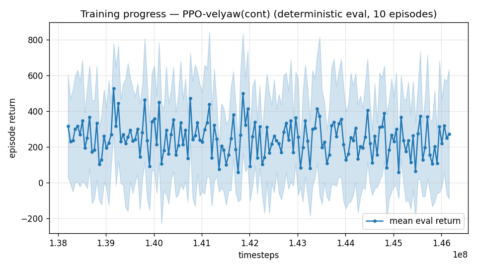

# Trial 62 — xw62: precision ladder at 25–34 on the covering lineage

## Why
The envelope climb saturated: 27–40 consolidation moved the top band only 8.63 → 8.36 (−3%),
versus −29% for 21–34's first stage. So more coverage stages are not productive, and
**coverage stands at ~40 m/s flown with zero crashes; 40–45 unreached.** The higher-value
use of the chain is the phase that has actually produced sub-1 results: a dedicated
precision ladder on a narrow range, with wind oversampling and robust gates (the stack that
took low 0.88→0.46 and mid 2.35→0.82).

25–34 is chosen because the covering policy already flies it at ~5 median, and it is the
next band in line for the composite (which currently routes 25–34 to xw55a at 3.77).

## Exact code changes
None — band-extension flags (trial 45), oversampling (trial 35), robust gate (trial 33).

## Pre-registered (vs the composite's current 25–34 owner: xw55a, 3.77 median, 7% <1)
- SUCCESS: median ≤2.0 → the precision stack transfers to the fast bands; run the same for
  34–40 and update the composite roster.
- PROGRESS: 2.0–3.0 → keep laddering.
- FAILURE: ≥3.5 → precision at 25+ needs a mechanism, not stages; escalate the
  trim-feedforward decision to the user together with the high-band result.

## Result
*(auto-appended)*

---

## AUTO-CAPTURED RESULTS (2026-08-05 00:49)

**config**: `{"max_speed": 34.0, "speed_min": 25.0, "wind_max": 15.0, "use_integral": true, "use_yaw_integral": true, "use_wind_est": true, "yaw_width": 0.35, "yaw_weight": 1.0, "yaw_bias": 0.3, "heading_frame": false, "xwing_aero": true, "tough_init": 0.0, "wind_curriculum": false, "yaw_gate": true, "yaw_gate_floor": 0.2, "vel_precision": 0.7, "trim_init": 0.2, "priv_critic": false, "att_cmd": true, "katt": 1.5, "yaw_att_gate": true, "cov_width": 5.0, "kp_rate": "25,25,15", "ki_rate": "6,6,3", "aero_dr": true, "integral_tau": 3.0, "ent_coef": 0.003, "gamma": 0.99, "episode_len": 8.0, "wind_oversample": 0.5}`

**eval curve**: n=160, first 318, best 527 @ 139,160,376, last 272 (final steps 146,160,096)

**late trend**: DECLINING (last-10% mean 226 vs prior-10% 231)





### Physical eval
```
=== PHYSICAL EVAL (level start, full wind, 8s episodes) ===

band           n    mean  median   %<1     p90     yaw
--------------------------------------------------------
vhigh(25-35) 100    7.35    4.80    1%   15.23   24.0°
--------------------------------------------------------
ALL          100    7.35    4.80    1%   15.23   24.0°   crash 0.0%
wind bins: [0-5) n=23 med 5.01 <1: 0%  [5-10) n=42 med 4.03 <1: 2%  [10-15) n=35 med 4.88 <1: 0%
```


### Dive-recovery test
```
=== DIVE-RECOVERY TEST (60 episodes, all starting in failure states) ===
  recovered (final-2s vel err < 8 m/s):  10/60 = 17%
  partial   (8-15 m/s):                  6/60 = 10%
  median final err: 33.5 m/s   mean: 36.6 m/s
```


### Behavior traces
```
--- trace seed 1005: target [27.2 11.9  0.6] (|v|=29.7), wind [ -3.6 -11.6  -3.1] ---
  t= 0.0 |v|=  0.1 vz=   0.0 tilt=   0 verr= 29.7 yawerr=+103.5 fins=( +9.0, -1.5) thr=+1.00
  t= 2.0 |v|= 19.7 vz=   0.4 tilt=  72 verr=  9.9 yawerr= +38.5 fins=(+18.5,+18.8) thr=-1.00
  t= 4.0 |v|= 23.2 vz=   0.7 tilt=  72 verr=  6.5 yawerr= +17.2 fins=(+18.5,-13.2) thr=-1.00
  t= 6.0 |v|= 25.9 vz=   4.6 tilt=  82 verr=  9.6 yawerr= +52.6 fins=(+18.5,-20.0) thr=-0.16
--- trace seed 1012: target [ 11.  -29.3   2.5] (|v|=31.4), wind [-0.3  4.1 -6.1] ---
  t= 0.0 |v|=  0.0 vz=   0.0 tilt=   0 verr= 31.4 yawerr= +46.7 fins=(+10.1, -8.9) thr=+1.00
  t= 2.0 |v|= 22.4 vz=   3.3 tilt=  66 verr=  9.2 yawerr=  +8.1 fins=(-13.4,-12.8) thr=-0.09
  t= 4.0 |v|= 28.5 vz=   1.8 tilt=  63 verr=  3.1 yawerr= +12.9 fins=( -3.9,-18.2) thr=-0.15
  t= 6.0 |v|= 29.0 vz=   1.5 tilt=  63 verr=  2.6 yawerr= +15.3 fins=( -6.5,-16.6) thr=-0.47
--- trace seed 1020: target [-20.1  22.6   1.9] (|v|=30.3), wind [-0.3 -1.2 -0.6] ---
  t= 0.0 |v|=  0.0 vz=   0.0 tilt=   0 verr= 30.3 yawerr= -65.7 fins=(+10.6,+10.9) thr=+1.00
  t= 2.0 |v|= 25.2 vz=  -0.1 tilt=  59 verr=  5.4 yawerr=  -3.0 fins=( +4.5,-20.0) thr=-0.14
  t= 4.0 |v|= 26.5 vz=   5.9 tilt=  54 verr=  6.0 yawerr=  +5.2 fins=( -1.8,-20.0) thr=-1.00
  t= 6.0 |v|= 25.9 vz=   4.5 tilt=  55 verr=  5.4 yawerr=  +2.4 fins=( -6.5,-20.0) thr=-1.00
```

## Stage a: 5.30 [CI 4.60–6.45], 1% <1 — WORSE than the composite's current 25–34 owner
(xw55a at 3.77). The covering lineage (xw60a, trained up to 40 m/s) has *traded away*
precision at 25–34 relative to the policy that was trained only to 34: extending the
envelope costs accuracy in the ranges already covered. Ladder continues one more stage to
confirm, but the reading is already clear and it is an important structural finding:
**coverage and precision are in tension in a single policy** — which is precisely the
argument for the composite/per-band deliverable rather than one all-envelope network.
